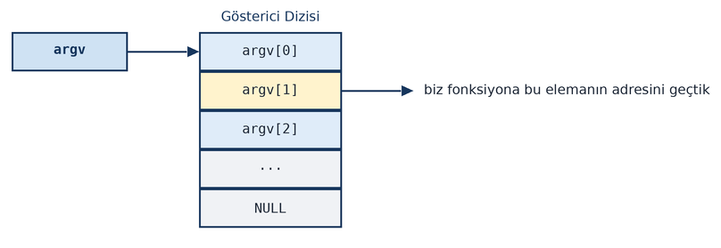
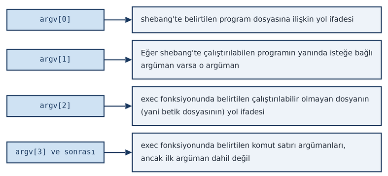
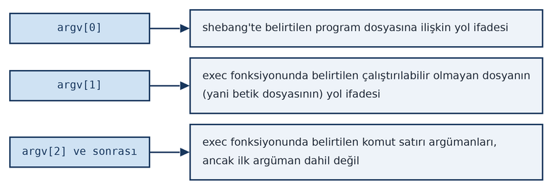

==================
**exec İşlemleri**
==================

Bu bölümde bir programın başka bir programı nasıl yükleyip çalıştırdığı üzerinde duracağız. ``fork`` işlemi yeni bir prosesin 
yaratılmasına yol açmaktadır. ``exec`` işlemleri ise yaratılmış olan prosesin başka bir program koduyla çalışmasına devam etmesini 
sağlamaktadır. Kabuk programları da ``exec`` işlemleri yoluyla programları çalıştırmaktadır. 

exec Fonksiyonları
==================

Bir program dosyasını yükleyip çalıştırmak için ismine *exec fonksiyonları* denilen bir grup POSIX fonksiyonu
kullanılmaktadır. Bu fonksiyonların yaptıkları işlemler birbirine benzerdir. Ancak fonksiyonların parametrik
yapıları arasında ve işlevsellikleri arasında bazı farklılıklar vardır. POSIX standartlarında bulunan 7 exec
fonksiyonunun isimleri şöyledir:

.. code-block:: text

    execl
    execle
    execlp
    execv
    execve
    execvp
    fexecve

Ayrıca POSIX standartlarında tanımlı olmasa da GNU C kütüphanesinde ``execvpe`` isimli bir ``exec`` fonksiyonu da
bulunmaktadır. (Bu fonksiyon *glibc* kütüphanesinde olduğu için bu kütüphanenin kullanıldığı BSD gibi diğer UNIX
türevi sistemlerde de bulunmaktadır.) Ayrıca Linux sistemlerine özgü bir biçimde ``sys_execveat`` isimli bir sistem
fonksiyonu da bulunmaktadır. Linux'ta bu fonksiyon ``execveat`` ismiyle kullanılabilmektedir.

Aslında UNIX/Linux sistemleri bu ``exec`` fonksiyonlarının hepsini sistem fonksiyonu biçiminde bulundurmamaktadır.
Örneğin Linux sistemlerinde ``execve`` fonksiyonu bir sistem fonksiyonu biçiminde (``sys_execve``) yazılmıştır.
Diğer ``exec`` fonksiyonları bu sistem fonksiyonunu çağıran kütüphane fonksiyonları biçiminde gerçekleştirilmiştir.
Yukarıda da belirttiğimiz gibi Linux'taki ``execveat`` fonksiyonu da bir sistem fonksiyonu biçiminde
(``sys_execveat``) gerçekleştirilmiştir. Bu durumda yukarıdaki POSIX fonksiyonları dışında Linux'a özgü olan exec
fonksiyonları şunlardır:

.. code-block:: text

    execvpe
    execveat

``exec`` fonksiyonları prosesin yaşamına başka bir program koduyla devam etmesini sağlamaktadır. ``exec`` fonksiyonlarına
biz "çalıştırılabilen bir program dosyasını" argüman olarak veririz. ``exec`` fonksiyonları o anda çalışmakta olan
programın bellek alanını tamamen boşaltıp onun yerine bizim verdiğimiz program dosyasını belleğe yükler ve o
yüklediği programın kodunu çalıştırır. ``exec`` işlemi ile prosesin kontrol bloğundaki pek çok alan
değiştirilmemektedir. Yani prosesin ID'si, kullanıcı ve grup ID'leri, prosesin çalışma dizini vs. değişmez. exec
işlemleriyle prosesin yalnızca çalıştırdığı program dosyası değiştirilmektedir. Örneğin *"sample"* programının
içerisinde biz ``exec`` fonksiyonlarıyla *"other"* programını çalıştırmak istediğimizde *"sample"* programı bellekten
tamamen atılır, onun yerine *"other"* programının kodu ve verileri belleğe yüklenir ve *"other"* programının kodu
çalıştırılır. Yukarıda da belirttiğimiz gibi ``exec`` işlemi sırasında prosesin kontrol bloğundaki temel bilgiler
değişmez. Yani ``exec`` fonksiyonları uygulandığında proses yaşamına başka bir program koduyla devam etmektedir.

``exec`` fonksiyonlarının isimlerinin sonlarında bulunan ``l`` harfi (``execl``, ``execlp``) komut satırı argümanlarının tek
tek bir liste biçiminde, fonksiyonların isimlerinin sonundaki ``v`` harfi ise komut satırı argümanlarının bir dizi (vector)
biçiminde verileceğini belirtir. Fonksiyonların isimlerinin sonlarındaki ``p`` harfi (*path* sözcüğünden geliyor) aramanın
``PATH`` çevre değişkenine bakılarak yapılacağını, ``e`` harfi (*environment* sözcüğünden geliyor) ise prosesin çevre
değişkenlerinin ``exec`` işlemi sırasında değiştirileceği anlamına gelmektedir. Yukarıda da belirttiğimiz gibi Linux 
sistemlerinde ``execl``, ``execv``, ``execlp``, ``execvp`` ve ``execle`` fonksiyonları aslında ``execve`` fonksiyonu 
(``sys_execve`` sistem fonksiyonu) çağrılarak, ``fexecve`` fonksiyonu ise ``execveat`` fonksiyonu (``sys_execveat`` 
sistem fonksiyonu) çağrılarak gerçekleştirilmiştir. Biz burada bu fonksiyonların üzerinde tek tek duracağız.

``exec`` fonksiyonları başarı durumunda geri dönmezler. Çünkü zaten başarı durumunda bu fonksiyonlar başka bir programı
yüklemiş ve çalıştırmış durumda olurlar. Bu fonksiyonlar başarısızlık durumunda yine ``-1`` değerine geri dönerler ve
``errno`` değişkeni uygun biçimde set edilir.

execl Fonksiyonu
================

``execl`` fonksiyonunun prototipi şöyledir:

.. code-block:: c

    #include <unistd.h>

    int execl(const char *path, const char *arg0, ... /*, (char *)0 */);

Fonksiyonun birinci parametresi çalıştırılacak olan program dosyasının yol ifadesini almaktadır. Bu yol ifadesi mutlak ya
da göreli olabilir. Fonksiyonun diğer parametreleri sırasıyla çalıştırılacak programa geçirilecek komut satırı
argümanlarının listesini belirtir. Birinci komut satırı argümanının (``argv[0]``) her zaman program ismi olacak biçimde
oluşturulması genel bir beklenti ve C standartlarında öngörülen bir durumdur. Programcı ``exec`` uygularken bunu sağlamak
zorunda değildir. Ancak bunun sağlanmaması kötü bir tekniktir ve çalıştırılacak programların hatalı çalışmasına yol
açabilir. Fonksiyon değişken sayıda (``...`` parametresine dikkat ediniz) argüman aldığı için argüman listesinin sonunda
``NULL`` adresin bulunması gerekmektedir. Ancak C'de "default argüman dönüştürmesi (default argument conversion)" denilen
kurala göre eğer argümanın karşılığında bir parametre türü belirtilmemişse "int türünden küçük türler int türüne, float
türü ise double türüne dönüştürülerek" fonksiyona yollanmaktadır. Burada programcının ``NULL`` adres sabitini yalnızca
``NULL`` sembolik sabiti biçiminde ya da ``0`` biçiminde belirtmemesi gerekir. Çünkü ``NULL`` sembolik sabiti düz sıfır
olarak da define edilmiş olabilir. Bu durumda düz ``0`` sabiti int olarak fonksiyona yollanır. Uygun olan durum düz sıfır
değerinin ya da ``NULL`` sembolik sabitinin bir adres türüne (tipik olarak ``char *`` türüne) dönüştürülerek fonksiyona
aktarılmasıdır. (C23 ile C'ye de eklenen ``nullptr`` sabitini hiç dönüştürme yapmadan kullanabilirsiniz.) Yukarıda da
belirtildiği gibi ``exec`` fonksiyonları başarı durumunda zaten geri dönmezler. Başarısızlık durumunda ``-1`` değerine geri
dönerler ve ``errno`` değişkeni uygun biçimde set edilir. ``execl`` fonksiyonunun çağrılması tipik olarak şöyle
yapılmaktadır:

.. code-block:: c

    if (execl("/bin/ls", "/bin/ls", "-l", "-i", (char *)0) == -1)
        exit_sys("execl");

    /* unreachable code */

Burada ``execl`` ile ``/bin/ls`` dosyası çalıştırılmak istenmiştir. Diğer argümanlar bu programın ``main`` fonksiyonuna
``argv`` parametresi olarak geçirilecek olan komut satırı argümanlarını belirtmektedir.

``exec`` fonksiyonları çeşitli nedenlerle başarısız olabilir. Örneğin çalıştırılacak program dosyası bulunamayabilir, bulunduğu
halde proses dosya için ``'x'`` hakkına sahip olmayabilir, çalıştırılabilen dosyanın formatı bozulmuş olabilir. Başarısızlık
durumunda ``errno`` değişkeni uygun biçimde set edilmektedir.

Aşağıdaki örnekte *"sample"* programı *"other"* isimli başka bir programı çalıştırmaktadır. *"sample"* programı
çalıştırıldığında ekrana (``stdout`` dosyasına) şu yazılar basılacaktır:

.. code-block:: console

    $ ./sample
    sample running...
    other running...
    argv[0]: other
    argv[1]: ali
    argv[2]: veli
    argv[3]: selami
    other ends...

``sample.c```

.. code-block:: c

    #include <stdio.h>
    #include <stdlib.h>
    #include <unistd.h>

    void exit_sys(const char *msg);

    int main(void)
    {
        printf("sample running...\n");

        if (execl("other", "other", "ali", "veli", "selami", (char *)0) == -1)
            exit_sys("execl");

        printf("unreachable code...\n");

        return 0;
    }

    void exit_sys(const char *msg)
    {
        perror(msg);
        exit(EXIT_FAILURE);
    }

``other.c``

.. code-block:: c

    #include <stdio.h>

    int main(int argc, char *argv[])
    {
        printf("other running...\n");

        for (int i = 0; i < argc; ++i)
            printf("argv[%d]: %s\n", i, argv[i]);

        printf("other ends...\n");

        return 0;
    }

Mademki ``exec`` fonksiyonları başarılı olduğunda zaten geri dönmemektedir, o halde ``exec`` işlemi aşağıdaki gibi de
yapılabilir:

.. code-block:: c

    execl(...);
    exit_sys("execl");

Burada ``exec`` fonksiyonları zaten başarılı olduğunda akış aşağıya geçmeyecektir, başarısız olduğunda akış aşağıya
geçecektir. Bu durumda başarı kontrolü yapmaya aslında gerek yoktur. Fakat biz kursumuzda genel olarak ``exec`` işlemlerini
aşağıdaki gibi uygulayacağız:

.. code-block:: c

    if (execl(...) == -1)
        exit_sys("execl");

fork ve exec İşlemlerinin Birlikte Uygulanması: fork/exec Kalıbı
================================================================

``exec`` işleminin tek başına uygulanması mevcut programı bellekten atarak başka bir programı çalıştırmaktadır. Ancak
genellikle programcı kendi programının da devam etmesini ister. İşte eğer biz hem başka bir programı çalıştırmak
istiyorsak hem de kendi programımızın devam etmesini istiyorsak bu durumda ``fork`` ve ``exec`` işlemlerini birlikte
uygulamamız gerekir.

``fork`` işlemi ile yeni bir proses yaratılıp yaratılan yeni proses üst proses ile aynı kodu çalıştırıyordu. exec
işleminde ise prosesin bellek alanı atılıp başka bir program dosyası belleğe yükleniyordu. Peki biz hem kendi programımız
devam etsin hem de başka bir programı da çalıştıralım istiyorsak bunu nasıl yapabiliriz? İşte bu durumda yalnızca
``fork`` ya da yalnızca ``exec`` işe yaramamaktadır. ``fork`` ve ``exec`` fonksiyonlarının birlikte kullanılması gerekmektedir.
Şöyle ki: Programcı önce ``fork`` yapar, sonra alt proseste ``exec`` işlemini uygular. Yani başka bir programın kodunu alt
proses çalıştırmış olur. Bu işlem tipik olarak şöyle yapılmaktadır:

.. code-block:: c

    pid_t pid;

    if ((pid = fork()) == -1)
        exit_sys("fork");

    if (pid == 0) {
        if (exec(...) == -1)            /* dikkat! exec demekle ailedeki herhangi bir fonksiyonu kastediyoruz */
            exit_sys("exec");
    }

    /* Yalnızca üst prosesin akışı buraya gelir */

Burada ``exec`` başarılı olursa zaten artık alt prosesin bellek alanı boşaltılıp yeni program yüklenecektir. ``exec`` başarısız
olduğunda da alt proses sonlandırılmıştır. Tabii yukarıdaki kalıp ``&&`` operatörüyle şöyle de oluşturulabilmektedir:

.. code-block:: c

    pid_t pid;

    if ((pid = fork()) == -1)
        exit_sys("fork");

    if (pid == 0 && exec(...) == -1)        /* dikkat! exec demekle ailedeki herhangi bir fonksiyonu kastediyoruz */
        exit_sys("exec");

    /* Yalnızca üst prosesin akışı buraya gelir */

Tabii ``exec`` yapılmış olsa da üst prosesin yine alt prosesi ``wait`` fonksiyonlarıyla beklemesi gerekmektedir.
Çalıştırılan programa ilişkin prosesin üst prosesi yine ``fork`` işlemi yapan prosestir. Örneğin:

.. code-block:: c

    pid_t pid;

    if ((pid = fork()) == -1)
        exit_sys("fork");

    if (pid == 0 && exec(...) == -1)        /* dikkat! exec demekle ailedeki herhangi bir fonksiyonu kastediyoruz */
        exit_sys("exec");

    /* Yalnızca üst prosesin akışı buraya gelir */

    if (waitpid(pid, NULL, 0) == -1)
        exit_sys("waitpid");

Bazen ``fork`` işleminden sonra programcı alt proseste bazı ayarlamalar yaptıktan sonra ``exec`` uygulamak isteyebilir.
Örneğin:

.. code-block:: c

    pid_t pid;

    if ((pid = fork()) == -1)
        exit_sys("fork");

    if (pid == 0) {
        /* alt proseste bazı işlemler */
        if (exec(...) == -1)                /* dikkat! exec demekle ailedeki herhangi bir fonksiyonu kastediyoruz */
            exit_sys("exec");
        /* unreachable code */
    }

    /* Yalnızca üst prosesin akışı buraya gelir */

    if (waitpid(pid, NULL, 0) == -1)
        exit_sys("waitpid");

Aslında ``fork`` ve ``exec`` nadiren tek başına uygulanmaktadır. Genellikle ``fork`` ve ``exec`` bir arada yukarıdaki kalıp
eşliğinde uygulanmaktadır.

Aşağıdaki örnekte üst proses ``/bin/ls`` programını çalıştırıp yoluna devam etmektedir:

.. code-block:: c

    #include <stdio.h>
    #include <stdlib.h>
    #include <unistd.h>
    #include <sys/wait.h>

    void exit_sys(const char *msg);

    int main(void)
    {
        pid_t pid;

        if ((pid = fork()) == -1)
            exit_sys("fork");

        if (pid == 0 && execl("/bin/ls", "/bin/ls", "-l", (char *)0) == -1)
            exit_sys("execl");

        for (int i = 0; i < 10; ++i) {
            printf("sample continues: %d\n", i);
            sleep(1);
        }

        if (waitpid(pid, NULL, 0) == -1)
            exit_sys("waitpid");

        return 0;
    }

    void exit_sys(const char *msg)
    {
        perror(msg);
        exit(EXIT_FAILURE);
    }

``fork``/``exec`` işlemlerinde kişilerin kafasını karıştıran bir durum oluşmaktadır. Kişiler haklı olarak şöyle düşünmektedir:
"fork işlemi ile üst prosesin bellek alanı alt proses için kopyalandığına göre ve alt proseste de ``exec`` yapıldığında alt
prosesin bellek alanı hemen boşaltılacağına göre burada üst prosesin bellek alanı gereksiz biçimde alt prosese
kopyalanmış olmuyor mu?" Gerçekten de ilk bakışta böyle bir durum söz konusu gibi gözükmektedir. Ancak modern
işlemcilerin "sayfalama (paging)" mekanizmaları sayesinde aslında ``fork`` işlemi sırasında *copy-on-write* mekanizması
işletilmektedir. Yani aslında bugün kullandığımız işlemcilerde ``fork`` işlemi sırasında işletim sistemi üst prosesin
bellek alanını zaten alt prosese bütünsel olarak kopyalamamaktadır. Kopyalama işlemi aslında *gerektiğinde*
yapılmaktadır. Bu mekanizmaya *copy-on-write* denilmektedir. Bu konuda bilgiler ileride verilecektir. Ancak bazı eski
sistemlerde *copy-on-write* mekanizması ya yoktu ya da etkin olarak gerçekleştirilemiyordu. Yani eski sistemlerde
yukarıdaki durum gerçekten etkinlik bakımından bir problem oluşturuyordu. Bu nedenle bu eski sistemler zamanında
``fork`` fonksiyonunun bellek kopyalamasını yapmayan (ya da minimal düzeyde yapan) ``vfork`` isminde bir benzeri de
bulundurulmuştur. ``vfork`` fonksiyonu eskiden POSIX standartlarında bulunuyordu. 2008'den itibaren POSIX
standartlarından kaldırılmıştır. Fakat *glibc* kütüphanesi bu fonksiyonu bulundurmaya devam etmektedir. Zaten yukarıda
da belirttiğimiz gibi modern sistemlerde artık ``vfork`` fonksiyonuna gereksinim de kalmamıştır. ``vfork`` tamamen
``fork`` işlemi yapar. Ancak üst prosesin bellek alanını alt prosese kopyalamaz. Çünkü ``vfork`` fonksiyonu ``exec`` için
düşünülmüştür. Yani ``vfork`` işleminden sonra ``exec`` yapılmalıdır. Eğer ``vfork`` işleminden sonra ``exec`` yapılmayıp sanki
``fork`` yapılmış gibi program devam ettirilirse "tanımsız davranış (undefined behavior)" oluşmaktadır. ``vfork``
fonksiyonunun prototipi ``fork`` ile aynı biçimdedir:

.. code-block:: c

    #include <unistd.h>

    pid_t vfork(void);

Eski POSIX standartlarına göre ``vfork`` işleminden sonra yalnızca ``_exit`` fonksiyonu ya da ``exec`` fonksiyonları
çağrılabilir. Bunun dışında başka bir fonksiyon çağrılamaz. Yani ``vfork`` başarılı ise biz ya ``_exit`` fonksiyonu ile
prosesi sonlandırmalıyız ya da ``exec`` uygulamalıyız. Tabii ``exec`` de başarısız olursa ``_exit`` ile (``exit`` ile değil) alt
prosesi sonlandırmalıyız. Başka bir fonksiyonun kullanılamamasının nedeni o fonksiyonların kodlarının alt prosese
kopyalanmamış olmasıdır.

execv Fonksiyonu
================
 
``execv`` fonksiyonu ``execl`` fonksiyonu ile aynı işlevselliğe sahiptir.. Ancak bu fonksiyon çalıştırılacak
programın komut satırı argümanlarını bir gösterici dizisi biçiminde almaktadır. Fonksiyonun prototipi
şöyledir:
 
.. code-block:: c
 
    #include <unistd.h>
 
    int execv(const char *path, char * const *argv);
 
Fonksiyonun birinci parametresi çalıştırılacak program dosyasının yol ifadesini, ikinci
parametresi ise komut satırı argümanlarının bulunduğu ``char`` türden gösterici dizisinin başlangıç
adresini almaktadır. Yani bizim komut satırı argümanlarını bir gösterici dizisine yerleştirip fonksiyona 
onun adresini vermemiz gerekir. Bu gösterici dizisinin son elemanında ``NULL`` adres bulunmalıdır. Tabii bu durumda
tür dönüştürmesi yapmaya gerek yoktur. Örneğin:
 
.. code-block:: c
 
    char *argv[] = {"/bin/ls", "-l", NULL};
    /* ... */
 
    execv("/bin/ls", argv);
    exit_sys("execv");
 
``execv`` fonksiyonunun ikinci parametresindeki ``const`` niteleyicisinin yerine dikkat ediniz. Buradaki
``const`` niteleyicisi adresi geçirilen gösterici dizisinin ``const`` olduğunu belirtmektedir. Yani
fonksiyon hem o gösterici dizisinde değişiklik yapmamaktadır.
 
Aşağıda ``execv`` fonksiyonunun kullanımına bir örnek verilmiştir.
 
.. code-block:: c
 
    #include <stdio.h>
    #include <stdlib.h>
    #include <unistd.h>
    #include <sys/wait.h>
 
    void exit_sys(const char *msg);
 
    int main(int argc, char *argv[])
    {
        pid_t pid;
        char *args[] = {"/bin/ls", "-l", "-i", NULL};
 
        if ((pid = fork()) == -1)
            exit_sys("fork");
 
        if (pid == 0 && execv("/bin/ls", args) == -1)
            exit_sys("execl");
 
        for (int i = 0; i < 10; ++i) {
            printf("sample continues: %d\n", i);
            sleep(1);
        }
 
        if (waitpid(pid, NULL, 0) == -1)
            exit_sys("waitpid");
 
        return 0;
    }
 
    void exit_sys(const char *msg)
    {
        perror(msg);
        exit(EXIT_FAILURE);
    }
 
 
Peki ``execv`` ne zaman tercih edilebilir? İşte bazen ``execl`` fonksiyonu yerine ``execv``
fonksiyonunun kullanılması daha uygun olabilmektedir. Örneğin biz ``runprog`` isimli bir program yazalım.
Bu program da komut satırı argümanlarıyla aldığı programı çalıştırsın. Yani ``runprog`` programı şöyle
çalıştırılsın:
 
.. code-block:: console
 
    $ ./runprog /bin/ls -l -i
 
Eğer böyle bir programı ``execl`` ile yazmaya çalışırsak bunu pratik bir biçimde başaramayız. Çünkü
çalıştıracağımız programın kaç komut satırı argümanı ile çalıştırılacağını baştan bilmemekteyiz. Aşağıda
böyle bir programa örnek verilmiştir. Programı şöyle çalıştırabilirsiniz:
 
.. code-block:: console
 
    $ ./runprog /bin/ls -l -i
    $ ./runprog /bin/cp sample.c x.c
    $ ./runprog other ali veli selami
 
Programda ``exec`` çağrısına dikkat ediniz:
 
.. code-block:: c
 
    if ((pid = fork()) == -1)
        exit_sys("fork");
 
    if (pid == 0 && execv(argv[1], &argv[1]) == -1)
        exit_sys("execl");
 
Burada ``execv`` fonksiyonuna ``argv`` gösterici dizisinin 1'inci indeksli elemanının adresi
geçirilmiştir. ``argv`` dizisinin sonunda zaten ``NULL`` adres bulunduğunu anımsayınız:
 

 
``runprog.c``

.. code-block:: c
 
 
    #include <stdio.h>
    #include <stdlib.h>
    #include <unistd.h>
    #include <sys/wait.h>
 
    void exit_sys(const char *msg);
 
    int main(int argc, char *argv[])
    {
        pid_t pid;
 
        if (argc < 2) {
            fprintf(stderr, "wrong number of arguments!..\n");
            exit(EXIT_FAILURE);
        }
 
        if ((pid = fork()) == -1)
            exit_sys("fork");
 
        if (pid == 0 && execv(argv[1], &argv[1]) == -1)
            exit_sys("execv");
 
        for (int i = 0; i < 10; ++i) {
            printf("sample continues: %d\n", i);
            sleep(1);
        }
 
        if (waitpid(pid, NULL, 0) == -1)
            exit_sys("waitpid");
 
        return 0;
    }
 
    void exit_sys(const char *msg)
    {
        perror(msg);
        exit(EXIT_FAILURE);
    }
 
execlp ve execvp Fonksiyonları
==============================
 
``exec`` fonksiyonlarının iki p'li versiyonu da vardır: ``execlp`` ve ``execvp``. Bu ``p``'li versiyonların
prototipleri ``p``'siz versiyonlarla aynıdır. Yalnızca ilk parametrenin semantik anlamı farklıdır. Bunların
prototipleri şöyledir:
 
.. code-block:: c
 
    #include <unistd.h>
 
    int execlp(const char *file, const char *arg0, ... /*, (char *)0 */);
    int execvp(const char *file, char *const argv[]);
 
exec fonksiyonlarının ``p``'li versiyonları şöyle çalışmaktadır:
 
- Eğer bu fonksiyonların birinci parametrelerinde belirtilen dosya isminde hiç ``/`` karakteri
  kullanılmamışsa bu fonksiyonlar önce ``PATH`` çevre değişkeninin değerini ``getenv`` fonksiyonuyla
  elde edip buradaki yazıyı ``:`` karakterlerinden parçalara ayırırlar (parse ederler). Bu `:`
  karakterlerinin arasındaki yazıların dizin belirttiğini varsayarlar. Sonra ``exec`` yapılacak dosyayı
  sırasıyla bu dizinlerde ararlar. Eğer bulurlarsa onu ``exec`` yaparlar, bulamazlarsa bu fonksiyonlar
  başarısız olur. Tabii bu fonksiyonlar ``PATH`` çevre değişkeninde belirtilen dizinlerdeki aramayı
  baştan sona doğru yapmaktadır ve ilk bulduğu dizindeki programı ``exec`` işlemine sokmaktadır. (Yani eğer
  söz konusu program dosyası birden fazla ``PATH`` dizininde varsa dosyanın ilk bulunduğu dizindeki
  program çalıştırılır.) ``PATH`` çevre değişkeninin değeri aşağıdakine benzer bir biçimdedir:
 
.. code-block:: text
 
    /usr/local/sbin:/usr/local/bin:/usr/sbin:/usr/bin:/sbin:/bin:/usr/games:/usr/local/games:/snap/bin
 
- Eğer ``p``'li ``exec`` fonksiyonlarının birinci parametresiyle belirtilen dosya isminde en az bir ``/``
  karakteri varsa bu durumda fonksiyonlar ``PATH`` çevre değişkenine başvurmazlar. Birinci parametresiyle
  belirtilen göreli ya da mutlak yol ifadesinden hareketle dosyanın yerini belirlemeye çalışırlar. Başka
  bir deyişle bu durumda fonksiyonların ``p``'li versiyonlarının ``p``'siz versiyonlarından hiçbir farkı
  kalmamaktadır. Örneğin:
 
.. code-block:: c
 
    execlp("ls", ...);          /* PATH çevre değişkenine başvurulur */
    execlp("./sample", ...);    /* PATH çevre değişkenine başvurulmaz */
    execlp("a/sanple", ...);    /* PATH çevre değişkenine başvurulmaz */
 
``exec`` fonksiyonlarının ``p``'li versiyonları eğer dosya isminde hiç ``/`` karakteri yoksa ve ``PATH``
dizinlerinde de dosyayı bulamazlarsa prosesin çalışma dizinine bakmamaktadır. Yani bu durumda bu
fonksiyonlar yalnızca ``PATH`` çevre değişkenindeki dizinlere bakmaktadır. Tabii ``PATH`` çevre
değişkeninde o andaki prosesin çalışma dizini ``.`` karakteri ile de belirtilebilir. Örneğin:
 
.. code-block:: text
 
    /bin:/usr/bin:/:.

 
Buradaki ``.`` karakteri prosesin çalışma dizinini belirtmektedir. Biz ``PATH`` çevre değişkeninin sonuna dizinler
ekleyebiliriz. Örneğin:
 
.. code-block:: console
 
    $ PATH=$PATH:/home/kaan
 
Tabii bunun kalıcı hale getirilmesi için kabuk programının *startup* dosyalarına yerleştirilmesi gerekir.
Prosesin çalışma dizininin ``PATH`` çevre değişkenine eklenmesi güvenlik zafiyeti nedeniyle iyi bir
teknik kabul edilmemektedir. Örneğin:
 
.. code-block:: console
 
    $ PATH=$PATH:.
 
Peki ``exec`` fonksiyonlarının ``p``'li versiyonları ``PATH`` çevre değişkenini bulamazsa ne olur? POSIX
standartları bu durumdaki davranışın sistemden sisteme değişebileceğini (implementation-defined)
belirtmektedir. Pek çok sistem (örneğin Linux ve BSD) bu durumda sanki ``PATH`` çevre değişkeni
``/bin:/usr/bin`` biçimindeymiş gibi davranmaktadır.
 
exec fonksiyonlarının ``p``'li versiyonları (``execlp`` ve ``execvp``) aramayı ``PATH`` dizinlerinde
sırasıyla yapmaktadır. Ancak bu fonksiyonlar dosyayı bir dizinde bulduğunda ve onu sistem fonksiyonuyla
(``execve``) çalıştırmaya çalıştığında başarısız olup ``EINVAL`` ve ``ENOEXEC`` ``errno`` değeri oluşursa
dosyanın bir *kabuk betiği (shell script)* olduğundan çalıştırılamadığı sonucunu çıkartmaktadır ve bu
durumda dosyayı ``/bin/sh`` (*default shell)* programı ile çalıştırmaktadır. Ancak ``exec`` fonksiyonlarının
diğer versiyonları ``EINVAL`` ve ``ENOEXEC`` ``errno`` değeri oluştuğunda bunu yapmamaktadır. Tabii bu
davranışı yalnızca ``exec`` fonksiyonlarının ``p``'li versiyonları göstermektedir. ``exec`` fonksiyonlarının ``p``'li
versiyonları ``PATH`` dizinlerinin birinde dosyayı sistem fonksiyonuyla (Linux'taki ``sys_execve``)
çalıştırmaya çalıştığında ``EACCES`` ``errno`` değeri ile başarısız olduklarında dosyayı sonraki ``PATH``
dizinlerinde aramaya devam ederler. Ancak bu arama sırasında bu fonksiyonlar artık dosyayı diğer ``PATH``
dizinlerinde bulamazlarsa ``EACCES`` errno değeri ile başarısız olurlar.
 
Aşağıda ``execlp`` fonksiyonuna bir örnek verilmiştir. Örnekte ``execlp`` fonksiyonu şöyle çağrılmıştır:
 
.. code-block:: c
 
    if ((pid = fork()) == -1)
        exit_sys("fork");
 
    if (pid == 0 && execlp("ls", "ls", "-l", (char *)0) == -1)
        exit_sys("execv");
 
Burada ``ls`` programı ``PATH`` çevre değişkeninde belirtilen ``/bin`` dizininde bulunacaktır.
 
.. code-block:: c
 
    #include <stdio.h>
    #include <stdlib.h>
    #include <unistd.h>
    #include <sys/wait.h>
 
    void exit_sys(const char *msg);
 
    int main(void)
    {
        pid_t pid;
 
        printf("sample running...\n");
 
        if ((pid = fork()) == -1)
            exit_sys("fork");
 
        if (pid == 0 && execlp("ls", "ls", "-l", (char *)0) == -1)
            exit_sys("execv");
 
        for (int i = 0; i < 10; ++i) {
            printf("sample continues: %d\n", i);
            sleep(1);
        }
 
        if (waitpid(pid, NULL, 0) == -1)
            exit_sys("waitpid");
 
        return 0;
    }
 
    void exit_sys(const char *msg)
    {
        perror(msg);
        exit(EXIT_FAILURE);
    }
 
Aşağıda da ``execvp`` kullanımına örnek verilmiştir. Örnekte ``execvp`` fonksiyonu şöyle kullanılmıştır:
 
.. code-block:: c
 
    if ((pid = fork()) == -1)
        exit_sys("fork");
 
    if (pid == 0 && execvp(argv[1], &argv[1]) == -1)
        exit_sys("execvp");
 
Burada ``argv[1]`` ile girilen dosya isminde hiç ``/`` karakteri yoksa dosya ``PATH`` çevre değişkeni ile
belirtilen dizinlerde aranacaktır.
 
.. code-block:: c
 
    #include <stdio.h>
    #include <stdlib.h>
    #include <unistd.h>
    #include <sys/wait.h>
 
    void exit_sys(const char *msg);
 
    int main(int argc, char *argv[])
    {
        pid_t pid;
 
        if (argc == 1) {
            fprintf(stderr, "wrong number of arguments!...\n");
            exit(EXIT_FAILURE);
        }
 
        printf("sample running...\n");
 
        if ((pid = fork()) == -1)
            exit_sys("fork");
 
        if (pid == 0 && execvp(argv[1], &argv[1]) == -1)
            exit_sys("execvp");
 
        for (int i = 0; i < 10; ++i) {
            printf("sample continues: %d\n", i);
            sleep(1);
        }
 
        if (waitpid(pid, NULL, 0) == -1)
            exit_sys("waitpid");
 
        return 0;
    }
 
    void exit_sys(const char *msg)
    {
        perror(msg);
        exit(EXIT_FAILURE);
    }
 
Şimdi de daha önce yapmış olduğumuz ``myshell`` kabuk programına ``fork``/``exec`` işlemini ekleyelim. Programın
bu versiyonu önce *içsel (internal)* komutlara bakacak, eğer içsel komutlarda verilen komutu bulmazsa
onu ``fork``/``exec`` ile program dosyası gibi çalıştıracaktır. Aslında ``bash`` gibi kabuk programları da böyle
yapmaktadır.
 
Biz ``myshell`` programımızda komut satırından aldığımız yazıyı parse edip parametrelerini zaten
``g_params`` isimli bir gösterici dizisinde saklamıştık. Örneğimizde eğer komut içsel komut listesinde
bulunamadıysa aşağıdaki gibi ``fork``/``exec`` uygulanmıştır:
 
.. code-block:: c
 
    if (g_cmds[i].name == NULL) {
            pid_t pid;
 
            if ((pid = fork()) == -1)
                exit_sys("fork");
            if (pid == 0 && execvp(g_params[0], &g_params[0]) == -1) {
                fprintf(stderr, "%s: %s\n", g_params[0], strerror(errno));
                continue;
            }
            if (waitpid(pid, NULL, 0) == -1)
                exit_sys("waitpid");
        }
 
``myshell.c``

.. code-block:: c
 
    #include <stdio.h>
    #include <stdlib.h>
    #include <string.h>
    #include <errno.h>
    #include <unistd.h>
    #include <sys/wait.h>
 
    #define MAX_CMD_LINE            4096
    #define MAX_CMD_PARAMS          1024
    #define PATH_SIZE               4096
 
    struct cmd {
        const char *name;
        void (*proc)(void);
    };
 
    void parse_cmd_line(char *cmdline);
    void rm_proc(void);
    void cp_proc(void);
    void mv_proc(void);
    void cd_proc(void);
    void exit_sys(const char *msg);
 
    struct cmd g_cmds[] = {
        {"cd", cd_proc},
        {NULL, NULL}
    };
 
    char *g_params[MAX_CMD_PARAMS];
    int g_nparams;
    char g_cwd[PATH_SIZE];
 
    int main(void)
    {
        char cmdline[MAX_CMD_LINE];
        char *str;
        int i;
 
        if (getcwd(g_cwd, PATH_SIZE) == NULL)
            exit_sys("fatal error");
 
        for (;;) {
            printf("CSD:%s$ ", g_cwd);
            fflush(stdout);
 
            if (fgets(cmdline, MAX_CMD_LINE, stdin) == NULL)
                continue;
            if ((str = strchr(cmdline, '\n')) != NULL)
                *str = '\0';
 
            parse_cmd_line(cmdline);
            if (g_nparams == 0)
                continue;
            if (!strcmp(g_params[0], "exit"))
                break;
 
            for (i = 0; g_cmds[i].name != NULL; ++i)
                if (!strcmp(g_cmds[i].name, g_params[0])) {
                    g_cmds[i].proc();
                    break;
                }
            if (g_cmds[i].name == NULL) {
                pid_t pid;
 
                if ((pid = fork()) == -1)
                    exit_sys("fork");
                if (pid == 0 && execvp(g_params[0], &g_params[0]) == -1) {
                    fprintf(stderr, "%s: %s\n", g_params[0], strerror(errno));
                    continue;
                }
                if (waitpid(pid, NULL, 0) == -1)
                    exit_sys("waitpid");
            }
        }
 
        return 0;
    }
 
    void parse_cmd_line(char *cmdline)
    {
        char *arg;
 
        g_nparams = 0;
        for ((arg = strtok(cmdline, " \t")); arg != NULL; arg = strtok(NULL, " \t"))
            g_params[g_nparams++] = arg;
        g_params[g_nparams] = NULL;
    }
 
    void rm_proc(void)
    {
        if (g_nparams == 1) {
            printf("too few command parameters!...\n");
            return;
        }
        printf("rm command...\n");
    }
 
    void cp_proc(void)
    {
        if (g_nparams != 3) {
            printf("wrong number of command parameters!...\n");
            return;
        }
 
        printf("cp command...\n");
    }
 
    void mv_proc(void)
    {
        if (g_nparams != 3) {
            printf("wrong number of command parameters!...\n");
            return;
        }
 
        printf("mv command...\n");
    }
 
    void cd_proc(void)
    {
        if (g_nparams != 2) {
            printf("wrong number of command parameters!..\n");
            return;
        }
 
        if (chdir(g_params[1]) == -1) {
            printf("%s: \"%s\"\n", strerror(errno), g_params[1]);
            return;
        }
 
        if (getcwd(g_cwd, PATH_SIZE) == NULL)
            exit_sys("fatal error");
    }
 
    void exit_sys(const char *msg)
    {
        perror(msg);
        exit(EXIT_FAILURE);
    }

Kabukta Programların ./ Yol İfadesi Kullanılarak Çalıştırılması
---------------------------------------------------------------
 
Şimdi kabuk üzerinden programları neden ``./sample`` biçiminde başına ``./`` getirerek çalıştırdığımız
artık anlaşılabilir. Kabuk programları önce ``fork`` yapıp alt proseste ``exec`` fonksiyonlarının ``p``'li
versiyonlarıyla programları çalıştırmaktadır. Dolayısıyla biz programı ``sample`` biçiminde çalıştırmak
istediğimizde bu ``p``'li versiyonlar bu programı ``PATH`` çevre değişkeninin belirttiği dizinlerde
bulamayacaktır. Ancak biz programı ``./sample`` biçiminde çalıştırmak istediğimizde bu fonksiyonlar
artık ``PATH`` çevre değişkenine bakmayacak, bulunulan dizindeki ``sample`` programını çalıştıracaktır.
 
Peki kabuk programları neden ``exec`` fonksiyonlarının ``p``'li versiyonlarını kullanmaktadır? Bunun birinci
sebebi kolaylık sağlamak içindir. Örneğin ``ls`` komutunu biz ``/bin/ls`` biçiminde kullanmak istemeyiz.
Bunun ikinci nedeni güvenliktir. Eskiden durum böyle değilken programın çalışma dizinine gerçek
komutlarla aynı isimli komutlar yerleştirerek hileli işlemler yapmaya yeltenenler olmuştur. İşte bu
nedenle ``PATH`` dizinlerinin içerisinde prosesin çalışma dizini yerleştirilmemektedir. Eğer durum böyle
olmasaydı bazen hatalı yazılmış komutlarla istenmeden başka programlar da çalıştırılabilirdi. Örneğin
dizinimizde ``co`` isminde bir program olsun; biz ``cp`` yerine yanlışlıkla ``co`` yazarsak bu programı
istemeden de çalıştırabiliriz.
 
exec Fonksiyonlarına İlişkin errno Değerleri
============================================
 
exec fonksiyonlarının başarısızlığının nedeni olabilecek çeşitli ``errno`` değerleri vardır. Bunların en
önemlilerinden birkaçı şunlardır:
 
- ``ENOENT`` ("*No such file or directory*"): Dosya bulunamamıştır.
- ``EACCES`` ("*Permission denied*"): Dosyaya ilişkin tüm yol bileşenlerinde ``'x'`` hakkı yoktur ya da 
  proses dosyaya ``'x'`` hakkına sahip değildir.
- ``ENOEXEC`` ("*Exec format error*"): Dosya bulunmuştur, prosesin dosyaya ``'x'`` hakkı da vardır. Ancak dosyanın 
  formatı anlaşılamamıştır ya da bozuktur. Tipik olarak dosya çalıştırılabilir bir dosya olmadığında ya da dosyanın 
  başında *shebang* bulunmadığında bu hata ortaya çıkmaktadır.
- ``EINVAL`` ("*Invalid argument*"):  Dosya bulunmuştur, proses dosyaya ``'x'`` hakkına sahiptir. Dosyanın formatı 
  tespit edilmiştir ancak sistem bu formattaki dosyaları çalıştıramamantadır. Yani bu hata "ne olduğunu biliyorum 
  ama çalıştıramam" anlamına gelmektedir. 

Yukarıda da belirttiğimiz gibi ``exec`` fonksiyonlarının ``p``'li versiyonları (``execlp`` ve ``execvp``)
``PATH`` dizinlerinde tek tek dosyayı aramaktadır. Ancak bu fonksiyonlar dosyayı bir dizinde bulduğunda
ve onu sistem fonksiyonuyla (Linux'ta ``sys_execve``) çalıştırmaya çalıştığında ``EINVAL`` ya da ``ENOEXEC``
``errno`` değerleri ile başarısızlık durumu oluşursa dosyanın bir *kabuk betiği (shell script)* olduğundan 
çalıştırılamadığı sonucunu çıkartmaktadır ve bu durumda dosyayı *"/bin/sh (default shell)"* programı ile 
çalıştırmaktadır. Ancak ``exec`` fonksiyonlarının diğer versiyonları ``EINVAL`` ve ``ENOEXEC`` hatalarında 
bunu yapmamaktadır. Bunu yalnızca ``exec`` fonksiyonlarının ``p``'li versiyonları yapmaktadır. ``exec`` fonksiyonlarının 
``p``'li versiyonları ``PATH`` dizinlerinin birinde dosyayı sistem fonksiyonuyla (``sys_execve``) çalıştırmaya çalıştığında
``EACCES`` ``errno`` değeri ile başarısız olurlarsa dosyayı sonraki ``PATH`` dizinlerinde aramaya devam
ederler. Ancak bu arama sırasında bu fonksiyonlar artık dosyayı diğer ``PATH`` dizinlerinde de
bulamazlarsa ``EACCES`` ``errno`` değeri ile başarısız olurlar.
 
execle ve execve Fonksiyonları
==============================
 
exec fonksiyonlarının iki e'li biçimi vardır: ``execle`` ve ``execve``. Buradaki ``e`` harfi
*environment* yani *çevre değişkenleri* anlamında isme eklenmiştir.
 
Anımsanacağı gibi çevre değişkenleri tipik olarak prosesin bellek alanında bulunduruluyordu ve ``fork``
işlemi sırasında üst prosesin bellek alanının alt prosese kopyalanmasıyla alt prosese geçiriliyordu.
Ancak ``exec`` işlemleri prosesin bellek alanını ortadan kaldırıp yeni bir program kodunu yüklediğine göre
prosesin çevre değişkenleri ne olacaktır? İşte ``exec`` işlemi sırasında prosesin bellek alanı boşaltılıp
yeni program için prosesin bellek alanı yeniden oluşturulurken çevre değişkenleri de sıfırdan
oluşturulabilmektedir. Bunu ``exec`` fonksiyonlarının ``e``'li versiyonları yapmaktadır. ``exec`` fonksiyonlarının
``e``'siz versiyonları o andaki prosesin çevre değişkenlerinin aynısını ``exec`` yapılan programın bellek
alanına taşımaktadır. Yani biz ``exec`` fonksiyonlarının ``e``'siz versiyonlarını kullandığımızda ``exec`` yapmadan
önceki çevre değişkenleriyle ``exec`` yaptıktan sonraki programın çevre değişkenleri aynı olacaktır.
 
``execle`` ve ``execve`` fonksiyonlarının prototipleri şöyledir:
 
.. code-block:: c
 
    #include <unistd.h>
 
    int execle(const char *path, const char *arg0, ... /*, (char *)0, char *const envp[]*/);
    int execve(const char *path, char *const argv[], char *const envp[]);
 
``execle`` fonksiyonunun birinci parametresi yine çalıştırılacak dosyanın yol ifadesini almaktadır.
Diğer parametreler programa geçirilecek komut satırı argümanlarını belirtir. Bu argüman listesinin sonu
yine ``NULL`` adresle bitirilmelidir. Bu ``NULL`` adresten sonra son parametre ``char`` türden bir
gösterici dizisi olmalıdır. Bu gösterici dizisi çevre değişkenlerini ``anahtar=değer`` biçiminde tutan
yazıların adreslerinden oluşmalıdır (yani ``environ`` global değişkeninde olduğu gibi). Bu fonksiyonlardaki 
çevre değişkenleri için oluşturulan gösterici dizilerinin sonunda ``NULL`` adres
bulunmalıdır.
 
``execve`` fonksiyonu da benzerdir. Bu fonksiyon da önce çalıştırılacak programın yol ifadesini,
sonra komut satırı argümanlarını bir gösterici dizisi biçiminde, sonra da çevre değişkenlerini bir gösterici
dizisi biçiminde almaktadır.
 
Aşağıdaki örnekte ``execve`` fonksiyonunun kullanımına bir örnek verilmiştir. Örnekte ``sample``
programı aynı dizindeki ``other`` programını çalıştırmaktadır. ``execle`` işlemi şöyle yapılmıştır:
 
.. code-block:: c
 
    pid_t pid;
    char *env[] = {"city=ankara", "furit=banana", "color=red", NULL};
 
    if ((pid = fork()) == -1)
        exit_sys("fork");
 
    if (pid == 0) {
        execle("other", "other", "ali", "veli", "selami", (char *)0, env);
        exit_sys("execle");
    }
 
    printf("parent continues...\n");
 
Burada ``execle`` fonksiyonunun argümanlarına dikkat ediniz. Artık ``other`` programı çalıştırıldığında
alt prosesin çevre değişken listesi ``env`` gösterici dizisindeki gibi olacaktır. ``sample`` programını
çalıştırmadan önce ``other`` programını da derlemelisiniz. ``sample`` programı çalıştırıldığında ekrana
şunlar basılacaktır:
 
.. code-block:: console
 
    $ ./sample
    parent continues...
    other command line arguments:
    other
    ali
    veli
    selami
    other environment variables:
    city=ankara
    furit=banana
    color=red
 
``sample.c``

.. code-block:: c
 
    #include <stdio.h>
    #include <stdlib.h>
    #include <unistd.h>
    #include <sys/wait.h>
 
    void exit_sys(const char *msg);
 
    int main(void)
    {
        pid_t pid;
        char *env[] = {"city=ankara", "furit=banana", "color=red", NULL};
 
        if ((pid = fork()) == -1)
            exit_sys("fork");
 
        if (pid == 0) {
            execle("other", "other", "ali", "veli", "selami", (char *)0, env);
            exit_sys("execle");
        }
 
        printf("parent continues...\n");
 
        if (waitpid(pid, NULL, 0) == -1)
            exit_sys("waitpid");
 
        return 0;
    }
 
    void exit_sys(const char *msg)
    {
        perror(msg);
        exit(EXIT_FAILURE);
    }
 
``other.c``

.. code-block:: c
 
    #include <stdio.h>
 
    extern char **environ;
 
    int main(int argc, char *argv[])
    {
        printf("other command line arguments:\n");
 
        for (int i = 0; i < argc; ++i)
            puts(argv[i]);
 
        printf("other environment variables:\n");
 
        for (int i = 0; environ[i] != NULL; ++i)
            puts(environ[i]);
 
        return 0;
    }
 
Aşağıda ``execv`` fonksiyonunun ``execve`` kullanılarak basit biçimde yazımına örnek verilmiştir. Bu
örnek yukarıdaki örneğin aynısıdır. Yalnızca ``execle`` yerine ``execve`` fonksiyonu kullanılmıştır.
 
``sample.c``

.. code-block:: c
 
    #include <stdio.h>
    #include <stdlib.h>
    #include <unistd.h>
    #include <sys/wait.h>
 
    void exit_sys(const char *msg);
 
    int main(void)
    {
        pid_t pid;
        char *args[] = {"ali", "veli", "selami", NULL};
        char *env[] = {"city=ankara", "furit=banana", "color=red", NULL};
 
        if ((pid = fork()) == -1)
            exit_sys("fork");
 
        if (pid == 0) {
            execve("other", args, env);
            exit_sys("execve");
        }
 
        printf("parent continues...\n");
 
        if (waitpid(pid, NULL, 0) == -1)
            exit_sys("waitpid");
 
        return 0;
    }
 
    void exit_sys(const char *msg)
    {
        perror(msg);
        exit(EXIT_FAILURE);
    }
 
``other.c``

.. code-block:: c
 
    #include <stdio.h>
 
    extern char **environ;
 
    int main(int argc, char *argv[])
    {
        printf("other command line arguments:\n");
 
        for (int i = 0; i < argc; ++i)
            puts(argv[i]);
 
        printf("other environment variables:\n");
 
        for (int i = 0; environ[i] != NULL; ++i)
            puts(environ[i]);
 
        return 0;
    }

exec Fonksiyonlarının execve Kullanılarak Gerçekleştirilmesi
------------------------------------------------------------

Daha önceden de belirttiğimşiz gibi UNIX türevi sistemlerde genellikle yalnızca ``execve`` fonksiyonu sistem
fonksiyonu olarak işletim sistemi içerisinde bulunmaktadır. Aslında ``execl``, ``execlp``, ``execv``,
``execvp``, ``execle`` fonksiyonları, ``execve`` fonksiyonunu çağıran birer kütüphane fonksiyonu
biçiminde bulundurulmaktadır. Yani burada *taban (base)* fonksiyon ``execve`` fonksiyonudur.
 
Aşağıdaki örnekte de ``execl`` fonksiyonunun ``execve`` kullanılarak nasıl yazıldığı hakkında bir fikir
verilmiştir. Burada komut satırı argümanlarının sayısı ``MAX_ARG`` ile sınırlandırılmıştır.

Değişken sayıda argüman alan fonksiyonların yazımını inceleyiniz.

.. code-block:: c

    /* execl.c */

    #include <stdio.h>
    #include <stdlib.h>
    #include <unistd.h>
    #include <sys/wait.h>
    #include <stdarg.h>

    #define MAX_ARG        4096

    void exit_sys(const char *msg);

    extern char **environ;

    int myexecl(const char *path, const char *arg0, ...)
    {
        va_list vl;
        char *args[MAX_ARG + 1];
        char *arg;
        int i;

        va_start(vl, arg0);

        args[0] = (char *)arg0;
        for (i = 1; (arg = va_arg(vl, char *)) != NULL && i < MAX_ARG; ++i)
            args[i] = arg;
        args[i] = NULL;

        va_end(vl);

        return execve(path, args, environ);
    }

    int main(void)
    {
        pid_t pid;

        printf("execl running...\n");

        if ((pid = fork()) == -1)
            exit_sys("fork");

        if (pid == 0 && myexecl("/bin/ls", "/bin/ls", "-l", "-i", (char *)0) == -1)
            exit_sys("myexecl");

        printf("ok, parent continues...\n");

        if (waitpid(pid, NULL, 0) == -1)
            exit_sys("waitpid");

        return 0;
    }

    void exit_sys(const char *msg)
    {
        perror(msg);
        exit(EXIT_FAILURE);
    }

fexecve Fonksiyonu
==================

``fexecve`` isimli POSIX fonksiyonu ``execve`` fonksiyonu gibidir. Ancak bunun tek farkı parametre olarak 
dosyanın yol ifadesini değil dosya betimleyicisini almasıdır. Yani biz çalıştırmak istediğimiz program dosyasını
zaten ``open`` fonksiyonu ile açmışsak bu durumda doğrudan ``fexecve`` fonksiyonunu kullanabiliriz.
Fonksiyonun prototipi şöyledir:

.. code-block:: c

    #include <unistd.h>

    int fexecve(int fd, char *const argv[], char *const envp[]);

Fonksiyonun birinci parametresi çalıştırılacak dosyanın dosya betimleyicisini belirtmektedir. Diğer
parametreler ``execve`` fonksiyonu ile tamamen aynıdır. Peki bu fonksiyonun birinci parametresinde belirtilen
betimleyiciye ilişkin dosya hangi modda açılmış olmalıdır? POSIX standartlarında dosyanın ``O_EXEC``
bayrağı ile ya da ``O_RDONLY`` bayrağı ile açılması gerektiği belirtilmiştir. ``O_EXEC`` bayrağında zaten
açım sırasında dosyanın ``'x'`` hakkına sahip olup olmadığına bakılmaktadır. ``O_RDONLY`` bayrağında açım
sırasında ``'x'`` hakkına bakılmaz, ancak ``fexecve`` çağrısı sırasında prosesin dosyaya ``'x'`` hakkına
sahip olup olmadığı kontrol edilmektedir. Linux çekirdeği ``O_EXEC`` bayrağını desteklemediği için Linux
sistemlerinde dosya ``O_RDONLY`` bayrağı ile ya da ``O_PATH`` bayrağı ile açılmalıdır. Anımsanacağı gibi
``O_PATH`` bayrağı da POSIX tarafından desteklenmemektedir.

Aşağıda ``fexecve`` fonksiyonunun kullanımına bir örnek verilmiştir. Burada dosya alt proseste açılmıştır:

.. code-block:: c

    if (pid == 0) {
        if ((fd = open(argv[1], O_RDONLY)) == -1)
            exit_sys("open");
        if (fexecve(fd, &argv[1], environ) == -1)
            exit_sys("fexecve");
        /* unreachable code */
    }

Açım işleminin Linux'ta ``O_RDONLY`` bayrağı ile yapıldığına dikkat ediniz. Örneğimizde ``fexecve`` fonksiyonuna üst 
prosesin çevre değişken listesi geçirilmiştir.

.. code-block:: c

    #include <stdio.h>
    #include <stdlib.h>
    #include <fcntl.h>
    #include <unistd.h>
    #include <sys/wait.h>

    void exit_sys(const char *msg);

    extern char **environ;

    int main(int argc, char *argv[])
    {
        pid_t pid;
        int fd;

        if (argc == 1) {
            fprintf(stderr, "wrong number of arguments!...\n");
            exit(EXIT_FAILURE);
        }

        printf("sample running...\n");

        if ((pid = fork()) == -1)
            exit_sys("fork");

        if (pid == 0) {
            if ((fd = open(argv[1], O_RDONLY)) == -1)
                exit_sys("open");
            if (fexecve(fd, &argv[1], environ) == -1)
                exit_sys("fexecve");
            /* unreachable code */
        }

        printf("ok, parent continues...\n");

        if (waitpid(pid, NULL, 0) == -1)
            exit_sys("waitpid");

        return 0;
    }

    void exit_sys(const char *msg)
    {
        perror(msg);
        exit(EXIT_FAILURE);
    }

exec İşlemlerinde Açık Dosyaların Durumu ve Betimleyicilerin close-on-exec Bayrakları
======================================================================================

``exec`` işlemi yapıldığında o ana kadar açık olan dosyaların akıbeti ne olacaktır? Anımsanacağı gibi açık
dosyaların dosya nesnelerinin adresleri *dosya betimleyici tablosu* denilen bir tabloda tutuluyordu. ``exec``
işlemi sırasında prosesin betimleyici tablosu korunmaktadır. Bu durumda örneğin bir program ``100`` tane
dosya açıp sonra ``exec`` işlemi uygulasa yeni çalıştırılacak program bu ``100`` dosyanın farkında olmayacaktır.
Ancak dosya betimleyici tablosunda bu ``100`` betimleyici çoğu kez gereksiz bir biçimde (seyrek olarak
böylesi bir durum kasten istenebilir) bulunmaya devam edecektir. İşte UNIX/Linux sistemlerinde her açık
dosya için *close-on-exec* isminde bir bayrak da tutulmaktadır. Eğer bu bayrak set edilmişse bu durumda
``exec`` işlemi sırasında bu dosya işletim sistemi tarafından otomatik olarak kapatılır. Eğer bu bayrak
reset durumdaysa bu durumda ``exec`` işlemi sırasında dosya kapatılmaz, ``exec`` yapılan program kodu dosyanın
betimleyicisini bilirse onu kullanmaya devam edebilir. Bu bayrak varsayılan durumda set edilmemiştir. 
Yani ``exec`` sonrasında önceki programın açmış olduğu dosyalar açık kalmaya devam etmektedir. İşte ``open`` 
fonksiyonuyla dosya açılırken açış modunda ``O_CLOEXEC`` bayrağı belirtilirse bu bayrak set edilmiş olur. 
Böylece` ``exec`` işlemi sırasında dosya otomatik biçimde kapatılır. Örneğin:

.. code-block:: c

    fd = open("test.txt", O_RDONLY|O_CLOEXEC);

Programcı isterse herhangi bir zaman ``fcntl`` fonksiyonu ile de bu bayrağı set ya da reset edebilir. Biz
``fcntl`` fonksiyonunu henüz görmedik. Ancak bu bayrağın set edilmesi işlemi şöyle yapılabilmektedir:

.. code-block:: c

    if (fcntl(fd, F_SETFD, fcntl(fd, F_GETFD)|FD_CLOEXEC) == -1)
        exit_sys("fcntl");

Benzer biçimde bu bayrak şöyle reset edilebilmektedir:

.. code-block:: c

    if (fcntl(fd, F_SETFD, fcntl(fd, F_GETFD) & ~FD_CLOEXEC) == -1)
        exit_sys("fcntl");

Close-on-exec bayrağı dosya nesnesinin içerisinde tutulmamaktadır. Çünkü aynı dosya nesnesini gösteren
farklı betimleyiciler olabilir. Bu betimleyicilerden birinin *close-on-exec* bayrağı set edilmişken
diğerinin set edilmemiş olabilir. Yani *close-on-exec* bayrağı dosya nesnesinin içerisinde değil, proses
kontrol bloğu içerisinde başka bir yerdedir.

Aşağıdaki örnekte ``sample`` programı ``execl`` ile ``other`` programını çalıştırmıştır. Ancak ``other``
programı ``sample`` programının açmış olduğu dosyanın betimleyici numarasını bilmediği için ``sample``
programı komut satırı argümanıyla bu bilgiyi ``other`` programına iletmiştir.

Aşağıdaki programı daha sonra dosyanın *close-on-exec* bayrağını set ederek yeniden deneyiniz:

.. code-block:: c

    if ((fd = open("sample.c", O_RDONLY|O_CLOEXEC)) == -1)
        exit_sys("open");

Tabii aynı işlem şöyle de yapılabilirdi:

.. code-block:: c

    if ((fd = open("sample.c", O_RDONLY)) == -1)
        exit_sys("open");

    if (fcntl(fd, F_SETFD, fcntl(fd, F_GETFD)|FD_CLOEXEC) == -1)
        exit_sys("fcntl");

Bu durumda alt proseste dosya betimleyicisi kapalı olduğu için ``read`` fonksiyonu ``-1`` ile geri dönecek ve
``errno`` değişkeni ``EBADF`` ("*Bad file descriptor*") ile set edilecektir.

``sample.c``

.. code-block:: c

    #include <stdio.h>
    #include <stdlib.h>
    #include <fcntl.h>
    #include <unistd.h>
    #include <sys/wait.h>

    void exit_sys(const char *msg);

    int main(int argc, char *argv[])
    {
        pid_t pid;
        int fd;
        char fd_str[64];

        if ((fd = open("test.txt", O_RDONLY)) == -1)
            exit_sys("open");

        if ((pid = fork()) == -1)
            exit_sys("fork");

        sprintf(fd_str, "%d", fd);
        if (pid == 0 && execl("other", "other", fd_str, (char *)0) == -1)
            exit_sys("execve");

        printf("parent process continues...\n");

        if (waitpid(pid, NULL, 0) == -1)
            exit_sys("waitpid");

        close(fd);

        return 0;
    }

    void exit_sys(const char *msg)
    {
        perror(msg);
        exit(EXIT_FAILURE);
    }

``other.c``

.. code-block:: c

    #include <stdio.h>
    #include <stdlib.h>
    #include <unistd.h>

    #define BUFFER_SIZE        4096

    void exit_sys(const char *msg);

    int main(int argc, char *argv[])
    {
        int fd;
        char buf[BUFFER_SIZE + 1];
        ssize_t result;

        if (argc != 2) {
            fprintf(stderr, "wrong number of arguments!...\n");
            exit(EXIT_FAILURE);
        }
        fd = atoi(argv[1]);
        lseek(fd, 0, SEEK_SET);

        while ((result = read(fd, buf, BUFFER_SIZE)) > 0) {
            buf[result] = '\0';
            printf("%s", buf);
        }
        if (result == -1)
            exit_sys("read");

        close(fd);

        return 0;
    }

    void exit_sys(const char *msg)
    {
        perror(msg);
        exit(EXIT_FAILURE);
    }

*close-on-exec* bayrağı bazı işlemler sırasında işletim sistemi tarafından set ya da reset edilebilmektedir.
Örneğin ``dup`` ve ``dup2`` fonksiyonları ile dosya betimleyicisinin kopyası çıkartılırken her zaman yeni
betimleyicinin *close-on-exec* bayrağı reset edilmektedir.

Anımsanacağı gibi POSIX'e 2024 versiyonu ile ``fork`` yaparken de dosyanın otomatik kapatılmasını
sağlayan ``O_CLOFORK`` bayrağı eklenmiştir. Ancak Linux'un bu bayrağı desteklemediğini belirtmiştik.
Linux'un bu bayrağı desteklememesinin nedeni ``exec`` işlemi olmadan tek başına ``fork`` işleminin artık pek
kullanılmaması ve bu desteğin mevcut çekirdek tasarımına bir yük getirmesidir.

Kabuk IO Yönlendirmesini Nasıl Yapıyor?
=======================================

Şimdi de kabuk programlarının IO yönlendirmesini nasıl yaptığına ilişkin küçük bir uygulama üzerinde
duralım. Anımsanacağı gibi kabuk üzerinde ``>`` operatörü çalıştırılan programın 1 numaralı
betimleyicisini (``STDOUT_FILENO``) ``>`` operatörünün sağındaki dosyaya yönlendirmektedir. Örneğin:

.. code-block:: console

    # ./sample > test.txt

Burada ``sample`` programının ``stdout`` dosyasına yazdıkları ekrana yazılmayacak, ``test.txt``
dosyasına yazılacaktır. Peki kabuk bunu nasıl yapmaktadır? Yönlendirmenin şu biçimde yapıldığını varsayalım:

.. code-block:: console

    $ a > b

İşte tipik olarak kabuk önce ``a`` programı için ``fork`` yapar. Ancak henüz ``exec`` yapmadan alt prosesin ``1``
numaralı betimleyicisini ``b`` dosyasını açarak ona yönlendirir. Sonra da ``exec`` uygular.

Biz bu işlemi yapan aşağıdaki gibi bir fonksiyon yazmak isteyelim:

.. code-block:: c

    int redirect_stdout(const char *cmd);

Fonksiyon bizden tıpkı kabukta olduğu gibi ``>`` ile yapılan yönlendirme yazısını alacak olsun. Örneğin:

.. code-block:: c

    result = redirect_stdout("ls -l > test.txt");

Bizim bu fonksiyon içerisinde önce ``>`` karakterini bulup onun solunu ve sağını ayrıştırmamız gerekir.
Sonra ``fork`` uygulayıp alt proseste yönlendirmeyi yapıp ``exec`` uygulamamız gerekir. Bu işlemi aşağıdaki
örnekte şöyle yaptık:

.. code-block:: c

    if ((pid = fork()) == -1)
        return -1;

    if (pid == 0) {
        int fd;

        if ((fd = open(pi.path, O_WRONLY|O_CREAT|O_TRUNC, S_IRUSR|S_IWUSR|S_IRGRP|S_IROTH)) == -1)
            _exit(1);
        if (dup2(fd, 1) == -1)
            _exit(2);
        execvp(pi.args[0], &pi.args[0]);
        _exit(3);
    }

Burada ``pi``, ``>`` karakteri ile ayrıştırma sonucunda ayrıştırılmış bilgilerin yerleştirildiği
``parse_info`` isimli bir yapı nesnesidir. ``parse_info`` yapısı şöyle tanımlanmıştır:

.. code-block:: c

    struct parse_info {
        char *args[MAX_PARAM + 1];
        char *path;
    };

Aşağıda örneği bütünsel olarak veriyoruz. Programı şöyle test edebilirsiniz:

.. code-block:: console

    $ ./redirect "ls -l  > test.txt"

``redirect.c``

.. code-block:: c


    #include <stdio.h>
    #include <stdlib.h>
    #include <string.h>
    #include <ctype.h>
    #include <fcntl.h>
    #include <sys/stat.h>
    #include <unistd.h>
    #include <errno.h>
    #include <sys/wait.h>

    #define MAX_CMD_PARSE       4096
    #define MAX_PARAM           128

    struct parse_info {
        char *args[MAX_PARAM + 1];
        char *path;
    };

    int redirect_stdout(char *cmd);
    void exit_sys(const char *msg);

    int main(int argc, char *argv[])
    {
        if (argc != 2) {
            fprintf(stderr, "wrong number of arguments!..\n");
            exit(EXIT_FAILURE);
        }
        if (redirect_stdout(argv[1]) == -1)
            exit_sys("Error");

        return 0;
    }

    int parse_redirect(char *cmd, struct parse_info *pi)
    {
        char *str;
        char *tok;
        size_t i;

        if ((str = strchr(cmd, '>')) == NULL || strchr(str + 1, '>') != NULL)
            return -1;
        *str++ = '\0';

        for (i = 0, tok = strtok(cmd, " \t"); tok != NULL; tok = strtok(NULL, " \t"), ++i)
            pi->args[i] = tok;
        if (i == 0)
            return -1;
        pi->args[i] = NULL;

        for (i = 0; isspace(str[i]); ++i)
            ;
        if (str[i] == '\0')
            return -1;
        pi->path = str + i;
        for (; !isspace(str[i]) && str[i] != '\0'; ++i)
            ;
        str[i] = '\0';

        return 0;
    }

    int redirect_stdout(char *cmd)
    {
        pid_t pid;
        char cmd_parse[MAX_CMD_PARSE + 1];
        struct parse_info pi;

        if (strlen(cmd) > MAX_CMD_PARSE) {
            errno = EINVAL;
            return -1;
        }
        strcpy(cmd_parse, cmd);

        if (parse_redirect(cmd_parse, &pi) == -1) {
            errno = EINVAL;
            return -1;
        }

        if ((pid = fork()) == -1)
            return -1;

        if (pid == 0) {
            int fd;

            if ((fd = open(pi.path, O_WRONLY|O_CREAT|O_TRUNC, S_IRUSR|S_IWUSR|S_IRGRP|S_IROTH)) == -1)
                _exit(1);
            if (dup2(fd, 1) == -1)
                _exit(2);
            execvp(pi.args[0], &pi.args[0]);
            _exit(3);
        }

        if (waitpid(pid, NULL, 0) == -1)
            exit_sys("waitpid");

        return 0;
    }

    void exit_sys(const char *msg)
    {
        perror(msg);
        exit(EXIT_FAILURE);
    }

exec Fonksiyonlarıyla Betik Dosyalarının Çalıştırılması
=======================================================

``exec`` fonksiyonları ile betik (script) dosyaları da (yani text dosyalar da) çalıştırılabilmektedir. Bu
özellik tamamen çekirdekte bulunan sistem fonksiyonları (Linux'ta ``execve`` ve ``execveat``) tarafından sağlanmaktadır.
exec fonksiyonları (aslında Linux'ta ``execve`` ve ``execveat`` sistem fonksiyonu) eğer çalıştırılmak istenen dosya
çalıştırılabilir bir dosya değilse (örneğin Linux'ta ``ELF`` formatı ya da ``a.out`` formatı değilse) bu
dosyanın birinci satırını okuyarak onunla özel bir işlem yapmaktadır. Çalıştırılabilir formata sahip
olmayan bir dosyanın (tipik olarak bir text dosya) birinci satırı aşağıdaki gibi ise ``exec`` fonksiyonları
burada özel bir işlem uygulamaktadır:

.. code-block:: text

    #! [isteğe bağlı SPACE'ler] <executable file mutlak yol ifadesi> [isteğe bağlı argüman(lar)]

Burada ``#!`` karakterlerine genellikle *shebang* denilmektedir. Bu karakterler hemen dosyanın başında
bulunmak zorundadır. Shebang karakterlerinden sonra isteğe bağlı bir ya da birden fazla ``SPACE`` karakteri
bulundurulabilmektedir. Bundan sonra gerçekten çalıştırılacak olan *çalıştırılabilir bir dosyanın* mutlak
yol ifadesi olmalıdır. Bunu isteğe bağlı argümanlar izleyebilir. Örneğin aşağıdaki satırlar geçerlidir:

.. code-block:: text

    #! /bin/bash
    #!/bin/bash
    #!/usr/bin/python
    #!/usr/bin/make -f

``exec`` işlemini yapan sistem fonksiyonları, eğer ``exec`` yapılmak istenen dosya çalıştırılabilir bir dosya
değilse (burada ``x`` hakkını kastetmiyoruz, dosyanın ``ELF`` gibi bir formata sahip olmadığını
kastediyoruz), onun birinci satırını okuyarak orada belirtilen çalıştırılabilir dosyayı çalıştırmaktadır.
Ancak ``exec`` fonksiyonlarının bu işlemi yapabilmesi için ``exec`` yapılan dosyanın yine de (text dosyası
olmasına karşın) ``x`` hakkına sahip olması gerekmektedir. Aksi takdirde ``exec`` fonksiyonları başarısız
olur ve yine ``errno`` değeri ``EACCES`` biçiminde set edilir.

Yukarıdaki gibi shebang satırı içeren bir betik dosyası ``exec`` fonksiyonlarıyla çalıştırılmak istendiğinde
``exec`` fonksiyonları betik dosyasını değil *shebang* satırında belirtilen dosyayı çalıştırmaktadır. 
Ancak o dosyayı çalıştırırken betik dosyasının yol ifadesini de o programa komut satırı argümanı olarak 
geçirmektedir. Örneğin ``myscript`` ismindeki aşağıdaki dosyayı ``exec`` fonksiyonlarıyla çalıştırmak isteyelim:

.. code-block:: bash

    #!/bin/bash

    for i in {1..10}; do
        echo "$i"
    done

Burada dosyanın shebang satırında ``/bin/bash`` dosyası belirtilmektedir. İşte ``exec`` fonksiyonları aslında
bu ``/bin/bash`` dosyasını çalıştırıp ``myscript`` dosyasını da bu programa komut satırı argümanı olarak
geçirmektedir. Yani aslında aşağıdaki çalıştırmayla eşdeğer bir durum ortaya çıkmaktadır:

.. code-block:: console

    $ /bin/bash myscript

Görüldüğü gibi bu örnekte aslında betik dosyasını ``exec`` fonksiyonları değil ``/bin/bash`` programı
çalıştırmaktadır. ``exec`` fonksiyonları bu sürece yalnızca aracılık etmektedir.

Shebang satırında belirtilen programın çalıştırılması sırasında bu programa geçirilen komut satırı
argümanları şöyledir:



Eğer shebang'in yanındaki programın yol ifadesinin yanında argüman yoksa bu durumda shebang'te belirtilen programın 
komut satırı argümanları şöyle olacaktır:



Burada dikkat edilmesi gereken bir nokta şudur: ``exec`` fonksiyonunda belirtilen ``argv[0]`` için girilen
argüman shebang satırında belirtilen programa aktarılmamaktadır.

Şimdi çeşitli denemelerle argüman aktarımını anlamaya çalışalım.

``sample.py`` isimli Python programını biz normalde şöyle çalıştırırız.

.. code-block:: console

    $ python3 sample.py

``python3`` isimli yorumlayıcı (ismi ``python`` da olabilir) çalıştıracağı programı komut satırı
argümanı olarak almaktadır. Şimdi biz çalıştırma işlemini kolaylaştırmak isteyelim. Bunun için
``sample.py`` dosyasının başına shebang satırı yerleştirmeliyiz:

.. code-block:: python

    #!/usr/bin/python3

    for i in range(10):
        print(i)

``sample.py`` dosyasına ``chmod`` komutu ile ``'x'`` hakkı verelim:

.. code-block:: console

    $ chmod +x sample.py

Artık Python programını sanki bir C programıymış gibi çalıştırabiliriz:

.. code-block:: console

    $ ./sample.py
    0
    1
    2
    3
    4
    5
    6
    7
    8
    9

``test.txt`` dosyasının shebang satırı şöyle olsun:

.. code-block:: text

    #!/home/kaan/Study/UnixLinux-SysProg/sample ankara

Burada biz denememenin ``/home/kaan/Study/UnixLinux-SysProg`` dizininde yapıldığını varsayıyoruz. Siz bu
denemeyi yaparken shebang satırındaki dizini kendi çalıştığınız dizinle değiştirmelisiniz.

Burada görüldüğü gibi shebang'te belirtilen programın yanında isteğe bağlı bir argüman (*ankara*
argümanı) bulunmaktadır. Şimdi ``sample`` programının da C'de şöyle yazıldığını varsayalım:

``sample.c```

.. code-block:: c

    int main(int argc, char *argv[])
    {
        printf("sample running...\n");

        for (int i = 0; i < argc; ++i)
            printf("argv[%d]: %s\n", i, argv[i]);

        return 0;
    }

Şimdi aşağıdaki gibi exec yapmış olalım:

.. code-block:: c

    execl("test.txt", "test.txt", "ali", "veli", "selami", (char *)0);

Ekranda şunları görürüz:

.. code-block:: text

    sample running...
    argv[0]: /home/kaan/Study/UnixLinux-SysProg/10-Exec/sample
    argv[1]: ankara
    argv[2]: test.txt
    argv[3]: ali
    argv[4]: veli
    argv[5]: selami

``exec`` işlemi şöyle yapılmış olsun:

.. code-block:: c

    execl("test.txt", "ali", "veli", "selami", (char *)0);

Bu durumda ekrana şunlar basılacaktır:

.. code-block:: text

    sample running...
    argv[0]: /home/kaan/Study/UnixLinux-SysProg/10-Exec/sample
    argv[1]: ankara
    argv[2]: test.txt
    argv[3]: veli
    argv[4]: selami

Shebang satırı şöyle olsun:

.. code-block:: text

    #!/home/kaan/Study/UnixLinux-SysProg/sample

Görüldüğü gibi burada artık shebang'te belirtilen programın yanında argüman yoktur. Şimdi exec işlemini 
şöyle yapmış olalım:

.. code-block:: c

    execl("test.txt", "test.txt", "ali", "veli", "selami", (char *)0);


Ekrana şunlar basılacaktır:

.. code-block:: text

    sample running...
    argv[0]: /home/kaan/Study/UnixLinux-SysProg/10-Exec/sample
    argv[1]: test.txt
    argv[2]: ali
    argv[3]: veli
    argv[4]: selami

Sistemlerde genellikle shebang satırları için maksimum bir uzunluk belirlenmektedir. Örneğin eski
Linux sistemlerinde eğer shebang satırı uzunsa çekirdek bunun ilk ``127`` karakterini dikkate almaktadır.
Ancak Linux'ta 5.1 çekirdeği ile birlikte bu uzunluk ``255``'e yükseltilmiştir.

Shebang'te belirtilen çalıştırılabilir program genellikle mutlak yol ifadesi ile belirtilmektedir.
Ancak Linux'ta buradaki program göreli yol ifadesi ile de belirtilebilmektedir. Örneğin:

.. code-block:: text

    #!sample

Bu durumda burada belirtilen program exec işlemini yapan prosesin çalışma dizini temel alınarak
aranmaktadır.

Prki shebang'te belirtilen programın yanına birden fazla argüman yazabilir miyiz? Örneğin:

.. code-block:: text

    #!/home/kaan/Study/Unix-Linux-SysProg/sample ankara izmir istanbul

Maalesef bu durumda UNIX türevi sistemler arasında bazı farklılıklar söz konusu olmaktadır. Bu durum
POSIX standartlarında açık biçimde belirtilmemiş ve işletim sistemini yazanların isteğine bırakılmıştır.
Linux ve pek çok sistem bu durumda shebang'te belirtilen programın sağındaki tüm argümanları tek bir
argümanmış gibi aktarmaktadır. ``test.txt`` dosyasının başının yukarıdaki gibi olduğunu varsayalım. Bu
dosya aşağıdaki gibi exec yapılmış olsun:

.. code-block:: c

    execl("test.txt", "test.txt", "ali", "veli", "selami", (char *)0);

Linux sistemlerinde aşağıdaki gibi bir çıktı elde edilmiştir:

.. code-block:: text

    sample running...
    argv[0]: /home/kaan/Study/UnixLinux-SysProg/10-Exec/sample
    argv[1]: ankara izmir istanbul
    argv[2]: test.txt
    argv[3]: ali
    argv[4]: veli
    argv[5]: selami

Bazı UNIX türevi sistemler bu durumda yalnızca boşlukla ayrılmış ilk argümanı (örneğimizde *ankara*)
programa aktarıp diğerlerini ihmal edebilmektedir. Bu durumda programcının taşınabilirliği sağlamak için
shebang satırında tek bir argüman kullanması tavsiye edilmektedir.

Tabii biz konya girişte de belirttiğimiz gibi bir script dosyasını doğrudan kabuk üzerinden de çalıştırabiliriz. Fark eden 
bir şey yoktur. Bu durumda zaten exec işlemini kabuk uygulamaktadır. Örneğin ``test.txt`` dosyası şöyle olsun:

.. code-block:: text

    #!/home/kaan/Study/UnixLinux-SysProg/sample ankara

Şimdi bunu kabuk üzerinden çalıştıralım:

.. code-block:: console

    $ ./test.txt ali veli selami

    sample running...
    argv[0]: /home/kaan/Study/UnixLinux-SysProg/10-Exec/sample
    argv[1]: ankara
    argv[2]: ./test.txt
    argv[3]: ali
    argv[4]: veli
    argv[5]: selami

Görüldüğü gibi burada ``exec`` işlemini kabuk uygulamıştır. Kabuk ``exec`` uygularken dosya ismini yine ``exec``'te
ilk komut satırı argümanı olarak kullanır. Ancak exec bu dosya ismini shebang'te belirtilen programa aktarmamaktadır.

Aşağıda shebang satırında belirtilen programa argüman aktarımının test edilmesi için bir örnek verilmiştir. Örnekteki
``test.txt`` script programına ``chmod`` komutu ile ``x`` hakkı vermeyi unutmayınız. Burada biz denemeyi
kendi makinemizde ``/home/kaan/Study/UnixLinux-SysProg`` dizininde yaptık. Siz kendi dizininizde
yaparken shebang satırındaki yol ifadesini kendi çalıştığınız dizinle değiştirmelisiniz.

``exec-prog.c``

.. code-block:: c

    #include <stdio.h>
    #include <stdlib.h>
    #include <unistd.h>
    #include <sys/wait.h>

    void exit_sys(const char *msg);

    int main(void)
    {
        pid_t pid;

        if ((pid = fork()) == -1)
            exit_sys("fork");

        if (pid == 0) {
            execl("test.txt", "test.txt", "ali", "veli", "selami", (char *)0);
            exit_sys("execl");
        }

        if (wait(NULL) == -1)
            exit_sys("wait");

        return 0;
    }

    void exit_sys(const char *msg)
    {
        perror(msg);
        exit(EXIT_FAILURE);
    }

``sample.c```

.. code-block:: c

    #include <stdio.h>
    #include <stdlib.h>

    int main(int argc, char *argv[])
    {
        printf("sample running...\n");

        for (int i = 0; i < argc; ++i)
            printf("argv[%d]: %s\n", i, argv[i]);

        return 0;
    }

``test.txt``

.. code-block:: text

    #!/home/kaan/Study/UnixLinux-SysProg/10-Exec/sample ankara

Peki bütün bunların anlamı nedir? Yani shebang ile bir betik dosyasının aslında başka bir programı
çalıştırmasının ne faydası olabilir? İşte bu mekanizma sayesinde yorumlayıcı yoluyla çalıştırılan
dosyaların doğrudan çalıştırılabilmesine olanak sağlanmaktadır.

Örneğin aşağıdaki gibi ``sample.sh`` isimli bir bash script dosyası olsun:

.. code-block:: bash

    #!/bin/bash

    for i in {1..10}
    do
        echo $i
    done

Bu program ``1``'den ``10``'a kadar sayıları ekrana yazdırmaktadır. Normal olarak bir bash programı aşağıdaki
gibi çalıştırılır:

.. code-block:: console

    $ /bin/bash sample.sh

Burada ``sample.sh`` dosyasının ``'x'`` hakkına sahip olması gerekmez. Ancak biz dosyayı doğrudan aşağıdaki
gibi çalıştırmak isteyebiliriz:

.. code-block:: console

    $ ./sample.sh

Bu durumda dosyanın ``'x'`` hakkına sahip olması gerekir. Dosyayı böyle çalıştırmak istediğimizde kabuk
programı exec işlemi uygulayıp ``sample.sh`` programını çalıştırmak isteyecektir. Sistem fonksiyonu da
``sample.sh`` programının çalıştırılabilir bir dosya formatına sahip olmadığını anladığında shebang
satırına bakıp orada belirtilen ``/bin/bash`` programını çalıştıracaktır. Ancak bu programa betik
dosyasının yol ifadesini argüman olarak geçirecektir. Yani program adeta şöyle çalıştırılmış olacaktır:

.. code-block:: console

    $ /bin/bash sample.sh

Peki ``/bin/bash`` programı buradaki ``sample.sh`` programını çalıştırırken onun başındaki shebang
satırı bir soruna yol açmayacak mı? İşte betik dilleriyle, yorumlayıcılarla çalışılan dillerin hemen
hepsinde ``#`` özellikle bu shebang kullanımını desteklemek için yorumlama biçiminde ele alınmaktadır.
Aynı durum *Python*, *Perl*, *sed*, *awk* gibi dillerde de böyledir.

Yukarıda Python programlarının da bu biçimde çalıştırılmasına örnek vermiştik. Yinelemek istiyoruz. Python 
programımızın ismi ``sample.py`` olsun:

.. code-block:: python

    #!/usr/bin/python3

    for i in range(10):
        print(i)

Bu dosyaya ``x`` verelim:

.. code-block:: console

    $ chmode +x sample.py

Artık onu komut satırından çalıştırabiliriz:

.. code-block:: console

    $ ./sample.py

.. code-block:: python

    #!/usr/bin/python3

    for i in range(10):
        print(i)

Aşağıdaki örnekte bir ``make`` dosyası shebang yoluyla betik dosyası biçiminde çalıştırılmaktadır:

.. code-block:: makefile

    #!/bin/make -f

    sample: sample.o
        gcc -o sample sample.o
    sample.o: sample.c
        gcc -c sample.c

    clean:
        rm -f *.o
        rm -f sample

Burada dosyanın ``sample.mak`` isminde olduğunu varsayalım. Bu dosyaya ``'x'`` hakkını verdikten sonra onu
aşağıdaki gibi çalıştırmış olalım:

.. code-block:: console

    $ ./sample.mak

Bu çalıştırma aslında aşağıdakiyle eşdeğer olacaktır:

.. code-block:: console

    $ /bin/make -f sample.mak

exec İşlemeri Sıasında shebang Kontrolü 
---------------------------------------

Linux çekirdeklerinde ``exec`` fonksiyonları genel olarak (bazı ayrıntıları da vardır) önce shebang kontrolü
yapıp sonra ``ELF`` dosyası kontrolünü (ve diğer bazı çalıştırılabilir dosya formatlarının kontrolünü)
yapmaktadır. Ancak aslında bu sıranın da bir önemi yoktur. Çünkü ``ELF`` gibi çalıştırılabilir dosya
formatlarının ilk bayt'larında *sihirli sayılar (magic numbers)* vardır. Bu sihirli sayılarla ``#!``
shebang karakterleri zaten çakışmamaktadır.

Shebang satırında bazı şeylere de dikkat etmek gerekir. Örneğin shebang karakterlerinin hemen ilk satırın
başından başlatılması gerekir. Aksi takdirde ``exec`` fonksiyonlarının ``p``'siz versiyonları (izleyen
paragrafta ayrıntıları göreceksiniz) dosya çalıştırılabilir bir dosya formatına sahip değilse ve dosyanın ilk iki
karakteri ``#!`` biçiminde de değilse ``ENOEXEC`` ile başarısız olmaktadır. Eğer ``exec`` fonksiyonları
shebang karakterlerinin yanındaki dosyayı bulamazsa bu durumda ``ENOENT`` ``errno`` değeri ile başarısız
olmaktadır.

exec fonksiyonlarının ``p``'li versiyonları (yani ``execlp`` ve ``execvp``) özel bir davranışa sahiptir.
Bilindiği gibi bu fonksiyonlar ``PATH`` çevre değişkeninde belirtilen dizinlerde exec yapılan dosyayı tek
tek aramaktadır. Eğer bunlar betik dosyasını (``ELF`` dosyasını değil) ``x`` hakkına sahip olarak bulup ancak
dosyanın başında *shebang* görmezlerse sanki dosyanın başında aşağıdaki gibi bir satır varmış gibi onları 
işleme sokmaktadır:

.. code-block:: text

    #!/bin/sh

Buradan şu sonuç çıkmaktadır: exec fonksiyonlarının ``p``'li versiyonları ile bir kabuk betik dosyasını biz
başında shebang satırı olmadan da çalıştırabiliriz. Ancak ``exec`` fonksiyonlarının ``p``'siz versiyonlarında
bunu yapamayız. Öte yandan Linux sistemlerinde zaten ``execve`` dışındaki ``exec`` fonksiyonlarının sistem
fonksiyonu olmadığını anımsayınız. O halde ``exec`` fonksiyonlarının ``p``'li versiyonları tamamen kullanıcı
modunda betik dosyasını ``execve`` yaptıktan sonra ``ENOEXEC`` ``errno`` değeri ile fonksiyonun başarısız
olduğunu gördüklerinde bu kez ``/bin/sh`` dosyasını ``execve`` ile ``exec`` yapmaktadır. Dosya isminin
içerisinde ``/`` karakteri kullanılsa bile ``exec`` fonksiyonlarının ``p``'li versiyonlarının davranışı yine bu
biçimdedir. Tabii bu durumda ``PATH`` çevre değişkenine başvurulmamaktadır. ``exec`` fonksiyonlarının ``p``'li
versiyonlarının bu davranışı POSIX'te eskiden isteğe bağlı bırakılmıştı. Ancak sonra standartlarda bu
davranış zorunlu tutulmuştur. Ancak POSIX standartları çalıştırılacak kabuk programının ne olacağı
konusunda bir belirlemede bulunmamıştır.

Yukarıdaki açıklamalarımızdan çıkan bir sonuç şudur: Biz kabuk üzerinde kabuk betiğini aslında başında
hiç shebang satırı olmadan da çalıştırabiliriz. Çünkü kabuk ``exec`` fonksiyonlarının ``p``'li versiyonlarını
kullanmaktadır. Aşağıdaki gibi ``'x'`` hakkı verilmiş ``myscript`` isminde bir Bash betik dosyası olsun:

.. code-block:: bash

    for i in {1..10}; do
        echo "$i"
    done

Biz bu dosyayı başında shebang satırı olmadığı halde kabuk üzerinden çalıştırabiliriz:

.. code-block:: console

    $ ./myscript
    1
    2
    3
    4
    5
    6
    7
    8
    9
    10

Peki shebang satırında belirtilen dosyanın kendisi de bir betik dosyası olabilir mi? Yani shebang
işlemler özyinelemeli midir? Aslında POSIX standartları bu konuda bir şey söylememiştir. Bu durumda böyle
bir işlemin özyinelemeli yapılacağının bir garantisi yoktur. Linux çekirdeği bu tür durumlarda dört
kademeye kadar özyineleme yapabilmektedir.

system Fonksiyonu
=================

``system`` isimli ilginç bir standart C fonksiyonu vardır. Bu fonksiyon ilgili sistemdeki kabuk
programını (command interpreter) interaktif olmayan (non-interactive) modda çalıştırarak bizim
verdiğimiz bir kabuk komutunun kabuk tarafından işletilmesini sağlar. Böylece biz kabuk üzerinde
çalıştırabildiğimiz tüm komutları bir C programının içerisinde bu yolla çalıştırabiliriz. ``system``
fonksiyonunun prototipi şöyledir:

.. code-block:: c

    #include <stdlib.h>

    int system(const char *command);

Fonksiyon parametre olarak kabuğa işlettirilecek olan komut yazısını almaktadır. Tabii ``system`` bir standart C
fonksiyonu olduğuna göre yalnızca UNIX/Linux sistemlerinde değil diğer tüm sistemlerde de
kullanılabilmektedir. Örneğin ``system`` fonksiyonu UNIX/Linux sistemlerinde ``/bin/sh`` programını
çalıştırırken, Windows sistemlerinde ``cmd.exe`` programını çalıştırmaktadır. Tabii bir sistemde kabuk
programı bulunuyor olmak zorunda da değildir. Örneğin pek çok gömülü sistemde bir işletim sistemi
olmadığı için kabuk programı da yoktur. İşte programcı ilgili sistemde kabuk programının olup olmadığını
fonksiyonun parametresine ``NULL`` adres geçerek test edebilir. Bu durumda ``system`` fonksiyonu eğer
ilgili sistemde kabuk programı varsa sıfır dışı bir değere, yoksa ``0`` değerine geri dönmektedir. Tabii
programcı Windows, UNIX/Linux ve macOS gibi sistemlerde çalışıyorsa böyle bir kontrol yapmaz.

Daha önceden de belirttiğimiz gibi pek çok sistemde kabuk programları *interaktif olmayan
(non-interactive)* bir modda çalıştırılabilmektedir. Örneğin UNIX/Linux kabuk programları ``-c`` seçeneği
ile çalıştırılırsa yalnızca bir komutu çalıştırıp sonlanmaktadır. Örneğin:

.. code-block:: console

    $ bash -c "ls -l; cat sample.c"

Windows sistemlerinde de ``cmd.exe`` kabuk programı ``/C`` seçeneği ile benzer biçimde çalıştırılabilmektedir.

UNIX/Linux sistemlerinde ``system`` fonksiyonu kabuk programını ``-c`` seçeneği ile ``fork``/``exec``
yoluyla çalıştırmaktadır. Eğer ``system`` fonksiyonu ``fork`` ya da ``wait`` işleminde başarısız olursa
``-1`` değeri ile geri dönmektedir. Eğer ``fork`` başarılı olup ``exec`` başarısız olursa sanki ``_exit(127)`` biçiminde
oluşturulan durum (*status*) bilgisine geri dönmektedir. (Yani başarısız olursa geri dönüş değeri hem sonlanma 
bilgisini hem de çıkış kodunu içermektedir.) Diğer durumlarda (yani ``fork`` ve ``exec`` başarılı bir biçimde yapılmışsa) 
``system`` fonksiyonu çalıştırdığı kabuk programının durum (*status*) bilgisine geri dönmektedir. Tabii kabuk programları da
interaktif olmayan modda çalıştırılan komutun durum (*status*) bilgisine geri dönerler. Bu durumda başarı durumunda aslında
kabuktan çalıştırılan komutun (yani programın) durum (*status*) bilgisi elde edilmektedir. Örneğin çağrı şöyle yapılmış olsun:

.. code-block:: c

    system("ls -l");

Burada ``system`` fonksiyonu fork/exec ile ``/bin/sh`` programını ``-c`` seçeneği ile çalıştırmaktadır.
Tabii kabuk programı da ``ls`` programını fork/exec ile çalıştıracaktır. (Bazen kabuk programları
interaktif modda eğer tek bir komut işletiliyorsa boşuna fork yapmayabilir.) Burada kabuk programı aslında
``ls`` programının ``waitpid`` fonksiyonu ile elde edilen değer (status) ile sonlanmaktadır. Dolayısıyla
biz aslında ``system`` fonksiyonunun geri dönüş değeri olarak çalıştırdığımız ``ls`` programının
``waitpid`` fonksiyonu ile elde edilen (*status*) değerini elde etmiş oluruz. UNIX/Linux sistemlerinde
genel olarak kabuk komutları (yani programları) başarı durumunda exit kodu olarak 0 değerini
oluşturmaktadır.

Peki ``system`` fonksiyonunun başarısını nasıl kontrol etmeliyiz? Biz fonksiyonun geri dönüş değerini -1
ve 0'dan farklılık ile test edebiliriz. Örneğin:

.. code-block:: c

    result = system("ls -l");

    if (result == -1 || (WIFEXITED(result) && WEXITSTATUS(result) != 0) || WIFSIGNALED(result)) {
        fprintf(stderr, "command failed!..\n");
        exit(EXIT_FAILURE);
    }

Biz kabuk programını ``system`` fonksiyonu ile çalıştırırken komutlar arasına ``;`` koyarak birden fazla
komutun çalıştırılmasını sağlayabiliriz. Genel olarak kabuk bu durumda son komutun status değerini bize
vermektedir.

Aslında programcılar genellikle ``system`` fonksiyonu için yalnızca -1 kontrolünü yapmaktadır. Yani
çalıştırdıkları komutun başarısını kontrol etmemektedir. Örneğin:

.. code-block:: c

    if (system("any command") == -1)
        exit_sys("system");

``system`` fonksiyonu POSIX standartlarında ``errno`` değişkenini set etmektedir. POSIX standartlarına
göre fonksiyonun -1 değeri ile geri döndüğünde ``errno`` değişkeni ancak ``ECHILD`` değeri ile set
edilmektedir.

Aşağıda ``system`` fonksiyonunun kullanımına bir örnek verilmiştir.

.. code-block:: c

    #include <stdio.h>
    #include <stdlib.h>
    #include <sys/wait.h>

    int main(int argc, char *argv[])
    {
        int result;

        result = system("ls -l");
        if (result == -1 || (WIFEXITED(result) && WEXITSTATUS(result) != 0) || WIFSIGNALED(result)) {
            fprintf(stderr, "command failed!..\n");
            exit(EXIT_FAILURE);
        }

        printf("Success...\n");

        return 0;
    }

system Fonksiyonunun Kendi Gerçekleştirimi (mysystem)
-----------------------------------------------------

Peki ``system`` fonksiyonunu nasıl yazabiliriz? Aşağıda buna bir örnek verilmiştir. Ancak aşağıdaki
örnekte bazı noktalar henüz kursumuzda o konu anlatılmadığı için ihmal edilmiştir. Bu noktalar şunlardır:

- ``waitpid`` fonksiyonu sinyalle kesilirse yeniden çalıştırılması (restart edilmesi) gerekir.
- Üst prosesin işlemler sırasında ``SIGCHLD`` sinyalini, ``SIGINT`` ve ``SIGQUIT`` sinyallerini bloke
  etmesi gerekmektedir.

Bu konular kursumuzda *sinyaller (signals)* konusu içerisinde ileride ele alınacaktır.

.. code-block:: c

    #include <stdio.h>
    #include <stdlib.h>
    #include <unistd.h>
    #include <sys/wait.h>

    void exit_sys(const char *msg);

    int mysystem(const char *command)
    {
        pid_t pid;
        int status;

        if (command == NULL)
            return 1;

        if ((pid = fork()) == -1)
            return -1;

        if (pid == 0) {
            if (execl("/bin/sh", "/bin/sh", "-c", command, (char *)0) == -1)
                _exit(127);
            /* unreachable code */
        }
        if (waitpid(pid, &status, 0) == -1)
            return -1;

        return status;
    }

    int main(void)
    {
        int result;

        result = mysystem("ls");

        if (result == -1 || WIFEXITED(result) && WEXITSTATUS(result) != 0) {
            fprintf(stderr,"command failed!...\n");
            exit(EXIT_FAILURE);
        }

        printf("Ok\n");

        return 0;
    }

    void exit_sys(const char *msg)
    {
        perror(msg);
        exit(EXIT_FAILURE);
    }

system mi fork/exec mi?
=======================

Peki mademki ``system`` fonksiyonu bizim için zaten fork/exec işlemlerini yapmaktadır, bu durumda
örneğin bir programı çalıştırmak için biz fork/exec kullanmak yerine bu işlemi ``system`` fonksiyonu ile
yapamaz mıyız? Evet aslında yapabiliriz. Ancak bu konudaki her türlü gereksinimimizi ``system``
fonksiyonu karşılayamaz. Örneğin ``fork`` işleminden sonra alt proseste ayarlamalar yapıp exec yapmak
isteyebiliriz. Ayrıca ``system`` fonksiyonu kendi içerisinde kabuk programını çalıştırdığı için daha
yavaş ve daha fazla kaynak kullanır durumdadır. Bizim tavsiyemiz bir programı açıkça fork/exec ile
çalıştırmanız, ancak karmaşık işlemleri (örneğin IO yönlendirmesi, boru vs. gibi) ``system`` fonksiyonuyla
yapmanızdır.

system ile Basit Bir Kabuk Sarmalayıcısı Örneği
===============================================

Aşağıdaki örnekte kabuk programı ``system`` fonksiyonu sayesinde sarmalanmıştır. Tabii komut satırından
komut alıp onu ``system`` fonksiyonu yoluyla asıl kabuk programına çalıştırmak gerçek anlamda bir kabuk
yazmak anlamına gelmemektedir. Bu bir sarmalama (wrapping) işlemidir.

.. code-block:: c

    #include <stdio.h>
    #include <stdlib.h>
    #include <string.h>

    int main(void)
    {
        char cmd[4096];
        char *str;

        for (;;) {
            printf("CSD>");
            fflush(stdout);

            if (fgets(cmd, 4096, stdin) != NULL)
                if ((str = strchr(cmd, '\n')) != NULL)
                    *str = '\0';
                if (!strcmp(cmd, "exit"))
                    break;
            if (system(cmd) == -1)
                perror("system");
        }

        return 0;
    }


