==========================================
**Dosyalar ve Dizinler Üzerinde İşlemler**
==========================================

Dosya işlemleri UNIX/Linux sistemlerinde en önemli konulardan biridir. Çünkü bu sistemlerde pek çok olgu bir
dosya gibi ele alınmaktadır. UNIX/Linux sistemlerinde sistem programlama için ilk öğrenilecek temel konu dosya
işlemleri olmalıdır. Bu bölümde UNIX/Linux sistemlerindeki dosya işlemleri üzerinde duracağız. UNIX/Linux
sistemlerinde dosya sistemi işletim sisteminin kalbi gibidir.

Dosyaların Kullanıcı ID'leri ve Grup ID'leri
============================================

UNIX/Linux sistemlerinde her dosyanın bir kullanıcı ID'si (user ID) ve grup ID'si (group ID)
bulunmaktadır. (Dosyaların gerçek ve etkin biçiminde ID'leri yoktur, yalnızca ID'leri vardır.) Dosyanın kullanıcı
ve grup ID'lerini ``ls -l`` komutu ile görebilirsiniz. Örneğin:

.. code-block:: bash

    $ ls -l
    toplam 52
    drwxrwxr-x 2 kaan study  4096 May 21 13:44 01-CommandLineParsing
    drwxrwxr-x 2 kaan study  4096 Haz  4 10:27 02-BasicCustomShell
    drwxrwxr-x 2 kaan study  4096 Haz  4 12:18 03-POSIXErr
    -rwxrwxr-x 1 kaan study 15960 May  7 12:33 a.out
    -rwxrwxr-x 1 kaan study 15960 Haz  9 11:51 sample
    -rw-rw-r-- 1 kaan study   110 Haz  9 11:51 sample.c
    -rw-rw-r-- 1 kaan study  1512 May  7 12:39 sample.o

Burada üçüncü sütunda dosyaların kullanıcı ID'leri, dördüncü sütunda ise grup ID'leri bulunmaktadır. Peki
dosyaların kullanıcı ve grup ID'leri nasıl oluşturulmaktadır?

UNIX/Linux sistemlerinde tüm dosyalar ``open`` POSIX fonksiyonu tarafından yaratılmaktadır. Bir
dosyanın kullanıcı ID'si onu yaratan prosesin etkin kullanıcı ID'sinden alınmaktadır. Örneğin çalışan
prosesimizin etkin kullanıcı ID'si ``kaan (1000)`` olsun. Biz bu programda ``open`` fonksiyonu ile
``sample.txt`` dosyasını yaratmış olalım. Bu durumda ``sample.txt`` dosyasının kullanıcı ID'si de ``kaan (1000)``
olacaktır.

Dosyaların grup ID'lerinin set edilmesi konusunda tarihsel olarak UNIX/Linux sistemler arasında bir anlaşmazlık
oluşmuştur. AT&T UNIX sistemleri başta olmak üzere bazı sistemler ``open`` fonksiyonuyla yaratılan dosyaların 
grup ID'lerini dosyayı yaratan prosesin etkin grup ID'si olarak, BSD sistemleri başta olmak üzere bazı sistemler 
ise yaratılan dosyanın içinde bulunduğu dizinin grup ID'si olarak set etmektedir. POSIX standartları her iki 
biçimi de geçerli kabul etmektedir. Linux sistemlerinde yaratılan dosyanın grup ID'si onu yaratan prosesin etkin 
grup ID'si biçiminde set edilmektedir (AT&T davranışı). Linux sistemlerinde *mount parametreleriyle* BSD tarzı 
davranış istenirse oluşturulabilmektedir. Aynı zamanda Linux sistemlerinde "dosyanın içinde bulunduğu dizinin set group ID" 
bayrağı set edilerek de aynı etki oluşturulabilmektedir.

Dosyaların ve Dizinlerin Erişim Hakları
=======================================

UNIX/Linux sistemlerinde her dosyanın ve dizinin erişim hakları vardır. Teknik olarak dosyanın erişim haklarına
*dosyanın mode bilgisi* de denilmektedir. Dosyaların ve dizinlerin erişim hakları ``ls -l`` komutunda en soldaki
sütunda belirtilmektedir. Örneğin:

.. code-block:: bash

    $ ls -l
    toplam 52
    drwxrwxr-x 2 kaan study  4096 May 21 13:44 01-CommandLineParsing
    drwxrwxr-x 2 kaan study  4096 Haz  4 10:27 02-BasicCustomShell
    drwxrwxr-x 2 kaan study  4096 Haz  4 12:18 03-POSIXErr
    -rwxrwxr-x 1 kaan study 15960 May  7 12:33 a.out
    -rwxrwxr-x 1 kaan study 15960 Haz  9 11:51 sample
    -rw-rw-r-- 1 kaan study   110 Haz  9 11:51 sample.c
    -rw-rw-r-- 1 kaan study  1512 May  7 12:39 sample.o

Dosyaların erişim haklarına ilişkin en soldaki sütunun 10 karakterden oluştuğuna dikkat ediniz. Bu 10 karakterin
en solundaki karakter dosyanın türünü belirtmektedir. Burada ``d`` harfi varsa dosya bir dizin (directory)
belirtmektedir. Burada ``-`` karakteri varsa dosya sıradan bir dosyadır. Normal sıradan dosyalara UNIX/Linux
dünyasında İngilizce *regular file* denilmektedir. Erişim haklarının en başındaki karakter şunlardan biri
olabilir:

.. list-table:: 
   :header-rows: 1
   :widths: 20 80

   * - Karakter
     - Dosya Türü
   * - ``-``
     - Normal dosya
   * - ``d``
     - Dizin
   * - ``l``
     - Sembolik bağ dosyası
   * - ``c``
     - Karakter aygıt dosyası
   * - ``b``
     - Blok aygıt dosyası
   * - ``p``
     - İsimli boru (FIFO)
   * - ``s``
     - Unix domain socket

``ls -l`` komutunda erişim hakları sütununda dosyanın türünden sonra ``rwx`` biçiminde üç tane kısım
bulunmaktadır:

.. code-block:: text

    rwx rwx rwx

İlk üçlük kısma *sahiplik (owner)* hakları, ikinci üçlük kısma *grup (group)* hakları ve son üçlük kısma da
*diğerlerine ilişkin (other)* haklar denilmektedir:

.. list-table::
   :header-rows: 1
   :widths: 25 25 25 25

   * - Dosya Türü
     - Owner (rwx)
     - Group (rwx)
     - Other (rwx)
   * - ``- d l c b p s``
     - ``r`` ``w`` ``x``
     - ``r`` ``w`` ``x``
     - ``r`` ``w`` ``x``

Sahiplik, grup ve diğer kısımlarda ``rwx`` hakları varsa ilgili karakter, yoksa ``-`` karakteri
kullanılmaktadır. Örneğin:

.. code-block:: text

    -rw-r--r--

Burada dosya normal bir dosyadır. Dosyanın sahiplik haklarının ``rw-`` olduğunu görüyorsunuz. Bu ``r`` ve
``w`` haklarının olduğunu, ancak ``x`` hakkının olmadığını belirtmektedir. Grup haklarının ve diğer hakların
``r--`` biçiminde olduğuna dikkat ediniz. Bu da ``r`` hakkının olduğu ancak ``w`` ve ``x`` haklarının
olmadığı anlamına gelmektedir.

Dosyalarda Erişim Kontrolleri
=============================

UNIX/Linux sistemlerinde normal dosyalar ``open`` POSIX fonksiyonuyla fonksiyonuyla açılmakta ve yaratılmaktadır. 
``open`` POSIX fonksiyonunda (ileride ayrıntılarıyla açıklayacağız) dosyayı açarken hangi niyetle açtığımızı fonksiyonun 
bir parametresiyle belirtiriz. Buna dosyanın açış modu da denilmektedir. ``open`` fonksiyonunda dosyalar üç biçimde 
açılabilmektedir:

.. list-table::
   :header-rows: 1
   :widths: 25 75

   * - Mod
     - Anlamı
   * - ``O_RDONLY``
     - Yalnızca okuma niyetiyle
   * - ``O_WRONLY``
     - Yalnızca yazma niyetiyle
   * - ``O_RDWR``
     - Hem okuma hem yazma niyetiyle

Örneğin:

.. code-block:: c

    fd = open("test.txt", O_RDWR);

Burada dosya hem okuma hem de yazma niyetiyle açılmak istenmiştir. İşte ``open`` fonksiyonunda çekirdek,
dosyanın niyet edilen açış modu ile dosyanın erişim haklarını kontrol eder. Eğer bu kontrol başarısız olursa
``open`` fonksiyonu başarısızlıkla geri döner.

İşletim sistemi ``open`` fonksiyonunda (ve diğer bazı fonksiyonlarda) sırasıyla şu kontrolleri uygulamaktadır
(bu kontroller ``else-if`` biçiminde sıralanmıştır):

| **1.** Eğer işlem yapmak isteyen prosesin etkin kullanıcı ID'si (etkin grup ID'sinin burada önemi yoktur) ``0`` ise
   işlem yapmak isteyen proses sistemdeki yetkili kullanıcının bir prosesidir. Bu tür proseslere *root
   prosesler* ya da *super user prosesler* ya da daha genel olarak *öncelikli (privileged) prosesler* denilmektedir. 
   Bu durumda işletim sistemi, yapılmak istenen işlem ne olursa olsun bu işleme onay verir. Yani etkin kullanıcısı 
   ``0`` olan prosesler her türlü dosyaya her türlü biçimde erişebilmektedir.

| **2.** Eğer işlem yapmak isteyen prosesin etkin kullanıcı ID'si (effective user ID) dosyanın kullanıcı ID'si ile
   aynıysa bu durumda "dosyanın sahibinin dosya üzerinde işlem yaptığı" gibi mantıksal bir çıkarım
   yapılmaktadır. Yapılmak istenen işlem ile dosyanın sahiplik (owner) erişim bilgileri karşılaştırılır. Eğer
   bu erişim bilgileri işlemi destekliyorsa işleme onay verilir, değilse işlem başarısızlıkla sonuçlanır.

| **3.** Eğer işlem yapmak isteyen prosesin etkin grup ID'si (effective group ID) ya da "*ek grup (supplementary
   groups)* ID'lerinden biri" dosyanın grup ID'si ile aynıysa bu durumda "dosya ile aynı grupta bulunan bir
   kullanıcının dosya üzerinde işlem yaptığı" gibi mantıksal bir çıkarım yapılmaktadır. Yapılmak istenen işlem
   ile dosyanın grup (group) erişim bilgileri karşılaştırılır. Eğer bu erişim bilgileri işlemi destekliyorsa
   işleme onay verilir, değilse işlem başarısızlıkla sonuçlanır.

| **4.** Eğer İşlem yapmak isteyen proses yukarıdaki üç durumdan herhangi birine girmiyorsa bu durumda yapılmak istenen
   işlem ile dosyanın diğerlerine (other) ilişkin erişim hakları karşılaştırılır. Eğer bu erişim hakları işlemi
   destekliyorsa işleme onay verilir, değilse işlem başarısızlıkla sonuçlanır.

Örneğin aşağıdaki gibi bir dosya söz konusu olsun:

.. code-block:: text

    -rw-r--r-- 1 kaan study    20 Kas 13 13:54 test.txt

Dosyaya erişim yapmak isteyen proses, "okuma ve yazma amaçlı" erişim yapmak istesin. Yani örneğin ``open``
fonksiyonuyla dosyayı ``O_RDWR`` moduyla açmak istesin. Eğer prosesin etkin kullanıcı ID'si ``0`` ise bu işlem
onaylanacaktır. Eğer prosesin etkin kullanıcı ID'si ``kaan`` ise bu işlem yine onaylanacaktır, çünkü dosyanın
sahiplik hakları ``rw-`` biçimdedir. Ancak prosesin etkin grup ID'si ya da ek grup ID'lerinden biri
``study`` ise işlem onaylanmayacaktır. Çünkü erişim hakları gruptaki üyelere yalnızca okuma izni vermektedir.
Benzer biçimde prosesin etkin kullanıcı ID'si ya da etkin grup ID'si (ve ek grup ID'leri) burada
belirtilenlerin dışında ise yine prosese bu işlem için onay verilmeyecektir.

Yukarıdaki maddeler ``else-if`` biçiminde düşünülmelidir. Örneğin dosyanın erişim hakları aşağıdaki gibi olsun:

.. code-block:: text

    -r--rw-r-- 1 kaan study    20 Kas 13 13:54 test.txt

Burada dosyanın sahibi (yani etkin kullanıcı ID'si dosyanın kullanıcı ID'si ile aynı olan proses) dosya
üzerinde yazma yapamayacaktır. Ancak aynı grupta olan prosesler bunu yapabilecektir. Tabii bu biçimdeki erişim
hakları mantıksal olarak tuhaf ve anlamsızdır. Yani dosyanın sahibine verilmeyen bir hakkın gruba ya da
diğerlerine verilmesi normal bir durum değildir.

Çalıştırılabilir bir dosya ``x`` hakkı ile temsil edilmiştir. Bir dosyanın ``x`` hakkına sahip olabilmesi için
ya onun "derlenmiş ve bağlanmış çalıştırılabilir (executable) bir dosya olması" ya da bir "*betik (script)
dosyası* olması" gerekir. Çalıştırılamayan bir dosyanın ``x`` hakkına sahip olması zaten anlamsızdır. Ancak
çalıştırılabilir bir dosyanın da başkaları tarafından çalıştırılması engellenebilmektedir. Örneğin:

.. code-block:: text

    -rwxr--r-- 1 kaan study 16816 Kas 13 13:49 sample

Burada muhtemelen dosya bir program dosyasıdır. Dosyanın sahibi (ve tabii root kullanıcısı) bu dosyayı
çalıştırabilir. Ancak diğer kullanıcılar bu dosyayı çalıştıramazlar. Örneğin:

.. code-block:: text

    -rw-r--r-- 1 kaan study 16816 Kas 13 13:49 sample

Burada artık ``root`` prosesler de dosyayı çalıştıramaz. ``root`` proseslerin (etkin kullanıcı id'si ``0`` olan 
proseslerin) dosyayı çalıştırabilmesi için sahiplik, grup ya da diğer erişim haklarının en az birinde ``x`` 
hakkının belirtilmiş olması gerekmektedir.

Dosyanın ``x`` hakkı kontrolü, dosyayı yükleyip çalıştıran ``exec`` fonksiyonları tarafından yapılmaktadır.
``exec`` fonksiyonları ileride ayrı bir bölümde ele alınacaktır.

Erişim Hataları ve Erişim Haklarının Belirlenmesi
=================================================

``open`` fonksiyonu ile dosya açım işlemi sırasında eğer ``open`` fonksiyonu yukarıda açıkladığımız erişim
hakları testinde başarısız olursa bu durumda ``errno`` değişkeni ``EACCES`` değeriyle set edilmektedir.
``EACCES`` ``errno`` değerinin İngilizce mesaj yazısı "*Permission denied*"" biçimindedir.

Peki yeni yaratılan bir dosyanın ya da dizinin erişim hakları nasıl belirlenmektedir? İşte dosyalar ``open`` POSIX
fonksiyonuyla, dizinler de  mkdir POSIX fonksiyonuyla yaratılmaktadır. ``open`` ve ``mkdir`` fonksiyonlarında
yaratım sırasında yaratılacak dosya ve dizin için erişim hakları da belirtilmektedir. Yani bu durumda dosyaların
ve dizinlerin erişim hakları onlar yaratılırken onları yaratan kişiler tarafından belirlenmektedir. Dosyalerin ve 
dizinlerin erişim hakları daha sonra ``chmod`` isimli POSIX fonksiyonuyla ya da komut satırından ``chmod`` komutuyla
(``chmod`` programı da zaten ``chmod`` POSIX fonksiyonu kullanılarak yazılmıştır) değiştirilebilmektedir. Tabii
dosyaların ve dizinlerin erişim haklarını herkes değiştiremez. Bunların erişim hakları ancak etkin kullanıcı ID'si 
dosyanın ya da dizinin ullanıcı id'si ile aynı olan (yani dosyanın sahibi olan) prosesler tarafından ve etkin kullanıcı 
ID'si ``0`` olan ``root`` prosesleri tarafından değiştirilebilmektedir. ``chmod`` POSIX fonksiyonu ve ``chmod`` kabuk 
komutu ileride ele alınacaktır.

POSIX'in Uygun Öncelikler Kavramı
=================================

POSIX standartlarında kaynaklara erişim üzerinde açıklamalar yapılırken "``root`` önceliği" ya da "prosesin etkin
kullanıcı ID'sinin ``0`` olması" gibi bir anlatım tercih edilmemiştir. Onun yerine POSIX standartlarında
*uygun öncelikler (appropriate privileges)* terimi kullanılmıştır. Çünkü bir POSIX sistemi "ya hep ya hiç" biçiminde tasarlanmak
zorunda değildir. Gerçekten de örneğin Linux sistemlerinde *yeteneklilik (capability)* denilen bir özellik bulunmaktadır. Bu
*yeteneklilik* sayesinde bir prosesin etkin kullanıcı ID'si ``0`` olmamasına karşın o proses, belirlenen bazı
şeyleri yapabilir duruma getirilebilmektedir. İşte POSIX standartlarındaki *uygun öncelikler (appropriate privileges)* 
terimi bunu anlatmaktadır. Yani buradaki *uygun öncelikler* terimi "prosesin etkin kullanıcı ID'sinin ``0 ``olduğunu ya da
``0`` olmasa da prosesin bu işlemi yapabilme yeteneğine sahip olduğunu" belirtmektedir. 

Klasik UNIX tasarımında "ya hep ya hiç" sistemi kullanılmıştır. Yani ya bir proses ``root`` olarak her şeyi
yapabilir ya da yalnızca kendine ilişkin şeyleri yapabilir. Ancak bu "ya hep ya hiç" sistemi bazı UNIX türevi
sistemler tarafından zaman içerisinde gevşetilmiştir. Örneğin Linux sistemlerinde yukarıda da belirttiğimiz
*yeteneklilik (capability)* denilen özellik sayesinde prosesler "her şeyi değil bazı şeyleri yapabilir" hale
getirilebilmektedir. İşte bu nedenle POSIX standartları ``root`` terimi ya da "proses ID'si ``0`` olan prosesler"
terimi yerine *appropriate privileges* terimini kullanmaktadır.

sudo ve su Komutları
====================

Modern UNIX/Linux sistemlerinde bir programın "etkin kullanıcı ID'si ``0`` olacak biçimde çalıştırılmasını sağlayan"
``sudo`` isimli bir komut vardır. ``sudo`` komutu uygulandığında sistem ``sudo`` yapan kullanıcının (``sudoer``) 
ilişkin parolasını sormaktadır. Yani ``sudo`` komutu ancak "sudo yapabilme yetkisine sahip kullanıcılar tarafından" 
kullanılabilmektedir. Kendi Linux makinemizde ana kullanıcı ``sudo`` yapabilme yetkisine sahiptir. Ancak Linux sistemlerinde 
her kullanıcı ``sudo`` komutunu kullanamamaktadır. Bir kullanıcının ``sudo`` komutunu kullanabilmesi için onun *sudoer* olması
gerekmektedir. Biz bu kavramı ileride başka bir bölümde ele alacağız. Örneğin:

.. code-block:: bash

    $ sudo ./sample

Burada artık ``sample`` programı etkin kullanıcı ID'si (ve etkin grup ID'si) ``0`` olacak biçimde çalıştırılacaktır. 
Böylece program her türlü dosyaya erişebilecektir. Biz yukarıda ``chmod`` gibi kabuk komutuyla yalnızca kendi dosyalarımızın 
erişim haklarını değiştirebileceğimizi söylemiştik. Tabii bu komutu ``sudo`` ile çalıştırırsak her türlü dosyanın
erişim haklarını değiştirebiliriz. Örneğin:

.. code-block:: bash

    $ sudo chmod 666 test.txt

Burada ``test.txt`` dosyasının erişim hakları, dosyanın sahibi kim olursa olsun, ``rw-rw-rw-`` biçiminde
değiştirilmektedir.

``sudo`` ismi *switch user and do* sözcüklerinden kısaltılmıştır. Aslında UNIX türevi sistemlerin çoğunda kabuk
üzerinde başka bir kullanıcı ile işlem yapmak için ``su`` komutu da bulunmaktadır. Örneğin:

.. code-block:: bash

    $ su ali

Burada adeta ``ali`` kullanıcısıyla oturum açılmış etkisi yaratılmaktadır. Geri dönmek için ``exit`` komutu
uygulanmaktadır.

``su`` komutu ile *root* için komut satırına da geçebilirsiniz. Örneğin:

.. code-block:: bash

    $ su root

``su`` komutunda ``root`` argümanı verilmese bile varsayılan durumda ``root`` anlaşılmaktadır. Yani yukarıdaki 
komut ile aşağıdaki eşdeğerdir:

.. code-block:: bash

    $ su 

*su* komutunda çalışma dizini gibi bazı unsurlar korunmaktadır. Eğer tam bir *root* girişi simüle edilmek
isteniyorsa ``-`` komut satırı argümanının da eklenmesi gerekir. Örneğin:

.. code-block:: text

    $ su - root

Tabii varsayılan kullanıcı ``root`` olduğu için bu komut aşağıdakiyle eşdeğerdir:

.. code-block:: text

    $ su -

Anlattıklarımızı aşağıdaki tabloyla da desteklemek istiyoruz:

.. list-table::
   :widths: 26 34 40
   :header-rows: 1

   * - Özellik
     - ``su``
     - ``su -``
   * - Çalışma dizini
     - Bulunduğunuz dizinde kalır
     - ``/root``
   * - ``$HOME``
     - Kendi home dizininiz
     - ``/root``
   * - ``$PATH``
     - Sizinki korunur
     - ``root``'unki kurulur
   * - Okunan dosyalar
     - ``~/.bashrc`` (root'unki)
     - ``/etc/profile``, ``/root/.profile``
   * - Kabuk türü
     - Etkileşimli, giriş değil
     - Giriş kabuğu
   * - Ortam değişkenleri
     - Çoğu aktarılır
     - Sıfırdan kurulur

Dosya Sistemine İlişkin Temel Kavramlar
=======================================

Bu ana başlık altında UNIX türevi sistemlerin dosya sistemi ile ilgili önemli kavramları gözden geçireceğix.

Yol İfadeleri 
-------------

Bir dosyanın ya da dizinin dosya sisteminde nerede olduğunu belirten yazısal ifadeye yazılım terminolojisinde İngilizce 
*pathname* denilmektedir. (İngilizce *path* sözcüğü "patika yol" ya da "mantıksal bakımdan yol" anlamına gelmektedir.)
Biz bu kavrama Türkçe *yol ifadesi* diyeceğiz. Örneğin:

.. code-block:: text

    "/home/kaan/Study/test.txt"
    "notes/list.txt"
    "sample.txt"

birer yol ifadesidir.

Yol ifadeleri iki gruba ayrılmaktadır: *Mutlak yol ifadeleri (absolute pathnames)* ve *göreli yol ifadeleri
(relative pathnames)*. Eğer yol ifadesinin ilk karakteri ``/`` ise böyle yol ifadelerine mutlak yol ifadeleri
denilmektedir. Mutlak yol ifadeleri her zaman kök dizinden itibaren çözülmektedir. Örneğin:

.. code-block:: text

    "/home/kaan/test.txt"

Bu yol ifadesinde kökün altında ``home`` dizini, ``home`` dizininin altında ``kaan`` dizini olmalıdır ve
``kaan`` dizininin altındaki ``test.txt`` dosyasına referans edilmektedir.

Göreli yol ifadelerinin ilk karakteri ``/`` değildir. Örneğin:

.. code-block:: text

    "notes/readme.txt"

Bu bir göreli yol ifadesidir. 

Mutlak yol ifadelerinin kök dizinden itibaren yol belirttiğini söyledik, peki göreli yol ifadeleri nereden itibaren 
yol belirtmektedir? İşte göreli yol ifadeleri prosesin *çalışma dizini (current working directory)* denilen bir 
dizinden itibaren yol belirtmektedir. Proseslerin çalışma dizinleri *proses kontrol bloğu* içerisinde saklanmaktadır ve göreli yol
ifadeleri için orijin belirtmektedir. Örneğin prosesimizin çalışma dizini ``/home/student`` olsun. Bu durumda
``notes/readme.txt`` yol ifadesi aslında ``/home/student/notes/readme.txt`` mutlak yol ifadesiyle aynı anlama
gelmektedir. Örneğin:

.. code-block:: text

    "test.txt"

Bu yol ifadesi de görelidir. Prosesin çalışma dizini hangi dizinse bu yol ifadesi de o dizindeki ``test.txt``
dosyasını belirtmektedir.

Proseslerin çalışma dizinleri işin başında üst prosesten alınmaktadır; ancak program çalışırken
değiştirilebilmektedir. Kabuk programları genellikle kendi çalışma dizinlerini prompt'un bir parçası olarak
komut satırına yazdırmaktadır. Örneğin:

.. code-block:: text

    kaan@kaan-virtual-machine:~/Study$

Burada ``:`` karakterinden sonraki ``~`` karakteri *home dizinini* belirtmektedir. Biz bu komut satırında bir
programı çalıştıracak olsak, yaratılacak prosesin çalışma dizini şu andaki prompt'ta belirtilen dizin olacaktır.
Buradaki ``~`` karakteri programlamada kullanılan bir karakter değildir; kabuk programının kullandığı bir
semboldür.

Bir yol ifadesindeki dizin geçişleri UNIX/Linux sistemlerinde ``/`` karakteriyle belirtilmektedir. Windows
sistemleri ``/`` karakteri yerine ``\`` karakterini kullanmaktadır. Bu karakterlere *yol ayıracı (path
separator)* denilmektedir. Yol ifadelerindeki dizin geçişlerinde birden fazla ``/`` karakteri yan yana
kullanılabilir. Örneğin aşağıdaki yol ifadesi geçerlidir:

.. code-block:: text

    "/home///////kaan////test.txt"

Yol ifadelerindeki her bir bileşene *yol bileşeni (path component)* denilmektedir. Örneğin:

.. code-block:: text

    "/home/kaan/temp/test.txt"

Buradaki yol bileşenleri şunlardır:

.. code-block:: text

    home
    kaan
    temp
    test.txt

UNIX/Linux sistemlerinde dosya ve dizin isimleri *büyük harf küçük harf duyarlılığına (case sensitivity)*
sahiptir. (Ancak Windows sistemlerinde yol bileşenlerinde büyük harf küçük harf duyarlılığı yoktur. Windows
dosya ve dizin isimlerini kullanıcının girdiği biçimde saklamaktadır ancak işleme sokarken büyük harf küçük harf
ayrımı yapmamaktadır.)

Yol ifadelerinde ``.`` ve ``..`` karakterleri özel yol bileşenleridir. ``.`` yol bileşeni "yol ifadesinde kendisinden
önceki dizini", ``..`` ol bileşeni ise "önceki dizini" belirtmektedir. ``.`` yol bileşeninin yol ifadesinde "bir etki 
göstermediğine" dikkat ediniz. Örneğin:

.. code-block:: text

    "/home/student/notes/./llm/../../test.txt"

Yol ifadesindeki ``.`` yol bileşeninin bir etkisi yoktur. Yani ``/home/student/notes/.`` yol ifadesi ile
``/home/student/notes`` eşdeğerdir. ``..`` yol bileşeni son dizinin öncesini belirtmektedir. Bu yol ifadesini
aşama aşama çözümleyelim:

- ``/home/student/notes/.`` yol ifadesi yukarıda da belirttiğimiz gibi ``/home/student/notes`` ile eşdeğerdir.
- ``/home/student/notes/./llm`` yol ifadesi ``/home/student/notes/llm`` anlamına gelmektedir.
- ``/home/student/notes/./llm/..`` yol ifadesi ``/home/student/notes/`` anlamına gelmektedir.
- ``/home/student/notes/./llm/../..`` yol ifadesi ``/home/student`` anlamına gelmektedir.
- ``/home/student/notes/./llm/../../test.txt`` yol ifadesi de ``/home/student/test.txt`` anlamına gelmektedir.

Şimdi *mademki ``.`` yol bileşeni zaten bulunulan dizini belirtiyor, o zaman bunun kullanılmasına ne gerek var?*
sorusu aklınıza gelebilir. İşte bazı durumlarda bu belirlemenin açıkça yapılması gerekebilmektedir. Kabuk
üzerinde kullanılan ``~`` sembolü *home* dizini anlamına gelmektedir. Ancak bu sembol kabuğa ilişkindir.
Çekirdekte böyle bir yol bileşeni yoktur.

``/etc/passwd`` dosyasındaki kullanıcılara ilişkin satırları anımsayınız. Örneğin:

.. code-block:: text

    kaan:x:1000:1000:Kaan Aslan,,,:/home/kaan:/bin/bash

Burada 6. sütundaki yol ifadesi, 7. sütundaki program çalıştırıldığında onun varsayılan çalışma dizinini
belirtmektedir. Yani ``login`` prosesi, 7. sütundaki programı, onun çalışma dizini *6. sütundaki dizin* olacak
biçimde çalıştırmaktadır. Böylece kabuk programları çalışmaya başladığında onların çalışma dizinleri `ètc/passwd``
dosyasında ayarlanabilmektedir. 

Yol İfadelerinin Çözümlenmesi 
-----------------------------

İşletim sistemlerinde bir yol ifadesi verildiğinde işletim sisteminin o yol ifadesine ilişkin hedeflenen
dosyayı ya da dizini elde etmesi sürecine *yol ifadesinin çözümlenmesi (pathname resolution)* denilmektedir.
Yol ifadelerinin çözümlenmesi dizin geçişleriyle yapılan yavaş bir işlemdir. Bu nedenle işletim sistemleri bu
işlemi hızlandırmak için önbellek mekanizmaları kullanmaktadır. Bu nedenle işletim sistemleri bu işlemi hızlandırmak 
için önbellek mekanizmaları kullanmaktadır. Örneğin işletim sistemi ``/home/kaan/study/sample.c`` yol ifadesini 
çözümleyecek olsun. Önce kök dizinde ``home`` dizinini, bulursa onun içerisinde ``kaan`` dizinini, bulursa onun 
içerisinde ``study`` dizinini, nihayet onu da bulursa ``study`` dizininde ``sample.c`` dosyasını arayacaktır. Linux 
işletim sistemlerinde daha önce erişilmiş olan dizin girişleri *dentry önbelleği (dentry cache)* denilen önbellek 
sisteminde, daha önce erişilmiş olan dosya ve dizin bilgileri de *inode önbelleği (inode cache)* denilen önbellek 
sisteminde tutulmaktadır.

Proseslerin Çalışma Dizinlerinin Elde Edilmesi ve Değiştirilmesi
----------------------------------------------------------------

Bir prosesin çalışma dizini ``getcwd`` isimli POSIX fonksiyonuyla elde edilebilmektedir. Fonksiyonun prototipi
şöyledir:

.. code-block:: c

    #include <unistd.h>

    char *getcwd(char *buf, size_t size);

Fonksiyonun birinci parametresi, yol ifadesinin yerleştirileceği dizinin adresini; ikinci parametresi ise bu
dizinin uzunluğunu almaktadır. Fonksiyon başarı durumunda birinci parametresiyle belirtilen adresin aynısına,
başarısızlık durumunda NULL adrese geri dönmektedir. Fonksiyonun ikinci parametresinde belirtilen uzunluk eğer
yol ifadesini ve null karakteri içerecek büyüklükte değilse fonksiyon başarısız olur. Bu durumda ``errno``
değişkeni ``ERANGE`` değeriyle set edilmektedir. Örneğin:

.. code-block:: c

    char cwd[4096];

    if (getcwd(cwd, 4096) == NULL)
        exit_sys("getcwd");

UNIX/Linux sistemlerinde bir yol ifadesinin maksimum karakter sayısı (null karakter dahil olmak üzere)
``<limits.h>`` içerisindeki ``PATH_MAX`` sembolik sabitiyle belirtilmiştir. Ancak bu konuda bazı ayrıntılar
vardır. Bazı sistemlerde bu ``PATH_MAX`` sembolik sabiti tanımlı değildir. Dolayısıyla bazı sistemlerde
maksimum yol ifadesi uzunluğu ``pathconf`` denilen özel bir fonksiyon ile elde edilebilmektedir. Linux
sistemlerinde ``<limits.h>`` dosyası içerisinde ``PATH_MAX`` sembolik sabiti ``4096`` olarak tanımlanmıştır.

.. code-block:: c

    #include <stdio.h>
    #include <stdlib.h>
    #include <limits.h>
    #include <unistd.h>

    void exit_sys(const char *msg);

    int main(void)
    {
        char buf[PATH_MAX];

        if (getcwd(buf, PATH_MAX) == NULL)
            exit_sys("getcwd");

        puts(buf);

        return 0;
    }

    void exit_sys(const char *msg)
    {
        perror(msg);
        exit(EXIT_FAILURE);
    }

Prosesin çalışma dizini ``chdir`` isimli POSIX fonksiyonuyla değiştirilmektedir. Fonksiyonun prototipi şöyledir:

.. code-block:: c

    #include <unistd.h>

    int chdir(const char *path);

Fonksiyon yeni çalışma dizininin yol ifadesini parametre olarak alır. Başarı durumunda ``0`` değerine,
başarısızlık durumunda ``-1`` değerine geri döner. Örneğin:

.. code-block:: c

    if (chdir("/home/student/notes") == -1)
        exit_sys("chdir");

Tabii ``chdir`` fonksiyonunun argümanı göreli bir yol ifadesi biçiminde de girilebilir. Ancak sistem her zaman
çalışma dizinini mutlak yol ifadesiyle tutmaktadır. Örneğin prosesimizin çalışma dizini ``/home/student`` olsun.
Biz de fonksiyonu aşağıdaki gibi çağırmış olalım:

.. code-block:: c

    if (chdir("notes") == -1)
        exit_sys("chdir");

Burada prosesin çalışma dizini ``/home/student/notes`` biçiminde olacaktır.

.. code-block:: c

    #include <stdio.h>
    #include <stdlib.h>
    #include <limits.h>
    #include <unistd.h>

    void exit_sys(const char *msg);

    int main(void)
    {
        char buf[PATH_MAX];

        if (getcwd(buf, PATH_MAX) == NULL)
            exit_sys("getcwd");

        puts(buf);

        if (chdir("/usr/bin") == -1)
            exit_sys("chdir");

        if (getcwd(buf, PATH_MAX) == NULL)
            exit_sys("getcwd");

        puts(buf);

        return 0;
    }

    void exit_sys(const char *msg)
    {
        perror(msg);
        exit(EXIT_FAILURE);
    }

Şimdi daha önce yazmış olduğumuz kabuk programımıza ``cd`` komutunu ekleyelim. Örneğimizde kabuğumuzun çalışma
dizinini ``g_cwd`` global dizisinde tuttuk. Her ``cd`` komutu girildiğinde ``getcwd`` uygulayarak yeni çalışma
dizinini bu diziye yerleştirdik:

.. code-block:: c

    void cd_proc(void)
    {
        if (g_nparams != 2) {
            printf("wrong number of command parameters!..\n");
            return;
        }

        if (chdir(g_params[1]) == -1) {
            printf("%s: \"%s\"\n", strerror(errno), g_params[1]);
            return;
        }

        if (getcwd(g_cwd, PATH_SIZE) == NULL)
            exit_sys("fatal error");
    }

Programın tamamı şöyledir:

.. code-block:: c

    /* myshell.c */

    #include <stdio.h>
    #include <stdlib.h>
    #include <string.h>
    #include <errno.h>
    #include <unistd.h>

    #define MAX_CMD_LINE            4096
    #define MAX_CMD_PARAMS          1024
    #define PATH_SIZE               4096

    struct cmd {
        const char *name;
        void (*proc)(void);
    };

    void parse_cmd_line(char *cmdline);
    void rm_proc(void);
    void cp_proc(void);
    void mv_proc(void);
    void cd_proc(void);
    void exit_sys(const char *msg);

    struct cmd g_cmds[] = {
        {"rm", rm_proc},
        {"cp", cp_proc},
        {"mv", mv_proc},
        {"cd", cd_proc},
        {NULL, NULL}
    };

    char *g_params[MAX_CMD_PARAMS];
    int g_nparams;
    char g_cwd[PATH_SIZE];

    int main(void)
    {
        char cmdline[MAX_CMD_LINE];
        char *str;
        int i;

        if (getcwd(g_cwd, PATH_SIZE) == NULL)
            exit_sys("fatal error");

        for (;;) {

            printf("CSD:%s$ ", g_cwd);
            fflush(stdout);

            if (fgets(cmdline, MAX_CMD_LINE, stdin) == NULL)
                continue;
            if ((str = strchr(cmdline, '\n')) != NULL)
                *str = '\0';

            parse_cmd_line(cmdline);
            if (g_nparams == 0)
                continue;
            if (!strcmp(g_params[0], "exit"))
                break;

            for (i = 0; g_cmds[i].name != NULL; ++i)
                if (!strcmp(g_cmds[i].name, g_params[0])) {
                    g_cmds[i].proc();
                    break;
                }
            if (g_cmds[i].name == NULL)
                printf("command not found: %s\n", g_params[0]);
        }

        return 0;
    }

    void parse_cmd_line(char *cmdline)
    {
        char *arg;

        g_nparams = 0;
        for ((arg = strtok(cmdline, " \t")); arg != NULL; arg = strtok(NULL, " \t"))
            g_params[g_nparams++] = arg;
        g_params[g_nparams] = NULL;
    }

    void rm_proc(void)
    {
        if (g_nparams == 1) {
            printf("too few command parameters!...\n");
            return;
        }
        printf("rm command...\n");
    }

    void cp_proc(void)
    {
        if (g_nparams != 3) {
            printf("wrong number of command parameters!...\n");
            return;
        }

        printf("cp command...\n");
    }

    void mv_proc(void)
    {
        if (g_nparams != 3) {
            printf("wrong number of command parameters!...\n");
            return;
        }

        printf("mv command...\n");
    }

    void cd_proc(void)
    {
        if (g_nparams != 2) {
            printf("wrong number of command parameters!..\n");
            return;
        }

        if (chdir(g_params[1]) == -1) {
            printf("%s: \"%s\"\n", strerror(errno), g_params[1]);
            return;
        }

        if (getcwd(g_cwd, PATH_SIZE) == NULL)
            exit_sys("fatal error");
    }

    void exit_sys(const char *msg)
    {
        perror(msg);
        exit(EXIT_FAILURE);
    }


Proseslerin Kök Dizinlerinin Değiştirilmesi
-------------------------------------------

Aslında proseslerin kök dizinleri de değiştirilebilmektedir. Bir prosesin kök dizininin değiştirilmesine İngilizce
*change root* işlemi denilmektedir. Ancak *change root* işleminin dikkatli uygulanması gerekir. Çünkü prosesin kök
dizini değiştirildiğinde artık tüm mutlak yol ifadeleri o dizin referans alınarak çözülmeye çalışılır. *Change root*
işlemini yapmadan önce çeşitli hazırlıkların yapılması gerekir. Prosesin kök dizini de proses kontrol bloğunda 
(Linux'ta ``task_struct`` yapısı içerisinde) tutulmaktadır. Linux sistemlerinde prosesin kök dizininin değiştirilmesi 
için "glibc" kütüphanesindeki ``chroot`` isimli fonksiyon bulundurulmuştur. Bu fonksiyon da ``sys_chroot`` isimli sistem 
fonksiyonunu çağırmaktadır.  ``chroot`` bir POSIX fonksiyonu değildir. 

Dizinlerin İçeriği ve Dizinlerin Erişim Haklarının Anlamı
---------------------------------------------------------

Dizinler de işletim sistemi tarafından birer dosyaymış gibi ele alınmaktadır. Gerçekten de dizinleri sanki
"içerisinde dizin girişlerini tutan dosyalar" gibi düşünebiliriz. Her dizin girişi bir isim ve bazı anahtar 
bilgilerden olşmaktadır. Bir dizini temsili olarak şöyle bir yapı gibi düşünebilirsiniz:

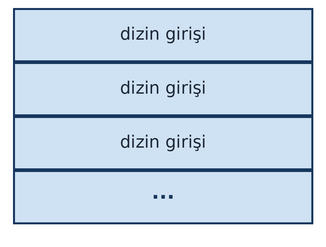

Örneğin ext dosya sistemlerindeki dizin girişi formatı şöyledir:

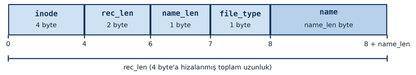

Dizinler ileride göreceğimiz gibi ``opendir`` POSIX fonksiyonuyla açılıp içindeki girişler ``readdir`` POSIX
fonksiyonuyla okunmaktadır. Örneğin ``ls`` komutu da bu fonksiyonları kullanmaktadır.

Bir dizine ``'r'``" hakkının olması, o dizinin içeriğinin ``ls`` gibi bir komutla görüntülenebileceği anlamına
gelmektedir. (Aslında bu kontrol ``opendir`` POSIX fonksiyonunda yapılmaktadır.) Bir dizin içerisinde bir
dosyanın ya da dizinin yaratılması için dizine ``'w'`` hakkının olması gerekir. Çünkü dizin içerisinde dosya ya da
dizin yaratmak aslında dizin dosyasına yeni bir giriş eklemek (bunun bir yazma işlemi olduğuna dikkat ediniz)
anlamına gelmektedir.

Bir dizin içerisindeki bir dosyayı ya da dizini silmek için tek gereken şey, o dosya ya da dizinin içinde
bulunduğu dizine ``'w'`` hakkının olmasıdır. Silinecek dosya ya da dizine ``'w'`` hakkının olup olmadığının hiçbir
önemi yoktur. Ancak bazı kabuk programları, dizine ``'w'`` hakkı varsa ancak silinmek istenen dosya ya da dizine
``'w'`` hakkı yoksa bir uyarı mesajı da verebilmektedir.

Dizinlerde ``x`` hakkı farklı bir anlama gelmektedir. Daha önce de belirttiğimiz gibi işletim sistemi bir yol 
ifadesi verildiğinde yol ifadesini çözümleyebilmek için yol bileşenlerini üzerinden tek tek ilerlemektedir. 
Örneğin:

.. code-block:: text

    "/home/kaan/Study/C/sample.c"

Burada hedeflenen dosya ``sample.c`` dosyasıdır. İşletim sistemi bu dosyanın yerini bulabilmek için yol
ifadesindeki bileşenlerin üzerinden geçmek ister. İşte yol ifadesinin çözümlenmesi işleminde dizin geçişleriyle
hedefe ulaşılabilmesi için prosesin, yol ifadesine ilişkin tüm dizinler için ``'x'`` hakkına sahip olması gerekir.
Yani dizinlerdeki ``'x'`` hakkı "içinden geçilebilirlik" gibi bir anlama gelmektedir. Biz bir dizindeki ``'x'``
hakkını kaldırırsak, işletim sistemi yol ifadesinin çözümlenmesi işleminde başarısız olur. Yukarıdaki örnekte "yol
ifadesinin çözümlenmesi" işleminin başarıyla bitirilebilmesi için prosesin ``home`` dizinine, ``kaan`` dizinine,
``Study`` dizinine ve ``C`` dizinine ``'x'`` hakkının olması gerekir.

``x`` hakkı göreli yol ifadelerinde de aynı biçimde uygulanmaktadır. Örneğin biz ``test.txt`` dosyasını ``open``
fonksiyonu ile ``test.txt`` yol ifadesini vererek açmak isteyelim. Eğer içinde bulunduğumuz dizin için (yani prosesin 
çalıma dizini için) ``'x'`` hakkına sahip değilsek yine yol ifadesi başarılı bir biçimde çözümlenemeyecektir. Başka 
bir deyişle ``test.txt`` yol ifadesi sanki ``./test.txt`` gibi ele alınmaktadır. Örneğin ``a/b/c/test.txt`` gibi 
bir yol ifadesinin başarılı bir biçimde çözülmesi için prosesin çalışma dizini de dahil olmak üzere ``a``, ``b`` 
ve ``c`` dizinlerine ``'x'`` hakkının olması gerekir.

``'x'`` hakkı dizin ağacında bir noktaya duvar örmek için kullanılabilmektedir. ``mkdir`` gibi kabuk komutları
dizin yaratırken zaten ``'x'`` hakkını varsayılan durumda vermektedir. Proses ID'si ``0`` olan *root prosesler*
her zaman yol ifadesinin çözümlenmesi sırasında dizinlerin içerisinden geçebilirler.

Burada bir noktaya dikkatinizi çekmek istiyoruz. Yol ifadesinin çözümlenmesi sırasında prosesin dizinlere ``'r'`` 
hakkının bulunması gerekmemektedir. Örneğin ``a/b/c/test.txt`` gibi bir yol ifadesinde, prosesin ``a`` dizinine,
``b`` dizinine ve ``c`` dizinine ``'r'`` hakkı olmasa bile ``test.txt`` dosyasına gerekli erişim izni varsa bu 
dosya açılabilir. Yani bir dizinin içeriğini görüntüleyemediğimiz halde, eğer bir dosyanın o dizinin içerisinde 
bulunduğunu biliyorsak, o dosyayı yine de kullanabiliriz.

Dosya Nesneleri
---------------

İşletim sistemlerinin dosya işlemleriyle ilgili alt sistemlerine *dosya sistemi (file system)* denilmektedir.
Dosya sisteminin iki yönü vardır: Disk ve Bellek. İşletim sistemi dosyaların kalıcı olarak diskte saklanması
için diski bölümlere ayırır ve belli biçimlerde organize eder. Ancak bir dosya açıldığında işletim sistemi
çekirdek alanı içerisinde o dosyayı yönetebilmek için bazı veri yapıları da oluşturmaktadır.

Bir dosya açıldığında işletim sistemi, açılacak dosyanın bilgilerini yol ifadesini çözümleyerek diskten elde
eder. Bu dosya bilgilerini çekirdek alanı içerisine çeker. Diskteki dosya bilgilerinin bilgilerin çekirdek alanında 
yerleştirildiği nesneelere *dosya nesneleri (file objects)* denilmektedir. Buradaki *nesne (object)* terimi tahsis
edilmiş yapı alanları için kullanılmaktadır; nesne yönelimli programlama tekniğindeki *nesne* terimi ile
doğrudan bir ilgisi yoktur. Dosya nesnesi Linux'un kaynak kodlarında ``file`` isimli bir yapıyla temsil
edilmektedir. Güncel çekirdeklerde ``file`` yapısı Linux kaynak kodlarında ``include/linux/fs.h`` dosyasında
şöyle bildirilmiştir:

.. code-block:: c

    struct file {
        spinlock_t.              f_lock;
        fmode_t	                 f_mode;
        const struct file_operations    *f_op;
        struct address_space            *f_mapping;
        void                     *private_data;
        struct inode             *f_inode;
        unsigned int             f_flags;
        unsigned int             f_iocb_flags;
        const struct cred.       *f_cred;
        struct fown_struct.      *f_owner;
        /* --- cacheline 1 boundary (64 bytes) --- */
        union {
            const struct path	f_path;
            struct path.        __f_path;
        };
        union {
            /* regular files (with FMODE_ATOMIC_POS) and directories */
            struct mutex        f_pos_lock;
            /* pipes */
            u64                 f_pipe;
        };
        loff_t                  f_pos;
    #ifdef CONFIG_SECURITY
        void                    *f_security;
    #endif
        /* --- cacheline 2 boundary (128 bytes) --- */
        errseq_t                f_wb_err;
        errseq_t                f_sb_err;
    #ifdef CONFIG_EPOLL
        struct hlist_head.      *f_ep;
    #endif
        union {
            struct callback_head.   f_task_work;
            struct llist_node.      f_llist;
            struct file_ra_state.   f_ra;
            freeptr_t.              f_freeptr;
        };
        file_ref_t              f_ref;
        /* --- cacheline 3 boundary (192 bytes) --- */
    } __randomize_layout 
    __attribute__((aligned(4)));	/* lest something weird decides that 2 is OK */

Yapının elemanlarını anlamlandıramayabilirsiniz. Bu yapının pek çok elemanını anlanlandırabilmek için başka
bilgilere sahip olmak gerekir.

İşletim sistemi, bir proses bir dosyayı açtığında açılan dosyayı o proses ile ilişkilendirmektedir. Böylece dosya
nesnelerine proses kontrol bloğu yoluyla erişilmektedir. Güncel Linux çekirdeklerinde proses kontrol bloğu yoluyla 
dosya nesnesine erişim süreci biraz karmaşıktır:

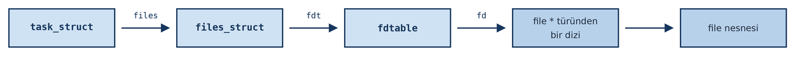

Görüldüğü gibi Linux'ta proses kontrol bloğundan dosya nesnesine erişim birkaç yapıdan geçilerek yapılmaktadır. 
Ancak biz bu durumu şöyle basitleştirerek ifade edebiliriz: proses kontrol bloğundan hareketle bir gösterici dizisine 
erişilmektedir. Bu gösterici dizisine *dosya betimleyici tablosu (file descriptor table)* denilmektedir. 

Dosya Göstericisi Kavramı
-------------------------

Dosyadaki her bir byte'a bir offset numarası karşı getirilmiştir. Buna ilgili byte'ın offset'i denilmektedir.
Dosya göstericisi (file pointer), okuma ve yazma işlemlerinin hangi offset'ten itibaren yapılacağını gösteren
bir offset belirtmektedir. Okunan ya da yazılan byte sayısı kadar dosya göstericisi otomatik olarak ilerletilmektedir.
Dosya ilk açıldığında dosya göstericisi ``0`` konumundadır. Örneğin dosyanın içerisinde ``ankara`` byte'ları
olsun:

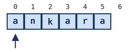

Bu dosya açıldığında dosya göstericisinin değeri ilk byte'ın offset'i olan ``0``'dır. Biz bu pozisyondan iki
byte okursak ``an`` byte'larını okuruz ve dosya göstericisi de 2 byte ilerletilir:

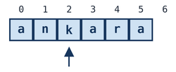

Şimdi 2 byte daha okursak artık ``ka`` byte'larını okuruz:

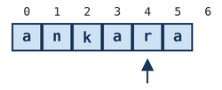

Dosya göstericisinin dosyanın son byte'ından sonraki byte'ı göstermesi durumuna *EOF (End of File) durumu*
denilmektedir. EOF durumunda dosyadan okuma yapılamaz, çünkü okunacak bir şey yoktur. Ancak EOF durumunda dosyaya yazma
yapılabilir. Bu durumda yazılanlar dosyaya eklenmiş olur. Dosyada araya bir şey eklemek (insert) diye bir
kavram yoktur. Dosya boyutunu değiştirmek için dosya göstericisini EOF durumuna çekip yazma yapmak gerekir. 
Şimdi dosyadan 2 byte daha okuyalım:

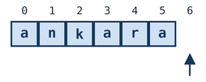

Burada dosya göstericisi artık EOF konumundadır. Şimdi biz bu dosyaya ``istanbul`` yazısının byte'larını yazacak
olsak bunlar artık dosyaya eklenecektir:

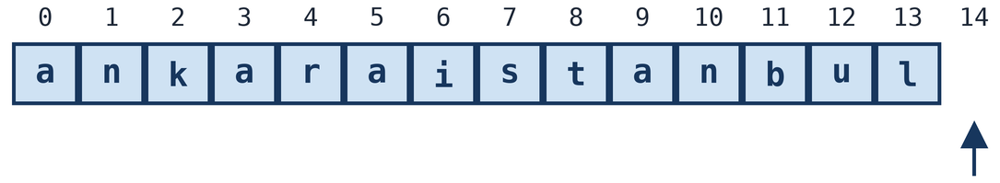

Bir dosya yeni yaratıldığında dosyanın içi boştur, dolayısıyla dosya göstericisi de zaten EOF durumundadır.
Örneğin:


Biz yeni yaratılmış bir dosyaya yazma yaparsak ona ekleme yapmış oluruz. Örneğin boş bir dosyaya ``istanbul`` yazısının 
karakterlerine iişkin byte'ları yazmış olalım:

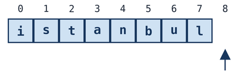

Dosya göstericisinin konumu dosya nesnesi içerisinde saklanmaktadır. (Linux'un kaynak kodlarında ``file``
yapısının ``f_pos`` elemanı dosya göstericisinin konumunu tutmaktadır.) Biz aynı dosyayı ikinci kez açsak
bile yeni bir dosya nesnesi, dolayısıyla yeni bir dosya göstericisi elde etmiş oluruz.

Dosya Betimleyici Tablosu 
-------------------------

Yukarıda da belirttiğimiz gibi *dosya betimleyici tablosu (file descriptor table)*, dosya nesnelerinin adreslerini 
tutan bir gösterici dizisidir:

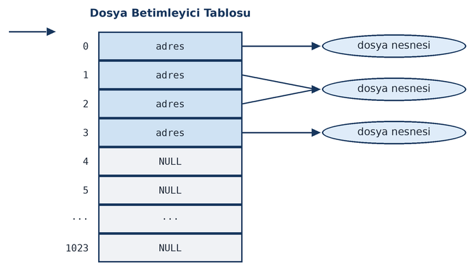

Göürldüğü gibi *dosya betimleyici tablosunun* her elemanı bir dosya nesnesini göstermektedir. 
Dosya betimleyici tablosu prosese özgüdür ve ona o prosesin proses kontrol bloğu (Linux'ta ``task_struct``
yapısı) yoluyla erişilmektedir. 

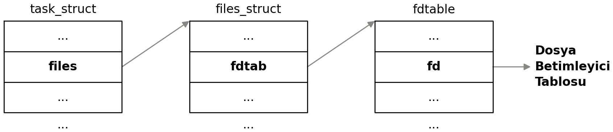

Görüldüğü gibi dosya betimleyici tablosu aslında dosya nesnelerinin
(``struct file`` türünden nesnenin) adreslerini tutmaktadır. Bir dosya açıldığında işletim sistemi dosyanın 
bilgilerini diskten elde eder, bir dosya nesnesi tahsis edip o dosyanın bilgilerini dosya nesnesinin içerisine, dosya 
nesnesinin adresini de dosya betimleyici tablosunun bir slotuna (dizinin elemanına) yerleştirir. Böylece dosya 
betimleyici tablosunun ilgili slotu dosya nesnesini gösteriyor durumda olur. 

Yukarıda da belirttiğimiz gibi dosya betimleyici tablosu prosese özgüdür, thread'e özgü değildir. Prosesin tüm
thread'leri aynı dosya betimleyici tablosunu kullanmaktadır. (Yani işletim sistemi her zaman o anda çalışan thread'in ilişkin
olduğu prosesin dosya betimleyici tablosunu kullanmaktadır.)

Dosya nesnelerinin içerisinde dosya açılırken kullanılan açış bayrakları gibi, dosya göstericisinin konumu gibi pek 
çok bilgi doğrudan ve pek çok bilgi de dolaylı bir biçimde saklanmaktadır. Yani dosya nesneleri diskteki dosya üzerinde 
işlem yapmak için gereken tüm bilgileri doğrudan ya da dolaylı biçimde bulundurmaktadır. 

Temel Dosya Fonksiyonları
=========================

Pek çok POSIX uyumlu işletim sistemi dosya işlemleri için 5 sistem fonksiyonu bulundurmaktadır:

- Dosyayı açmak için gereken sistem fonksiyonu (Linux'ta ``sys_open``)
- Dosyayı kapatmak için gereken sistem fonksiyonu (Linux'ta ``sys_close``)
- Dosyadan okuma yapmak için gereken sistem fonksiyonu (Linux'ta ``sys_read``)
- Dosyaya yazma yapmak için gereken sistem fonksiyonu (Linux'ta ``sys_write``)
- Dosya göstericisini konumlandırmak için gereken sistem fonksiyonu (Linux'ta ``sys_lseek``)

Bu 5 sistem fonksiyonunu çağıran 5 POSIX fonksiyonu bulunmaktadır: ``open``, ``close``, ``read``, ``write`` ve
``lseek``. Dosya işlemleri temelde bu 5 POSIX fonksiyonuyla yapılmaktadır.

Biz UNIX türevi bir sistemde hangi düzeyde çalışıyor olursak olalım, eninde sonunda dosya işlemleri bu 5 POSIX
fonksiyonu çağrılarak gerçekleştirilmektedir. Bu POSIX fonksiyonları da yukarıda belirttiğimiz gibi işletim
sisteminin ilgili sistem fonksiyonlarını çağırmaktadır. Programlama dili ne olursa olsun, bu sistemlerde tüm
dosya işlemleri eninde sonunda bu temel POSIX fonksiyonları çağrılarak yapılmaktadır.

open Fonksiyonu
---------------

UNIX/Linux sistemlerinde dosyayı açmak için ``open`` isimli POSIX fonksiyonu kullanılmaktadır. (Örneğin ``fopen``
standart C fonksiyonu da UNIX/Linux sistemlerinde nihayetinde ``open`` fonksiyonunu çağırmaktadır.) Fonksiyonun
prototipi şöyledir:

.. code-block:: c

    #include <fcntl.h>

    int open(const char *path, int flags, ...);

``open`` fonksiyonu duruma göre üçüncü bir argüman da alabilmektedir. Eğer fonksiyon üç argümanla çağrılacaksa
üçüncü argüman ``mode_t`` türünden olmalıdır. Her ne kadar prototipteki ``...`` atomu *istenildiği kadar argüman
girilebilir* anlamına geliyorsa da ``open`` ya iki argümanla ya da üç argümanla çağrılmalıdır. ``open``
fonksiyonunu daha fazla argümanla çağırmak *tanımsız davranışa (undefined behavior)* yol açmaktadır. Biz daha
açıklayıcı olacak biçimde bu prototipi şöyle de yazabiliriz:

.. code-block:: c

    int open(const char *path, int flags, ... /* mode_t modu */ );

Başka bir gösterim de şöyle olabilir:

.. code-block:: c

    int open(const char *path, int flags);
    int open(const char *path, int flags, mode_t);

Tabii C'de aynı isimli birden fazla fonksiyon bulunamaz. Yukarıdaki gösterim yalnızca kullanımın nasıl
olabileceğini açıklamaktadır.

``open`` fonksiyonunun birinci parametresi açılacak dosyanın yol ifadesini, İkinci parametre açış
bayraklarını (modlarını) belirtmektedir. Bu parametre ``O_XXX`` biçiminde isimlendirilmiş sembolik sabitlerin
*bit OR* işlemine sokulmasıyla oluşturulur. Açış sırasında aşağıdaki sembolik sabitlerden yalnızca birinin
belirtilmesi zorunludur:

.. list-table::
   :header-rows: 1
   :widths: 20 80

   * - Bayrak
     - Anlamı
   * - ``O_RDONLY``
     - Yalnızca okuma niyetiyle
   * - ``O_WRONLY``
     - Yalnızca yazma niyetiyle
   * - ``O_RDWR``
     - Hem okuma hem yazma niyetiyle
   * - ``O_SEARCH``
     - *at*'li fonksiyonlar için
   * - ``O_EXEC``
     - ``fexecve`` fonksiyonu için

Bu bayraklara başka bayraklar da eşlik edebilir; ancak yukarıdaki bayrakların yalnızca bir tanesi kullanılmak
zorundadır.

Buradaki ``O_RDONLY`` "yalnızca okuma yapma amacıyla", ``O_WRONLY`` "yalnızca yazma yapma amacıyla" ve ``O_RDWR``
"hem okuma hem de yazma yapma amacıyla" dosyanın açılmak istendiği anlamına gelmektedir. İşletim sistemi,
prosesin etkin kullanıcı id'sine ve etkin grup id'sine ve dosyanın kullanıcı ve grup id'sine bakarak prosesin
dosyaya ``'r'``, ``'w'`` hakkının olup olmadığını kontrol eder. Eğer proses bu hakka sahip değilse ``open``
fonksiyonu başarısız olur. (Erişim erişim kontrollerinin dosyadan okuma yapılırken ya da dosyaya yazma yapılırken 
değil ``open`` fonksiyonu ile dosya açılırken yapıldığına dikkat ediniz.) Örneğin biz dosyayı şöyle açmak isteyelim:

.. code-block:: c

    fd = open("test.txt", O_RDONLY);

Burada işletim sistemi prosesin dosyaya ``'r'`` hakkı olup olmadığını kontrol edecektir. Örneğin:

.. code-block:: c

    fd = open("test.txt", O_WRONLY);

Burada işletim sistemi prosesin dosyaya ``'w'`` hakkı olup olmadığını kontrol edecektir. Örneğin:

.. code-block:: c

    fd = open("test.txt", O_RDWR);

Burada işletim sistemi prosesin dosyaya hem ``'r'`` hem de ``'w'`` hakkı olup olmadığını kontrol edecektir.

Zorunlu açış bayraklarından ``O_SEARCH`` bayrağı bazı POSIX fonksiyonlarının *at*'li versiyonları için,
``O_EXEC`` bayrağı ise ``fexecve`` fonksiyonu için bulundurulmuştur. 

``open`` fonksiyonu yalnızca olan bir dosyayı açmak için değil aynı zamanda yeni bir dosya yaratmak için de
kullanılmaktadır. ``O_CREAT`` bayrağı, dosya varsa etkili olmaz; dosya yoksa dosyanın yaratılmasını sağlar. Yani
``O_CREAT`` bayrağı "dosya varsa olanı aç, dosya yoksa yarat ve aç" anlamına gelmektedir. Bir dosya yaratılırken
dosyanın erişim haklarını, dosyayı yaratan kişi ``open`` fonksiyonunun üçüncü parametresinde belirtmek zorundadır.
Yani dosyanın erişim haklarını dosyayı yaratan kişi belirlemektedir. Biz ``O_CREAT`` bayrağını açış moduna
eklemişsek bu durumda "dosya yaratılabilir" fikri ile erişim haklarını ``open`` fonksiyonunun üçüncü
parametresine girmek zorundayız. 

Erişim hakları ``<sys/stat.h>`` dosyası içerisinde, tüm bitleri sıfır tek biti ``1`` olan sembolik sabitlerin
*bit OR* işlemine sokulmasıyla oluşturulmaktadır. Bu sembolik sabitlerin hepsi ``S_I`` öneki ile başlar, bunu
``R``, ``W`` ya da ``X`` harfi, bunu da ``USR``, ``GRP`` ya da ``OTH`` harfleri izler. Yani bu sembolik sabitlerin 
oluşturulma biçimi şöyledir:

.. code-block:: text

    S_I[RWX][USR GRP OTH]

Bu biçimde 9 erişim hakkı oluşturulabilmektedir:

.. code-block:: c

    S_IRUSR
    S_IWUSR
    S_IXUSR
    S_IRGRP
    S_IWGRP
    S_IXGRP
    S_IROTH
    S_IWOTH
    S_IXOTH

Örneğin ``S_IRUSR|S_IWUSR|S_IRGRP|S_IROTH`` erişim hakları ``rw-r--r--`` anlamına gelmektedir. Örneğin
``S_IRUSR|S_IWUSR|S_IRGRP|S_IWGRP|S_IROTH`` erişim hakları ``rw-rw-r--`` anlamına gelmektedir. Burada *owner*
sözcüğü yerine *user* sözcüğünün kullanıldığına dikkat ediniz.

Ayrıca ``<sys/stat.h>`` içerisinde aşağıdaki sembolik sabitler de bildirilmiştir:

.. code-block:: c

    S_IRWXU
    S_IRWXG
    S_IRWXO

Bu sembolik sabitler şöyle oluşturulmuştur:

.. code-block:: c

    #define S_IRWXU (S_IRUSR|S_IWUSR|S_IXUSR)
    #define S_IRWXG (S_IRGRP|S_IWGRP|S_IXGRP)
    #define S_IRWXO (S_IROTH|S_IWOTH|S_IXOTH)

Bu durumda örneğin ``S_IRWXU|S_IRWXG|S_IRWXO`` işlemi ``rwxrwxrwx`` anlamına gelmektedir.

Yukarıdaki ``S_IXXX`` biçimindeki sembolik sabitlerin değerlerinin eskiden sistemden sisteme değişebileceği
varsayılmıştır. Bu nedenle POSIX standartları başlarda bu sembolik sabitlerin sayısal değerlerini işletim
sistemlerini oluşturanların belirlemesini istemiştir. Ancak POSIX 2008 (SUS 4) ve sonrasında bu sembolik 
sabitlerin değerleri açıkça belirtilmiştir. Dolayısıyla programcılar artık bu sembolik sabitleri kullanmak 
yerine bunların sayısal karşılıklarını da kullanabilir duruma gelmiştir. Ancak eski sistemler dikkate alındığında 
bunların sayısal karşılıkları yerine yukarıdaki sembolik sabitlerin kullanılması tavsiye edilmektedir. Bu sembolik 
sabitler aynı zamanda okunabilirliği de artırabilmektedir. POSIX standartları 2008 ve sonrasında bu sembolik 
sabitlerin sayısal değerlerini aşağıdaki gibi belirlemiştir:

.. list-table::
   :header-rows: 1
   :widths: 30 30

   * - Sembolik Sabit
     - Sayısal Değer (octal)
   * - ``S_IRWXU``
     - ``0700``
   * - ``S_IRUSR``
     - ``0400``
   * - ``S_IWUSR``
     - ``0200``
   * - ``S_IXUSR``
     - ``0100``
   * - ``S_IRWXG``
     - ``070``
   * - ``S_IRGRP``
     - ``040``
   * - ``S_IWGRP``
     - ``020``
   * - ``S_IXGRP``
     - ``010``
   * - ``S_IRWXO``
     - ``07``
   * - ``S_IROTH``
     - ``04``
   * - ``S_IWOTH``
     - ``02``
   * - ``S_IXOTH``
     - ``01``
   * - ``S_ISUID``
     - ``04000``
   * - ``S_ISGID``
     - ``02000``
   * - ``S_ISVTX``
     - ``01000``

Yani 2008 ve sonrasında artık ``rwxrwxrwx`` biçiminde *owner*, *group* ve *other* bilgilerine ilişkin ``S_IXXX``
biçimindeki sembolik sabitler gerçekten yukarıdaki sıraya göre bitleri temsil eder hale gelmiştir. Örneğin
``S_IWGRP`` sembolik sabiti ``000010000`` bitlerinden oluşmaktadır. Bu durumda 2008 ve sonrasında örneğin
``S_IRUSR|S_IWUSR|S_IRGRP|S_IROTH`` bir erişim hakkını biz doğrudan ``0644`` octal değeri ile de verebiliriz. Bu
sembolik sabitlerin binary karşılıklarını da vermek istiyoruz:

.. list-table::
   :header-rows: 1

   * - Bayrak
     - Bitsel Karşılığı
   * - ``S_IRUSR``
     - 100 000 000
   * - ``S_IWUSR``
     - 010 000 000
   * - ``S_IXUSR``
     - 001 000 000
   * - ``S_IRGRP``
     - 000 100 000
   * - ``S_IWGRP``
     - 000 010 000
   * - ``S_IXGRP``
     - 000 001 000
   * - ``S_IROTH``
     - 000 000 100
   * - ``S_IWOTH``
     - 000 000 010
   * - ``S_IXOTH``
     - 000 000 001

Örneğin:

.. code-block:: c

    fd = open("test.txt", O_RDWR|O_CREAT, S_IRUSR|S_IWUSR|S_IRGRP|S_IROTH);

çağrısı aşağıdakiyle eşdeğerdir:

.. code-block:: c

    fd = open("test.txt", O_RDWR|O_CREAT, 0644);

``open`` fonksiyonunda ``O_CREAT`` bayrağı belirtilmemişse erişim haklarının girilmesinin hiçbir anlamı yoktur.
Kaldı ki ``O_CREAT`` bayrağı girildiğinde de dosya varsa erişim hakları yine dikkate alınmamaktadır. Ancak biz
``open`` fonksiyonunun ikinci parametresinde ``O_CREAT`` bayrağını girmişsek "dosya yaratılabilir" düşüncesiyle
dosyanın erişim haklarını da ``open`` fonksiyonunun üçüncü parametresi için girmeliyiz. ``O_CREAT`` bayrağının 
``O_WRONLY`` ya da ``O_RDWR`` bayraklarıyla kullanılması anlamlıdır. POSIX standartlarına göre ``O_CREAT`` bayrağının 
``O_RDONLY`` bayrağı ile kullanılması *belirsiz davranışa (unspecifed behaviour)* yol açmaktadır. 

Yeni yaratılacak dosya için en çok kullanılan erişim hakları ``rw-r--r--`` biçimindedir. Bu haklar
``S_IRUSR|S_IWUSR|S_IRGRP|S_IROTH`` ya da doğrudan ``0644`` ile verilebilir.

POSIX sistemlerinde yukarıdaki ``S_IXXX`` biçimindeki sembolik sabitler ``mode_t`` türüyle temsil edilmiştir.
``mode_t`` türü ``<sys/types.h>`` ve bazı başlık dosyalarında (örneğin ``<sys/stat.h>``) "bir tamsayı türü olarak" 
typedef edilmek zorundadır. Linux'ta ``<sys/types.h>`` dosyası içerisinde ``mode_t`` türü ``unsigned int`` biçiminde 
typedef edilmiştir.

``O_TRUNC`` açış bayrağı "eğer dosya varsa onu sıfırlayarak aç" anlamına gelmektedir. Ancak ``O_TRUNC`` yazma
modunda açılan dosyalarda kullanılabilmektedir. Yani ``O_TRUNC`` bayrağını kullanabilmek için ``O_WRONLY`` ya da
``O_RDWR`` bayraklarından birinin de belirtilmiş olması gerekir. (Eğer ``O_TRUNC`` bayrağı ``O_WRONLY`` ya da 
``O_RDWR`` bayrağı olmadan kullanılırsa POSIX standartlarına göre bu durum *tanımsız davranışa* yol açmaktadır.)
Örneğin ``O_WRONLY|O_CREAT|O_TRUNC`` açış modu "dosya yoksa yarat ancak dosya varsa içini sıfırlayarak aç" anlamına 
gelmektedir. ``O_TRUNC`` bayrağı için dosyanın yaratılıyor olması gerekmez (zaten dosya yaratılırken içinde bir 
şey olmayacaktır). ``O_WRONLY|O_TRUNC`` geçerli bir açış modudur. Bu durumda dosya yoksa ``open`` başarısız olur. 
Ancak dosya varsa sıfırlanarak açılır.

``O_APPEND`` bayrağı yazma işlemlerinin dosyanın sonuna yapılacağı anlamına gelmektedir. Yani bu bayrak
kullanılırsa tüm yazma işlemlerinde işletim sistemi dosya göstericisini dosyanın sonuna çekip sonra yazmayı
yapmaktadır. Bu açış bayrağı da ``O_WRONLY`` ya da ``O_RDWR`` için anlamlıdır. Ancak POSIX standartları bu bayrağın 
O_RDONLY bayrağı ile kullanılmasını yasaklamamıştır. Örneğin ``O_RDWR|O_APPEND`` kullanıldığında dosyaya her 
yazılan sona eklenecektir. Ancak dosyanın herhangi bir yerinden okuma yapılabilecektir.

O halde standart C'nin ``fopen`` fonksiyonundaki açış modlarının POSIX karşılıkları şöyle oluşturulabilir:

.. list-table::
   :header-rows: 1
   :widths: 20 50

   * - Standart C
     - POSIX
   * - ``"w"``
     - ``O_WRONLY|O_CREAT|O_TRUNC``
   * - ``"w+"``
     - ``O_RDWR|O_CREAT|O_TRUNC``
   * - ``"r"``
     - ``O_RDONLY``
   * - ``"r+"``
     - ``O_RDWR``
   * - ``"a"``
     - ``O_WRONLY|O_CREAT|O_APPEND``
   * - ``"a+"``
     - ``O_RDWR|O_CREAT|O_APPEND``

``O_EXCL`` bayrağı *exclusive* açım için kullanılmaktadır. Bu bayrak tek başına değil ``O_CREAT`` ile birlikte
kullanılmak zorundadır. ``O_CREAT|O_EXCL`` biçimindeki açış modu "dosya yoksa yarat, varsa yaratma, başarısız ol"
anlamına gelmektedir. Yani bu modu kullanan programcı "mutlaka dosyanın sıfırdan yaratılmasını" istemektedir.
POSIX standartlarına göre ``O_EXCL`` bayrağının ``O_CREAT`` olmadan kullanılması *tanımsız davranışa* yol açmaktadır.

``O_DIRECTORY`` bayrağı, açılmak istenen dosya bir dizin dosyası değilse açımın başarısız olmasını
sağlamaktadır. Dizin dosyaları da ``open`` fonksiyonuyla bu bayrak kullanılarak açılabilmektedir.

Aşağıda bayrak birleşimlerinin geçerliliğine yönelik özet bir tablo veriyoruz:

.. list-table::
   :header-rows: 1

   * - Bayrak
     - ``O_RDONLY``
     - ``O_WRONLY``
     - ``O_RDWR``
   * - ``O_APPEND``
     - İzinli, etkisiz (yazma yok)
     - Anlamlı: her ``write`` öncesi ofset EOF'a
     - Anlamlı: her ``write`` öncesi ofset EOF'a
   * - ``O_TRUNC``
     - TANIMSIZ DAVRANIŞ, kullanmayın
     - Geçerli; dosya 0 uzunluğa indirilir
     - Geçerli; dosya 0 uzunluğa indirilir
   * - ``O_CREAT``
     - BELİRSİZ DAVRANIŞ; 3. argüman (mode) zorunlu
     - Geçerli; 3. argüman (mode) zorunlu
     - Geçerli; 3. argüman (mode) zorunlu
   * - ``O_EXCL``
     - ``O_CREAT`` ile kullanılmak zorunda
     - ``O_CREAT`` ile kullanılmak zorunda
     - ``O_CREAT`` ile kullanılmak zorunda

Linux sistemlerinde POSIX standartlarında olmayan bazı açış bayrakları da bulunmaktadır. Biz open fonksiyonunun diğer açış
bayraklarını ileride başka konular içerisinde ele alacağız. Bazılarını henüz görmemiş olsak da açış bayraklarının 
hepsini aşağıda bir tablo halinde veriyoruz:

.. list-table::
   :header-rows: 1

   * - Bayrak
     - İşlev
     - Standart
   * - ``O_RDONLY``
     - Dosyayı yalnızca okuma modunda aç.
     - POSIX
   * - ``O_WRONLY``
     - Dosyayı yalnızca yazma modunda aç.
     - POSIX
   * - ``O_RDWR``
     - Dosyayı hem okuma hem yazma modunda aç.
     - POSIX
   * - ``O_CREAT``
     - Dosya yoksa oluştur. ``mode`` argümanıyla izin bitleri verilir.
     - POSIX
   * - ``O_EXCL``
     - ``O_CREAT`` ile birlikte: dosya zaten varsa hata döndür (``EEXIST``).
     - POSIX
   * - ``O_TRUNC``
     - Dosya varsa ve yazma modundaysa içeriği sıfırlanır.
     - POSIX
   * - ``O_APPEND``
     - Her ``write`` çağrısından önce dosya göstericisini sona taşı; atomik ekleme garantisi verir.
     - POSIX
   * - ``O_NONBLOCK``
     - IO işlemlerini bloke etmeyen (non-blocking) modda gerçekleştir.
     - POSIX
   * - ``O_NOCTTY``
     - Dosya bir terminal aygıtıysa prosesin kontrol terminali (controlling terminal) olarak
       atanmasını engeller.
     - POSIX
   * - ``O_CLOEXEC``
     - Dosya betimleyicisine ``FD_CLOEXEC`` bayrağı atar; ``exec`` sonrası betimleyici otomatik
       kapanır. ``fork`` + ``exec`` yarış koşulunu önler.
     - POSIX
   * - ``O_DSYNC``
     - Her ``write``, yalnızca veriyi diske flush edene kadar bloke et; meta veri (erişim zamanı vs)
       beklenmez.
     - POSIX (2008'den)
   * - ``O_SYNC``
     - Her ``write``, veri ve meta veriyi diske flush edene kadar bloke eder. ``O_DSYNC`` + meta veri
       garantisi; ``__O_SYNC | O_DSYNC`` olarak tanımlıdır.
     - POSIX (2008'den)
   * - ``O_RSYNC``
     - ``read`` çağrıları, bekleyen ``write`` I/O'larının tamamlanmasını bekler. Linux'ta ``O_SYNC``
       ile eş anlamlı davranır.
     - POSIX (2008'den)
   * - ``O_NDELAY``
     - ``O_NONBLOCK`` ile eş anlamlı; eski BSD uyumluluğu için korunur.
     - Linux'a Özgü
   * - ``O_DIRECTORY``
     - Yol ifadesi bir dizin dosyası belirtmiyorsa ``ENOTDIR`` döndür; yalnızca dizin dosyalarını
       açmak için kullanılır.
     - Linux'a Özgü
   * - ``O_NOFOLLOW``
     - Yol ifadesinin son bileşeni sembolik bağsa (symlink) ``ELOOP`` döndürür. Sembolik bağın
       izlenmesini engeller.
     - Linux'a Özgü
   * - ``O_NOATIME``
     - ``read`` çağrılarında inode'un ``atime`` (erişim zamanı) alanı güncellenmez. Yedekleme ve
       dizin dosyası tarama araçlarında kullanılır.
     - Linux'a Özgü
   * - ``O_PATH``
     - Dosya içeriğine değil yalnızca dosya sistemi konumuna referans için fd aç. Okuma/yazma
       yapılamaz; at'li fonksiyonlar için kullanılır.
     - Linux'a Özgü
   * - ``O_TMPFILE``
     - İsimsiz geçici bir dosya oluştur; fd kapanınca dosya otomatik silinir. ``linkat`` ile kalıcı
       hale getirilebilir.
     - Linux'a Özgü
   * - ``O_LARGEFILE``
     - 32-bit sistemlerde 2 GB'ı aşan dosyaların açılmasına izin ver. 64-bit sistemlerde örtük
       olarak etkindir.
     - Linux'a Özgü
   * - ``O_ASYNC``
     - Dosya üzerinde IO hazır olduğunda ``SIGIO`` sinyali gönder (sinyal güdümlü G/Ç). ``fcntl``
       ile de ayarlanabilir.
     - Linux'a Özgü

Yukarıda da belirttiğimiz gibi erişim hakları ``open`` fonksiyonu tarafından (yani ``open`` fonksiyonunun
çağırdığı sistem fonksiyonu tarafından) kontrol edilmektedir. Örneğin biz dosyayı ``O_RDWR`` modunda açmak
isteyelim; bu durumda prosesimizin dosyaya ``r`` ve ``w`` haklarına sahip olması gerekir. Eğer prosesimiz dosya
için bu haklara sahip değilse ``open`` başarısız olur ve ``errno`` ``EACCES`` (*Permission denied*) değeri ile
set edilir. Burada önemli olan nokta, kontrolün en başta ``open`` fonksiyonu tarafından yapılmasıdır.

``open`` fonksiyonu başarı durumunda ``int`` türden *dosya betimleyicisi (file descriptor)* denilen bir değerle
geri dönmektedir. Dosya betimleyicisi bir handle olarak diğer fonksiyonlara geçirilmektedir. ``open``
başarısızlık durumunda ``-1`` ile geri döner ve ``errno`` uygun biçimde set edilir. ``open`` fonksiyonunun
başarısız olması için pek çok neden söz konusudur. Bundan dolayı açma işleminin başarısı kesinlikle kontrol
edilmelidir. Örneğin:

.. code-block:: c

    int fd;

    if ((fd = open("test.txt", O_RDONLY)) == -1)
        exit_sys("open");

Yukarıda da belirttiğimiz gibi``open`` fonksiyonu işletim sisteminin dosya açan sistem fonksiyonunu (Linux'ta ``sys_open``) 
çağırmaktadır. Bu sistem fonksiyonu açılacak dosyaya ilişkin bilgileri diskten bulur ve o bilgileri daha önceden de belirttiğimiz
gibi *dosya nesnesi (file object)* denilen bir yapının içerisine yerleştirir. Dosya nesnesinin Linux'un kaynak
kodlarında ``struct file`` türü ile temsil edildiğini söylemiştik. İşletim sistemi dosya nesnesinin içini
doldurduktan sonra dosya betimleyici tablosunda boş bir slot bulur ve o slota dosya nesnesinin adresini yazar.
Anımsanacağı gibi dosya betimleyici tablosu, dosya nesnelerinin adreslerini tutan bir gösterici dizisi
biçiminde organize edilmiştir. Dosya betimleyici tablosunun yeri prosesin kontrol bloğundan hareketle elde
edilmektedir. İşte ``open`` fonksiyonunun bize geri döndürdüğü dosya betimleyicisi aslında dosya betimleyici
tablosunda (yani gösterici dizisinde) bir indeks belirtmektedir. Örneğin ``open`` fonksiyonu dosya nesnesinin
adresini dosya betimleyici tablosunun 3. indeksli slotuna yerleştirmiş olsun:

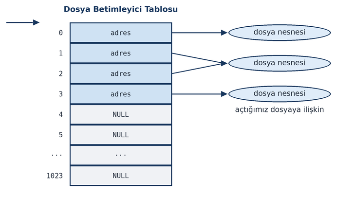

Bu durumda ``open`` fonksiyonu ``3`` değeri ile geri dönecektir.

Bir program çalıştığında genellikle dosya betimleyici tablosunun ilk üç betimleyicisi dolu, diğerleri boştur.
Dosya betimleyici tablosunun 0. slotu (yani ``0`` numaralı betimleyici) terminal aygıt sürücüsü için
oluşturulmuş dosya nesnesini göstermektedir. Buna *stdin dosya betimleyicisi* de denilmektedir. ``1`` ve ``2``
numaralı betimleyiciler yine terminal aygıt sürücüsü için oluşturulmuş dosya nesnesini gösterir (``1`` ve ``2``
numaralı betimleyiciler aynı nesneyi göstermektedir). Bu betimleyicilere de sırasıyla *stdout ve stderr dosya
betimleyicileri* denilmektedir. Böylece ilk boş betimleyici genellikle ``3`` numaralı betimleyici olmaktadır.

``open`` fonksiyonunun dosya betimleyici tablosunda ilk boş betimleyiciyi vermesi POSIX standartlarında garanti edilmiştir. 
Örneğin ``open`` fonksiyonunun çağrıldığı durumda dosya betimleyici tablosunun durumu şöyle olsun:

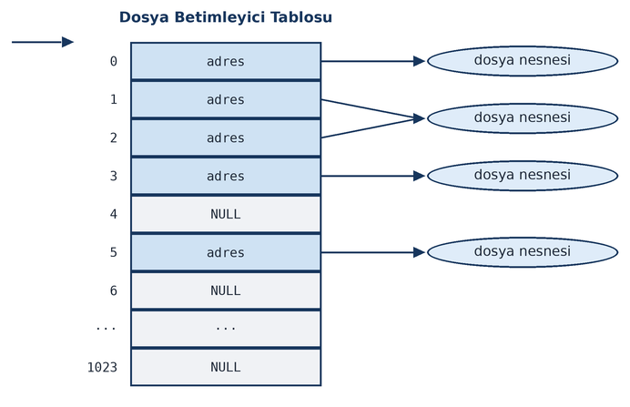

Bu durumda ``open`` fonksiyonunun ``4`` ile geri dönecektir. Çünkü ilk boş slot ``4`` numaralı slottur.  

Her prosesin proses kontrol bloğu ve dolayısıyla dosya betimleyici tablosu birbirinden farklıdır. Dosya 
betimleyicileri kendi prosesinin dosya betimleyici tablosunda bir indeks belirtmektedir. Yani dosya
betimleyicileri prosese özgü bir anlama sahiptir. Biz bir prosesteki dosya betimleyicisini prosesler arası
haberleşme yöntemleriyle başka bir prosese göndersek, o betimleyici o proseste farklı bir dosyaya referans
edebilir ya da geçersiz olabilir.

Bu durumda işletim sisteminin dosya açan sistem fonksiyonu kabaca sırasıyla şu işlemleri yapmaktadır:

| **1.** Dosya betimleyici tablosunda ilk boş betimleyiciyi bulmaya çalışır. Boş bir betimleyici bulamazsa
   başarısız olur ve ``errno`` değerini ``EMFILE`` (*Too many open files*) ile set eder.
| **2.** Dosya nesnesini ve diğer başka nesneleri tahsis eder, bunların içini diskten elde ettiği bilgilerle 
   doldurur. Dosya nesnesinin adresini de dosya betimleyici tablosunda ilk boş betimleyiciye ilişkin slota yerleştirir.
| **3.** Dosya betimleyici tablosunda indeks belirten betimleyici değeri ile geri döner.

C'nin ``fopen`` fonksiyonunda dosya açımı sırasında *text mode*, *binary mode* gibi bir kavram vardır. Halbuki
işletim sisteminde böyle bir kavram yoktur. İşletim sistemine göre dosya byte'lardan oluşmaktadır. *Text mode*,
*binary mode* C ve diğer bazı diller tarafından kullanılan yapay bir kavramdır.

Bir proses her ``open`` işlemi yaptığında yeni bir dosya nesnesi oluşturulmaktadır. Bu durumda bir
proses aynı dosyayı aynı biçimde ikinci kez açmış olsa bile aynı dosya nesnesi kullanılmaz. Her iki ``open``
çağrısı iki farklı dosya nesnesinin ve dosya betimleyicisinin oluşmasına yol açmaktadır. 

Aşağıda örnek bir dosya açım kodu verilmiştir:

.. code-block:: c

    #include <stdio.h>
    #include <stdlib.h>
    #include <fcntl.h>
    #include <sys/stat.h>

    void exit_sys(const char *msg);

    int main(void)
    {
        int fd;

        if ((fd = open("test.txt", O_WRONLY|O_CREAT|O_TRUNC, S_IRUSR|S_IWUSR|S_IRGRP|S_IROTH)) == -1)
            exit_sys("open");

        printf("file opened: %d\n", fd);

        return 0;
    }

    void exit_sys(const char *msg)
    {
        perror(msg);
        exit(EXIT_FAILURE);
    }

Linux sistemlerinde varsayılan olarak proseslerin dosya betimleyici tabloları 1024 slottan oluşmaktadır. 
Yani varsayılan durumda bu sistemlerde bir proses, kapatmadan en fazla 1024 dosyayı açık olarak tutabilmektedir.
Yukarıda da belirttiğimiz gibi eğer dosya betimleyici tablosunda boş yer yoksa ``open`` fonksiyonu başarısız
olur ve ``errno`` değişkenine ``EMFILE`` (*Too many open files*)  set edilir. (Her ne kadar Linux sistemlerinde işin 
başında dosya betimleyici tablosu `1024`` slottan oluşuyorsa da bu değer çeşitli biçimlerde artırılabilmektedir. 
Bu konuyu "proseslerin kaynak limitlerini" anlattığımız bölümde ele alacağız.)

Aşağıdaki örnekte döngü içerisinde "var olan bir dosya" kapatılmadan sürekli yeniden açılmıştır. En sonunda şöyle bir 
hata ile karşılaşılacaktır:

open: Too many open files

.. code-block:: text

    open: Too many open files

.. code-block:: c

    #include <stdio.h>
    #include <stdlib.h>
    #include <fcntl.h>

    void exit_sys(const char *msg);

    int main(void)
    {
        int fd;

        for (int i = 0;; ++i) {
            if ((fd = open("test.txt", O_RDONLY)) == -1)
                break;
            printf("%d\n", fd);
        }

        if ((fd = open("test.txt", O_RDONLY)) == -1)
            exit_sys("open");

        return 0;
    }

    void exit_sys(const char *msg)
    {
        perror(msg);
        exit(EXIT_FAILURE);
    }

creat Fonksiyonu
----------------

İlk UNIX sistemlerinden beri ``creat`` isimli bir fonksiyon da ``open`` fonksiyonunun bir sarma fonksiyonu
biçiminde bulundurulmaktadır. ``creat`` fonksiyonu POSIX standartlarında var olan bir fonksiyondur. Fonksiyonun
prototipi şöyledir:

.. code-block:: c

    #include <fcntl.h>

    int creat(const char *path, mode_t mode);

Fonksiyonun birinci parametresi dosyanın yol ifadesini belirtmektedir. İkinci parametre erişim bilgisini
belirtir. Görüldüğü gibi fonksiyonda açış modu belirten ``flags`` parametresi yoktur. Çünkü bu parametre
``O_WRONLY|O_CREAT|O_TRUNC`` biçiminde alınmaktadır. ``creat`` fonksiyonu aşağıdaki gibi yazılmıştır:

.. code-block:: c

    int creat(const char *path, mode_t mode)
    {
        return open(path, O_WRONLY|O_CREAT|O_TRUNC, mode);
    }

Ancak biz kitabımızda bu ``creat`` fonksiyonu yerine asıl fonksiyon olan ``open`` fonksiyonunu kullanacağız.

close Fonksiyonu
----------------

Açılan her dosyanın kapatılması gerekir. Bir dosyanın kapatılması sırasında işletim sistemi, dosyanın açılması
sırasında yapılan işlemleri geri almaktadır. Kabaca (tabii ayrıntıları var) UNIX/Linux sistemlerinde dosya kapatıldığında 
şunlar yapılmaktadır:

| **1.** Dosya nesnesi ve bununla ilgili diğer çekirdek nesneleri yok edilir.
| **2.** Dosya betimleyici tablosundaki betimleyiciye ilişkin slot boşaltılır.

İleride de göreceğimiz gibi dosya betimleyici tablosunda birden fazla betimleyici aynı dosya nesnesini
gösteriyor durumda olabilmektedir. Bu durumda işletim sistemi dosya nesnesi içerisinde bir sayaç tutup bu
sayacı artırıp eksiltmektedir. Sayaç ``0``'a düştüğünde nesneyi silmektedir. (Linux'un kaynak kodlarında bu
sayaç eski çekirdeklerde ``struct file`` yapısının ``f_count`` elemanında, yeni çekirdeklerde ise ``f_ref``
elemanında tutulmaktadır.)

Bir dosya artık kullanılmayacaksa onu kapatmak iyi bir tekniktir. Çünkü bu sayede:

| **1.** Dosya nesnesi ve bununla ilgili diğer çekirdek nesneleri gereksiz bir biçimde çekirdek alanı içerisinde yer kaplamaz.
| **2.** Dosya betimleyici tablosundaki slot serbest bırakılır.

Tabii işletim sistemi, proses dosyayı kapatmasa bile proses sonlandırılırken prosesin dosya betimleyici
tablosunu inceler ve açık dosyaları ``close`` fonksiyonu çağrılmış gibi kapatır. Yani biz bir dosyayı kapatmasak bile proses
bittiğinde dosyalar zaten kapatılmaktadır. Ancak dosyaların kullanımı bittikten sonra erken bir biçimde
programcı tarafından kapatılması iyi bir tekniktir.

Dosyanın kapatılması için ``close`` isimli POSIX fonksiyonu bulundurulmuştur. Bu POSIX fonksiyonu doğrudan
işletim sisteminin dosyayı kapatan sistem fonksiyonunu (Linux'ta ``sys_close``) çağırmaktadır. ``close``
fonksiyonunun prototipi şöyledir:

.. code-block:: c

    #include <unistd.h>

    int close(int fd);

Fonksiyon parametre olarak dosya betimleyicisini alır. ``close`` fonksiyonu başarı durumunda ``0`` değerine,
başarısızlık durumunda ``-1`` değerine geri dönmektedir. Fonksiyonun geri dönüş değeri genellikle kontrol
edilmez. Eğer programcı fonksiyona geçerli bir dosya betimleyicisini argüman olarak geçmişse fonksiyonun
başarısız olması mümkün değildir.

Aşağıda bir dosyayı açıp kapatan örnek bir program veriyoruz.

.. code-block:: c

    #include <stdio.h>
    #include <stdlib.h>
    #include <fcntl.h>
    #include <sys/stat.h>

    void exit_sys(const char *msg);

    int main(void)
    {
        int fd;

        if ((fd = open("test.txt", O_WRONLY|O_CREAT|O_TRUNC, S_IRUSR|S_IWUSR|S_IRGRP|S_IROTH)) == -1)
            exit_sys("open");

        printf("file opened: %d\n", fd);

        close(fd);

        return 0;
    }

    void exit_sys(const char *msg)
    {
        perror(msg);
        exit(EXIT_FAILURE);
    }

read Fonksiyonu
---------------

Dosyadan okuma yapmak için ``read`` POSIX fonksiyonu kullanılmaktadır. Pek çok sistemde bu POSIX fonksiyonu
doğrudan işletim sisteminin okuma yapan sistem fonksiyonunu (Linux'ta ``sys_read``) çağırmaktadır. ``read``
fonksiyonunun prototipi şöyledir:

.. code-block:: c

    #include <unistd.h>

    ssize_t read(int fd, void *buf, size_t nbyte);

Fonksiyonun birinci parametresi okuma işleminin yapılacağı dosya betimleyicisini belirtmektedir. İşletim sistemi
bu betimleyiciden hareketle dosya nesnesine erişir. İkinci parametre dosyadan okunan byte'ların
yerleştirileceği bellek transfer adresini, üçüncü parametre de okunacak byte sayısını belirtmektedir.

Fonksiyon başarı durumunda okuyabildiği byte sayısıyla geri döner. ``read`` fonksiyonu ile eğer dosya
göstericisinin gösterdiği yerden itibaren dosya sonuna kadar mevcut olan byte miktarından daha fazla byte
okunmak istenirse, ``read`` fonksiyonu okuyabildiği kadar byte'ı okur ve okuyabildiği byte sayısına geri döner.
Dosya göstericisi EOF durumunda ise ``read`` fonksiyonu hiç okuma yapamayacağı için ``0`` ile geri dönmektedir. Ancak
argümanların yanlış girilmesinde ya da IO hatalarında ``read`` başarısız olur ve ``-1`` değerine geri döner;
``errno`` uygun bir biçimde set edilir. ``ssize_t`` türü ``<unistd.h>`` ve ``<sys/types.h>`` dosyaları
içerisinde "işaretli bir tamsayı türünü belirtecek biçiminde" ``typedef`` edilmek zorunda olan POSIX'e özgü bir tür
ismidir. ``ssize_t`` türünü ``size_t`` türünün işaretli biçimi olarak düşünebilirsiniz. ``size_t`` türü C
standartlarında olduğu halde ``ssize_t`` türü C standartlarında bulunmamaktadır. ``read`` fonksiyonunu tipik
olarak şöyle kullanmalısınız:

.. code-block:: c

    ssize_t result;
    char buf[BUFFER_SIZE];

    if ((result = read(fd, buf, BUFFER_SIZE)) == -1)
        exit_sys("read");

Talep ettiğiniz kadar bilginin okunup okunmadığını anlamak için ayrıca bir kontrol de apabilirsiniz:

.. code-block:: c

    if ((result = read(fd, buf, BUFFER_SIZE)) != BUFFER_SIZE) {
        if (result == -1)
            exit_sys("read");
        fprintf(stderr, "cannot read enough!..\n");
        exit(EXIT_FAILURE);
    }

Eğer bir metin dosyasından okuma yapıp okunanı yazdırmak istiyorsanız null karakteri yaznın sonuna eklemeyi unutmayınız.
Örneğin:

.. code-block:: c

    char buf[BUFFER_SIZE + 1];
    ssize_t result;

    if ((result = read(fd, buf, BUFFER_SIZE)) == -1)
        exit_sys("read");

    buf[result] = '\0';
    puts(buf);

``read`` fonksiyonu ile dosyadan ``0`` byte okunmak istendiğinde ``read`` fonksiyonu temel bazı kontrolleri
yapar (örneğin dosyanın okuma modunda açılmış olup olmadığını kontrol eder), eğer bu kontrollerde bir sorun
çıkarsa fonksiyon başarısız olur ve ``-1`` değerine geri döner. Eğer bu kontrollerde bir sorun çıkmazsa fonksiyon ``0``
değerine geri döner ve herhangi bir okuma işlemi yapmaz.

Aşağıda "içerisinde yazıların bulunduğu bir dosyadan" ``10`` byte okuma yapılıp okunanlar ekrana (``stdout`` dosyasına) yazdırılmıştır.

.. code-block:: c

    #include <stdio.h>
    #include <stdlib.h>
    #include <fcntl.h>
    #include <sys/stat.h>
    #include <unistd.h>

    void exit_sys(const char *msg);

    int main(void)
    {
        int fd;
        char buf[10 + 1];
        ssize_t result;

        if ((fd = open("test.txt", O_RDONLY)) == -1)
            exit_sys("open");

        if ((result = read(fd, buf, 10)) == -1)
            exit_sys("read");

        buf[result] = '\0';
        printf(":%s:\n", buf);

        close(fd);

        return 0;
    }

    void exit_sys(const char *msg)
    {
        perror(msg);
        exit(EXIT_FAILURE);
    }

Şimdi bir dosyayı dosya sonuna kadar ``read`` fonksiyonu ile bir döngü içerisinde okuyalım. Bu tür durumlarda
klasik yöntem aşağıdaki gibi bir döngü oluşturmaktır:

.. code-block:: c

    while ((result = read(fd, buf, BUFSIZE)) > 0) {
        /* ... */
    }
    if (result == -1)
        exit_sys("read");

Bu döngüden IO hatası oluşunca ya da dosya göstericisi dosyanın sonuna geldiğinde çıkılacaktır. Döngüden
çıkıldığında neden çıkıldığı da ayrıca sorgulanmıştır.

.. code-block:: c

    #include <stdio.h>
    #include <stdlib.h>
    #include <fcntl.h>
    #include <sys/stat.h>
    #include <unistd.h>

    #define BUFSIZE        4096

    void exit_sys(const char *msg);

    int main(void)
    {
        int fd;
        char buf[BUFSIZE + 1];
        ssize_t result;

        if ((fd = open("sample.c", O_RDONLY)) == -1)
            exit_sys("open");

        while ((result = read(fd, buf, BUFSIZE)) > 0) {
            buf[result] = '\0';
            printf("%s", buf);
        }

        if (result == -1)
            exit_sys("read");

        close(fd);

        return 0;
    }

    void exit_sys(const char *msg)
    {
        perror(msg);
        exit(EXIT_FAILURE);
    }

write Fonksiyonu
----------------

Dosyaya yazma yapmak için ``write`` isimli POSIX fonksiyonu kullanılmaktadır. Bu fonksiyon da pek çok sistemde
doğrudan işletim sisteminin dosyaya yazma yapan sistem fonksiyonunu (Linux'ta ``sys_write``) çağırmaktadır.
Fonksiyonun prototipi şöyledir:

.. code-block:: c

    #include <unistd.h>

    ssize_t write(int fd, const void *buf, size_t nbyte);

Fonksiyonun birinci parametresi yazma yapılacak dosyaya ilişkin dosya betimleyicisini, ikinci parametresi
yazılacak bilgilerin bulunduğu bellek transfer adresini, üçüncü parametresi ise yazılacak byte sayısını
belirtmektedir. ``write`` fonksiyonu başarılı olarak yazılan byte sayısıyla geri dönmektedir. Normal olarak bu
değer üçüncü parametrede belirtilen yazılmak istenen byte sayısıdır. Ancak çok seyrek bazı durumlarda ``write``
fonksiyonu talep edilenden daha az byte'ı da dosyaya yazabilir. Bu durumda ``write`` fonksiyonu yazabildiği
byte sayısıyla geri dönmektedir. ``write`` fonksiyonu başarısız olursa ``-1`` değerine geri döner ve ``errno``
uygun biçimde set edilir. Fonksiyon tipik olarak şöyle kullanılmaktadır:

.. code-block:: c

    if (write(fd, buf, size) == -1)
        exit_sys("write");

Disk doluysa ya da yazılmak istenen dosya işletim sisteminin kullandığı dosya sisteminin izin verilen uzunluğunu
aşıyorsa ``write`` fonksiyonu yazabildiği kadar byte'ı yazar, yazabildiği byte sayısına geri döner (partial write),
ancak bu nedenlerle ``write`` hiç byte yazamazsa başarısız olup -1 değeri ile geri dönmektedir. Bu durumda ``errno``
değişkeni ``ENOSPC`` (*No space left on device*) değeri ile set edilmektedir. ``write`` fonksiyonunun boru gibi özel
dosyalardaki davranışı farklıdır. Bu konu ileride ele alınacaktır. 

Daha önce de belirttiğimiz gibi ``write`` fonksiyonu yazmayı EOF ötesine yapabilir; bu durumda yazılanlar dosyaya 
eklenmiş olacaktır. Örneğin yeni yaratılmış bir dosyaya yazma yapılırsa yazılanlar dosyaya eklenmiş olur.

``write`` fonksiyonu ile dosyaya ``0`` byte yazılmak istendiğinde gerçek bir yazma yapılmaz. ``write``
fonksiyonu bu durumda yazma için gerekli kontrolleri yapar (örneğin dosyanın yazma modunda açılıp açılmadığı
gibi), eğer bu kontrollerde başarısızlık oluşursa ``-1`` değeriyle, eğer bu kontrollerde başarısızlık 
oluşmazsa ``0`` değeriyle geri döner. Ancak yukarıda da belirttiğimiz gibi bu durumda gerçek bir yazma yapılmamaktadır. 
POSIX standartları normal dosyaların dışında (yani *regular* dosyaların dışında) 0 byte yazma işleminin 
*belirsiz (unspecified)* davranışa yol açacağını belirtmektedir. 

Aşağıdaki programda klavyeden (``stdin`` dosyasından) yazılar okunup ``write`` fonksiyonu ile dosyaya
yazdırılmıştır. ``fgets`` fonksiyonunun ``'\n'`` karakterini de diziye yerleştirdiğini anımsayınız.

.. code-block:: c

    #include <stdio.h>
    #include <stdlib.h>
    #include <string.h>
    #include <fcntl.h>
    #include <unistd.h>

    void exit_sys(const char *msg);

    #define BUFFER_SIZE         4096

    int main(void)
    {
        int fd;
        char buf[BUFFER_SIZE];
        size_t len;
        ssize_t result;
        
        if ((fd = open("test.txt", O_WRONLY|O_CREAT|O_TRUNC, S_IRUSR|S_IWUSR|S_IRGRP|S_IROTH)) == -1)
            exit_sys("open");

        for (;;) {
            printf("Enter text:");
            fflush(stdout);
            if (fgets(buf, BUFFER_SIZE, stdin) == NULL)
                continue;
            if (!strcmp(buf, "quit\n"))
                break;      
            len = strlen(buf);
            if ((result = write(fd, buf, len)) != len) {
                if (result == -1)
                    exit_sys("write");
                fprintf(stderr, "partial write error!..\n");
                exit(EXIT_FAILURE);
            }      
        }

        close(fd);

        return 0;
    }

    void exit_sys(const char *msg)
    {
        perror(msg);
        exit(EXIT_FAILURE);
    }

Örnek Bir Uygulama: Dosya Kopyalaması
-------------------------------------

UNIX/Linux sistemlerinde dosya kopyalama tipik olarak bir döngü içerisinde kaynak dosyadan hedef dosyaya blok
blok okuma yazma işlemi ile yapılmaktadır. Ancak bazı UNIX türevi işletim sistemleri dosya kopyalama işlemi
için sistem fonksiyonları da bulundurabilmektedir. Örneğin Linux sistemlerinde ``sys_copy_file_range`` isimli
sistem fonksiyonu doğrudan disk üzerinde blok kopyalaması yoluyla, hiç kullanıcı modunda işlem yapmadan dosya
kopyalamasını gerçekleştirebilmektedir. Ancak dosya kopyalama işleminin taşınabilir yolu yukarıda belirttiğimiz
gibi kaynaktan hedefe aktarım yapmaktır.

Peki bu kopyalama işleminde hangi büyüklükte bir tampon kullanılmalıdır? Tipik olarak bunun için dosya
sistemindeki blok uzunluğu tercih edilir. ``stat``, ``fstat``, ``lstat`` gibi fonksiyonlar bu bilgiyi bize
verirler. Bu fonksiyonları izleyen paragraflarda ele alacağız. Kopyalama sırasında kaynak dosyanın ``O_RDONLY``
bayrağı ile, hedef dosyanın ise ``O_WRONLY|O_CREAT|O_TRUNC`` bayrağı ile açılması uygun olur. Ancak hedef
dosya varsa onu ezmemek için hedef dosya ``O_WRONLY|O_CREAT|O_EXCL`` bayraklarıyla da açılabilir. Kopyalama
tipik olarak aşağıdaki gibi bir döngüyle yapılmaktadır:

.. code-block:: c

    if ((fds = open(argv[1], O_RDONLY)) == -1)
        exit_sys(argv[1]);

    if ((fdd = open(argv[2], O_WRONLY|O_CREAT|O_TRUNC, S_IRUSR|S_IWUSR|S_IRGRP|S_IROTH)) == -1)
        exit_sys(argv[2]);

    while ((result = read(fds, buf, BUFFER_SIZE)) > 0)
        if (write(fdd, buf, result) == -1) {
            if (result == -1)
                exit_sys(argv[2]);
            fprintf(stderr, "partial write error!..\n");
            exit(EXIT_FAILURE);
        }
    if (result == -1)
        exit_sys(argv[1]);

    close(fds);
    close(fdd);

Kopyalama yapılırken aslında hedef dosyanın erişim hakları kaynak dosyanın aynısı olacak biçimde ayarlanmalıdır.
Ancak biz henüz o konuları görmedik. Bu nedenle aşağıdaki programla çalıştırılabilir bir dosyayı kopyalamaya
çalışırsak ``x`` hakkı hedef dosyada olmadığı için kopyasını çalıştıramayız.

.. code-block:: c

    #include <stdio.h>
    #include <stdlib.h>
    #include <string.h>
    #include <fcntl.h>
    #include <unistd.h>

    #define BUFFER_SIZE         8192

    void exit_sys(const char *msg);

    int main(int argc, char *argv[])
    {
        int fds, fdd;
        char buf[BUFFER_SIZE];
        ssize_t result;

        if (argc != 3) {
            fprintf(stderr, "wrong number of arguments!..\n");
            exit(EXIT_FAILURE);
        }

        if ((fds = open(argv[1], O_RDONLY)) == -1)
            exit_sys(argv[1]);

        if ((fdd = open(argv[2], O_WRONLY|O_CREAT|O_TRUNC, S_IRUSR|S_IWUSR|S_IRGRP|S_IROTH)) == -1)
            exit_sys(argv[2]);

        while ((result = read(fds, buf, BUFFER_SIZE)) > 0)
            if (write(fdd, buf, result) == -1) {
                if (result == -1)
                    exit_sys(argv[2]);
                fprintf(stderr, "partial write error!..\n");
                exit(EXIT_FAILURE);
            }
        if (result == -1)
            exit_sys(argv[1]);

        close(fds);
        close(fdd);

        return 0;
    }

    void exit_sys(const char *msg)
    {
        perror(msg);
        exit(EXIT_FAILURE);
    }

pread ve pwrite Fonksiyonları
-----------------------------

``read`` ve ``write`` POSIX fonksiyonları yukarıda da belirttiğimiz gibi dosya göstericisinin gösterdiği yerden
itibaren okuma ve yazma işlemlerini yapmaktadır. Bu fonksiyonlar dosya göstericisinin konumunu okunan ya da
yazılan miktar kadar ilerletmektedir. İşte ``read`` ve ``write`` fonksiyonlarının ``pread`` ve ``pwrite``
biçiminde versiyonları da bulunmaktadır. ``pread`` ve ``pwrite`` fonksiyonları işlemlerini dosya
göstericisinin gösterdiği yerden itibaren değil, parametreleriyle belirtilen offset'ten itibaren yapmaktadır.
Bu fonksiyonlar dosya göstericisinin konumunu değiştirmezler. Uygulamada ``pread`` ve ``pwrite`` fonksiyonları
seyrek kullanılmaktadır. Örneğin dosyanın farklı yerlerinden sürekli okuma/yazma yapıldığı durumlarda bu
fonksiyonlar kullanım kolaylığı sağlayabilmektedir. Fonksiyonların prototipleri şöyledir:

.. code-block:: c

    #include <unistd.h>

    ssize_t pread(int fildes, void *buf, size_t nbyte, off_t offset);
    ssize_t pwrite(int fildes, const void *buf, size_t nbyte, off_t offset);

``pread`` ve ``pwrite`` fonksiyonlarının ``read`` ve ``write`` fonksiyonlarından tek farkı ``offset``
parametresidir. Bu fonksiyonlar dosya göstericisinin gösterdiği yerden itibaren değil, son parametreleriyle
belirtilen yerden itibaren okuma ve yazma işlemini yaparlar. Fonksiyonların dosya göstericisinin konumunu
değiştirmediğine dikkat ediniz. Örneğin:

.. code-block:: c

    if ((result = pread(fd, buf, 10, 5)) == -1)
        exit_sys("pread");

Burada dosyanın 5. offset'inden itibaren 10 byte okunmuştur.

Dosyalara okuma yazma işlemi genellikle ardışıl bir biçimde yapıldığı için bu fonksiyonlar seyrek
kullanılmaktadır. Ancak örneğin veritabanı işlemlerinde dosyanın farklı offset'lerinden sıkça okuma ve yazmanın
yapıldığı durumlarda bu fonksiyonlar tercih edilebilmektedir.

``pread`` ve ``pwrite`` fonksiyonları da doğrudan ilgili sistem fonksiyonlarını çağırmaktadır (Linux
sistemlerinde ``sys_pread`` ve ``sys_pwrite``). Tabii bu işlemler önce dosya göstericisini saklayıp, sonra
konumlandırıp, sonra ``read``/``write`` işlemlerini yapıp, sonra da yeniden dosya göstericisini eski konumuna
yerleştirmekle de yapılabilir. Ancak ``pread`` ve ``pwrite`` işlemlerini yapan sistem fonksiyonları bu biçimde
değil, daha doğrudan aynı işlemi yapmaktadır.

lseek Fonksiyonu
----------------

Daha önceden de belirttiğimiz gibi dosya göstericisi dosya açıldığında 0. offset'tedir. Ancak okuma ve yazma
yapıldığında okunan ya da yazılan miktar kadar otomatik ilerletilmektedir. Dosya göstericisini belli bir konuma
yerleştirmek için ``lseek`` isimli POSIX fonksiyonu kullanılmaktadır. Bu fonksiyon da pek çok işletim
sisteminde doğrudan dosyayı konumlandıran sistem fonksiyonunu (Linux'ta ``sys_lseek``) çağırmaktadır. ``lseek``
fonksiyonunun genel kullanımı ``fseek`` standart C fonksiyonuna çok benzemektedir. Fonksiyonun prototipi
şöyledir:

.. code-block:: c

    #include <unistd.h>

    off_t lseek(int fd, off_t offset, int whence);

Fonksiyonun birinci parametresi dosya göstericisi konumlandırılacak dosyaya ilişkin dosya betimleyicisini
almaktadır. Dosya göstericisi dosya nesnesinin (Linux'ta ``struct file`` yapısının) içerisinde tutulmaktadır.
İkinci parametre konumlandırma offset'ini belirtir. ``off_t`` türü ``<unistd.h>`` ve ``<sys/types.h>``
içerisinde işaretli bir tamsayı türü biçiminde typedef edilmiş olmak zorundadır. Fonksiyonun üçüncü parametresi
konumlandırma orijinini belirtmektedir. Bu üçüncü parametre ``0``, ``1`` ya da ``2`` olarak girilebilir. 
Sayısal değer girmek yerine ``SEEK_SET`` (0), ``SEEK_CUR`` (1) ve ``SEEK_END`` (2) sembolik sabitlerini de
kullanabiliriz. Bu sembolik sabitler ``<unistd.h>`` ve ``<stdio.h>`` dosyaları içerisinde tanımlanmıştır.
Fonksiyon başarı durumunda dosyanın başından itibaren konumlandırılan offset'e, başarısızlık durumunda ``-1``
değerine geri dönmektedir.

``SEEK_SET`` konumlandırmanın dosyanın başından itibaren yapılacağını, ``SEEK_CUR`` o anda dosya göstericisinin
gösterdiği yerden itibaren yapılacağını, ``SEEK_END`` ise EOF durumundan itibaren yapılacağını belirtmektedir.
En normal durum ``SEEK_SET`` orijininde ikinci parametrenin ``>= 0``, ``SEEK_END`` orijininde ``<= 0`` biçiminde
girilmesidir. ``SEEK_CUR`` orijininde ikinci parametre pozitif ya da negatif girilebilir. Pozitif, bulunulan
yerden ileriye doğru; negatif ise bulunulan yerden geriye doğru anlamına gelmektedir. Örneğin dosya göstericisini
EOF durumuna şöyle konumlandırabiliriz:

.. code-block:: c

    lseek(fd, 0, SEEK_END);

``lseek`` fonksiyonunun başarısı genellikle programcı tarafından kontrol edilmemektedir.
Örneğin yukarıdaki çağrıda zaten disk dosyalarında (*regular files*) dosya göstericisinin EOF durumuna
konumlandırılamaması mümkün değildir. Yukarıdaki çağrının başarısız olmasının tek nedeni geçersiz bir
betimleyicinin kullanılmış olmasıdır.

Dosya sistemine de bağlı olarak UNIX/Linux sistemleri (Windows sistemlerinde de bu özellik vardır) dosya göstericisini 
EOF'un ötesine konumlandırmaya izin verebilmektedir. Bu özel bir durumdur. Bu tür durumlarda dosyaya yazma yapıldığında 
*dosya delikleri (file holes)* oluşmaktadır. Dosya delikleri konusu ileride ele alınacaktır.

Aslında dosya açarken kullanılan ``O_APPEND`` bayrağı her ``write`` işleminden önce atomik bir biçimde dosya göstericisini
EOF durumuna çekmektedir. Bu nedenle her yazılan dosyanın sonuna eklenmektedir.

Aşağıdaki örnekte ``test.txt`` dosyası ``O_WRONLY`` modunda açılmış ve dosya göstericisi EOF durumuna çekilerek
dosyaya ekleme yapılmıştır.

.. code-block:: c

    #include <stdio.h>
    #include <stdlib.h>
    #include <string.h>
    #include <fcntl.h>
    #include <sys/stat.h>
    #include <unistd.h>

    void exit_sys(const char *msg);

    int main(void)
    {
        int fd;
        char buf[] = "\nthis is a test";
        size_t len;
        ssize_t result;

        if ((fd = open("test.txt", O_WRONLY)) == -1)
            exit_sys("open");

        len = strlen(buf);
        lseek(fd, 0, SEEK_END);
        if ((result = write(fd, buf, len)) != len) {
            if (result == -1)
                 exit_sys("write");
            fprintf(stderr, "partial write error!..\n");
            exit(EXIT_FAILURE);
        } 

        close(fd);

        return 0;
    }

    void exit_sys(const char *msg)
    {
        perror(msg);
        exit(EXIT_FAILURE);
    }

read ve write İşlemlerinde Atomiklik
------------------------------------

POSIX standartlarına göre disk dosyalarına (regular files) yapılan ``read`` ve ``write`` işlemleri sistem genelinde 
atomiktir. Yani örneğin iki program aynı anda aynı dosyanın aynı yerine yazma yapsa bile iç içe geçme oluşmaz. Önce
birisi yazar daha sonra diğeri yazar. Tabii hangi prosesin önce yazacağını bilemeyiz. Ancak burada önemli olan
nokta iç içe geçmenin olmamasıdır. Benzer biçimde bir ``read`` ile bir disk dosyasının bir yerinden ``n`` byte
okumak istediğimizde, başka bir proses aynı dosyanın aynı yerine yazma yaptığında biz ya o prosesin yazdıklarını 
okuruz ya da onun yazmadan önceki dosya içeriğini okuruz. Yarısı eski yarısı yeni bir bilgi okumayız. 

.. note::

    Bu durum POSIX standartlarında "2.9.7 Thread Interactions with Regular File Operations" başlığı altında şu cümlelerle 
    ifade edilmiştir:

    All of the following functions shall be atomic with respect to each other in the effects specified in
    POSIX.1-2024 when they operate on files in the file hierarchy:

    ``chmod()``, ``chown()``, ``creat()``, ``fchmod()``, ``fchmodat()``, ``fchown()``, ``fchownat()``, ``fstat()``,
    ``fstatat()``, ``ftruncate()``, ``futimens()``, ``lchown()``, ``link()``, ``linkat()``, ``lstat()``, ``open()``,
    ``openat()``, ``readlink()``, ``readlinkat()``, ``rename()``, ``renameat()``, ``stat()``, ``symlink()``,
    ``symlinkat()``, ``truncate()``, ``unlink()``, ``unlinkat()``, ``utimensat()``, ``utimes()``

    If two threads each call one of these functions, each call shall either see all of the specified effects of the
    other call, or none of them.

    Except where specified otherwise, all of the following functions shall be atomic with respect to each other in
    the effects specified in POSIX.1-2024 when they operate on file descriptors that are open, or being opened, to
    files in the file hierarchy:

    ``close()``, ``dup2()``, ``dup3()``, ``fcntl()``, ``fstat()``, ``fstatat()``, ``ftruncate()``, ``futimens()``,
    ``lseek()``, ``open()``, ``openat()``, ``pread()``, ``read()``, ``readv()``, ``pwrite()``, ``write()``

Ancak işletim sistemi farklı ``read`` ve ``write`` çağrılarını bu anlamda senkronize etmemektedir. Yani örneğin
biz bir dosyanın belli bir yerine iki farklı ``write`` fonksiyonu ile ardışık şeyler yazdığımızı düşünelim.
Birinci ``write`` işleminden sonra başka bir proses artık orayı değiştirebilir. Dolayısıyla bu anlamda bir iç
içe girme durumu oluşabilir. Veritabanı programlarında bu tür durumlarla sık karşılaşılmaktadır. Örneğin
veritabanı programı bir kaydı "data dosyasına" yazıp ona ilişkin indeksleri de "index dosyasına" yazıyor
olabilir. Bu durumda iki ``write`` işlemi söz konusudur. Data dosyasına bilgiler yazıldıktan sonra henüz indeks
dosyasına bilgi yazılmadan başka bir proses bu iki işlemi hızlı davranarak yaparsa *data* ve *indeks* bütünlüğü
bozulabilir. İşletim sisteminin burada bir sorumluluğu yoktur. Bu tarz işlemlerde senkronizasyon programcılar
tarafından sağlanmak zorundadır. Bu tür senkronizasyonlar senkronizasyon nesneleriyle (semaphore gibi, mutex
gibi) dosya bütününde yapılabilir. Ancak tüm dosyaya erişimin engellenmesi iyi bir teknik değildir. İşte bu
tür durumlar için işletim sistemleri çekirdeğe entegre edilmiş olan *dosya kilitleme (file locking)* mekanizması
bulundurmaktadır. Dosya kilitleme tüm dosyayı değil dosyanın belli offset'lerine erişimi engelleme amacındadır.

Peki Dosya İşlemleri İçin Hangi Fonksiyonlar Kullanılmalı?
----------------------------------------------------------

Bir C/C++ programcısı olarak UNIX/Linux sistemlerinde dosya işlemleri yapmak için üç seçenek söz konusu
olabilir:

1. C'nin ya da C++'ın standart dosya fonksiyonlarını kullanmak.
2. POSIX dosya fonksiyonlarını kullanmak.
3. Sistem fonksiyonlarını kullanmak.

Burada en taşınabilir olan standart C/C++ fonksiyonlarıdır. Bu fonksiyonlar kullanıcı alanında oluşturulan tamponlama 
mekanizmasını da kullanmaktadır. Dolayısıyla ilk tercih bunlar olmalıdır. Ancak C ve C++'ın standart dosya fonksiyonları 
spesifik bir sistemin gereksinimini karşılayacak biçimde tasarlanmamıştır. Bu nedenle bazen doğrudan POSIX fonksiyonlarının 
kullanılması gerekebilmektedir. Genellikle dosya işlemleri yapan sistem fonksiyonlarının kullanılması hiç gerekmez. 
Çünkü Linux'ta olduğu gibi pek çok UNIX türevi sistemde yukarıda da belirttiğimiz gibi POSIX fonksiyonları zaten doğrudan 
sistem fonksiyonlarını çağırmaktadır. Biz kursumuzda dosya işlemlerini daha çok POSIX fonksiyonlarını kullanarak 
gerçekleştireceğiz.

Yardımcı Dosya Fonksiyonları
=============================

UNIX/Linux sistemlerinde ``open``, ``close``, ``read``, ``write`` ve ``lseek`` fonksiyonlarının yanı sıra pek
çok yardımcı dosya fonksiyonu da vardır. Bu yardımcı dosya fonksiyonları dosyalar üzerinde bazı önemli işlemleri
yapmaktadır. Bu bölümde bu fonksiyonların önemli olanlarını tanıtacağız.

Proseslerin umask Değerleri ve umask Fonksiyonu
-----------------------------------------------

Biz ``open`` fonksiyonu ile bir dosya yaratırken yaratacağımız dosyaya verdiğimiz erişim hakları dosyaya tam olarak
yansıtılmayabilir. Yani örneğin biz gruba *w* hakkı vermek istesek bile bunu sağlayamayabiliriz. Çünkü belirtilen
erişim değerlerini maskeleyen (yani ortadan kaldıran) bir mekanizma vardır. Buna prosesin *umask değeri*
denilmektedir. Prosesin umask değeri ``mode_t`` türü ile ifade edilir; sahiplik, grupluk ve diğerlerine ilişkin
maskeleme bilgisini içerir. Örneğin prosesin umask değerinin ``S_IWGRP|S_IWOTH`` olduğunu varsayalım. Bu umask
değeri *biz open fonksiyonu ile bir dosyayı yaratırken grup için ve diğerleri için w hakkı versek bile bu hak
dosyaya yansıtılmayacak* anlamına gelmektedir. Eğer prosesin umask değeri 0 ise bu durumda maskeleme yapılmaz,
dolayısıyla verilen hakların hepsi dosyaya yansıtılır. Prosesin umask değerinin ``umask`` olduğunu, dosyaya vermek
istediğimiz erişim haklarının da ``mode`` olduğunu varsayalım. (Yani ``mode`` ``S_IXXX`` gibi tek biti 1 olan
değerlerin bit düzeyinde OR'lanması ile oluşturulmuş değer olsun.) Bu durumda dosyaya yansıtılacak erişim hakları
``mode & ~umask`` olacaktır. Yani prosesin umask değerindeki 1 olan bitlere karşı gelen erişim hakları
kaldırılacaktır.

Prosesin başlangıçtaki umask değeri üst prosesten aktarılmaktadır. Örneğin biz kabuktan program çalıştırırken
çalıştırdığımız programın umask değeri kabuğun (örneğin *bash* prosesinin) umask değeri olarak bizim prosesimize
geçirilecektir. Kabuğun umask değeri *umask* isimli komutla elde edilebilir. Kabuğun umask değeri genellikle *0022*
ya da *0002* gibi bir değerde olur. Buradaki basamaklar octal sayı (sekizlik sistemde sayı) belirtmektedir. Bir
octal digit 3 bitle açılmaktadır. Dolayısıyla bu bitler maskelenecek erişim haklarının durumunu belirtir:

.. code-block:: text

    ? owner group other

En yüksek anlamlı octal digit (bizim ? ile gösterdiğimiz) şimdiye kadar görmediğimiz başka bayraklarla ilgilidir.
Bu bayraklara *set user ID*, *set group ID* ve *sticky* bayrakları denilmektedir. Ancak diğer üç octal digit
sırasıyla *owner*, *group* ve *other* maskeleme bitlerini belirtmektedir.

*umask* komutuyla aynı zamanda kabuğun umask değeri de değiştirilebilir. Bu durumda yine değiştirme değerleri octal
digitler biçiminde verilmelidir. Örneğin:

.. code-block:: text

    $ umask 022

Burada en yüksek anlamlı octal digit verilmediğine göre o digit 0 kabul edilir. O halde burada belirtilen umask
değeri grup için ve diğerleri için *w* hakkını maskeleyecektir. (Zaten pek çok kabukta umask değerinin default
durumu böyledir.) Bazen programcı umask değerini tamamen sıfırlamak da isteyebilir. Bu işlem şöyle yapılabilir:

.. code-block:: text

    $ umask 0

Burada yüksek anlamlı üç octal digit de 0 kabul edilmektedir. Bu durumda artık çalıştırdığımız programda ``open``
fonksiyonunun tüm erişim hakları dosyalara yansıtılacaktır.

Prosesin umask değerini programlama yoluyla değiştirmek için ``umask`` isimli POSIX fonksiyonu kullanılmaktadır.
``umask`` fonksiyonunun prototipi şöyledir:

.. code-block:: c

    #include <sys/stat.h>

    mode_t umask(mode_t cmask);

Fonksiyon belirtilen değerle prosesin umask değerini set eder ve prosesin eski umask değerine geri döner. Fonksiyon
başarısız olamaz. ``umask`` fonksiyonu ile kendi prosesimizin umask değerini almak için onu değiştirmemiz gerekir.
Bunu aşağıdaki gibi bir kodla yapabiliriz:

.. code-block:: c

    mode_t mode;

    mode = umask(0);
    printf("%03jo\n", (intmax_t)mode);
    umask(mode);

Tabii programcı ``umask`` fonksiyonuna octal digitler de girebilir. Ancak daha önceden de bahsedildiği gibi POSIX
standartlarında 2008'de bu ``S_IXXX`` sembolik sabitlerinin değerleri octal değerlerle eşleştirilmiştir. Örneğin:

.. code-block:: c

    umask(0022);                /* Eskiden bu biçimde belirleme taşınabilir değildi, eski sistemlerde dikkat edilmesi gerekir */
    umask(S_IWGRP|S_IWOTH);     /* Bu biçimde belirleme daha okunabilirdir. */

Aşağıdaki örnekte prosesin umask değeri önce sıfırlanmış, sonra bir dosya yaratılmıştır. ``open`` fonksiyonunda
verilen erişim hakları artık dosyaya tamamen yansıtılacaktır. Ayrıca bu programda prosesin eski umask değeri de
yazdırılmaktadır.

.. code-block:: c

    #include <stdio.h>
    #include <stdlib.h>
    #include <stdint.h>
    #include <fcntl.h>
    #include <sys/stat.h>
    #include <unistd.h>

    void exit_sys(const char *msg);

    int main(void)
    {
        int fd;
        mode_t oldmask;

        oldmask = umask(0);

        if ((fd = open("test.txt", O_WRONLY|O_CREAT|O_EXCL, S_IRUSR|S_IWUSR|S_IRGRP|S_IWGRP|S_IROTH|S_IWOTH)) == -1)
            exit_sys("open");

        printf("%03jo\n", (intmax_t)oldmask);
        umask(oldmask);

        close(fd);

        return 0;
    }

    void exit_sys(const char *msg)
    {
        perror(msg);
        exit(EXIT_FAILURE);
    }

Şimdi daha önce yazmış olduğumuz kabuk programına ``umask`` komutunu ekleyelim:

.. code-block:: c

    void umask_proc(void)
    {
        mode_t oldmask;
        long mode;

        if (g_nparams == 1) {
            oldmask = umask(0);
            printf("%04jo\n", (intmax_t)oldmask);
            umask(oldmask);
        }
        else if (g_nparams == 2) {
            if (!isoctal(g_params[1])) {
                printf("invalid mask...\n");
                return;
            }
            mode = strtol(g_params[1], NULL, 8);
            umask(mode);
        }
        else
            printf("too many arguments!..\n");
    }

Burada komut argüman almamışsa prosesin umask değeri doğrudan yazdırılmıştır. Eğer komut tek argüman almışsa
önce girilen umask değerinin geçerliliği sınanmış, sonra prosesin umask değeri set edilmiştir. Geçerlilik
sınaması aşağıdaki gibi basit bir fonksiyonla yapılmıştır:

.. code-block:: c

    int isoctal(const char *str)
    {
        if (strlen(str) > 4)
            return 0;
        while (*str != '\0') {
            if (*str < '0' || *str > '7')
                return 0;
            ++str;
        }
        return 1;
    }

Programın tamamı şöyledir:

``myshell.c```

.. code-block:: c

    #include <stdio.h>
    #include <stdlib.h>
    #include <stdint.h>
    #include <string.h>
    #include <errno.h>
    #include <sys/stat.h>
    #include <unistd.h>

    #define MAX_CMD_LINE            4096
    #define MAX_CMD_PARAMS          1024
    #define PATH_SIZE               4096

    struct cmd {
        const char *name;
        void (*proc)(void);
    };

    void parse_cmd_line(char *cmdline);
    void rm_proc(void);
    void cp_proc(void);
    void mv_proc(void);
    void cd_proc(void);
    void umask_proc(void);

    int isoctal(const char *str);
    void exit_sys(const char *msg);

    struct cmd g_cmds[] = {
        {"rm", rm_proc},
        {"cp", cp_proc},
        {"mv", mv_proc},
        {"cd", cd_proc},
        {"umask", umask_proc},
        {NULL, NULL}
    };

    char *g_params[MAX_CMD_PARAMS];
    int g_nparams;
    char g_cwd[PATH_SIZE];

    int main(void)
    {
        char cmdline[MAX_CMD_LINE];
        char *str;
        int i;

        if (getcwd(g_cwd, PATH_SIZE) == NULL)
            exit_sys("fatal error");

        for (;;) {

            printf("CSD:%s$ ", g_cwd);
            fflush(stdout);

            if (fgets(cmdline, MAX_CMD_LINE, stdin) == NULL)
                continue;
            if ((str = strchr(cmdline, '\n')) != NULL)
                *str = '\0';

            parse_cmd_line(cmdline);
            if (g_nparams == 0)
                continue;
            if (!strcmp(g_params[0], "exit"))
                break;

            for (i = 0; g_cmds[i].name != NULL; ++i)
                if (!strcmp(g_cmds[i].name, g_params[0])) {
                    g_cmds[i].proc();
                    break;
                }
            if (g_cmds[i].name == NULL)
                printf("command not found: %s\n", g_params[0]);
        }

        return 0;
    }

    void parse_cmd_line(char *cmdline)
    {
        char *arg;

        g_nparams = 0;
        for ((arg = strtok(cmdline, " \t")); arg != NULL; arg = strtok(NULL, " \t"))
            g_params[g_nparams++] = arg;
        g_params[g_nparams] = NULL;
    }

    void rm_proc(void)
    {
        if (g_nparams == 1) {
            printf("too few command parameters!...\n");
            return;
        }
        printf("rm command...\n");
    }

    void cp_proc(void)
    {
        if (g_nparams != 3) {
            printf("wrong number of command parameters!...\n");
            return;
        }
        printf("cp command...\n");
    }

    void mv_proc(void)
    {
        if (g_nparams != 3) {
            printf("wrong number of command parameters!...\n");
            return;
        }
        printf("mv command...\n");
    }

    void cd_proc(void)
    {
        if (g_nparams != 2) {
            printf("wrong number of command parameters!..\n");
            return;
        }

        if (chdir(g_params[1]) == -1) {
            printf("%s: \"%s\"\n", strerror(errno), g_params[1]);
            return;
        }

        if (getcwd(g_cwd, PATH_SIZE) == NULL)
            exit_sys("fatal error");
    }

    void umask_proc(void)
    {
        mode_t oldmask;
        long mode;

        if (g_nparams == 1) {
            oldmask = umask(0);
            printf("%04jo\n", (intmax_t)oldmask);
            umask(oldmask);
        }
        else if (g_nparams == 2) {
            if (!isoctal(g_params[1])) {
                printf("invalid mask...\n");
                return;
            }
            mode = strtol(g_params[1], NULL, 8);
            umask(mode);
        }
        else
            printf("too many arguments!..\n");
    }

    int isoctal(const char *str)
    {
        if (strlen(str) > 4)
            return 0;
        while (*str != '\0') {
            if (*str < '0' || *str > '7')
                return 0;
            ++str;
        }
        return 1;
    }

    void exit_sys(const char *msg)
    {
        perror(msg);
        exit(EXIT_FAILURE);
    }

Inode Tabanlı Dosya Sistemlerinin Disk Organizasyonuna Özet Bir Bakış
---------------------------------------------------------------------

UNIX/Linux sistemlerinde ``ext2``, ``ext3``, ``ext4`` gibi inode tabanlı dosya sistemlerinde bir disk bölümü
formatlandığında kabaca (ayrınları var) disk bölümünde üç mantıksal bölüm oluşturulmaktadır: Süper Blok (Super Block), Inode
Blok (Inode Block) ve Data Blok (Data Block):

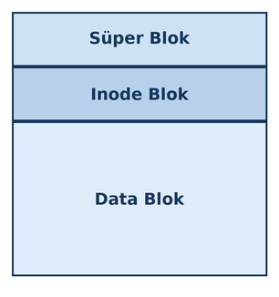

Aslında inode tabanlı dosya sistemlerinin disk organizasyonu daha ayrıntılıdır. Bu ayrıntıları kitabımızın inode
tabanlı dosya sistemlerini anlattığımız bölümünde ele alacağız. 

Süper Blok, dosya sistemine ilişkin en önemli parametrik bilgilerin tutulduğu bölümdür. Inode Blok inode elemanlarından 
oluşmaktadır. Inode bloğu şöyle düşünebilirsiniz:

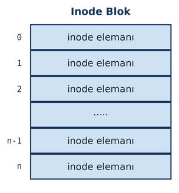

Dosyaların metadata bilgileri inode elemanlarında tutulmaktadır. Her inode elemanının bir numarası olduğuna dikkat ediniz. 
Her inode elemanına, ilk eleman ``0`` olmak üzere artan sırada bir numara karşılık düşürülmüştür. Örneğin
``test.txt`` dosyası için inode blok içerisinde bir inode elemanı bulunmaktadır ve bu inode elemanında bu
dosyanın bilgileri tutulmaktadır. Örneğin ``test.txt`` dosyasının inode numarasının ``51546`` olduğunu
varsayalım. Bu durumda bu dosyaya ilişkin bilgiler Inode Bloktaki ``51546`` numaralı inode elemanında bulunmaktadır.
Inode elemanında tutulan önemli dosya bilgileri şunlardır:

- Dosyanın erişim hakları
- Dosyanın kullanıcı ve grup ID'si
- Dosyanın hard link sayacı
- Dosyanın uzunluğu
- Dosyanın zamansal bilgileri (timestamps)
- Dosyayı oluşturan bilgilerin Data Blok'taki yerleri

Inode elemanında yalnızca dosyanın metadata bilgileri tutulmaktadır. Dosyanın içerisindeki bilgiler Data
Blok'ta saklanmaktadır. Her dosyanın sistem genelinde tek olan (unique) bir inode numarasının olduğuna dikkat
ediniz.

Inode elemanındaki dosyaya ilişkin metadata bilgileri izleyen başlıkta açıklayacağımız ``stat``, ``lstat`` ve ``fstat`` 
fonksiyonlarıyla elde edilmektedir.

stat, lstat ve fstat Fonksiyonları
-------------------------------------------------

Bir dosyaya metadata bilgilerini elde etmek için ``stat``, ``lstat`` ve ``fstat`` isimli üç fonksiyon
kullanılmaktadır. Bu fonksiyonlar aslında aynı şeyi yaparlar. Fakat parametrik yapı bakımından ve semantik
bakımdan bunların arasında küçük farklılıklar vardır. Fonksiyonların prototipleri şöyledir:

.. code-block:: c

    #include <sys/stat.h>

    int stat(const char *path, struct stat *buf);
    int fstat(int fd, struct stat *buf);
    int lstat(const char *path, struct stat *buf);

``stat`` fonksiyonları dosyaya ilişkin inode elemanından dosyanın metadata bilgilerini elde etmektedir. Örneğin dosyanın
erişim hakları, kullanıcı ve grup id'leri, dosyanın uzunluğu, dosyanın tarih-zaman bilgileri bu ``stat``
fonksiyonlarıyla elde edilmektedir. ``ls`` komutu ``-l`` seçeneği ile kullanıldığında aslında dosya bilgilerini
bu ``stat`` fonksiyonlarıyla elde edip ekrana (``stdout`` dosyasına) yazdırmaktadır.

``stat`` fonksiyonunun prototipi şöyledir:

.. code-block:: c

    int stat(const char *path, struct stat *buf);

Fonksiyonun birinci parametresi metadata bilgisi elde edilecek dosyanın yol ifadesini, ikinci parametresi ise dosyanın
metadata bilgilerinin yerleştirileceği ``struct stat`` isimli yapı türünden nesnesinin adresini almaktadır. ``stat`` 
isimli yapı ``<sys/stat.h>`` dosyası içerisinde bildirilmiştir. Fonksiyon başarı durumunda ``0`` değerine başarısızlık
durumunda ``-1`` değerine geri dönmektedir. (``stat`` isminin hem bir yapı belirttiğine hem de bir fonksiyon
belirttiğine dikkat ediniz. C'de yapı ismiyle aynı isimli bir değişken ya da fonksiyon ismi bulunabilmektedir.
Yapı isimleri zaten ``struct`` anahtar sözcüğüyle kullanılmaktadır.)

``stat`` yapısının elemanları şöyledir:

.. code-block:: c

    struct stat {
        dev_t     st_dev;         /* ID of device containing file */
        ino_t     st_ino;         /* Inode number */
        mode_t    st_mode;        /* File type and mode */
        nlink_t   st_nlink;       /* Number of hard links */
        uid_t     st_uid;         /* User ID of owner */
        gid_t     st_gid;         /* Group ID of owner */
        dev_t     st_rdev;        /* Device ID (if special file) */
        off_t     st_size;        /* Total size, in bytes */
        blksize_t st_blksize;     /* Block size for filesystem I/O */
        blkcnt_t  st_blocks;      /* Number of 512B blocks allocated */

        /* Since Linux 2.6, the kernel supports nanosecond
            precision for the following timestamp fields.
            For the details before Linux 2.6, see NOTES. */

        struct timespec st_atim;  /* Time of last access */
        struct timespec st_mtim;  /* Time of last modification */
        struct timespec st_ctim;  /* Time of last status change */

    #define st_atime st_atim.tv_sec      /* Backward compatibility */
    #define st_mtime st_mtim.tv_sec
    #define st_ctime st_ctim.tv_sec
    };

Yapının elemanlarının ``st_`` öneki ile isimlendirildiğine dikkat ediniz. Yapının ``st_dev`` elemanı dosyanın
içinde bulunduğu aygıtın aygıt numarasını belirtir. ``dev_t`` herhangi bir tamsayı türü biçiminde ``typedef``
edilebilen bir tür ismidir. Biz aygıt numarası kavramını kursumuzun 1aygıt sürücülere ilişkin bölümünde ele alacağız.

Yapının ``st_ino`` elemanı dosyaya ilişkin inode elemanının numarasını belirtmektedir. Dosyaların inode
numaraları ``ls`` komutunda ``-i`` seçeneği ile de görüntülenebilmektedir. ``ino_t`` türü işaretsiz olmak
koşuluyla herhangi bir tamsayı türü biçiminde ``typedef`` edilebilmektedir.

Yapının ``st_mode`` elemanı dosyanın erişim haklarını ve türünü tutmaktadır. Bu elemanın içerisindeki değerler
bitler biçiminde oluşturulmuştur. ``1`` olan bitler ilgili özelliğin olduğunu belirtmektedir. Belli bir erişim
hakkının (örneğin ``S_IWGRP`` gibi) olup olmadığını anlamak için programcı ilgili bitin set edilip edilmediğine
``st_mode & S_IXXX`` işlemi ile bakmalıdır. Örneğin:

.. code-block:: c

    struct stat finfo;
    int masks[] = {S_IRUSR, S_IWUSR, S_IXUSR, S_IRGRP, S_IWGRP, S_IXGRP, S_IROTH, S_IWOTH, S_IXOTH};
    char ch;

    if (stat(argv[1], &finfo) == -1)
        exit_sys("stat");

    for (int i = 0; i < 9; ++i) {
        ch = finfo.st_mode & masks[i] ? "rwx"[i % 3] : '-';
        putchar(ch);
    }

Burada biz ``ls -l`` tarzında erişim haklarını yazdırıyoruz. Aşağıdaki ifadeye dikkat ediniz:

.. code-block:: c

    ch = finfo.st_mode & masks[i] ? "rwx"[i % 3] : '-';

Burada döngünün her yinelenmesinde ``'r'``, ``'w'``, ``'x'`` haklarından biri varsa ilgili karakter, bu haklar yoksa
``'-''`` karakteri elde edilmektedir. Daha önce de belirttiğimiz gibi POSIX 2008 ve sonrasında artık erişim haklarının 
maskeleme değerleri açıkça belirtilmiştir. Bu maskeleme değerleri ``rwxrwxrwx`` dizilimiyle uyuşmaktadır:

.. code-block:: text

    876543210
    rwxrwxrwx

Örneğin ``S_IWUSR`` değeri şöyledir:

.. code-block:: text

    876543210
    010000000

Bunun da octal karşılığı ``0200``'dür. Dolayısıyla biz aynı işlemi POSIX 2008 ve sonrası için şöyle de
yapabiliriz:

.. code-block:: c

    for (int i = 0; i < 9; ++i) {
        ch = finfo.st_mode >> (8 - i) & 1 ? "rwx"[i % 3] : '-';
        putchar(ch);
    }

Dosyanın türü de yine ``st_mode`` elemanının içerisine bitsel olarak kodlanmıştır. Ancak hangi bitlerin hangi
türleri belirttiği POSIX standartlarında belirtilmemiştir. Bu durum sistemden sisteme değişebilmektedir.
(Anımsanacağı gibi eskiden aynı durum ``S_IXXX`` sembolik sabitleri için de geçerliydi. Ancak daha sonra bu
sembolik sabitlerin sayısal değerleri yani bit pozisyonları POSIX standartlarında belirlendi.) 

Dosyanın türünü anlamak için iki yöntem bulunmaktadır. Birinci yöntemde ``<sys/stat.h>`` içerisindeki ``S_ISXXX`` 
biçimindeki makrolar kullanılır. Bu makrolar, eğer dosya ilgili türdense sıfır dışı bir değer, ilgili türden değilse 
sıfır değerini verir. Makrolar şunlardır:

.. list-table::
   :header-rows: 1
   :widths: 25 75

   * - Makro
     - Açıklama
   * - ``S_ISBLK(m)``
     - Blok aygıt sürücü dosyası mı? (``ls -l``'de ``b`` dosya türü)
   * - ``S_ISCHR(m)``
     - Karakter aygıt sürücü dosyası mı? (``ls -l``'de ``c`` dosya türü)
   * - ``S_ISDIR(m)``
     - Dizin dosyası mı? (``ls -l``'de ``d`` dosya türü)
   * - ``S_ISFIFO(m)``
     - Boru dosyası mı? (``ls -l``'de ``p`` dosya türü)
   * - ``S_ISREG(m)``
     - Sıradan bir disk dosyası mı? (``ls -l``'de ``-`` dosya türü)
   * - ``S_ISLNK(m)``
     - Sembolik bağlantı dosyası mı? (``ls -l``'de ``l`` dosya türü)
   * - ``S_ISSOCK(m)``
     - Soket dosyası mı? (``ls -l``'de ``s`` dosya türü)

Örneğin:

.. code-block:: c

    struct stat finfo;

    if (stat(argv[1], &finfo) == -1)
        exit_sys("stat");

    if (S_ISBLK(finfo.st_mode))
        putchar('b');
    else if (S_ISCHR(finfo.st_mode))
        putchar('c');
    else if (S_ISDIR(finfo.st_mode))
        putchar('d');
    else if (S_ISFIFO(finfo.st_mode))
        putchar('p');
    else if (S_ISREG(finfo.st_mode))
        putchar('-');
    else if (S_ISLNK(finfo.st_mode))
        putchar('l');
    else if (S_ISSOCK(finfo.st_mode))
        putchar('s');
    else
        putchar('?');

İkinci yöntemde ``st_mode`` değeri ``S_IFMT`` sembolik sabiti ile bit AND işlemine sokularak aşağıdaki sembolik sabitlerle 
karşılaştırılmaktadır:

.. list-table::
   :header-rows: 1
   :widths: 25 75

   * - Sembolik Sabit
     - Açıklama
   * - ``S_IFBLK``
     - Blok aygıt dosyası
   * - ``S_IFCHR``
     - Karakter aygıt dosyası
   * - ``S_IFIFO``
     - Boru dosyası
   * - ``S_IFREG``
     - Sıradan disk dosyası
   * - ``S_IFDIR``
     - Dizin dosyası
   * - ``S_IFLNK``
     - Sembolik bağlantı dosyası
   * - ``S_IFSOCK``
     - Soket dosyası

``st_mode`` değeri ``S_IFMT`` değeri ile bit AND işlemine sokulduktan sonra bu sembolik sabitlerle
karşılaştırılmalıdır. Bu sembolik sabitlerin tek biti ``1`` değildir. Yani karşılaştırma
``(mode & S_IFMT) == S_IFXXX`` biçiminde yapılmalıdır. Bu yöntem ``switch`` deyiminin kullanılmasına da olanak
sağlamaktadır. Örneğin:

.. code-block:: c

    switch (finfo.st_mode & S_IFMT) {
        case S_IFBLK:
            putchar('b');
            break;
        case S_IFCHR:
            putchar('c');
            break;
        case S_IFIFO:
            putchar('p');
            break;
        case S_IFREG:
            putchar('-');
            break;
        case S_IFDIR:
            putchar('d');
            break;
        case S_IFLNK:
            putchar('l');
            break;
        case S_IFSOCK:
            putchar('s');
            break;
    }

O halde biz bir dosyanın türünü ve erişim haklarını ``ls -l`` formatında şöyle yazdırabiliriz:

.. code-block:: c

    int main(int argc, char *argv[])
    {
        struct stat finfo;
        int masks[] = {S_IRUSR, S_IWUSR, S_IXUSR, S_IRGRP, S_IWGRP, S_IXGRP, S_IROTH, S_IWOTH, S_IXOTH};
        char ch;

        if (argc != 2) {
            fprintf(stderr, "wrong number of arguments!..\n");
            exit(EXIT_FAILURE);
        }

        if (stat(argv[1], &finfo) == -1)
            exit_sys("stat");

        printf("Inode No: %jd\n", (intmax_t)finfo.st_ino);

        if (S_ISBLK(finfo.st_mode))
            putchar('b');
        else if (S_ISCHR(finfo.st_mode))
            putchar('c');
        else if (S_ISDIR(finfo.st_mode))
            putchar('d');
        else if (S_ISFIFO(finfo.st_mode))
            putchar('p');
        else if (S_ISREG(finfo.st_mode))
            putchar('-');
        else if (S_ISLNK(finfo.st_mode))
            putchar('l');
        else if (S_ISSOCK(finfo.st_mode))
            putchar('s');
        else
            putchar('?');

        for (int i = 0; i < 9; ++i) {
            ch = finfo.st_mode & masks[i] ? "rwx"[i % 3] : '-';
            putchar(ch);
        }
        putchar('\n');

        return 0;
    }

``stat`` yapısının ``st_nlink`` elemanı dosyanın *katı bağ (hard link)* sayısını belirtmektedir. Katı bağ kavramı
ileride ele alınacaktır. ``nlink_t`` bir tamsayı türü olmak koşuluyla herhangi bir tür olarak ``typedef``
edilebilmektedir.

Yapının ``st_uid`` elemanı dosyanın kullanıcı id'sini belirtmektedir. ``ls -l`` komutu bu id'yi sayı olarak
değil ``/etc/passwd`` dosyasına başvurarak isim biçiminde yazdırmaktadır. ``uid_t`` türü herhangi bir tamsayı
türü olarak typedef edilebilmektedir.

Yapının ``st_gid`` elemanı dosyanın grup id'sini belirtmektedir. ``ls -l`` komutu bu id'yi sayı olarak değil
``/etc/group`` dosyasına başvurarak isim biçiminde yazdırmaktadır. ``gid_t`` türü herhangi bir tamsayı türü
olarak typedef edilebilmektedir.

Yapının ``st_rdev`` elemanı eğer dosya bir aygıt dosyası ise temsil ettiği aygıtın numarasını bize vermektedir.
Bu eleman da ``dev_t`` türündedir. Bu bilginin ne anlam ifade ettiği kursumuzun *aygıt sürücüleri* bölümünde
ele alınmaktadır.

Yapının ``st_size`` elemanı dosyanın uzunluğunu bize vermektedir. ``off_t`` türü daha önceden de belirttiğimiz
gibi işaretli bir tamsayı türü biçiminde typedef edilmek zorundadır.

Yapının ``st_blksize`` elemanı dosyanın içinde bulunduğu dosya sisteminin kullandığı blok uzunluğunu
belirtmektedir. Dosyaların parçaları diskte *blok* denilen ardışıl byte topluluklarında tutulmaktadır. İşte
bir bloğun kaç byte olduğu bilgisi bu elemanla belirtilmektedir. Aynı zamanda programcılar dosya kopyalama
gibi işlemlerde bu büyüklüğü tampon büyüklüğü (buffer size) olarak da kullanmaktadır. ``blksize_t`` işaretli
bir tamsayı türü olarak ``typedef`` edilmek zorundadır. Bu konunun ayrıntılarını kursumuzun inode tabanlı dosya
sistemlerini ele aldığımız bölümde açıklayacağız.

Yapının ``st_blocks`` elemanı dosyanın diskte kapladığı blok sayısını belirtmektedir. (Ancak buradaki sayı 512
byte'lık blokların sayısıdır. Yani dosya sistemindeki dosyanın parçaları olan bloklara ilişkin sayı değildir.)
``blkcnt_t`` işaretli bir tamsayı türü olarak ``typedef`` edilmek zorundadır.

UNIX/Linux sistemlerinde kullanılan inode tabanlı dosya sistemleri bir dosya için üç zaman bilgisi
tutmaktadır:

1. Dosyanın son değiştirilme zamanı
2. Dosyanın son okunma zamanı
3. Dosyanın inode bilgilerinin son değiştirilme zamanı

POSIX standartları hangi POSIX fonksiyonlarının hangi zamanları dosya için güncellediğini belirtmektedir.
Örneğin ``read`` fonksiyonu dosyanın son okuma zamanını, ``write`` fonksiyonu son yazma ve inode bilgilerinin
değiştirilme zamanını güncellemektedir.

``stat`` yapısının zamansal bilgileri tutan elemanları eski POSIX standartlarında ``time_t`` türündendi ve isimleri
``st_atime``, ``st_mtime`` ve ``st_ctime`` biçimindeydi. Bu elemanlar epoch olan 01/01/1970'ten geçen saniye
sayısını tutuyordu. (C Programlama Dili'nde epoch'un 01/01/1970 olması zorunlu değildir. Ancak POSIX
standartlarında bu zorunludur.) Ancak daha sonra POSIX standartlarında bu zaman bilgisi nanosaniye çözünürlüğe
çekildi. Dolayısıyla zamansal bilgiler ``time_t`` türü ile değil ``timespec`` isimli bir yapıyla belirtilmeye
başlandı. Yapı elemanlarının isimleri de ``st_atim``, ``st_mtim`` ve ``st_ctim`` olarak değiştirildi.
``timespec`` yapısı geçmişe doğru uyumu koruyabilmek için aşağıdaki gibi bildirilmiştir:

.. code-block:: c

    struct timespec {
        time_t  tv_sec;
        long    tv_nsec;
    };

Yapının ``tv_sec`` elemanı yine 01/01/1970'ten geçen saniye sayısını, ``tv_nsec`` elemanı ise o saniyeden
sonraki nanosaniye sayısını tutmaktadır. Sistemlerin çoğu POSIX standartlarında bu konuda değişiklik yapılmış
olsa da geriye doğru uyumu şöyle korumuştur:

.. code-block:: c

    struct stat {
        ...
        struct timespec st_atim;    /* Time of last access */
        struct timespec st_mtim;    /* Time of last modification */
        struct timespec st_ctim;    /* Time of last status change */

    #define st_atime st_atim.tv_sec        /* Backward compatibility */
    #define st_mtime st_mtim.tv_sec
    #define st_ctime st_ctim.tv_sec
    };

Bu durumda programcı sisteminin yeni POSIX standartlarını destekleyip desteklemediğine bakmalı ve duruma göre
yapının eski ya da yeni elemanlarını kullanmalıdır. Ancak yukarıda da belirttiğimiz gibi eski eleman isimleri
Linux'ta geçmişe doğru uyumu koruyabilmek için tanımlanmıştır. ``ls -l`` komutu dosyanın yalnızca son
değiştirilme zamanını göstermektedir. Ancak ``ls -lu`` ile son erişim zamanı, ``ls -lc`` ile inode bilgilerinin
son değiştirildiği zaman da görüntülenebilmektedir.

----

Örnek: finfo.c — ls -l Tarzında Dosya Bilgisi Yazdırma
-------------------------------------------------------

Aşağıda dosya bilgilerini ``stat`` fonksiyonu ile alıp yazdıran bir örnek verilmiştir. Bu programda dosya
bilgileri ``ls -l`` stilinde yazdırılmıştır. Ancak ayrıca ``ls -l`` çıktısında olmayan bilgiler de
yazdırılmaktadır. Biz henüz kullanıcı ve grup id değerlerinden kullanıcı ve grup isimlerinin nasıl elde
edileceğini bilmiyoruz. Bu nedenle örneğimizde kullanıcı ve grup id değerleri isimsel biçimde değil sayısal
biçimde yazdırılmıştır. Dosyanın tarih bilgisini yazdırırken ``ls -l`` komutunun yaptığı gibi dosyanın içinde
bulunulan yıla ilişkin olup olmadığını da kontrol ettik. Eğer dosya içinde bulunduğumuz yıla ilişkinse yıl
bilgisini hiç yazdırmadık. Programı aşağıdaki gibi çalıştırıp test edebilirsiniz:

.. code-block:: bash

    $ ./finfo /bin/ls

Buradan elde edilen çıktı denemenin yapıldığı makinede şöyledir:

.. code-block:: text

    -rwxr-xr-x 1 0 0 142312 Haz 22 19:21  2025 /bin/ls

    Inode No: 4719482
    Block Size: 4096
    Number of 512B blocks: 280

Aynı dosyayı ``ls -l`` ile yazdıralım:

.. code-block:: bash

    $ ls -l /bin/ls
    -rwxr-xr-x 1 root root 142312 Haz 22  2025 /bin/ls

Görüldüğü gibi çıktılar arasındaki tek fark kullanıcı ve grup id'lerinin isimlerinde ortaya çıkmaktadır.

.. code-block:: c

    /* finfo.c */

    #include <stdio.h>
    #include <stdlib.h>
    #include <time.h>
    #include <locale.h>
    #include <stdint.h>
    #include <sys/stat.h>

    void exit_sys(const char *msg);

    int main(int argc, char *argv[])
    {
        struct stat finfo;
        int masks[] = {S_IRUSR, S_IWUSR, S_IXUSR, S_IRGRP, S_IWGRP, S_IXGRP, S_IROTH, S_IWOTH, S_IXOTH};
        char ch;
        struct tm *pt_file;
        int this_year;
        time_t tval;
        char dt[32];

        if (argc != 2) {
            fprintf(stderr, "wrong number of arguments!..\n");
            exit(EXIT_FAILURE);
        }

        if (setlocale(LC_ALL, "tr_TR.UTF-8") == NULL) {
            fprintf(stderr, "cannot set locale!...\n");
            exit(EXIT_FAILURE);
        }

        if (stat(argv[1], &finfo) == -1)
            exit_sys("stat");

        if (S_ISBLK(finfo.st_mode))
            putchar('b');
        else if (S_ISCHR(finfo.st_mode))
            putchar('c');
        else if (S_ISDIR(finfo.st_mode))
            putchar('d');
        else if (S_ISFIFO(finfo.st_mode))
            putchar('p');
        else if (S_ISREG(finfo.st_mode))
            putchar('-');
        else if (S_ISLNK(finfo.st_mode))
            putchar('l');
        else if (S_ISSOCK(finfo.st_mode))
            putchar('s');
        else
            putchar('?');

        for (int i = 0; i < 9; ++i) {
            ch = finfo.st_mode & masks[i] ? "rwx"[i % 3] : '-';
            putchar(ch);
        }
        printf(" %ju", (uintmax_t)finfo.st_nlink);
        printf(" %ju", (uintmax_t)finfo.st_uid);
        printf(" %ju", (uintmax_t)finfo.st_gid);
        printf(" %jd", (intmax_t)finfo.st_size);

        tval = time(NULL);
        this_year = localtime(&tval)->tm_year;

        pt_file = localtime(&finfo.st_mtim.tv_sec);
        strftime(dt, 32, "%b %e %H:%M", pt_file);
        printf(" %s", dt);
        if (this_year != pt_file->tm_year)
            printf("  %d", pt_file->tm_year + 1900);
        printf(" %s\n\n", argv[1]);

        printf("Inode No: %ju\n", (uintmax_t)finfo.st_ino);
        printf("Block Size: %jd\n", (intmax_t)finfo.st_blksize);
        printf("Number of 512B blocks: %ju\n", (uintmax_t)finfo.st_blocks);

        return 0;
    }

    void exit_sys(const char *msg)
    {
        perror(msg);
        exit(EXIT_FAILURE);
    }


Dosya Bilgilerinin Elde Edilmesi: stat, fstat ve lstat
------------------------------------------------------

getpwuid ve getgrgid ile Kullanıcı ve Grup İsimlerinin Elde Edilmesi
^^^^^^^^^^^^^^^^^^^^^^^^^^^^^^^^^^^^^^^^^^^^^^^^^^^^^^^^^^^^^^^^^^^^^

Kullanıcı ve grup id'sinden hareketle kullanıcı ve grup isimlerinin elde edilmesi için ``getpwuid`` ve ``getgrgid``
POSIX fonksiyonları kullanılmaktadır. Biz bu fonksiyonları zaten göreceğiz. Ancak yine biz yukarıdaki örneği kullanıcı
ve grup isimlerini de basacak biçimde aşağıda yeniden veriyoruz.

.. code-block:: c

    #include <stdio.h>
    #include <stdlib.h>
    #include <time.h>
    #include <locale.h>
    #include <stdint.h>
    #include <sys/stat.h>


    void exit_sys(const char *msg);


    int main(int argc, char *argv[])
    {
        struct stat finfo;
        int masks[] = {S_IRUSR, S_IWUSR, S_IXUSR, S_IRGRP, S_IWGRP, S_IXGRP, S_IROTH, S_IWOTH, S_IXOTH};
        char ch;
        struct tm *pt_file;
        int this_year;
        time_t tval;
        char dt[32];

        if (argc != 2) {
            fprintf(stderr, "wrong number of arguments!..\n");
            exit(EXIT_FAILURE);
        }

        if (setlocale(LC_ALL, "tr_TR.UTF-8") == NULL) {
            fprintf(stderr, "cannot set locale!...\n");
            exit(EXIT_FAILURE);
        }

        if (stat(argv[1], &finfo) == -1)
            exit_sys("stat");

        if (S_ISBLK(finfo.st_mode))
            putchar('b');
        else if (S_ISCHR(finfo.st_mode))
            putchar('c');
        else if (S_ISDIR(finfo.st_mode))
            putchar('d');
        else if (S_ISFIFO(finfo.st_mode))
            putchar('p');
        else if (S_ISREG(finfo.st_mode))
            putchar('-');
        else if (S_ISLNK(finfo.st_mode))
            putchar('l');
        else if (S_ISSOCK(finfo.st_mode))
            putchar('s');
        else
            putchar('?');

        for (int i = 0; i < 9; ++i) {
            ch = finfo.st_mode & masks[i] ? "rwx"[i % 3] : '-';
            putchar(ch);
        }
        printf(" %ju", (uintmax_t)finfo.st_nlink);
        printf(" %ju", (uintmax_t)finfo.st_uid);
        printf(" %ju", (uintmax_t)finfo.st_gid);
        printf(" %jd", (intmax_t)finfo.st_size);

        tval = time(NULL);
        this_year = localtime(&tval)->tm_year;

        pt_file = localtime(&finfo.st_mtim.tv_sec);
        strftime(dt, 32, "%b %e %H:%M", pt_file);
        printf(" %s", dt);
        if (this_year != pt_file->tm_year)
            printf("  %d", pt_file->tm_year + 1900);
        printf(" %s\n\n", argv[1]);

        printf("Inode No: %ju\n", (uintmax_t)finfo.st_ino);
        printf("Block Size: %jd\n", (intmax_t)finfo.st_blksize);
        printf("Number of 512B blocks: %ju\n", (uintmax_t)finfo.st_blocks);

        return 0;
    }

    void exit_sys(const char *msg)
    {
        perror(msg);
        exit(EXIT_FAILURE);
    }

Dosya Bilgisinin disp_ls Fonksiyonu ile Basılması
^^^^^^^^^^^^^^^^^^^^^^^^^^^^^^^^^^^^^^^^^^^^^^^^^^

Dosyanın bilgilerinin ekrana (``stdout`` dosyasına) yazdırılması işlemini bir fonksiyona da yaptırabiliriz::

    int disp_ls(const char *path);

``disp_ls`` önce ``stat`` fonksiyonuyla dosya bilgilerini elde edip onu *"ls -l"* formatında ekrana (``stdout``
dosyasına) basmaktadır. Fonksiyon başarı durumunda 0 değerine, başarısızlık durumunda -1 değerine geri dönmektedir.

Bazen dosyanın bilgileri zaten elde edilmiş durumda olabilir. Bu durumda ``disp_ls`` fonksiyonuna bizim ``stat``
yapısını geçirmemiz daha uygun olabilir::

    void disp_ls(const struct stat *finfo, const char *path);

.. code-block:: c

    #include <stdio.h>
    #include <stdlib.h>
    #include <time.h>
    #include <locale.h>
    #include <stdint.h>
    #include <sys/stat.h>
    #include <pwd.h>
    #include <grp.h>

    int disp_ls(const char *path);
    void exit_sys(const char *msg);

    int main(int argc, char *argv[])
    {
        if (argc != 2) {
            fprintf(stderr, "wrong number of arguments!..\n");
            exit(EXIT_FAILURE);
        }

        if (setlocale(LC_ALL, "tr_TR.UTF-8") == NULL) {
            fprintf(stderr, "cannot set locale!...\n");
            exit(EXIT_FAILURE);
        }
        if (disp_ls(argv[1]) == -1)
            exit_sys("disp_ls");

        return 0;
    }

    int disp_ls(const char *path)
    {
        struct stat finfo;
        int masks[] = {S_IRUSR, S_IWUSR, S_IXUSR, S_IRGRP, S_IWGRP, S_IXGRP, S_IROTH, S_IWOTH, S_IXOTH};
        char ch;
        struct tm *pt_file;
        int this_year;
        time_t tval;
        char dt[32];
        struct passwd *pw;
        struct group *gr;

        if (stat(path, &finfo) == -1)
            return -1;

        if (S_ISBLK(finfo.st_mode))
            putchar('b');
        else if (S_ISCHR(finfo.st_mode))
            putchar('c');
        else if (S_ISDIR(finfo.st_mode))
            putchar('d');
        else if (S_ISFIFO(finfo.st_mode))
            putchar('p');
        else if (S_ISREG(finfo.st_mode))
            putchar('-');
        else if (S_ISLNK(finfo.st_mode))
            putchar('l');
        else if (S_ISSOCK(finfo.st_mode))
            putchar('s');
        else
            putchar('?');

        for (int i = 0; i < 9; ++i) {
            ch = finfo.st_mode & masks[i] ? "rwx"[i % 3] : '-';
            putchar(ch);
        }
        printf(" %ju", (uintmax_t)finfo.st_nlink);
        if ((pw = getpwuid(finfo.st_uid)) != NULL)
            printf(" %s", pw->pw_name);
        else
            printf(" %ju", (uintmax_t)finfo.st_uid);

        if ((gr = getgrgid(finfo.st_gid)) != NULL)
            printf(" %s", gr->gr_name);
        else
            printf(" %ju", (uintmax_t)finfo.st_gid);

        printf(" %jd", (intmax_t)finfo.st_size);

        tval = time(NULL);
        this_year = localtime(&tval)->tm_year;

        pt_file = localtime(&finfo.st_mtim.tv_sec);
        strftime(dt, 32, "%b %e %H:%M", pt_file);
        printf(" %s", dt);
        if (this_year != pt_file->tm_year)
            printf("  %d", pt_file->tm_year + 1900);
        printf(" %s\n", path);

        return 0;
    }

    void exit_sys(const char *msg)
    {
        perror(msg);
        exit(EXIT_FAILURE);
    }

Bilgilerin Yazı Olarak Elde Edilmesi: get_ls Fonksiyonu
^^^^^^^^^^^^^^^^^^^^^^^^^^^^^^^^^^^^^^^^^^^^^^^^^^^^^^^^

Aslında fonksiyonların doğrudan bilgileri ekrana (``stdout`` dosyasına) basması bazen istenmeyebilir. Programcı
bilgileri elde edip onları başka bir yazının içerisine gömmek isteyebilir. Bu tür durumlarda fonksiyonların formatlanmış
yazıyı ekrana (``stdout`` dosyasına) basacak biçimde değil onu yazı olarak verecek biçimde tasarlanması daha uygundur.
Bu tür tasarımlarda fonksiyonların yazıların bulunduğu ``static`` dizilerin adresiyle geri döndürülmesi kullanımı
kolaylaştırmaktadır. Ancak bu tür tasarımlar fonksiyonun ileride göreceğimiz *thread güvenliliğini (thread safety)*
ortadan kaldırmaktadır. Aşağıda dosyanın bilgilerini *"ls -l"* formatında ``static`` yerel bir dize yerleştirip o
dizinin adresiyle geri dönen fonksiyon örneğini veriyoruz:

.. code-block:: c

    char *get_ls(const char *path)
    {
        static char buf[4096];
        struct stat finfo;
        int masks[] = {S_IRUSR, S_IWUSR, S_IXUSR, S_IRGRP, S_IWGRP, S_IXGRP, S_IROTH, S_IWOTH, S_IXOTH};
        int i, ch;
        struct tm *pt_file;
        int this_year;
        time_t tval;
        struct passwd *pw;
        struct group *gr;

        if (stat(path, &finfo) == -1)
            return NULL;

        i = 0;
        if (S_ISBLK(finfo.st_mode))
            buf[i] = 'b';
        else if (S_ISCHR(finfo.st_mode))
            buf[i] = 'c';
        else if (S_ISDIR(finfo.st_mode))
            buf[i] = 'd';
        else if (S_ISFIFO(finfo.st_mode))
            buf[i] = 'p';
        else if (S_ISREG(finfo.st_mode))
            buf[i] = '-';
        else if (S_ISLNK(finfo.st_mode))
            buf[i] = 'l';
        else if (S_ISSOCK(finfo.st_mode))
            buf[i] = 's';
        else
            buf[i] = '?';

        ++i;
        for (int k = 0; k < 9; ++k) {
            ch = finfo.st_mode & masks[k] ? "rwx"[k % 3] : '-';
            buf[i++] = ch;
        }
        i += sprintf(buf + i, " %ju", (uintmax_t)finfo.st_nlink);
        if ((pw = getpwuid(finfo.st_uid)) != NULL)
            i += sprintf(buf + i," %s", pw->pw_name);
        else
            i += sprintf(buf + i, " %ju", (uintmax_t)finfo.st_uid);

        if ((gr = getgrgid(finfo.st_gid)) != NULL)
            i += sprintf(buf + i, " %s", gr->gr_name);
        else
            i += sprintf(buf + i, " %ju", (uintmax_t)finfo.st_gid);

        i += sprintf(buf + i, " %jd", (intmax_t)finfo.st_size);

        tval = time(NULL);
        this_year = localtime(&tval)->tm_year;

        pt_file = localtime(&finfo.st_mtim.tv_sec);
        i += strftime(buf + i, 32, " %b %e %H:%M", pt_file);
        if (this_year != pt_file->tm_year)
            i += sprintf(buf + i, "  %d", pt_file->tm_year + 1900);
        sprintf(buf + i, " %s\n", path);

        return buf;
    }

Burada ``printf`` çağrıları yerine ``sprintf`` çağrıları kullanılmıştır. ``printf`` türevi fonksiyonların (``strftime``
fonksiyonunun da) yazdırılan ya da yerleştirilen karakter sayısına geri döndüğünü anımsayınız.

.. code-block:: c

    #include <stdio.h>
    #include <stdlib.h>
    #include <time.h>
    #include <locale.h>
    #include <stdint.h>
    #include <sys/stat.h>
    #include <pwd.h>
    #include <grp.h>

    char *get_ls(const char *path);
    void exit_sys(const char *msg);

    int main(int argc, char *argv[])
    {
        char *buf;

        if (argc != 2) {
            fprintf(stderr, "wrong number of arguments!..\n");
            exit(EXIT_FAILURE);
        }

        if (setlocale(LC_ALL, "tr_TR.UTF-8") == NULL) {
            fprintf(stderr, "cannot set locale!...\n");
            exit(EXIT_FAILURE);
        }

        if ((buf = get_ls(argv[1])) == NULL)
            exit_sys("get_ls");

        printf("%s\n", buf);

        return 0;
    }

    char *get_ls(const char *path)
    {
        static char buf[4096];
        struct stat finfo;
        int masks[] = {S_IRUSR, S_IWUSR, S_IXUSR, S_IRGRP, S_IWGRP, S_IXGRP, S_IROTH, S_IWOTH, S_IXOTH};
        int i, ch;
        struct tm *pt_file;
        int this_year;
        time_t tval;
        struct passwd *pw;
        struct group *gr;

        if (stat(path, &finfo) == -1)
            return NULL;

        i = 0;
        if (S_ISBLK(finfo.st_mode))
            buf[i] = 'b';
        else if (S_ISCHR(finfo.st_mode))
            buf[i] = 'c';
        else if (S_ISDIR(finfo.st_mode))
            buf[i] = 'd';
        else if (S_ISFIFO(finfo.st_mode))
            buf[i] = 'p';
        else if (S_ISREG(finfo.st_mode))
            buf[i] = '-';
        else if (S_ISLNK(finfo.st_mode))
            buf[i] = 'l';
        else if (S_ISSOCK(finfo.st_mode))
            buf[i] = 's';
        else
            buf[i] = '?';

        ++i;
        for (int k = 0; k < 9; ++k) {
            ch = finfo.st_mode & masks[k] ? "rwx"[k % 3] : '-';
            buf[i++] = ch;
        }
        i += sprintf(buf + i, " %ju", (uintmax_t)finfo.st_nlink);
        if ((pw = getpwuid(finfo.st_uid)) != NULL)
            i += sprintf(buf + i," %s", pw->pw_name);
        else
            i += sprintf(buf + i, " %ju", (uintmax_t)finfo.st_uid);

        if ((gr = getgrgid(finfo.st_gid)) != NULL)
            i += sprintf(buf + i, " %s", gr->gr_name);
        else
            i += sprintf(buf + i, " %ju", (uintmax_t)finfo.st_gid);

        i += sprintf(buf + i, " %jd", (intmax_t)finfo.st_size);

        tval = time(NULL);
        this_year = localtime(&tval)->tm_year;

        pt_file = localtime(&finfo.st_mtim.tv_sec);
        i += strftime(buf + i, 32, " %b %e %H:%M", pt_file);
        if (this_year != pt_file->tm_year)
            i += sprintf(buf + i, "  %d", pt_file->tm_year + 1900);
        sprintf(buf + i, " %s\n", path);

        return buf;
    }

    void exit_sys(const char *msg)
    {
        perror(msg);
        exit(EXIT_FAILURE);
    }

Thread-Safe get_ls Fonksiyonu
^^^^^^^^^^^^^^^^^^^^^^^^^^^^^^

Yukarıdaki ``get_ls`` fonksiyonunu thread güvenli hale getirmek için fonksiyonun ``static`` diziye kodlama yapmasının
önüne geçilmesi gerekir. Fonksiyon parametresiyle aldığı bir diziye kodlama yapabilir. Bu tür fonksiyonlarda dizi
uzunluğunun da fonksiyona geçirilmesi ve dizinin taşırılmasının önüne geçilmesi iyi bir tekniktir. Fonksiyonun bu
halinin prototipi şöyle olabilir::

    char *get_ls(const char *path, char *buf, size_t size);

Fonksiyonun bu halini aşağıda veriyoruz.

.. code-block:: c

    #include <stdio.h>
    #include <stdlib.h>
    #include <time.h>
    #include <locale.h>
    #include <stdint.h>
    #include <sys/stat.h>
    #include <errno.h>
    #include <pwd.h>
    #include <grp.h>

    char *get_ls(const char *path, char *buf, size_t size);
    void exit_sys(const char *msg);

    int main(int argc, char *argv[])
    {
        char buf[4096];

        if (argc != 2) {
            fprintf(stderr, "wrong number of arguments!..\n");
            exit(EXIT_FAILURE);
        }

        if (setlocale(LC_ALL, "tr_TR.UTF-8") == NULL) {
            fprintf(stderr, "cannot set locale!...\n");
            exit(EXIT_FAILURE);
        }

        if (get_ls(argv[1], buf, 4096) == NULL)
            exit_sys("get_ls");

        printf("%s\n", buf);

        return 0;
    }

    char *get_ls(const char *path, char *buf, size_t size)
    {
        struct stat finfo;
        static const int masks[] = {S_IRUSR, S_IWUSR, S_IXUSR, S_IRGRP, S_IWGRP, S_IXGRP, S_IROTH, S_IWOTH, S_IXOTH};
        struct tm *pt_file;
        int this_year;
        time_t tval;
        struct passwd *pw;
        struct group *gr;
        size_t i, n;
        int len;

        if (stat(path, &finfo) == -1)
            return NULL;

        if (size < 11) {
            errno = ERANGE;
            return NULL;
        }

        i = 0;
        if (S_ISBLK(finfo.st_mode))
            buf[i] = 'b';
        else if (S_ISCHR(finfo.st_mode))
            buf[i] = 'c';
        else if (S_ISDIR(finfo.st_mode))
            buf[i] = 'd';
        else if (S_ISFIFO(finfo.st_mode))
            buf[i] = 'p';
        else if (S_ISREG(finfo.st_mode))
            buf[i] = '-';
        else if (S_ISLNK(finfo.st_mode))
            buf[i] = 'l';
        else if (S_ISSOCK(finfo.st_mode))
            buf[i] = 's';
        else
            buf[i] = '?';

        ++i;
        for (int k = 0; k < 9; ++k)
            buf[i++] = finfo.st_mode & masks[k] ? "rwx"[k % 3] : '-';

        len = snprintf(buf + i, size - i, " %ju", (uintmax_t)finfo.st_nlink);
        if (len >= size - i)
            goto EXIT;
        i += len;

        if ((pw = getpwuid(finfo.st_uid)) != NULL)
            len = snprintf(buf + i, size - i, " %s", pw->pw_name);
        else
            len = snprintf(buf + i, size - i, " %ju", (uintmax_t)finfo.st_uid);
        if (len >= size - i)
            goto EXIT;
        i += len;

        if ((gr = getgrgid(finfo.st_gid)) != NULL)
            len = snprintf(buf + i, size - i, " %s", gr->gr_name);
        else
            len = snprintf(buf + i, size - i, " %ju", (uintmax_t)finfo.st_gid);
        if (len >= size - i)
            goto EXIT;
        i += len;

        len = snprintf(buf + i, size - i, " %jd", (intmax_t)finfo.st_size);
        if (len >= size - i)
            goto EXIT;
        i += len;

        tval = time(NULL);
        this_year = localtime(&tval)->tm_year;
        pt_file = localtime(&finfo.st_mtim.tv_sec);

        if ((n = strftime(buf + i, size - i, " %b %e %H:%M", pt_file)) == 0)
            goto EXIT;
        i += n;

        if (this_year != pt_file->tm_year) {
            len = snprintf(buf + i, size - i, "  %d", pt_file->tm_year + 1900);
            if (len >= size - i)
                goto EXIT;
            i += len;
        }

        len = snprintf(buf + i, size - i, " %s\n", path);
        if (len >= size - i)
            goto EXIT;

        return buf;

    EXIT:
        errno = ERANGE;
        return NULL;
    }

    void exit_sys(const char *msg)
    {
        perror(msg);
        exit(EXIT_FAILURE);
    }

fstat Fonksiyonu
^^^^^^^^^^^^^^^^^

``fstat`` fonksiyonu ``stat`` fonksiyonunun yol ifadesi değil dosya betimleyicisi alan biçimidir. Prototipi şöyledir::

    int fstat(int fd, struct stat *buf);

Genel olarak işletim sisteminin dosya betimleyicisinden hareketle inode bilgilerine erişmesi yol ifadesinden hareketle
erişmesinden daha hızlı olmaktadır. Çünkü ``open`` fonksiyonuyla dosya açıldığında zaten dosyanın disk üzerindeki inode
bilgileri elde edilip çekirdek alanına çekilmektedir. Linux sistemlerinde diskteki dosyanın bilgilerinin yerleştirildiği
çekirdek nesnelerine *inode nesneleri* denilmektedir. Dolayısıyla eğer dosya zaten açılmışsa onun dosya
betimleyicisinden hareketle dosya bilgilerine erişilmesi çekirdek için daha zahmetsiz ve hızlıdır. Örneğin:

.. code-block:: c

    int fd;
    struct stat finfo;

    if ((fd = open("test.txt", O_RDONLY)) == -1)
        exit_sys("open");

    /* ... */

    if (fstat(fd, &finfo) == -1)
        exit_sys("fstat");

Burada bir noktayı yeniden vurgulamak istiyoruz. Dosyayı ``open`` fonksiyonuyla açıp ``fstat`` kullanmak iyi bir teknik
değildir. Dosya zaten başka işlemler için açılmak zorundaysa ve açık dosyanın bilgilerini elde etmek istiyorsak
``fstat`` kullanmamız uygun olur.

.. code-block:: c

    #include <stdio.h>
    #include <stdlib.h>
    #include <stdint.h>
    #include <time.h>
    #include <locale.h>
    #include <fcntl.h>
    #include <pwd.h>
    #include <grp.h>
    #include <sys/stat.h>
    #include <unistd.h>

    void disp_ls(const struct stat *finfo, const char *path);
    void exit_sys(const char *msg);

    int main(int argc, char *argv[])
    {
        int fd;
        struct stat finfo;

        if (argc != 2) {
            fprintf(stderr, "wrong number of arguments!..\n");
            exit(EXIT_FAILURE);
        }

        if (setlocale(LC_ALL, "tr_TR.UTF-8") == NULL) {
            fprintf(stderr, "cannot set locale!...\n");
            exit(EXIT_FAILURE);
        }

        if ((fd = open("test.txt", O_RDONLY)) == -1)
            exit_sys("open");

        /* burada dosyayla ilgili birtakim islemler yapiliyor */

        if (fstat(fd, &finfo) == -1)
            exit_sys("fstat");
        disp_ls(&finfo, argv[1]);

        return 0;
    }

    void disp_ls(const struct stat *finfo, const char *path)
    {
        int masks[] = {S_IRUSR, S_IWUSR, S_IXUSR, S_IRGRP, S_IWGRP, S_IXGRP, S_IROTH, S_IWOTH, S_IXOTH};
        char ch;
        struct tm *pt_file;
        int this_year;
        time_t tval;
        char dt[32];
        struct passwd *pw;
        struct group *gr;

        if (S_ISBLK(finfo->st_mode))
            putchar('b');
        else if (S_ISCHR(finfo->st_mode))
            putchar('c');
        else if (S_ISDIR(finfo->st_mode))
            putchar('d');
        else if (S_ISFIFO(finfo->st_mode))
            putchar('p');
        else if (S_ISREG(finfo->st_mode))
            putchar('-');
        else if (S_ISLNK(finfo->st_mode))
            putchar('l');
        else if (S_ISSOCK(finfo->st_mode))
            putchar('s');
        else
            putchar('?');

        for (int i = 0; i < 9; ++i) {
            ch = finfo->st_mode & masks[i] ? "rwx"[i % 3] : '-';
            putchar(ch);
        }
        printf(" %ju", (uintmax_t)finfo->st_nlink);
        if ((pw = getpwuid(finfo->st_uid)) != NULL)
            printf(" %s", pw->pw_name);
        else
            printf(" %ju", (uintmax_t)finfo->st_uid);

        if ((gr = getgrgid(finfo->st_gid)) != NULL)
            printf(" %s", gr->gr_name);
        else
            printf(" %ju", (uintmax_t)finfo->st_gid);

        printf(" %jd", (intmax_t)finfo->st_size);

        tval = time(NULL);
        this_year = localtime(&tval)->tm_year;

        pt_file = localtime(&finfo->st_mtim.tv_sec);
        strftime(dt, 32, "%b %e %H:%M", pt_file);
        printf(" %s", dt);
        if (this_year != pt_file->tm_year)
            printf("  %d", pt_file->tm_year + 1900);
        printf(" %s\n", path);
    }

    void exit_sys(const char *msg)
    {
        perror(msg);
        exit(EXIT_FAILURE);
    }

lstat Fonksiyonu
^^^^^^^^^^^^^^^^^

``lstat`` fonksiyonunun ``stat`` fonksiyonundan tek farkı sembolik bağlantı dosyaları söz konusu olduğunda ``lstat``
fonksiyonunun sembolik bağlantıyı izlememesi, sembolik bağlantı dosyasının kendisine ilişkin bilgileri vermesidir.
Dizinler için sembolik bağlantılar oluşturulduğunda dizin ağacı özyinelemeli bir biçimde dolaşılırken sembolik
bağlantıların izlenmesi bu tür dolaşımların sonsuz döngüye girmesine yol açabilmektedir. Bu tür durumlarda ``stat``
yerine ``lstat`` fonksiyonu kullanılmalıdır. ``lstat`` fonksiyonunun parametrik yapısı tamamen ``stat`` fonksiyonu
gibidir::

    int lstat(const char *path, struct stat *buf);

İzleyen paragraflarda katı bağların (hard link) ve sembolik bağların (soft link) ne anlama geldiğini açıklayacağız.

stat Kabuk Komutu
^^^^^^^^^^^^^^^^^^

Bir dosyanın ``stat`` bilgileri komut satırından *stat* kabuk komutuyla da elde edilebilmektedir. Örneğin:

.. code-block:: text

    $ stat test.txt
    Dosya: test.txt
    Boyut: 232       	Bloklar: 8          Kimlik bloku: 4096   normal dosya
    Aygıt: 8,3	İndeks: 6076078     Bağlar: 2
    Erişim: (0666/-rw-rw-rw-)  Uid: ( 1000/    kaan)   Gid: ( 1000/   study)
    Erişim: 2026-07-07 13:58:08.200998707 +0300
    Değiştirme: 2026-07-09 12:43:45.589508117 +0300
    Değişiklik: 2026-07-09 12:43:45.589508117 +0300
        Doğum: 2026-06-25 13:31:48.310425000 +0300

Dizinlerin Organizasyonu ve Dizin Girişleri
^^^^^^^^^^^^^^^^^^^^^^^^^^^^^^^^^^^^^^^^^^^^

Dizinler de aslında tamamen dosyalar gibi organize edilmektedir. Bir dosyanın içerisinde dosyanın içeriğindeki bilgiler
vardır. Ancak bir dizinin içerisinde o dizin içerisindeki dosyaların isimleri ve inode numaraları bulunmaktadır.
Dizinlerin içerisindeki her bir elemana *dizin girişi (directory entry)* denilmektedir. Dizin girişlerinin formatının
ayrıntıları dosya sisteminden sistemine değişebilmektedir. Ancak temel olarak dizin girişlerinde dosyanın ismi ve inode
numarası tutulmaktadır. Dosyanın metadata bilgilerinin (yani erişim hakları, uzunluk gibi) inode bloktaki inode
elemanında tutulduğunu ve ``stat`` fonksiyonlarının bu bilgileri inode elemanından aldığını anımsayınız. Biz ext dosya
sistemlerini kursumuzun sonlarına doğru ele alacağız. Ancak şimdilik bir dizinin aşağıdaki formatta dizin girişlerine
sahip olduğunu varsayabiliriz:

.. code-block:: text

    ┌────────────┬──────────┐
    │ dosya_ismi │ inode_no │
    ├────────────┼──────────┤
    │ dosya_ismi │ inode_no │
    │ dosya_ismi │ inode_no │
    │    ...     │   ...    │
    │ dosya_ismi │ inode_no │
    └────────────┴──────────┘

Örneğin:

.. code-block:: text

    ┌────────────┬──────────┐
    │ Dosya İsmi │ Inode No │
    ├────────────┼──────────┤
    │ sample.C   │ 342678   │
    │ test.txt   │ 422119   │
    │ sample     │ 214567   │
    │    ...     │   ...    │
    └────────────┴──────────┘

Biz bir POSIX fonksiyonuna yol ifadesi verdiğimizde çekirdek içerisindeki sistem fonksiyonları önce yol ifadesini
çözümlemektedir (pathname resolution). Yol ifadesi çözümlendiğinde çekirdek dosyaya ilişkin inode numarasını elde etmiş
olmaktadır. Sonra da *inode blok* içerisinde o indeksteki elemana başvurarak dosyanın bilgilerini ele geçirmektedir.
Ancak bundan sonra dosya üzerinde işlemler yapabilir hale gelmektedir.

Bir yol ifadesi verildiğinde çekirdeğin önce dizin girişine erişip, inode numarasından hareketle inode elemanına
erişmesi göreli olarak yavaş bir işlemdir. İşletim sistemleri bu işlemlerin daha hızlı yapılmasını sağlamak için daha
önce erişilen dizin girişlerini ve inode elemanlarını RAM'de oluşturdukları önbelleklerde saklamaktadır. Böylece eğer
başvurulan bilgiler zaten önbellekte varsa boşuna disk okumaları yapılmamaktadır. Linux işletim sisteminde erişilen
dizin girişlerinin saklandığı önbellek sistemine *dentry cache*, erişilen inode elemanlarının saklandığı önbellek
sistemine ise *inode cache* denilmektedir.


Katı Bağlar (Hard Link) ve Sembolik Bağlar (Symbolic Link)
==========================================================

Katı Bağ (Hard Link) Kavramı
----------------------------

Farklı dizin girişlerinin aynı inode numarasına sahip olması durumuna UNIX/Linux sistemlerinde *katı bağ (hard link)*
denilmektedir. Örneğin farklı dizinlerde (aynı dizinde de olabilir) aşağıdaki gibi iki giriş olsun:

.. code-block:: text

    ┌────────────┬──────────┐
    │ Dosya İsmi │ Inode No │
    ├────────────┼──────────┤
    │    ...     │   ...    │
    │   x.txt    │  34718   │
    │    ...     │   ...    │
    └────────────┴──────────┘

.. code-block:: text

    ┌────────────┬──────────┐
    │ Dosya İsmi │ Inode No │
    ├────────────┼──────────┤
    │    ...     │   ...    │
    │   y.txt    │  34718   │
    │    ...     │   ...    │
    └────────────┴──────────┘

Burada her iki dizin girişinin de aynı inode elemanına sahip olduğuna dikkat ediniz. Dosyaya erişmek için gereken tüm
bilgiler inode elemanının içerisinde olduğuna göre bu dosyaya ``x.txt`` yol ifadesiyle erişmekle ``y.txt`` yol
ifadesiyle erişmek arasında hiçbir farklılık yoktur. İşte ``x.txt`` ve ``y.txt`` dizin girişleri *katı bağ (hard link)*
oluşturmuştur. Tabii katı bağa sahip dizin girişleri ikiden fazla da olabilir. Katı bağ oluşturmak için ``link`` isimli
POSIX fonksiyonu kullanılmaktadır. Linux sistemlerinde bu POSIX fonksiyonu ``sys_link`` isimli sistem fonksiyonunu
çağırmaktadır. ``link`` fonksiyonunun prototipi şöyledir:

.. code-block:: c

    #include <unistd.h>

    int link(const char *oldpath, const char *newpath);

Fonksiyonun birinci parametresi katı bağı oluşturulacak dosyanın yol ifadesini, ikinci parametresi oluşturulacak olan
yeni katı bağın yol ifadesini belirtmektedir. Fonksiyon başarı durumunda 0 değerine, başarısızlık durumunda -1 değerine
geri dönmektedir. Örneğin:

.. code-block:: c

    if (link("x.txt", "y.txt") == -1)
        exit_sys("link");


``link`` fonksiyonun ``linkat`` adlı at'li bir versyionu da vardır:

.. code-block:: c

    #include <unistd.h>

    int linkat(int olddirfd, const char *oldpath, int newdirfd, const char *newpath, int flags);


POSIX dosya fonksiyonlarının at'li versiyonlarının nasıl çalıştığı ileride ele alınmamtadır. 


Kaynak dosya yoksa ya da hedef dosya varsa fonksiyon başarısız olmaktadır. Yukarıdaki işlemin başarılı olduğunu
varsayalım. Bu iki dosyanın *"ls -l"* ile bilgilerine baktığımızda aynı şeyleri görürüz:

.. code-block:: text

    $ ls -li x.txt y.txt
    6076082 -rw-r--r-- 2 kaan study 41 Haz 23 13:43 x.txt
    6076082 -rw-r--r-- 2 kaan study 41 Haz 23 13:43 y.txt

Burada dosyanın katı bağ sayacının (3'üncü sütun) 2 haline geldiğine dikkat ediniz. Buradaki 2 değeri aynı fiziksel
dosyayı gösteren iki farklı dizin girişinin bulunduğunu belirtmektedir.

Katı bağ oluşturma dosya sisteminin disk tarafındaki tasarımına da bağlıdır. Her dosya sistemi katı bağ oluşturulmasını
desteklemek zorunda değildir. Bu durumda ``link`` fonksiyonu başarısızlıkla geri dönecektir. Örneğin Microsoft'un FAT
dosya sistemleri katı bağları desteklememektedir.

Disk bölümleri arasında da katı bağ oluşturulamamaktadır. Çünkü her disk bölümünün inode tablosu farklıdır. Farklı disk
bölümlerinde aynı inode numaraları bulunabilmektedir. Yani inode numaraları sistem genelinde değil disk bölümü genelinde
tektir. Farklı bir disk bölümündeki dosyanın farklı bir disk bölümüne katı bağı oluşturulmak istendiğinde ``link``
fonksiyonu başarısız olur ve ``errno`` değeri ``EXDEV`` (*Invalid cross-device link*) olarak set edilmektedir.

Kabuk üzerinde katı bağlar *ln* isimli kabuk komutuyla oluşturulmaktadır. Bu kabuk komutu *cp* gibi kullanılmaktadır.
Örneğin:

.. code-block:: text

    $ ln x.txt y.txt

Burada ``x.txt`` dosyasına ilişkin inode elemanıyla aynı inode elemanına referans eden yeni bir ``y.txt`` dosyası
oluşturulmaktadır.

Bir Katı Bağ Oluşturma Programı: makelink.c
-------------------------------------------

Aşağıdaki program *ln* komutunun benzer işlevini yerine getirmektedir. Programı şöyle kullanabilirsiniz:

.. code-block:: text

    $ ./makelink x.txt y.txt

.. code-block:: c

    #include <stdio.h>
    #include <stdlib.h>
    #include <unistd.h>

    void exit_sys(const char *msg);

    int main(int argc, char *argv[])
    {
        if (argc != 3) {
            fprintf(stderr, "wrong number of arguments!");
            exit(EXIT_FAILURE);
        }

        if (link(argv[1], argv[2]) == -1)
            exit_sys("link");

        return 0;
    }

    void exit_sys(const char *msg)
    {
        perror(msg);
        exit(EXIT_FAILURE);
    }

Dizinlerin Katı Bağları
-----------------------

Dizinlerin katı bağlarının oluşturulması bazı sorunlara yol açabilmektedir. Yukarıda da belirttiğimiz gibi bu tür
durumlarda dizin ağacını dolaşan programlar sonsuz döngüye girebilmektedir. Bu nedenle bazı UNIX/Linux sistemlerinde
dizinlerin katı bağlarının oluşturulması mümkün olmayabilmektedir. Bazı sistemlerde ise dizinlerin katı bağları ancak
*root* kullanıcısı tarafından (yani *sudo* ile) oluşturulabilmektedir. Linux dizinler üzerinde katı bağ oluşturulmasına
izin vermemektedir. Linux'ta dizinler üzerinde katı bağı oluşturulmak istendiğinde ``link`` fonksiyonu başarısız olur ve
``errno`` değeri ``EPERM`` (*Permission denied*) ile set edilir. POSIX standartları bu konuda şunları söylemektedir:

    *If path1 names a directory, link() shall fail unless the process has appropriate privileges and the implementation
    supports using link() on directories.*

Dizinlerdeki . ve .. Girişleri
------------------------------

Bir dizin yaratıldığında içerisinde ``.`` ve ``..`` isimli iki dizin girişi de yaratılmaktadır. ``.`` girişi bulunulan
dizini, ``..`` dizini ise üst dizini belirtmektedir. UNIX/Linux sistemlerinde başı ``.`` ile başlayan dosyalar *ls*
komutunda default durumda görüntülenmemektedir. Bu girişleri görebilmek için *ls* komutunda *-a* seçeneğinin
kullanılması gerekir. Örneğin:

.. code-block:: text

    $ mkdir xxx
    $ ls xxx
    $ ls -a xxx
    .  ..

İşte yeni bir dizin yaratıldığında oluşturulan ``.`` girişi aslında içinde bulunulan dizine bir katı bağ girişidir. Bu
nedenle bir dizin yaratıldığında üst dizinin katı bağ sayacı 1 artırılmaktadır. Şimdi ``xxx`` dizinini sıfırdan yeniden
yaratıp *"ls -l"* ile durumuna bakalım:

.. code-block:: text

    $ mkdir xxx
    $ ls -ld xxx
    drwxr-xr-x 2 kaan study 4096 Tem  9 13:41 xxx

Görüldüğü gibi ``xxx`` dizini yaratıldığında katı bağ sayacı 2 durumundadır. Çünkü onun içerisindeki ``.`` dizini üst
dizine katı bağ oluşturmaktadır. Bunu şöyle ispatlayabiliriz:

.. code-block:: text

    $ mkdir xxx
    $ ls -ldai xxx xxx/.
    6335620 drwxr-xr-x 2 kaan study 4096 Tem  9 13:41 xxx
    6335620 drwxr-xr-x 2 kaan study 4096 Tem  9 13:41 xxx/.

Tabii siz şimdi *"hani Linux'ta dizinlere katı bağ oluşturulamıyordu"* diye sorabilirsiniz. İşte işletim sistemi bu
``.`` ve ``..`` dizinleri için istisnai olarak katı bağ oluşturmaktadır.

Bir dizinin içerisinde başka bir dizin yarattığımızda yarattığımız dizindeki ``..`` girişi üst dizine katı bağ
belirttiği için üst dizinin katı bağ sayacı da artırılmaktadır. O halde dizin içerisinde yaratılan her dizin üst dizinin
katı bağ sayacını 1 artırmaktadır. ``xxx`` dizinini silerek yeniden şu denemeyi yapalım:

.. code-block:: text

    $ mkdir xxx
    $ ls -ld xxx
    drwxr-xr-x 2 kaan study 4096 Tem  9 13:53 xxx
    $ mkdir xxx/yyy
    $ ls -ld xxx
    drwxr-xr-x 3 kaan study 4096 Tem  9 13:53 xxx
    $ mkdir xxx/zzz
    $ ls -ld xxx
    drwxr-xr-x 4 kaan study 4096 Tem  9 13:54 xxx
    $ ls -ldai xxx xxx/yyy/.. xxx/zzz/..
    6335620 drwxr-xr-x 4 kaan study 4096 Tem  9 13:54 xxx
    6335620 drwxr-xr-x 4 kaan study 4096 Tem  9 13:54 xxx/yyy/..
    6335620 drwxr-xr-x 4 kaan study 4096 Tem  9 13:54 xxx/zzz/..

Buradaki deneyden çıkan sonuçlara dikkat ediniz:

- Dizin ilk yaratıldığında dizinin kendisine ilişkin katı bağ sayacı ``.`` girişinden dolayı 2 olmaktadır.
- Dizin içerisinde her yeni dizin yaratıldığında o dizindeki ``..`` girişinden dolayı üst dizinin katı bağ sayacı 1
  artırılmaktadır.

Linux sistemleri ``.`` ve ``..`` dizinleri için istisna olarak katı bağ oluşturmaktadır ancak kullanıcılara dizinlere
katı bağ oluşturma olanağını vermemektedir.

Katı Bağın Silinmesi
--------------------

Aynı dosyaya referans eden ``x.txt`` ve ``y.txt`` biçiminde iki katı bağ girişi olsun. Biz bunlardan birini silersek ne
olur? Bu durumda eğer dosyanın kendisi silinirse diğer dizin girişi geçersiz duruma gelir. İşte işletim sistemi inode
elemanının içerisinde (``stat`` yapısının ``st_nlink`` elemanı) ilgili dosyaya ilişkin kaç katı bağın bulunduğu
bilgisini tutmaktadır. Bir dosyanın katı bağı silinmek istendiğinde işletim sistemi dizin girişini siler, dosyanın inode
elemanındaki katı bağ sayacını 1 eksiltir. Katı bağ sayacı 0'a düştüğünde diskten dosyayı gerçekten siler. Örneğin:

.. code-block:: text

    $ ls -li x.txt y.txt
    6076082 -rw-r--r-- 2 kaan study 41 Haz 23 13:43 x.txt
    6076082 -rw-r--r-- 2 kaan study 41 Haz 23 13:43 y.txt

Burada ``x.txt`` ve ``y.txt`` aynı dosyaya referans eden katı bağlardır. Bunlardan birini silelim:

.. code-block:: text

    $ rm x.txt

Artık ``x.txt`` girişi yok edilmiştir. Ancak ``y.txt`` girişi durmaktadır:

.. code-block:: text

    $ ls -li y.txt
    6076082 -rw-r--r-- 1 kaan study 41 Haz 23 13:43 y.txt

Dosyanın katı bağ sayacının 1'e düştüğüne dikkat ediniz. Artık biz bu ``y.txt`` dosyasını da sildiğimizde katı bağ
sayacı 0'a düştüğü için gerçekten dosya da silinecektir.

Sembolik Bağ (Soft Link) Kavramı
--------------------------------

UNIX/Linux sistemlerinde *gevşek bağ (soft link)* ya da *sembolik bağ (symbolic link)* denilen bir bağ biçimi de vardır.
Sembolik bağlar Windows sistemlerindeki *kısa yol dosyalarına* benzemektedir. UNIX/Linux sistemlerinde sembolik bağlar
katı bağlardan daha yaygın kullanılmaktadır. Sembolik bağ *başka bir dosyaya referans eden dosya* anlamına gelmektedir.
Sembolik bağın hangi dosyaya referans ettiği sembolik dosyanın diskteki inode elemanında tutulmaktadır. Anımsayacağınız
gibi ``stat`` fonksiyonlarıyla dosya bilgileri elde edildiğinde dosyanın sembolik bağlantı dosyası olup olmadığı bilgisi
``stat`` yapısının ``st_mode`` elemanında kodlanmış olarak bulunuyordu. Biz de dosyanın sembolik bağ dosyası olup
olmadığını ``S_IFLNK`` makrosuyla anlayabiliyorduk. Örneğin ``y.txt`` dosyası ``x.txt`` dosyasına sembolik bağ yapılmış
olsun. Biz bu durumu şöyle temsil edebiliriz:

.. code-block:: text

    y.txt -> x.txt

Bazı POSIX fonksiyonları sembolik bağ dosyasına ilişkin bir yol ifadesi ile karşılaştığında sembolik bağı izleyerek ve
sembolik bağın hedefine ilişkin dosyayı tespit edip onun üzerinde işlem yapmaktadır. Yukarıdaki örneğimizde biz
``y.txt`` dosyasını ``open`` fonksiyonuyla açmış olalım:

.. code-block:: c

    fd = open("y.txt", O_RDONLY);

Burada işletim sistemi ``y.txt`` dosyasının bir sembolik bağ dosyası olduğunu anlar ve onun referans ettiği dosyayı
tespit eder ve gerçekte o dosyayı açmaya çalışır. Buna sembolik bağın izlenmesi de denilmektedir. Yukarıda ``open``
işleminde aslında ``open`` ``y.txt`` sembolik bağ dosyasını değil ``x.txt`` dosyasını açmaya çalışacaktır. Sembolik
bağların kullanım amacı olarak katı bağlara oldukça benzediğine dikkat ediniz. Yukarıdaki örneğimizde biz ``y.txt``
dosyası üzerinde işlem yapmak istediğimizde sistem aslında onun referans ettiği ``x.txt`` dosyası üzerinde işlem
yapmaktadır.

Her POSIX fonksiyonu sembolik bağları izlememektedir. Örneğin biz bir sembolik bağ dosyasını ``unlink`` fonksiyonuyla ya
da komut satırında *rm* komutuyla silmek istediğimizde onun referans ettiği dosya değil sembolik bağ dosyasının kendisi
silinmektedir. Eğer dosya silmekte kullanılan ``unlink`` fonksiyonu sembolik bağı izleseydi yukarıdaki örneğimizde biz
``y.txt`` dosyasını silmeye çalıştığımızda ``x.txt`` dosyası silinirdi. Örneğin ``stat`` fonksiyonu sembolik bağı
izlediği halde ``lstat`` fonksiyonu onu izlememektedir. Yani biz ``stat`` fonksiyonuna bir sembolik bağ dosyası
verdiğimizde ``stat`` fonksiyonu bağı izleyerek bize onun referans ettiği dosyanın bilgilerini vermektedir. Ancak
``lstat`` fonksiyonu sembolik bağı izlememekte onun kendisine ilişkin dosya bilgilerini elde etmektedir.

symlink Fonksiyonu
------------------

Sembolik bağ dosyaları ``symlink`` isimli POSIX fonksiyonuyla yaratılmaktadır. Linux sistemlerinde bu fonksiyon
``sys_symlink`` isimli sistem fonksiyonunu çağırmaktadır. ``symlink`` fonksiyonunun prototipi şöyledir:

.. code-block:: c

    #include <unistd.h>

    int symlink(const char *target, const char *linkpath);

Fonksiyonun birinci parametresi gerçek dosyanın yol ifadesini, ikinci parametresi ise oluşturulacak sembolik bağlantı
dosyasının yol ifadesini belirtmektedir. Fonksiyon başarı durumunda 0 değerine, başarısızlık durumunda -1 değerine geri
dönmektedir. ``symkink`` fonksiyonunun ``symlinkat`` adlı at'li bir biçimi de vardır:

.. code-block:: c

    #include <unistd.h>

    int symlinkat(const char *target, int newdirfd, const char *linkpath);


Biz POSIX fonksiyonlarının at'li biçimleri hakkında izleyen bölümlerde bilgiler vereceğiz. 


Örneğin:

.. code-block:: c

    if (symlink("x.txt", "y.txt") == -1)
        exit_sys("symlink");

Burada ``y.txt -> x.txt`` durumu oluşturulmaktadır. Bu işlemden sonra her iki dosyayı da *"ls -li"* komutuyla
görüntülediğimizde aşağıdakine benzer bir çıktı elde ederiz:

.. code-block:: text

    $ ls -li x.txt y.txt
    6076082 -rw-r--r-- 1 kaan study 38 Tem  9 11:39 x.txt
    6076114 lrwxrwxrwx 1 kaan study  5 Tem  9 11:39 y.txt -> x.txt

Burada dosyaların inode numaralarının farklı olduğuna dikkat ediniz. Çünkü sembolik bağ dosyaları ayrı bir dosya
gibidir. Onun ayrı bir inode elemanı vardır. Ancak inode elemanında o sembolik bağ dosyasının gerçekte hangi dosyaya
referans ettiği bilgisi de tutulmaktadır. *"ls -l"* komutunda sembolik bağlar ok işaretiyle gösterilmektedir. Sembolik
bağ dosyalarının tür belirten karakterinin 'l' olduğuna da dikkat ediniz. Sembolik bağlantı dosyalarının kendi erişim
hakları her zaman *rwxrwxrwx* biçiminde oluşturulmaktadır.

``symlink`` fonksiyonunda kaynak dosyanın var olması gerekmez. Bu durumu izleyen paragraflarda açıklayacağız.

Bir Sembolik Bağ Oluşturma Programı: makesymlink.c
--------------------------------------------------

Aşağıda bir dosyanın sembolik bağlantısını oluşturan bir program örneği verilmiştir. Programı şöyle deneyebilirsiniz:

.. code-block:: text

    ./makesymlink x.txt y.txt

.. code-block:: c

    #include <stdio.h>
    #include <stdlib.h>
    #include <unistd.h>

    void exit_sys(const char *msg);

    int main(int argc, char *argv[])
    {
        /*
        if (argc != 3) {
            fprintf(stderr, "wrong number of arguments!");
            exit(EXIT_FAILURE);
        }

        if (link(argv[1], argv[2]) == -1)
            exit_sys("link");

        */

        if (symlink("x.txt", "y.txt") == -1)
            exit_sys("symlink");

        printf("Ok\n");

        return 0;
    }

    void exit_sys(const char *msg)
    {
        perror(msg);
        exit(EXIT_FAILURE);
    }

ln -s ile Sembolik Bağ Oluşturma ve Dangling Link
-------------------------------------------------

Sembolik bağ dosyası komut satırından yine *ln* komutuyla oluşturulmaktadır. Ancak *ln* komutuna *-s* seçeneği de
girilmelidir. Örneğin:

.. code-block:: text

    $ ln -s x.txt y.txt

    $ ls -li x.txt y.txt
    6076082 -rw-r--r-- 1 kaan study 38 Tem  9 11:39 x.txt
    6076114 lrwxrwxrwx 1 kaan study  5 Tem  9 11:48 y.txt -> x.txt

Sembolik bağ oluştururken kaynak dosyanın var olması gerekmemektedir.

Peki bir sembolik bağ dosyasının referans ettiği dosya silinirse ne olur? Yukarıdaki örneğimizde ``x.txt`` dosyasını
silelim:

.. code-block:: text

    $ rm x.txt

.. code-block:: text

    $ ls -li y.txt
    6076114 lrwxrwxrwx 1 kaan study 5 Tem  9 11:48 y.txt -> x.txt

Görüldüğü gibi sembolik bağ yine var olmaya devam etmektedir. *"ls -l"* komutunda bu tuhaf durum *siyah üstüne kırmızı*
renk ile temsil edilmektedir. (Yani komutun çıktısındaki ``y.txt -> x.txt`` kısmı siyah üzerine kırmızı renkle
gösterilmektedir.)

Peki biz bu durumda ``y.txt`` dosyasını ``open`` fonksiyonuyla açmak istediğimizde (ya da örneğin *cat* komutuyla onun
içini görmek istediğimizde) ne olacaktır? İşte ``open`` fonksiyonu sembolik bağ dosyasının referans ettiği dosyanın
olmadığını anlamakta ve sanki olmayan bir dosya açılmak istenmiş gibi davranmaktadır. Yani bu durumda ``open``
fonksiyonu başarısız olup -1 değerine geri döner ve ``errno`` değişkeni ``ENOENT`` (*No such file or directory*)
değeriyle set edilir.

Sembolik bağ dosyasının referans ettiği dosyanın silinmiş olma durumuna İngilizce *dangling link* denilmektedir.
Dangling duruma gelmiş bir sembolik bağ dosyasının referans ettiği dosya yeniden yaratılırsa artık dangling durumu
ortadan kaldırılmış olur.

Döngüsel Sembolik Bağlar
------------------------

Bir sembolik bağ dosyasına da sembolik bağ oluşturulabilir. Yani örneğin aşağıdaki gibi bir durum oluşturulabilmektedir:

.. code-block:: text

    z.txt -> y.txt -> x.txt

Elimizde yalnızca ``x.txt`` dosyası olsun. Biz yukarıdaki durumu şöyle oluşturabiliriz:

.. code-block:: text

    $ ln -s x.txt y.txt
    $ ln -s y.txt z.txt
    $ ls -li x.txt y.txt z.txt
    6076082 -rw-r--r-- 1 kaan study 17 Tem  9 11:58 x.txt
    6076114 lrwxrwxrwx 1 kaan study  5 Tem  9 12:23 y.txt -> x.txt
    6076115 lrwxrwxrwx 1 kaan study  5 Tem  9 12:23 z.txt -> y.txt

Peki biz böylesi bir durumda ``z.txt`` dosyasını ``open`` fonksiyonuyla açmak istersek ne olur? İşte ``open`` fonksiyonu
sembolik bağları izler ve bunun nihai hedefindeki dosyayı tespit eder ve onu açar. Örneğimizde ``x.txt`` dosyası
açılacaktır.

Sembolik bağ dosyaları döngüsel hale de gelebilir. Örneğin ``y.txt`` sembolik bağ dosyası ``z.txt`` sembolik bağ
dosyasını, ``z.txt`` sembolik bağ dosyası ise ``y.txt`` sembolik bağ dosyasını gösterir durumda olabilir. Bu durumu
yapay bir biçimde oluşturalım:

.. code-block:: text

    $ ln -s y.txt z.txt
    $ ln -s z.txt y.txt

Burada önce ``z.txt -> y.txt`` durumu, sonra da ``y.txt -> z.txt`` durumu oluşturulmuştur. Sembolik bağ oluşturmak için
kaynak dosyanın var olmasının gerekmediğine dikkat ediniz. Durum şöyledir:

.. code-block:: text

    $ ls -li y.txt z.txt
    6076114 lrwxrwxrwx 1 kaan study 5 Tem  9 12:33 y.txt -> z.txt
    6076082 lrwxrwxrwx 1 kaan study 5 Tem  9 12:33 z.txt -> y.txt

Peki bu durumda ``open`` fonksiyonuyla ``y.txt`` ya da ``z.txt`` dosyasını açmak istersek ya da örneğin *cat* ile bu
dosyaları görüntülemek istersek ne olur? İşte ``open`` fonksiyonu belli bir kademe sembolik bağları izlemekte eğer hedef
dosya hala bulunamadıysa ``errno`` değişkenini ``ELOOP`` (*Too many levels of symbolic links*) değeri ile set edip
işlemi başarısızlıkla sonlandırmaktadır.


readlink Fonksiyonu
--------------------

Biz ``lstat`` fonksiyonuyla bir dosyanın bilgilerini elde ettiğimizde o dosyanın bir sembolik bağlantı dosyası olup
olmadığını anlayabiliyorduk. Ancak o sembolik bağ dosyasının hangi dosyaya referans ettiğini ``lstat`` fonksiyonu 
bize vermemektedir. İşte readlink isimli POSIX fonksiyonu bu işi yapmaktadır. Fonksiyonun prototipi şöyledir:

.. code-block:: c
    
    #include <unistd.h>

    ssize_t readlink(const char *path, char *buf, size_t bufsize);


Fonksiyonun birinci parametresi sembolik bağ dosyasının yol ifadesini, ikinci ve üçüncü parametreler sembolik bağ 
dosyasının referans ettiği dosyanın yol ifadesinin yerleştirileceği yerin adresini ve uzunluğu almaktadır. Bu alan 
küçük ise fonksiyon başarısız olmaz ancak yol ifadesinin son kısmı budanır. Fonksiyon verdiğimiz adrese yerleştirdiği 
karakter sayısına geri dönmektedir. Fonksiyon (diğer fonksiyonların aksine) ``null`` karakteri dizinin sonuna 
yerleştirmez. Bu durumda programcı referans edilen yol ifadesine erişirken dikkat etmelidir.


Fonksiyon başarı durumunda yerleştirilen karakter sayısına, başarısızlık durumunda -1 değerine geri dönmektedir.


``readlink`` fonksiyonu sembolik bağ dosyasının içeerisindeki hedefi verir. Yani fonksiyonun amacı sembolik bağı 
izlemek değildir. Dolayısıyla ``readlink`` "dangling" sembolik bağlarda da başarısız olmaz.


``readlink`` fonksiyonunun ``readlinkat`` adlı at'li bir biçimi de vardır:

.. code-block:: c

    #include <unistd.h>

    int readlinkat(int dirfd, const char *pathname, char *buf, size_t bufsiz);


Biz POSIX dosya fonksiyonlarının at'li biçimlerini ileride ele alacağız.

``readlink`` fonksiyonunu çağırarak yazılmış olan ``readlink`` adlı bir kabuk komutu da bulunmaktadır. Mesela:

.. code-block:: bash

    $ readlink x.txt
    test.txt


Aşağıda ``readlink`` fonksiyonun kullanımına bir emsal verilmiştir. ``readlink`` fonksiyonunun ``null`` karakteri 
diziye yerleştirmediğine dikkat ediniz. Sonunda ``null`` karakter olmayan ``result`` uzunlukta bir yazının ``printf``
ile bastırılması şöyle yapılabilir:

``printf("%.*s\n", result, buf);``


``printf`` ``%.10s`` gibi bir format karakterlerinde yazıyı ``null`` karakter görene kadar değil n karakter 
yazdırmaktadır. (Emsalimizde 10). Tabii biz burada istersek ``null`` karakteri dizinin sonuna yerleştirip onu 
``%s`` ile de yazdırabiliriz. Ancak bu durumda da dizi uzunluğunun yeterli olduğuna dikkat etmemiz gerekir. Mesela:

.. code-block:: c

    char buf[4096];
    /* ... */

    if ((result = readlink(argv[1], buf, 4096)) == -1)
        exit_sys("readlink");

    if (result < 4096) {         /* alternatifi -> printf("%.*s\n", (int)result, buf); */
        buf[result] = '\0';        
        puts(buf);
    }
    else
        fprintf(stderr, "path maybe truncated!...\n");


Bu emsalde biz yol ifadesinin yerleştirileceği diziyi 4096 eleman uzunluğunda açtık. Linux sistemlerinde x86 ve 
x64 mimarilerinde (genel olarak sayfa uzunluğunun 4K olduğu mimarilerde) yol ifadeleri en fazla 4096 karakter 
olabilmektedir. Ancak diğer mimarilerde ve POSIX genelinde böyle bir zorunluluk yoktur. Bu tür durumlarda tavsiye
edilen yöntem diziyi büyütüp fonksiyonu başarılı olan kadar tekrar tekrar çağırmaktır. Ancak bir yol ifadesinin 4096 
karakterden büyük olması çok çok uç bir noktadır. (O sistemdeki maksimum yol ifadesi uzunluğu ``<limits.h>`` dosyası 
içerisindeki ``PATH_MAX`` sembolik sabitiyle belirtilmektedir. Ancak maalesef bu sembolik sabitin define edilmiş 
olması da zorunlu değildir.) Bu konunun biraz ayrıntıları olduğu için konu bir başlık altında ileride ele alınacaktır.

.. code-block:: c

    #include <stdio.h>
    #include <stdlib.h>
    #include <stdint.h>
    #include <unistd.h>


    void exit_sys(const char *msg);

    int main(int argc, char *argv[])
    {
        char buf[4096];
        ssize_t result;

        if (argc != 2) {
            fprintf(stderr, "wrong number of arguments!...\n");
            exit(EXIT_FAILURE);
        }

        if ((result = readlink(argv[1], buf, 4096)) == -1)
            exit_sys("readlink");

        printf("result = %jd\n", (intmax_t)result);

        if (result < 4096) {
            buf[result] = '\0';        /* alternatifi -> printf("%.*s\n", (int)result, buf); */
            puts(buf);
        }
        else
            fprintf(stderr, "path maybe truncated!...\n");

        return 0;
    }

    void exit_sys(const char *msg)
    {
        perror(msg);
        exit(EXIT_FAILURE);
    }


Katı Bağ ile Sembolik Bağ Arasındaki Farklar
============================================

Katı bağ ile sembolik bağ arasında ne farklılıklar vardır? Katı bağlar aynı inode elemanını gösteren dizin girişleridir.
Halbuki sembolik bağların kendi inode elemanları vardır. Sembolik bağın inode elemanında o sembolik bağın gösterdiği
dosyanın yol ifadesi saklanmaktadır. Sembolik bağlar birden fazla geçişli olabilmektedir. Dizinlerin sembolik bağlarının
oluşturulması mümkündür ve dolaşım sırasında bir soruna yol açmamaktadır. Çünkü dizin ağacını dolaşan programlar
``stat`` fonksiyonunu değil ``lstat`` fonksiyonunu kullanırlar. Yani sembolik bağı izlemezler. Halbuki katı bağlarda
böyle bir şey mümkün değildir. Sembolik bağ daha esnek kullanımlara sahiptir. Örneğin sembolik bağı değiştirerek onun
başka bir dosyayı göstermesi sağlanabilmektedir. Bu özelliklerinden dolayı sembolik bağlar katı bağlara göre çok daha
fazla kullanılmaktadır. Dosya sistemleri arasında (örneğin disk bölümleri arasında) katı bağların oluşturulamadığını
belirtmiştik. Ancak dosya sistemleri arasında sembolik bağlar oluşturulabilmektedir.

.. list-table:: Sembolik Bağ ve Katı Bağ Karşılaştırması
   :header-rows: 1
   :widths: 25 35 35

   * - Özellik
     - Sembolik Bağ
     - Katı Bağ
   * - inode durumu
     - Kendi inode'una sahiptir
     - Hedefle aynı inode'u paylaşır
   * - İçerik
     - Hedefin yol ifadesini tutar
     - Doğrudan veri bloklarına erişir
   * - Farklı dosya sistemine bağ
     - Oluşturulabilir
     - Oluşturulamaz
   * - Dizine bağ
     - Oluşturulabilir
     - Oluşturulamaz
   * - Hedef silindiğinde
     - Bağ kopuk (dangling) hale gelir
     - Veriye erişim devam eder
   * - Bağ sayacı (link count)
     - Hedefin sayacını değiştirmez
     - Hedefin sayacını 1 artırır
   * - POSIX fonksiyonu
     - ``symlink``
     - ``link``
   * - Kabuk komutu
     - ``ln -s``
     - ``ln``
   * - Dosya türü (ls -l)
     - ``l``
     - Normal dosya (``-``)
   * - Var olmayan hedefe bağ
     - Oluşturulabilir
     - Oluşturulamaz
   * - İzin bilgisi
     - İzinleri dikkate alınmaz
     - inode izinleri aynıdır

Elimizde ``x`` sembolik bağ dosyası olsun. Bu dosya ``y`` dosyasını gösteriyor olsun. Yani ``x -> y`` durumu söz konusu
olsun. Biz de bu ``x`` dosyasının ``y``'yi değil ``z``'yi göstermesini sağlamak isteyelim. İşte maalesef UNIX/Linux
sistemlerinde bir sembolik bağ dosyasının hedefini değiştirmenin pratik bir yolu yoktur. Önce sembolik bağın silinmesi
sonra yeni hedefle yeniden yaratılması gerekir.

Örnek: lstat ile Birden Fazla Dosyanın Bilgilerinin Yazdırılması
----------------------------------------------------------------

Aşağıdaki örnekte birden fazla dosyanın bilgileri ``lstat`` fonksiyonuyla satır satır yazdırılmıştır. Programı şöyle
kullanabilirsiniz:

.. code-block:: text

    $ ./lstat-test x.txt y.txt z.txt

Denemenin yapıldığı makinede şöyle bir çıktı elde edilmiştir:

.. code-block:: text

    $ ./lstat-test x.txt y.txt z.txt
    lrwxrwxrwx 1 kaan study 8 Tem 14 10:31 x.txt
    -rw-r--r-- 1 kaan study 15 Tem 14 10:49 y.txt
    lrwxrwxrwx 1 kaan study 5 Tem 14 10:49 z.txt

.. code-block:: c

    #include <stdio.h>
    #include <stdlib.h>
    #include <time.h>
    #include <locale.h>
    #include <stdint.h>
    #include <sys/stat.h>
    #include <pwd.h>
    #include <grp.h>

    int disp_ls(const char *path);
    void exit_sys(const char *msg);

    int main(int argc, char *argv[])
    {
        if (argc < 2) {
            fprintf(stderr, "wrong number of arguments!..\n");
            exit(EXIT_FAILURE);
        }

        if (setlocale(LC_ALL, "tr_TR.UTF-8") == NULL) {
            fprintf(stderr, "cannot set locale!...\n");
            exit(EXIT_FAILURE);
        }
        for (int i = 1; i < argc; ++i)
            if (disp_ls(argv[i]) == -1)
                exit_sys("disp_ls");

        return 0;
    }

    int disp_ls(const char *path)
    {
        struct stat finfo;
        int masks[] = {S_IRUSR, S_IWUSR, S_IXUSR, S_IRGRP, S_IWGRP, S_IXGRP, S_IROTH, S_IWOTH, S_IXOTH};
        char ch;
        struct tm *pt_file;
        int this_year;
        time_t tval;
        char dt[32];
        struct passwd *pw;
        struct group *gr;

        if (lstat(path, &finfo) == -1)
            return -1;

        if (S_ISBLK(finfo.st_mode))
            putchar('b');
        else if (S_ISCHR(finfo.st_mode))
            putchar('c');
        else if (S_ISDIR(finfo.st_mode))
            putchar('d');
        else if (S_ISFIFO(finfo.st_mode))
            putchar('p');
        else if (S_ISREG(finfo.st_mode))
            putchar('-');
        else if (S_ISLNK(finfo.st_mode))
            putchar('l');
        else if (S_ISSOCK(finfo.st_mode))
            putchar('s');
        else
            putchar('?');

        for (int i = 0; i < 9; ++i) {
            ch = finfo.st_mode & masks[i] ? "rwx"[i % 3] : '-';
            putchar(ch);
        }
        printf(" %ju", (uintmax_t)finfo.st_nlink);
        if ((pw = getpwuid(finfo.st_uid)) != NULL)
            printf(" %s", pw->pw_name);
        else
            printf(" %ju", (uintmax_t)finfo.st_uid);

        if ((gr = getgrgid(finfo.st_gid)) != NULL)
            printf(" %s", gr->gr_name);
        else
            printf(" %ju", (uintmax_t)finfo.st_gid);

        printf(" %jd", (intmax_t)finfo.st_size);

        tval = time(NULL);
        this_year = localtime(&tval)->tm_year;

        pt_file = localtime(&finfo.st_mtim.tv_sec);
        strftime(dt, 32, "%b %e %H:%M", pt_file);
        printf(" %s", dt);
        if (this_year != pt_file->tm_year)
            printf("  %d", pt_file->tm_year + 1900);
        printf(" %s\n", path);

        return 0;
    }

    void exit_sys(const char *msg)
    {
        perror(msg);
        exit(EXIT_FAILURE);
    }

Dosyaların Silinmesi: remove ve unlink Fonksiyonları
----------------------------------------------------

Bir dosyanın silinmesi o dosyanın diskteki inode elemanının inode tablosundan silinmesi ve o dosyaya ilişkin data
bloklarının diskin Data bölümünden silinmesi anlamına gelmektedir. Tabii burada *silinme* kavramını aslında *serbest
bırakma* anlamında kullanıyoruz. Yoksa diskten bir bilginin çıkartılması ve yok edilmesi mümkün değildir. Inode tabanlı
dosya sistemleri diskin inode tablosundaki hangi inode elemanlarının boş olduğunu tutmaktadır. Bir inode elemanı
silindiğinde o inode elemanı *artık kullanılmıyor biçiminde* işaretlenmektedir. Aynı işlem dosyanın data bloklarında da
benzer biçimde yürütülür. İşletim sistemi hangi data bloklarının boş olduğunu tutar. Dosya silindiğinde dosyanın data
blokları *artık kullanılmıyor* biçiminde işaretlenmektedir. Biz yukarıda inode tabanlı dosya sistemlerine ilişkin disk
organizasyonunu basit bir biçimde şöyle temsil etmiştik:

.. code-block:: text

    ┌────────────┐
    │ Süper Blok │
    ├────────────┤
    │ Inode Blok │
    ├────────────┤
    │            │
    │ Data Blok  │
    │            │
    │            │
    └────────────┘

Aslında biraz daha gerçekçi temsil şöyle oluşturulabilir:

.. code-block:: text

    ┌──────────────┐
    │  Süper Blok  │
    ├──────────────┤
    │ Inode Bitmap │
    ├──────────────┤
    │ Data Bitmap  │
    ├──────────────┤
    │              │
    │ Inode Blok   │
    │              │
    ├──────────────┤
    │              │
    │              │
    │  Data Blok   │
    │              │
    │              │
    └──────────────┘

Burada *Inode Bitmap* alanı Inode Bloktaki boş inode elemanlarının yerlerini, *Data Bitmap* ise Data Bloktaki boş
blokların yerlerini tutmaktadır. ext dosya sistemlerinin gerçek disk organizasyonlarını kursumuzun son kısımlarına doğru
inceleyeceğiz.

Anımsayacağınız gibi UNIX/Linux sistemlerinde katı bağlardan dolayı bir dizin girişinin silinmesi o dizin girişine
ilişkin dosyanın silineceği anlamına gelmemektedir. Daha önce de belirttiğimiz gibi aynı inode elemanını gösteren birden
fazla dizin girişi söz konusu olabilmektedir. Inode elemanındaki katı bağ sayacı 0'a düştüğünde gerçek dosya silmesi
yapılmaktadır.

UNIX/Linux sistemlerinde bir dosyayı silmek için ``remove`` ve ``unlink`` isimli POSIX fonksiyonları kullanılmaktadır.
``remove`` bir standart C fonksiyonudur. ``unlink`` ise bir POSIX fonksiyonudur. Bu iki fonksiyon tamamen aynı işlemi
yapmaktadır. Fonksiyonların prototipleri şöyledir:

.. code-block:: c

    #include <stdio.h>

    int remove(const char *path);

    #include <unistd.h>

    int unlink(const char *path);

Fonksiyonlar başarı durumunda 0 değerine, başarısızlık durumunda -1 değerine geri dönmektedir.

``remove`` ve ``unlink`` fonksiyonlarıyla bir dosyayı silebilmek için prosesin dosyaya *w* hakkına sahip olması
gerekmez. Ancak dosyanın içinde bulunduğu dizin için *w* hakkına sahip olması gerekir. Bizim eğer dosyanın içinde
bulunduğu dizine *w* hakkımız varsa dosyanın sahibi olmasak bile dosyayı silebiliriz. Tabii proses id'si 0 olan
prosesler (*root* prosesler) her zaman silme işlemini yapabilirler.

Bir dosya ``remove`` ya da ``unlink`` fonksiyonlarıyla silindiğinde dizin girişi silinir. Ancak yukarıda da
belirttiğimiz gibi dosyanın silinmesi katı bağ sayacı 0'a düştüğünde yapılmaktadır. Yani ``remove`` ve ``unlink``
fonksiyonları dizin girişini silerler. Sonra dosyanın katı bağ sayacını 1 eksiltirler. Eğer dosyanın katı bağ sayacı 0'a
düşmüşse dosyayı fiziksel olarak silerler.

Aşağıdaki örnekte komut satırından verilen yol ifadelerine ilişkin dosyalar silinmeye çalışılmıştır.

.. code-block:: c

    #include <stdio.h>
    #include <stdlib.h>
    #include <unistd.h>

    int main(int argc, char *argv[])
    {
        if (argc == 1) {
            fprintf(stderr, "file name(s) must be specified!...\n");
            exit(EXIT_FAILURE);
        }

        for (int i = 1; i < argc; ++i)
            if (unlink(argv[i]) == -1)
                perror(argv[i]);

        return 0;
    }

Dizin Girişleri ve Hard Link Sayacı
-----------------------------------

Daha önceden de belirttiğimiz gibi aslında *dizinler* birer dosya gibi organize edilmiştir. Dizin dosyalarının
içerisinde *dizin girişleri (directory entries)* bulunmaktadır. Bir dizin girişinin formatı dosya sisteminden dosya
sistemine değişebilmektedir. Ancak özet olarak bir dizin dosyasının içeriği şöyledir:

.. code-block:: text

    Dizin Dosyası
    -------------
    dosya_ismi  inode no
    dosya_ismi  inode no
    dosya_ismi  inode no
    ...
    dosya_ismi  inode no
    dosya_ismi  inode no
    dosya_ismi  inode no

Dosyaların asıl bilgileri (yani ``stat`` fonksiyonuyla elde ettiğimiz bilgiler) diskte *Inode Block* denilen bir bölgede
saklanmaktadır. Inode Block inode elemanlarından oluşur. Her inode elemanına ilk eleman 0 olmak üzere artan sırada bir
numara karşılık düşürülmüştür. İşletim sistemi bir dosya ile ilgili işlem yaparken kesinlikle o dosyanın inode elemanına
erişmek ve oradaki bilgileri kullanmak zorundadır.

Bir dosya ``unlink`` ya da ``remove`` fonksiyonlarıyla silindiğinde kesinlikle dizin girişi silinmektedir. Ancak
dosyanın silinip silinmeyeceği hard-link sayacına bağlıdır.

Farklı dizin girişleri farklı isimlerle aynı inode numaralarını işaret ediyorsa buna *hard link* denilmektedir. Örneğin:

.. code-block:: text

    Dizin Dosyası
    --------------
    a.txt   12345678
    b.txt   12345678
    ...

Burada bizim ``open`` fonksiyonuyla ``a.txt`` ya da ``b.txt`` dosyalarını açmamız arasında hiçbir farklılık yoktur.
Çünkü dosyanın bütün bilgileri inode elemanının içerisindedir. İşte biz bu dosyalardan örneğin ``a.txt`` dosyasını
silersek aslında yalnızca dizin girişini silmiş oluruz. Çünkü işletim sistemi ``a.txt`` dosyasının işaret ettiği inode
elemanının başka bir giriş tarafından kullanıldığını gördüğü için inode elemanını ve dosyanın diskteki varlığını silmez.
İşte bu durum *hard link sayacı* ile kontrol edilmektedir. Yukarıdaki örnekte dosyanın hard link sayacı 2'dir. Biz bu
dizin girişlerinden birini sildiğimizde hard link sayacı 1'e düşer. Diğerini de sildiğimizde hard link sayacı 0'a düşer
ve dosya gerçekten silinir.

Bir dosyanın hard link'ini oluşturmak için *ln* kabuk komutu kullanılmaktadır. Örneğin:

.. code-block:: text

    $ ln sample.c mample.c

    $ ls -li sample.c mample.c
    1207667 -rw-r--r-- 2 kaan study 329 Ara 10 10:59 mample.c
    1207667 -rw-r--r-- 2 kaan study 329 Ara 10 10:59 sample.c

Dosyanın hard link sayacının 2 olduğuna dikkat ediniz.

Bir dizin yaratıldığında onun içerisinde ``.`` ve ``..`` biçiminde iki dizin girişi otomatik olarak yaratılmaktadır.
(UNIX/Linux sistemlerinde başı ``.`` ile başlayan dizin girişleri *ls* komutunda default olarak görüntülenmemektedir.
Bunların görüntülenmesi için *-a (all)* seçeneğinin de kullanılması gerekir.) ``.`` dizin girişi kendi dizin dosyasının
inode elemanını, ``..`` dizin girişi ise üst dizinin inode elemanını göstermektedir. Bu nedenle bir dizin yaratıldığında
dizin dosyasına ilişkin hard-link sayacı 2 olur. O dizinin içerisinde yaratılan her dizin ``..`` girişini içereceğinden
dolayı o dizinin hard link sayacını artıracaktır.

Belli bir inode elemanını gösteren dizin girişlerinin elde edilmesine yönelik bu sistemlerde pratik bir yol yoktur.
Yapılacak şey diskteki tüm dosyaları gözden geçirip inode numaralarından onların aynı inode elemanını gösterip
göstermediğini anlamaktır.

Erişim Haklarının ve Sahiplik Bilgilerinin Değiştirilmesi
=========================================================

chmod ve fchmod Fonksiyonları
-----------------------------

Yukarıda da belirttiğimiz gibi dosya bilgileri disk üzerinde inode bloktaki inode elemanının içerisinde tutulmaktadır.
``stat`` fonksiyonları erişim bilgilerini buradan almaktadır (*ls* komutu da ``stat`` fonksiyonları kullanılarak
yazılmıştır). Dosyanın erişim hakları yine anımsayacağınız gibi ``open`` fonksiyonunda dosya yaratılırken
belirlenmektedir. İşte bir dosyanın erişim haklarını dışarıdan ``chmod`` ve ``fchmod`` isimli POSIX fonksiyonlarıyla
değiştirebiliriz. Fonksiyonların prototipleri şöyledir:

.. code-block:: c

    #include <sys/stat.h>

    int chmod(const char *path, mode_t mode);
    int fchmod(int fd, mode_t mode);

Fonksiyonun birinci parametresi dosyanın yol ifadesini, ikinci parametresi erişim haklarını belirtmektedir. Fonksiyonlar
başarı durumunda 0 değerine, başarısızlık durumunda -1 değerine geri dönmektedir. Anımsayacağınız gibi erişim hakları
POSIX'in 2008 standartlarına kadar ``S_IXXX`` sembolik sabitleriyle oluşturulmak zorundaydı. Ancak 2008 ve sonrasında
artık bu ``S_IXXX`` sembolik sabitlerinin sayısal değerleri belirlendiği için programcı doğrudan erişim haklarını octal
bir sayı biçiminde girebilmektedir. Fakat okunabilirlik ve geçmişe uyum göz önüne alındığında erişim haklarının
``S_IXXX`` sembolik sabitleriyle verilmesi tavsiye edilmektedir. ``chmod`` fonksiyonu sembolik bağları izlemektedir.
(Yani biz sembolik bağların kendi erişim haklarını değiştiremeyiz. Anımsayacağınız gibi sembolik bağların kendi erişim
hakları her zaman *rwxrwxrwx* biçimindedir.)

Bir dosyanın erişim haklarını ``chmod`` fonksiyonuyla değiştirebilmek için prosesin etkin kullanıcı id'sinin dosyanın
kullanıcı id'si ile aynı olması ya da prosesin etkin kullanıcı id'sinin 0 olması (root proses) gerekmektedir. Linux
yeteneklilik (capability) özelliğini de kullanmaktadır. Linux'ta prosesin etkin kullanıcı id'si 0 olmasa bile proses
``CAP_FSETID`` yeteneğine sahipse herhangi bir dosyanın erişim haklarını değiştirebilmektedir.

set-user-id, set-group-id ve sticky Bitleri
-------------------------------------------

Biz ``open`` fonksiyonunda dosyanın erişim haklarının *rwxrwxrwx* biçiminde üçerli üç gruptan oluştuğunu belirtmiştik.
Aslında bunlara ek olarak erişim haklarında üçlü bir grup daha vardır. Bu üçlü gruba *set-user-id*, *set-group-id* ve
*sticky* denilmektedir. Bu üçlü sırasıyla ``S_ISUID``, ``S_ISGID`` ve ``S_ISVTX`` sembolik sabitleriyle temsil
edilmektedir. ``chmod`` ve ``fchmod`` fonksiyonlarıyla bu yeni gördüğümüz üç erişim hakkı da değiştirilebilmektedir. Bu
erişim hakları octal değer olarak en yüksek anlamlı 3 biti oluşturmaktadır. Bu durumda erişim hakları octal 4 digit ile
belirlenmektedir:

- İlk octal digit: ``S_ISUID``, ``S_ISGID``, ``S_ISVTX``
- İkinci octal digit: ``S_IRUSR``, ``S_IWUSR``, ``S_IXUSR``
- Üçüncü octal digit: ``S_IRGRP``, ``S_IWGRP``, ``S_IXGRP``
- Dördüncü octal digit: ``S_IROTH``, ``S_IWOTH``, ``S_IXOTH``

Tabii biz ilk octal digit'i belirtmezsek bu durum oradaki bitlerin 0 olduğu anlamına gelmektedir. Örneğin:

.. code-block:: text

    0666

Erişim hakları *rw-rw-rw-* anlamına gelmektedir. Yukarıda sözünü ettiğimiz üç erişim hakkı set edilmemiştir.
``S_ISUID``, ``S_ISGID`` ve ``S_ISVTX`` erişim haklarının işlevlerini ileride başka bir bölümde ele alacağız.

``chmod`` POSIX fonksiyonu prosesin umask değerini dikkate almamaktadır. Yani fonksiyonda belirttiğimiz erişim
haklarının hepsi dosyaya yansıtılmaktadır.

Bir chmod Örneği: Octal Değerlerle (mychmod.c)
----------------------------------------------

Aşağıda girilen octal digitlerle dosyaların erişim haklarını değiştiren bir örnek program verilmiştir. Bu örnekte biz
``chmod`` fonksiyonunda doğrudan octal değerleri kullandık. Programımız önce en fazla 4 octal digit'i sonra da erişim
hakları değiştirilecek dosyaların yol ifadelerini komut satırı argümanı olarak almaktadır. Örneğin:

.. code-block:: text

    $ ./mychmod 666 x.txt y.txt

.. code-block:: c

    #include <stdio.h>
    #include <stdlib.h>
    #include <stdbool.h>
    #include <string.h>
    #include <sys/stat.h>

    bool check_mode(const char *mstr);

    int main(int argc, char *argv[])
    {
        int mode;

        if (argc < 2) {
            fprintf(stderr, "too few arguments!..\n");
            exit(EXIT_FAILURE);
        }

        if (!check_mode(argv[1])) {
            fprintf(stderr, "invalid mode argument!..\n");
            exit(EXIT_FAILURE);
        }
        sscanf(argv[1], "%o", &mode);

        for (int i = 2; i < argc; ++i)
            if (chmod(argv[i], mode) == -1)
                perror(argv[i]);

        return 0;
    }

    bool check_mode(const char *mstr)
    {
        if (strlen(mstr) > 4)
            return false;

        for (int i = 0; mstr[i] != '\0'; ++i)
            if (mstr[i] < '0' || mstr[i] > '7')
                return false;

        return true;
    }

Sembolik Sabitlerin OR'lanmasıyla mychmod.c
-------------------------------------------

Aşağıdaki örnekte eski POSIX standartları da dikkate alınarak mode bilgisi ``S_IXXX`` sembolik sabitlerinin bit
düzeyinde OR'lanması ile oluşturulmuştur.

.. code-block:: c

    #include <stdio.h>
    #include <stdlib.h>
    #include <stdbool.h>
    #include <string.h>
    #include <sys/stat.h>

    bool check_mode(const char *mstr);
    void exit_sys(const char *msg);

    int main(int argc, char *argv[])
    {
        int mode;
        mode_t tmode;
        int mode_masks[12] = {
            S_ISUID, S_ISGID, S_ISVTX,
            S_IRUSR, S_IWUSR, S_IXUSR,
            S_IRGRP, S_IWGRP, S_IXGRP,
            S_IROTH, S_IWOTH, S_IXOTH
        };

        if (argc < 2) {
            fprintf(stderr, "too few arguments!..\n");
            exit(EXIT_FAILURE);
        }

        if (!check_mode(argv[1])) {
            fprintf(stderr, "invalid mode argument!..\n");
            exit(EXIT_FAILURE);
        }
        sscanf(argv[1], "%o", &mode);

        tmode = 0;

        for (int i = 11; i >= 0; --i)
            if (mode >> i & 1)
                tmode |= mode_masks[11 - i];

        for (int i = 2; i < argc; ++i)
            if (chmod(argv[i], tmode) == -1)
                perror(argv[i]);

        return 0;
    }

    bool check_mode(const char *mstr)
    {
        if (strlen(mstr) > 4)
            return false;

        for (int i = 0; mstr[i] != '\0'; ++i)
            if (mstr[i] < '0' || mstr[i] > '7')
                return false;

        return true;
    }

    void exit_sys(const char *msg)
    {
        perror(msg);
        exit(EXIT_FAILURE);
    }

fchmod Fonksiyonunun Kullanımı
------------------------------

Dosya zaten açıksa ve onun dosya betimleyicisi biliniyorsa ``chmod`` fonksiyonu yerine ``fchmod`` fonksiyonu
kullanılabilir. Açık dosyalar üzerinde bu tür işlemlerin daha hızlı yapılabildiğini söylemiştik. Örneğin:

.. code-block:: c

    if ((fd = open("test.txt", O_RDONLY)) == -1)
        exit_sys("open");

    /* ... */

    if (fchmod(fd, mode) == -1)
        exit_sys("fchmod");

chmod Kabuk Komutu
------------------

Dosyanın erişim haklarını değiştirmek için *chmod* isimli bir kabuk komutu da bulunmaktadır. Tabii *chmod* kabuk komutu
``chmod`` POSIX fonksiyonu kullanılarak yazılmıştır. *chmod* komutunun kullanımının birkaç biçimi vardır. Tipik
kullanımda yukarıda yazdığımız örnek programda olduğu gibi erişim hakları komutta octal digit'lerle belirtilmektedir.
Örneğin:

.. code-block:: text

    $ chmod 664 a.txt b.txt

Burada 664'ün bit karşılığı şöyledir: 110 110 100. Bu erişim hakları olarak şu anlama gelmektedir: ``rw-rw-r--``.

Komutun ikinci kullanımı + ve -'li kullanımıdır. Örneğin:

.. code-block:: text

    $ chmod +w a.txt

Burada ``a.txt`` dosyasının *owner*, *group* ve *other* haklarına ``w`` hakkı eklenmektedir. ``-`` ilgili hakkın
çıkartılacağını belirtir. Örneğin:

.. code-block:: text

    $ chmod -w a.txt

Burada ``w`` erişim hakkı sahiplik, grup ve diğer erişim haklarından kaldırılmaktadır. Bunlar yan yana da
kullanılabilir. Örneğin:

.. code-block:: text

    $ chmod +wr a.txt

Örneğin:

.. code-block:: text

    $ chmod -w+r a.txt


``+`` ve ``-`` karakterlerinin önüne ``u``, ``g``, ``o`` ya da ``a`` harfleri getirilebilir. Buradaki ``a`` *hepsi* anlamına
gelmektedir. Zaten ``ugoa`` karakterlerinden biri kullanılmazsa default durumda ``a`` kullanılmış gibi işlem
yürütülmektedir. Örneğin:

.. code-block:: text

    $ chmod o+w a.txt

Burada yalnızca *other* için ``w`` hakkı eklenmiştir. ``a`` hepsine anlamına gelir. Örneğin:

.. code-block:: text

    $ chmod a-w a.txt

Burada owner, group ve other için ``w`` hakları silinmiştir. Tabii birden fazlası kombine edilebilir. Örneğin:

.. code-block:: text

    $ chmod 0 a.txt
    $ chmod ug+rw a.txt

Komutta octal sayı belirtilirse umask etkili olmaz, ancak octal sayı belirtilmezse kabuğun umask değeri etkili
olmaktadır. Örneğin:

.. code-block:: text

    $ chmod +w a.txt

Burada komutta octal sayı belirtilmediği için kabuğun umask değeri etkili olmaktadır. Default umask değerinde genellikle
*other* için ``w`` hakkı maskelenmektedir. O halde komut işletildiğinde grubun ``w`` hakkı set edilmeyecektir.

Örneğin bir script dosyasına ``x`` eklemek isteyelim. Bunun en pratik yolu şudur:

.. code-block:: text

    $ chmod +x myscript

Pek çok kabuk komutunda olduğu gibi *chmod* komutu da birden fazla dosya üzerinde işlem yapabilmektedir. Örneğin:

.. code-block:: text

    $ chmod +w a.txt b.txt

Komutun başka ayrıntıları da vardır. Bunun için ilgili dokümanlara başvurabilirsiniz.

chown, fchown ve lchown Fonksiyonları
-------------------------------------

Bir dosyanın kullanıcı id'si ve grup id'si dosya yaratılırken belirleniyordu. Ancak programcı isterse dosyanın kullanıcı
id'sini ve grup id'sini ``chown``, ``fchown`` ve ``lchown`` isimli POSIX fonksiyonları ile değiştirebilir.
Fonksiyonların prototipleri şöyledir:

.. code-block:: c

    #include <unistd.h>

    int chown(const char *path, uid_t owner, gid_t group);
    int lchown(const char *path, uid_t owner, gid_t group);
    int fchown(int fd, uid_t owner, gid_t group);

``chown`` fonksiyonunun birinci parametresi dosyanın yol ifadesini, ikinci parametresi değiştirilecek kullanıcı id'sini
ve üçüncü parametresi de değiştirilecek grup id'sini belirtmektedir. Fonksiyonlar başarı durumunda 0 değerine,
başarısızlık durumunda -1 değerine geri dönmektedir. ``chown`` fonksiyonu sembolik bağları izlemektedir. Yani bu
fonksiyona biz yol ifadesi olarak sembolik bağ verirsek fonksiyon onun referans ettiği dosyanın sahiplik ve grup
bilgilerini değiştirmeye çalışır. ``lchown`` fonksiyonu ``chown`` fonksiyonu gibidir. Ancak aralarındaki tek fark
``lchown`` fonksiyonunun sembolik bağı izlememesi ve sembolik bağın kendisi üzerinde işlem yapmasıdır. ``fchown``
fonksiyonu ``chown`` fonksiyonunun dosya betimleyicisi ile çalışan biçimidir.

Bir dosyanın kullanıcı ve grup id'lerinin değiştirilmesi kötüye kullanıma açık bir durum oluşturabilmektedir. (Yani
örneğin *kaan* kullanıcısı kendi dosyasını sanki *ali* kullanıcısının dosyasıymış gibi gösterirse burada bir kötü niyet
de söz konusu olabilir.) Bu nedenle bu fonksiyonun kullanımı üzerinde bazı kısıtlar vardır. Şöyle ki:

1) Eğer prosesin etkin kullanıcı id'si dosyanın kullanıcı id'si ile aynı ise bu durumda ``chown`` fonksiyonu dosyanın
grup id'sini kendi grup id'si olarak ya da ek gruplarının (supplementary groups) birinin id'si olarak
değiştirebilmektedir. Ancak dosyanın kullanıcı id'sinin değiştirilmesi işletim sisteminin iznine bağlıdır. Modern
sistemler bu izni vermemektedir. Ancak bazı eski sistemler bu izni vermektedir. Bu izin *change own restricted* ismiyle
ifade edilmektedir. İlgili sistemin bu izni verip vermediği ``<unistd.h>`` dosyası içerisindeki
``_POSIX_CHOWN_RESTRICTED`` sembolik sabitiyle derleme aşamasında sorgulanabilir. Eğer bu mevcutsa sistem bu izni
vermemektedir, mevcut değilse sistem bu izni vermektedir. (Bu durumda sorgulamayı ``#ifdef`` önişlemci komutuyla
yapmalısınız.) Linux sistemleri de *change own restricted* durumdadır. Yani bu işleme izin vermemektedir.

2) Proses id'si 0 olan root prosesler (ya da Linux sistemlerinde ``CAP_FOWNER`` yeteneğine sahip prosesler) her zaman
dosyanın kullanıcı ve grup id'sini istedikleri gibi değiştirebilirler. (Yani biz bir dosyanın kullanıcı ve grup id'sini
istediğimiz gibi değiştirmek istiyorsak programımızı *sudo* ile çalıştırmalıyız.)

Fonksiyonlar ile yalnızca kullanıcı id'si ya da grup id'si değiştirilebilir. Bu durumda değiştirilmeyecek değer için -1
girilmelidir. Fonksiyon başarı durumunda 0 değerine, başarısızlık durumunda -1 değerine geri dönmektedir.

*Change own restricted* durumu aşağıdaki gibi ``#ifdef`` komutuyla sorgulanabilir:

.. code-block:: c

    #include <stdio.h>
    #include <unistd.h>

    int main(int argc, char *argv[])
    {
    #ifdef _POSIX_CHOWN_RESTRICTED
        printf("chown restricted\n");
    #else
        printf("chown not restricted\n");
    #endif

        return 0;
    }

Aşağıda ``chown`` fonksiyonunun örnek bir kullanımını görüyorsunuz:

.. code-block:: c

    #include <stdio.h>
    #include <stdlib.h>
    #include <unistd.h>

    void exit_sys(const char *msg);

    int main(void)
    {
        if (chown("test.txt", 1000, -1) == -1)
            exit_sys("chown");

        printf("Ok\n");

        return 0;
    }

    void exit_sys(const char *msg)
    {
        perror(msg);
        exit(EXIT_FAILURE);
    }

Dosya ve Dizin İşlemleri: chown, truncate, mkdir, rmdir ve Kullanıcı Bilgileri
==============================================================================

chown Kabuk Komutu (Kullanıcı:Grup Formatı)
-------------------------------------------

Dosyanın kullanıcı ve grup id'lerini değiştirebilmek için *chown* isimli bir kabuk komutu da bulundurulmuştur. Komut
aşağıdaki biçimlerde kullanılmaktadır:

.. code-block:: text

    $ sudo chown kaan:study test.txt

Burada ``:`` karakterinin solu kullanıcı ismini, sağı ise grup ismini belirtmektedir. İsimler yerine doğrudan id'ler de
kullanılabilmektedir. Eğer tek bir isim ya da id kullanılırsa bu kullanıcıya ilişkin kabul edilmektedir. Örneğin:

.. code-block:: text

    $ sudo chown kaan test.txt

Burada dosyanın kullanıcı id'si kaan yapılmıştır. Aynı şeyi ``:`` karakterinin sağını boş bırakarak da yapabilirdik:

.. code-block:: text

    $ sudo chown kaan: test.txt

Dosyanın yalnızca grup id'sini değiştirmek için ``:`` karakterinin sol tarafı boş bırakılır. Örneğin:

.. code-block:: text

    $ sudo chown :study test.txt

Pek çok kabuk komutunda olduğu gibi *chown* komutu da birden fazla dosya üzerinde işlem yapabilmektedir. Örneğin:

.. code-block:: text

    $ sudo chown kaan test.txt sample.c

truncate ve ftruncate Fonksiyonları
-----------------------------------

``truncate`` isimli POSIX fonksiyonu bir dosyanın boyutunu değiştirmek için kullanılmaktadır. Fonksiyonun prototipi
şöyledir:

.. code-block:: c

    #include <unistd.h>

    int truncate(const char *path, off_t length);

Fonksiyonun birinci parametresi dosyanın yol ifadesini almaktadır. İkinci parametresi dosyanın yeni uzunluğunu belirtir.
Bu fonksiyon genellikle dosyanın sonundaki kısmı atarak onun boyutunu küçültmek amacıyla kullanılmaktadır. Burada
belirtilen uzunluk dosyanın gerçek uzunluğundan küçükse dosyanın sonundaki ilgili kısım yok edilir ve dosya burada
belirtilen uzunluğa getirilir. (*truncate* sözcüğü *budamak* anlamına gelmektedir. Fonksiyonun ismi tipik olarak
dosyaların küçültüleceği fikriyle *truncate* olarak verilmiştir.) Ancak ``truncate`` fonksiyonu ile aynı zamanda
dosyalar büyütülebilmektedir de. Bu durumda dosyanın büyütülmüş kısımları 0'larla doldurulur. Eğer dosya sistemi *dosya
delikleri (file holes)* destekliyorsa; büyütme, delik (hole) oluşturularak yapılmaktadır. Dosya deliklerini ileride ele
alacağız. Fonksiyon, başarı durumunda 0 değerine, başarısızlık durumunda -1 değerine geri döner ve ``errno`` değişkeni
uygun biçimde set edilir. Tabii ``truncate`` yapabilmek için prosesin dosyaya *w* hakkının olması gerekmektedir.
Örneğin:

.. code-block:: c

    if (truncate(path, newsize) == -1)
        exit_sys("truncate");

``truncate`` fonksiyonunun yol ifadesini alarak değil, dosya betimleyicisini alarak aynı işlemi yapan ``ftruncate``
isminde bir benzeri de vardır. ``ftruncate`` fonksiyonunun prototipi şöyledir:

.. code-block:: c

    #include <unistd.h>

    int ftruncate(int fd, off_t length);

Fonksiyonun birinci parametresi dosya betimleyicisini almaktadır. İkinci parametresi dosyanın yeni uzunluğunu belirtir.
Tabii dosyanın *yazma yapılabilecek modda açılmış olması* gerekir. Fonksiyon başarı durumunda 0 değerine, başarısızlık
durumunda -1 değerine geri döner ve ``errno`` değişkeni uygun biçimde set edilir. Fonksiyonun işlev bakımından
``truncate`` fonksiyonundan hiçbir farkı yoktur.

Bir truncate Örneği: mytruncate.c
---------------------------------

Aşağıdaki örnekte komut ``argv[1]`` truncate edilecek dosyanın yol ifadesini, ``argv[2]`` ise onun yeni uzunluğunu
belirtmektedir. Programı şöyle kullanabilirsiniz:

.. code-block:: text

    $ ./mytruncate test.txt 100

.. code-block:: c

    #include <stdio.h>
    #include <stdlib.h>
    #include <unistd.h>

    void exit_sys(const char *msg);

    int main(int argc, char *argv[])
    {
        unsigned long newsize;

        if (argc != 3) {
            fprintf(stderr, "wrong number of arguments!..\n");
            exit(EXIT_FAILURE);
        }

        newsize = strtoul(argv[2], NULL, 10);

        if (truncate(argv[1], (off_t)newsize) == -1)
            exit_sys(argv[1]);

        return 0;
    }

    void exit_sys(const char *msg)
    {
        perror(msg);
        exit(EXIT_FAILURE);
    }

truncate Kabuk Komutu
---------------------

*truncate* işlemini yapan bir kabuk komutu da bulunmaktadır. Komut ``-s`` seçeneği ile dosyanın yeni uzunluğunu
almaktadır. Örneğin:

.. code-block:: text

    $ truncate -s 100 test.txt

Dosya uzunluklarında uzunluğun sonuna birim belirten karakterler de eklenebilmektedir. Örneğin:

.. code-block:: text

    $ truncate -s 100K test.txt

Burada dosya 100K uzunluğuna çekilmektedir. Komutun diğer ayrıntıları için man sayfalarına başvurabilirsiniz.

mkdir Fonksiyonu ile Dizin Yaratma
----------------------------------

Dizinler dosyalarda olduğu gibi ``open`` fonksiyonuyla yaratılamazlar. Dizin (directory) yaratmak için ``mkdir`` isimli
POSIX fonksiyonu kullanılmaktadır. ``mkdir`` fonksiyonunun prototipi şöyledir:

.. code-block:: c

    #include <sys/stat.h>

    int mkdir(const char *path, mode_t mode);

Fonksiyonun birinci parametresi yaratılacak dizinin yol ifadesini, ikinci parametresi ise erişim haklarını
belirtmektedir. Fonksiyon başarı durumunda 0 değerine, başarısızlık durumunda -1 değerine geri dönmektedir.

Dizin yaratırken erişim haklarında *x* hakkını bulundurmayı unutmayınız. Anımsanacağı gibi dizinlerde *x* hakkı *içinden
geçilebilirlik* anlamına geliyordu. ``mkdir`` fonksiyonu tıpkı ``open`` fonksiyonu gibi prosesin umask değerinden
etkilenmektedir. O halde istediğiniz erişim haklarının hepsinin dizine yansıtılmasını istiyorsanız ``umask(0)``
çağrısıyla prosesinizin umask değerini sıfırlamalısınız.

Bir dizin yaratıldığında içerisinde ``.`` ve ``..`` isminde iki dizin girişi bulunmaktadır. Daha önceden de
belirttiğimiz gibi ``.`` dizin girişi bulunulan dizine, ``..`` dizin girişi ise üst dizine katı bağ belirtmektedir. Bu
nedenle bir dizin yaratıldığında kendi dizininin ve üst dizinin katı bağ sayaçlarının artırıldığını anımsayınız.

Aşağıda komut satırından verilen isimle bir dizin yaratan örnek verilmiştir.

.. code-block:: c

    #include <stdio.h>
    #include <stdlib.h>
    #include <sys/stat.h>

    void exit_sys(const char *msg);

    int main(int argc, char *argv[])
    {
        if (argc != 2) {
            fprintf(stderr, "wrong number of arguments!..\n");
            exit(EXIT_FAILURE);
        }

        if (mkdir(argv[1], S_IRWXU|S_IRWXG|S_IRWXO) == -1)
            exit_sys("mkdir");

        return 0;
    }

    void exit_sys(const char *msg)
    {
        perror(msg);
        exit(EXIT_FAILURE);
    }

mkdir Kabuk Komutu
------------------

Komut satırında dizin yaratmak için *mkdir* isminde bir kabuk komutu da bulunmaktadır. Tabii bu komut ``mkdir`` POSIX
fonksiyonu kullanılarak yazılmıştır. Komut default durumda umask değerinden etkilenir. Ancak ``-m`` ya da ``--mode``
seçeneği ile biz erişim haklarını octal basamaklar biçiminde belirtebilmekteyiz. Bu durumda umask etkili olmamaktadır.
Örneğin:

.. code-block:: text

    $ mkdir xxx
    $ mkdir -m 777 yyy

*mkdir* komutu ``-p`` seçeneği ile kullanılırsa hedefe varana kadar yaratılmamış olan tüm dizinleri yaratmaktadır.
Örneğin:

.. code-block:: text

    $ mkdir -p a/b/c/d

Burada aslında ``a`` dizininin altındaki ``b`` dizininin altındaki ``c`` dizininin altındaki ``d`` dizini yaratılmak
istenmiştir. Normal olarak bu yaratımın yapılabilmesi için ``a/b/c`` dizininin var olması gerekir. Ancak ``-p`` seçeneği
tüm bu dizinleri de eğer yoksa yaratarak ilerlemektedir.

rmdir Fonksiyonu ile Dizin Silme
--------------------------------

Bir dizini silmek için ``unlink`` ya da ``remove`` fonksiyonları kullanılamaz. Dizin silmek için ``rmdir`` isimli özel
bir POSIX fonksiyonu bulundurulmuştur. Fonksiyonun prototipi şöyledir:

.. code-block:: c

    #include <unistd.h>

    int rmdir(const char *path);

Fonksiyon parametre olarak silinecek dizinin yol ifadesini alır. Başarı durumunda 0 değerine, başarısızlık durumunda -1
değerine geri döner ve ``errno`` uygun biçimde set edilir. Örneğin:

.. code-block:: c

    if (rmdir(path) == -1)
        exit_sys("rmdir");

``rmdir`` fonksiyonu ile içinde dosya ya da dizin olan dizinler silinememektedir. Bu durum güvenlik amacıyla
düşünülmüştür. *İçi boş dizin* demek, *içinde yalnızca* ``.`` *ve* ``..`` *girişlerinin bulunduğu dizin* demektir. Zaten
UNIX/Linux, macOS ve Windows sistemlerinde bu iki özel dizin girişi silinememektedir. ``rmdir`` fonksiyonuna bir dizini
işaret eden sembolik bağlantı dosyası verilirse fonksiyon bağlantıyı izlemez. Bu durumda ``rmdir`` başarısız olur ve
``errno`` değeri ``ENOTDIR`` biçiminde set edilir.

``rmdir`` fonksiyonunun başarılı olabilmesi için prosesin silinecek dizin için *w* hakkına sahip olması gerekmez ancak
dizinin içinde bulunduğu dizin için *w* hakkına sahip olması gerekir.

Aşağıda ``rmdir`` fonksiyonunun kullanımına ilişkin bir örnek verilmiştir.

.. code-block:: c

    #include <stdio.h>
    #include <stdlib.h>
    #include <unistd.h>

    void exit_sys(const char *msg);

    int main(int argc, char *argv[])
    {
        if (argc != 2) {
            fprintf(stderr, "wrong number of arguments!..\n");
            exit(EXIT_FAILURE);
        }

        if (rmdir(argv[1]) == -1)
            exit_sys("rmdir");

        return 0;
    }

    void exit_sys(const char *msg)
    {
        perror(msg);
        exit(EXIT_FAILURE);
    }

rmdir Kabuk Komutu
------------------

Komut satırından dizin silmek için *rmdir* isimli bir kabuk komutu da bulunmaktadır. Tabii bu komut aslında ``rmdir``
POSIX fonksiyonu kullanılarak yazılmıştır. *rmdir* komutuyla dizin silmek için yine dizinin boş olması gerekir. Örneğin:

.. code-block:: text

    $ mkdir xxx
    $ rmdir xxx

İçi dolu dizinleri tek hamlede silmek için *rm* komutunu ``-r`` seçeneği ile kullanılabilir. Örneğin:

.. code-block:: text

    $ rm -r xxx

Kullanıcı ve Grup Bilgilerinin Elde Edilmesine Giriş
----------------------------------------------------

Bu bölümde kullanıcı ve grup bilgilerinin nasıl elde edileceği üzerinde duracağız.

Anımsanacağınız gibi genel olarak pek çok UNIX/Linux sisteminde kullanıcılar hakkında bilgiler ``/etc/passwd`` ve
``/etc/group`` dosyalarında tutuluyordu. Bu dosyalardaki satırlar ``:`` ile ayrılmış olan alanlardan oluşmaktaydı. Bu
dosyalar ve bunların formatları POSIX standartlarında belirtilmemiştir. Onun yerine POSIX standartlarında bu dosyalardan
kullanıcı ve grup bilgilerini elde eden özel fonksiyonlar bulundurulmuştur. Yani aslında bir POSIX sisteminde
``/etc/passwd`` ve ``/etc/group`` dosyaları bu isimlerde ve Linux'taki içerikte bulunmak zorunda değildir. Kullanıcı ve
grup bilgilerinin elde edilmesi için taşınabilir POSIX fonksiyonları bulundurulmuştur.

getpwnam Fonksiyonu ve struct passwd
------------------------------------

Kullanıcılar hakkında bilgileri veren (yani ``/etc/passwd`` dosyası üzerinde parse işlemleri yapan) fonksiyonların
prototipleri ``<pwd.h>`` dosyası içerisinde bulundurulmuştur. ``getpwnam`` POSIX fonksiyonu bir kullanıcının ismini
alarak o kullanıcı hakkındaki bilgileri vermektedir. Bu bilgiler Linux sistemlerinde doğrudan ``/etc/passwd``
dosyasındaki ilgili satırdan elde edilmektedir. ``/etc/passwd`` dosyasındaki satırların içeriğini yeniden anımsatmak
istiyoruz:

.. code-block:: text

    username:password:UID:GID:GECOS:home_dir:shell

``getpwnam`` fonksiyonunun prototipi şöyledir:

.. code-block:: c

    #include <pwd.h>

    struct passwd *getpwnam(const char *name);

Fonksiyon parametre olarak kullanıcı ismini almaktadır. Başarı durumunda o kullanıcıya ilişkin bilgileri barındıran
statik biçimde tahsis edilmiş olan ``struct passwd`` isimli bir yapı nesnesinin adresine, başarısızlık durumunda ise
``NULL`` adrese geri dönmektedir. ``struct passwd`` yapısı şöyle bildirilmiştir:

.. code-block:: c

    struct passwd {
        char   *pw_name;       /* username */
        char   *pw_passwd;     /* user password */
        uid_t   pw_uid;        /* user ID */
        gid_t   pw_gid;        /* group ID */
        char   *pw_gecos;      /* user information */
        char   *pw_dir;        /* home directory */
        char   *pw_shell;      /* shell program */
    };

Yapının eleman isimlerinin ``pw_`` ile başladığına dikkat ediniz. Yukarıda da belirttiğimiz gibi aslında bu fonksiyon
Linux sistemlerinde ``/etc/passwd`` dosyasındaki satır bilgisini okuyup onu statik bir nesneye yerleştirip yapının
adresiyle geri dönmektedir.

Yapının ``pw_name`` elemanı kullanıcı ismini, ``pw_passwd`` elemanı parola bilgisini, ``pw_uid`` ve ``pw_gid``
elemanları kullanıcının gerçek kullanıcı ve group id değerlerini, ``pw_gecos`` elemanı yorum bilgisini (yani kullanıcıya
ilişkin ek birtakım bilgileri), ``pw_dir`` elemanı login olunduğunda çalıştırılacak programa ilişkin prosesin çalışma
dizinini ve ``pw_shell`` elemanı da login olunduğunda çalıştırılacak programı belirtmektedir.

``getpwnam`` fonksiyonu iki nedenden dolayı başarısız olabilir. Birincisi belirtilen isme ilişkin kullanıcının kaydının
bulunmaması nedeniyle. İkincisi de IO hatası nedeniyle (örneğin ``/etc/passwd`` dosyasının silinmiş olması durumunda
fonksiyon başarısız olacaktır.) Fonksiyonun başarısı aşağıdaki gibi kontrol edilebilir:

.. code-block:: c

    struct passwd *pw;

    if ((pw = getpwnam(name)) == NULL) {
        /* ... */
    }

Ancak *kullanıcı kaydı yok biçiminde* bir ``errno`` değeri bulunmamaktadır. Hata raporlamasının aşağıdaki gibi yapılması
uygun değildir:

.. code-block:: c

    if ((pw = getpwnam(name)) == NULL)
        exit_sys("getpwnam");               /* dikkat! hatalı raporlama */

Hata nedeninin tespit edilmesi değişik biçimde yapılmaktadır. ``getpwnam`` fonksiyonu eğer isme ilişkin bir kayıt
bulamazsa ``errno`` değerini değiştirmemektedir. Diğer hatalı durumlarda ``errno`` değerini uygun biçimde set
etmektedir. Dolayısıyla programcı fonksiyonu çağırmadan önce ``errno`` değerini 0'a çekmeli, fonksiyon başarısız
olduğunda ``errno`` değerinin hala 0 olup olmadığına bakmalıdır. Örneğin:

.. code-block:: c

    errno = 0;
    if ((pw = getpwnam(name)) == NULL) {
        if (errno == 0) {
            fprintf(stderr, "invalid user name!..\n");
            exit(EXIT_FAILURE);
        }
        exit_sys("getpwnam");
    }

Bir getpwnam Örneği: uname-info.c
---------------------------------

Aşağıdaki örnekte komut satırından ismi alınan kullanıcının bilgileri ekrana (``stdout`` dosyasına) yazdırılmıştır.
Programı şöyle çalıştırabilirsiniz:

.. code-block:: text

    $ ./uname-info kaan

.. code-block:: c

    #include <stdio.h>
    #include <stdlib.h>
    #include <stdint.h>
    #include <errno.h>
    #include <pwd.h>

    void exit_sys(const char *msg);

    int main(int argc, char *argv[])
    {
        struct passwd *pw;

        if (argc != 2) {
            fprintf(stderr, "wrong number of arguments!..\n");
            exit(EXIT_FAILURE);
        }

        errno = 0;
        if ((pw = getpwnam(argv[1])) == NULL) {
            if (errno == 0) {
                fprintf(stderr, "invalid user name!..\n");
                exit(EXIT_FAILURE);
            }
            exit_sys("getpwnam");
        }

        printf("User name: %s\n", pw->pw_name);
        printf("Password: %s\n", pw->pw_passwd);
        printf("User id: %jd\n", (intmax_t)pw->pw_uid);
        printf("Group id: %jd\n", (intmax_t)pw->pw_gid);
        printf("Extra Info: %s\n", pw->pw_gecos);
        printf("Default Dir: %s\n", pw->pw_dir);
        printf("Shell: %s\n", pw->pw_shell);

        return 0;
    }

    void exit_sys(const char *msg)
    {
        perror(msg);
        exit(EXIT_FAILURE);
    }

getpwuid Fonksiyonu
-------------------

``getpwuid`` fonksiyonu da ``getpwnam`` fonksiyonu gibidir. Yalnızca kullanıcı ismi ile değil kullanıcı id'si ile
kullanıcı bilgilerini elde etmektedir. Fonksiyonun prototipi şöyledir:

.. code-block:: c

    #include <pwd.h>

    struct passwd *getpwuid(uid_t uid);

Fonksiyon yine başarı durumunda statik düzeyde tahsis edilmiş olan ``struct passwd`` türünden yapı nesnesinin adresiyle,
başarısızlık durumunda ``NULL`` adresle geri dönmektedir. Başarısızlığın nedeni kullanıcı id'sine ilişkin kullanıcının
bulunamaması nedeni ile ise bu durumda fonksiyon ``errno`` değerini değiştirmemektedir. Yine kullanımı şöyle olabilir:

.. code-block:: c

    errno = 0;
    if ((pw = getpwuid(userid)) == NULL) {
        if (errno == 0) {
            fprintf(stderr, "invalid user id!..\n");
            exit(EXIT_FAILURE);
        }
        exit_sys("getpwuid");
    }

Bir getpwuid Örneği: uid-info.c
-------------------------------

Aşağıdaki örnekte komut satırından verilen kullanıcı id'sine ilişkin kullanıcı bilgileri ekrana (``stdout`` dosyasına)
yazdırılmıştır. Programı şöyle çalıştırabilirsiniz:

.. code-block:: text

    $ ./uid-info 1000

.. code-block:: c

    #include <stdio.h>
    #include <stdlib.h>
    #include <stdint.h>
    #include <errno.h>
    #include <pwd.h>

    void exit_sys(const char *msg);

    int main(int argc, char *argv[])
    {
        struct passwd *pw;
        long uid;

        if (argc != 2) {
            fprintf(stderr, "wrong number of arguments!..\n");
            exit(EXIT_FAILURE);
        }

        uid = strtol(argv[1], NULL, 10);

        errno = 0;
        if ((pw = getpwuid(uid)) == NULL) {
            if (errno == 0) {
                fprintf(stderr, "invalid user id!..\n");
                exit(EXIT_FAILURE);
            }
            exit_sys("getpwuid");
        }

        printf("User name: %s\n", pw->pw_name);
        printf("Password: %s\n", pw->pw_passwd);
        printf("User id: %jd\n", (intmax_t)pw->pw_uid);
        printf("Group id: %jd\n", (intmax_t)pw->pw_gid);
        printf("Extra Info: %s\n", pw->pw_gecos);
        printf("Default Dir: %s\n", pw->pw_dir);
        printf("Shell: %s\n", pw->pw_shell);

        return 0;
    }

    void exit_sys(const char *msg)
    {
        perror(msg);
        exit(EXIT_FAILURE);
    }

getpwent, setpwent ve endpwent Fonksiyonları
--------------------------------------------

Bazen programcı kullanıcıya ilişkin tüm kayıtları elde etmek isteyebilir. Bunun için ``getpwent``, ``endpwent`` ve
``setpwent`` POSIX fonksiyonları bulundurulmuştur. Fonksiyonların prototipleri şöyledir:

.. code-block:: c

    #include <pwd.h>

    struct passwd *getpwent(void);
    void setpwent(void);
    void endpwent(void);

``getpwent`` fonksiyonu her çağrıldığında sıradaki bir kullanıcının bilgisini verir. Fonksiyon sona geldiğinde (yani
artık bilgisi verilecek kullanıcı kalmadığında) ``NULL`` adrese geri döner. Fonksiyon ``NULL`` adresle geri döndüğünde
bunun IO hatasından dolayı mı yoksa listenin sonuna gelindiğinden dolayı mı oluştuğunu tespit etmek gerekir. Fonksiyon
listenin sonuna geldiğinden dolayı ``NULL`` adrese geri dönmüşse ``errno`` değerini değiştirmemektedir. Dolayısıyla
programcı fonksiyonu çağırmadan önce ``errno`` değerini 0'a set etmeli, fonksiyon ``NULL`` ile geri döndüğünde ``errno``
değerini kontrol etmelidir.

``setpwent`` fonksiyonu kayıt imlecini ilk kayda çekmektedir. Dolaşım işlemi bittikten sonra ``endpwent`` fonksiyonu
çağrılmalıdır. Tipik dolaşım şöyle yapılmaktadır:

.. code-block:: c

    setpwent();

    while (errno = 0, (pw = getpwent()) != NULL) {
        /* ... */
    }
    if (errno != 0)
        exit_sys("getpwent");

    endpwent();

``while`` parantezi içerisindeki ifadeye dikkat ediniz. Burada virgül operatörü kullanılmıştır. Virgül operatörünün önce
sol tarafındaki ifadenin tam olarak yapılıp bitirildiğini, sonra sağ tarafındaki ifadenin tam olarak yapılıp
bitirildiğini ve virgül operatöründen elde edilen değerin sağ tarafındaki ifadeden elde edilen değer olduğunu
anımsayınız. ``errno`` değişkenini döngünün başında bir kez 0'a set etmek uygun değildir:

.. code-block:: c

    errno = 0;
    while ((pw = getpwent()) != NULL) {
        /* ... */
    }
    if (errno != 0)
        exit_sys("getpwent");

POSIX standartlarına göre bir fonksiyon hataya yol açmasa bile ``errno`` değişkenini set edebilmektedir. Ancak hiçbir
POSIX fonksiyonu ``errno`` değerini 0'a set etmemektedir.

Tüm Kullanıcıların Listelenmesi: user-info.c
--------------------------------------------

Aşağıdaki programda tüm kullanıcı bilgileri bir döngü içerisinde elde edilip ekrana (``stdout`` dosyasına)
yazdırılmıştır.

.. code-block:: c

    #include <stdio.h>
    #include <stdlib.h>
    #include <stdint.h>
    #include <errno.h>
    #include <pwd.h>

    void exit_sys(const char *msg);

    int main(void)
    {
        struct passwd *pw;

        setpwent();

        while (errno = 0, (pw = getpwent()) != NULL) {
            printf("User name: %s\n", pw->pw_name);
            printf("Password: %s\n", pw->pw_passwd);
            printf("User id: %jd\n", (intmax_t)pw->pw_uid);
            printf("Group id: %jd\n", (intmax_t)pw->pw_gid);
            printf("Extra Info: %s\n", pw->pw_gecos);
            printf("Default Dir: %s\n", pw->pw_dir);
            printf("Shell: %s\n", pw->pw_shell);
            printf("-----------------------------\n");
        }
        if (errno != 0)
            exit_sys("getpwent");

        endpwent();

        return 0;
    }

    void exit_sys(const char *msg)
    {
        perror(msg);
        exit(EXIT_FAILURE);
    }

Grup Bilgileri, Dizinlerin Açılması ve at'li Fonksiyonlar
=========================================================

Grup Bilgilerinin Elde Edilmesi: /etc/group ve struct group
-----------------------------------------------------------

Bilindiği gibi UNIX türevi sistemlerde genellikle grup bilgileri ``/etc/group`` isimli bir dosyada tutulmaktadır.
Aşağıda Linux sistemlerindeki ``/etc/group`` dosyasından birkaç satır görüyorsunuz:

.. code-block:: text

    ...
    nm-openvpn:x:133:
    kaan:x:1000:
    sambashare:x:134:kaan
    study:x:1001
    test:x:1002
    ...

Linux sistemlerinde ``/etc/group`` dosyasının satırları ``:`` ile ayrılmış 4 kısımdan oluşmaktadır:

.. code-block:: text

    groupname:password:GID:membernames

Grupların da parolaları bulunmaktadır. Ancak grup parolaları pek kullanılan bir kavram değildir. Ek gruplardan daha önce
bahsetmiştik. Bir kullanıcının gerçek bir grubu vardı. Ancak kullanıcı ek olarak başka gruplara da üye olabiliyordu.
Gerçek grupla ek gruplar arasında erişim kontrollerinde bir fark yoktu. Yani prosesin ek grupları da gerçek grubu gibi
erişim kontrolünde etkili olabiliyordu.

Grup bilgilerinin elde edilmesi için de standart POSIX fonksiyonları bulundurulmuştur. Grup bilgilerini elde etmek için
kullanılan POSIX fonksiyonları şunlardır:

.. code-block:: c

    #include <grp.h>

    struct group *getgrnam(const char *name);
    struct group *getgrgid(gid_t gid);
    struct group *getgrent(void);
    void setgrent(void);
    void endgrent(void);

Bu fonksiyonlardaki ``struct group`` yapısı ``<grp.h>`` dosyası içerisinde şöyle tanımlanmıştır:

.. code-block:: c

    struct group {
        char   *gr_name;          /* group name */
        char   *gr_passwd;        /* group password */
        gid_t   gr_gid;           /* group ID */
        char  **gr_mem;           /* NULL-terminated array of pointers to names of group members */
    };

Yapının ``gr_name`` elemanı grubun ismini, ``gr_passwd`` elemanı grubun parola bilgisini, ``gr_gid`` elemanı grubun
id'sini belirtir. Gruba ek olarak dahil olan kullanıcılar yapının ``gr_mem`` elemanından elde edilmektedir. Bu elemanın
göstericiyi gösteren gösterici olduğuna dikkat ediniz:

.. code-block:: text

    gr_mem -----> Gösterici Dizisi
                  ------> ekgrup\0
                  ------> ekgrup\0
                  NULL

Örneğin ``/etc/group`` dosyasında aşağıdaki gibi bir satır bulunuyor olsun:

.. code-block:: text

    project:x:1001:ali,veli,selami

Burada grup bilgilerinin sonundaki ali, veli, selami bu project grubuna ek grup olarak dahil edilen kullanıcıları
belirtmektedir. Örneğin kaan kullanıcısının gerçek grubu study olabilir. Ancak kaan kullanıcısı aynı zamanda *ek grup
(supplementary group)* olarak project grubuna da dahil olabilir. Bu durumda bir kullanıcının ek gruplarının elde
edilebilmesi için ``/etc/group`` dosyasının baştan sona gözden geçirilip kullanıcının hangi satırların ``:`` ile
ayrılmış son bölümünde geçtiğinin belirlenmesi gerekmektedir. İşte ``group`` yapısının ``gr_mem`` elemanının gösterdiği
gösterici dizisinin ``NULL`` adresle sonlandığına dikkat ediniz.

``getgrnam`` fonksiyonu grubun isminden hareketle grup bilgilerini, ``getgrgid`` fonksiyonu ise grup id'sinden hareketle
grup bilgilerini vermektedir. Tıpkı kullanıcı bilgilerinde olduğu gibi grup bilgilerinin de tek tek elde edilmesi benzer
biçimde ``setgrent``, ``getgrent`` ve ``endgrent`` fonksiyonlarıyla yapılmaktadır. Bu fonksiyonlarda da yine IO hatası
dışındaki hatalarda ``errno`` set edilmemektedir.

Tüm Grupların Listelenmesi
--------------------------

Aşağıdaki örnekte tüm gruplara ilişkin grup bilgileri ekrana (``stdout`` dosyasına) yazdırılmıştır.

.. code-block:: c

    #include <stdio.h>
    #include <stdlib.h>
    #include <stdint.h>
    #include <errno.h>
    #include <grp.h>

    void exit_sys(const char *msg);

    int main(void)
    {
        struct group *gr;

        setgrent();

        while (errno = 0, (gr = getgrent()) != NULL) {
            printf("Group Name: %s\n", gr->gr_name);
            printf("Group Password: %s\n", gr->gr_passwd);
            printf("Group Id: %ju\n", (uintmax_t)gr->gr_gid);
            printf("Group Members: ");
            for (int i = 0; gr->gr_mem[i] != NULL; ++i)
                printf("%s%s", i != 0 ? ", " : "", gr->gr_mem[i]);
            printf("\n--------------------\n");
        }

        if (errno != 0)
            exit_sys("getgrent");

        endgrent();

        return 0;
    }

    void exit_sys(const char *msg)
    {
        perror(msg);
        exit(EXIT_FAILURE);
    }

Dizinlerin open Fonksiyonuyla Açılması ve O_SEARCH Modu
-------------------------------------------------------

Anımsanacağı gibi dizinler (directories) de aslında tamamen dosyalar gibi organize edilmektedir. Dizinlerin içerisinde
aşağıdaki gibi dizin girişlerinin bulunduğunu söylemiştik:

.. code-block:: text

    isim    inode_no
    isim    inode_no
    isim    inode_no
    ...

Dizin dosyalarının ext dosya sistemlerindeki gerçek formatları biraz daha ayrıntı içermektedir. Kursumuzun sonlarına
doğru ext dosya sistemlerinin disk organizasyonu üzerinde duracağız.

Bir dizini erişim hakları yeterliyse ``open`` fonksiyonuyla açabiliriz. Ancak POSIX standartlarında dizin dosyalarından
okuma, yazma ve konumlandırma işlemlerinin yapılıp yapılamayacağı işletim sistemini yazanların isteğine bırakılmıştır.
Linux, BSD, macOS gibi sistemler dizin dosyalarından ``read`` ve ``write`` fonksiyonları ile okuma ve yazma yapmaya izin
vermemektedir. Ancak bu sistemler ``lseek`` fonksiyonuyla dizin dosyalarında konumlandırma yapılmasına izin vermektedir.
Peki mademki işletim sistemleri dizin dosyalarından okuma yazma yapmaya izin vermeyebiliyorlar, bu durumda ``open``
fonksiyonuyla dizin dosyalarını hangi modda açabiliriz? İşte dizinlerin açılması için POSIX standartlarında ``O_SEARCH``
isimli bir mod da bulunmaktadır. Bu mod aslında ileride ele alacağımız at'li POSIX fonksiyonları için düşünülmüştür.
Eğer ``O_SEARCH`` modunda bir dizin açılırsa bu dizinden okuma/yazma yapılamaz fakat bu at'li fonksiyonlar
kullanılabilir. Ancak ``O_SEARCH`` modu Linux tarafından desteklenmemektedir. Bu durumda mecburen Linux'ta bir dizini
açacaksak işletim sistemi ``read`` fonksiyonu ile okuma yapılmasına izin vermiyor olsa da biz açış modu olarak
``O_RDONLY`` kullanırız. Yani Linux dizinden ``read`` ile okuma yapılmasına izin vermiyor olsa da dizinlerin ``open``
fonksiyonu ile ``O_RDONLY`` bayrağı kullanılarak açılmasına izin vermektedir.

Peki Linux'ta bir dizini ``O_SEARCH`` modunda açmak ile ``O_RDONLY`` modunda açmak arasında ne fark vardır? ``O_SEARCH``
modu POSIX standartlarına dizin üzerinde ``read``, ``write`` yapmak için değil başka birtakım işlemler yapmak için
eklenmiştir. Dolayısıyla bir işletim sistemi örneğin dizin dosyalarından ``read`` fonksiyonu ile okuma yapmaya izin
veriyorsa bu durumda biz o dizini ``O_SEARCH`` modunda açarsak okuma yapamayız. Ancak ``O_RDONLY`` modunda açarsak okuma
yapabiliriz. Yukarıda da belirttiğimiz gibi Linux ve macOS sistemleri ``O_SEARCH`` modunu desteklememektedir. Ancak BSD
türevi sistemler bu modu desteklemektedir.

Aşağıda Linux sistemlerinde bir dizinin ``open`` fonksiyonuyla açılmasına örnek verdik. Örneğimizde Linux açış modu
olarak ``O_SEARCH`` modunu desteklemediği için ``O_RDONLY`` modunu kullandık. İşletim sistemleri genel olarak dizinlere
write yapılmasına zaten izin vermemektedir.

.. code-block:: c

    #include <stdio.h>
    #include <stdlib.h>
    #include <fcntl.h>
    #include <unistd.h>

    void exit_sys(const char *msg);

    int main(void)
    {
        int fd;

        if ((fd = open(".", O_RDONLY)) == -1)
            exit_sys("open");

        printf("Ok\n");

        close(fd);

        return 0;
    }

    void exit_sys(const char *msg)
    {
        perror(msg);
        exit(EXIT_FAILURE);
    }

at'li Fonksiyonlar (openat, fchmodat, fchownat, vb.)
----------------------------------------------------

Peki mademki işletim sistemlerinin çoğu bir dizin üzerinde ``read`` ve ``write`` fonksiyonları ile işlem yapmaya izin
vermiyorsa bu durumda bir dizini ``open`` fonksiyonu ile açmanın ne anlamı vardır? İşte anımsanacağı gibi yol ifadesi
alan POSIX dosya fonksiyonlarının başı ``f`` ile başlayan dosya betimleyicisi alan biçimleri de vardı. Örneğin ``stat``
ve ``lstat`` fonksiyonları yol ifadesi alırken ``fstat`` fonksiyonu dosya betimleyicisi alıyordu. Benzer biçimde
``chmod`` için ``fchmod``, ``chown`` için ``fchown`` fonksiyonları bulunmaktaydı. İşte bu fonksiyonların bir de at'li
versiyonları vardır. Örneğin ``fstatat``, ``fchmodat``, ``fchownat`` gibi. Ayrıca başı ``f`` ile başlamayan çeşitli
dosya fonksiyonlarının da at'li versiyonları bulunmaktadır. Örneğin ``open`` fonksiyonunun da bir at'li versiyonu
vardır. Aslında bu at'li fonksiyonlar seyrek kullanılan fonksiyonlardır. Ancak biz kursumuzda bunlar hakkında açıklama
yapmayı da uygun görüyoruz. Peki bu at'li fonksiyonlar ne yapmaktadır? Aşağıda ``openat`` fonksiyonunun prototipini
görüyorsunuz:

.. code-block:: c

    #include <fcntl.h>

    int openat(int fd, const char *path, int oflag, ...);

Fonksiyonun prototipini ``open`` fonksiyonu ile karşılaştırınız:

.. code-block:: c

    int open(const char *path, int oflag, ...);

Fonksiyonların at'li versiyonları yol ifadesinin yanı sıra bir dosya betimleyicisi de almaktadır. Bu dosya
betimleyicisinin bir dizine ilişkin olması gerekir. Eğer bu dosya betimleyicisi bir dizine ilişkin değilse fonksiyon
başarısız olur. at'li versiyonlara bir dizine ilişkin dosya betimleyicisinin yanı sıra bir yol ifadesi de verilmektedir.
Buradaki yol ifadesi eğer mutlak (absolute) ise bu at'li versiyonların at'siz versiyonlardan (flag parametreleri
dışında) hiçbir farkı kalmaz. Dolayısıyla bu durumda kullanım geçerli olsa da bu at'li versiyonları kullanmanın anlamı
kalmamaktadır. (Bazı at'li versiyonlar flag parametresine de sahiptir. Bu parametrenin işlevinden faydalanmak için de
at'li fonksiyonlar kullanılabilmektedir.) Yani bu durumda fonksiyon bu dizin betimleyicisinden faydalanmamaktadır. Ancak
yol ifadesi göreli (relative) ise bu durumda dosyanın orijini, prosesin çalışma dizininden itibaren değil, dizin
betimleyicisinin belirttiği dizinden itibaren belirlenmektedir. Yani biz at'li versiyonlarla göreli yol ifadelerinin
orijinlerini prosesin çalışma dizininin dışında başka bir dizine kaydırabilmekteyiz. Tabii fonksiyonların at'li
versiyonları kullanılacaksa bu durumda dizin dosyalarının ``O_SEARCH`` modunda açılması daha uygundur. Çünkü bu at'li
versiyonlar için dizin dosyalarının okuma modunda açılması gerekmemektedir. Zaten POSIX'te ``O_SEARCH`` modu bu at'li
fonksiyonlar için bulundurulmuştur. Linux ve macOS sistemleri ``O_SEARCH`` modunu desteklemediğine göre bu sistemlerde
at'li fonksiyonları kullanırken dizinleri ``O_RDONLY`` modda açmamız gerekir. POSIX standartlarına göre at'li
fonksiyonlarda eğer dizin ``O_SEARCH`` modunda açılmışsa göreli aramada orijin belirten dizinin *x* hakkına sahiplik
kontrolü yapılmaz. (Dizin ``O_SEARCH`` modunda açılırken zaten *x* hakkı kontrolü yapılmaktadır.) Eğer dizin
``O_SEARCH`` yerine diğer modlarla (örneğin ``O_RDONLY``) açılmışsa bu durumda belirtilen dizinde *x* hakkı kontrolü
yapılmaktadır. Ayrıca fonksiyonların at'li versiyonlarında dizine ilişkin dosya betimleyicisine özel olarak ``AT_FDCWD``
değeri geçirilirse bu durumda sanki prosesin çalışma dizinine ilişkin dizin betimleyicisi geçirilmiş gibi bir etki
oluşmaktadır. Tabii bu durumda fonksiyonun at'li versiyonu ile at'siz versiyonu arasında bir fark kalmamaktadır. Ancak
fonksiyonların at'li versiyonlarının ekstra parametreleri de olabilmektedir (genellikle bu ekstra parametre flag
parametresi biçimindedir). İşte programcı bu ekstra parametrelerden faydalanabilmek için dosya betimleyici parametresini
``AT_FDCWD`` biçiminde geçebilmektedir.

Diğer at'li fonksiyonların prototipleri de şöyledir:

.. code-block:: c

    int openat(int dirfd, const char *pathname, int flags, ... /* mode_t mode */);
    int fchmodat(int dirfd, const char *pathname, mode_t mode, int flags);
    int fchownat(int dirfd, const char *pathname, uid_t owner, gid_t group, int flags);
    int fstatat(int dirfd, const char *pathname, struct stat *statbuf, int flags);
    int mkdirat(int dirfd, const char *pathname, mode_t mode);
    int mknodat(int dirfd, const char *pathname, mode_t mode, dev_t dev);
    int linkat(int olddirfd, const char *oldpath, int newdirfd, const char *newpath, int flags);
    int symlinkat(const char *target, int newdirfd, const char *linkpath);
    ssize_t readlinkat(int dirfd, const char *pathname, char *buf, size_t bufsiz);
    int unlinkat(int dirfd, const char *pathname, int flags);
    int renameat(int olddirfd, const char *oldpath, int newdirfd, const char *newpath);
    int utimensat(int dirfd, const char *pathname, const struct timespec times[2], int flags);
    int faccessat(int dirfd, const char *pathname, int mode, int flags);

Bir openat Örneği
-----------------

Aşağıda ``openat`` fonksiyonunun kullanımına bir örnek verilmiştir. Burada çalışma dizininde ``stdio.h`` dosyası yoktur.
Ancak yol ifadesi göreli olduğu için dosya ``/usr/include`` dizininde aranacak ve orada bulunacaktır.

.. code-block:: c

    #include <stdio.h>
    #include <stdlib.h>
    #include <fcntl.h>
    #include <unistd.h>

    void exit_sys(const char *msg);

    int main(void)
    {
        int fddir, fd;

        if ((fddir = open("/usr/include", O_RDONLY)) == -1)
            exit_sys("open");

        if ((fd = openat(fddir, "stdio.h", O_RDONLY)) == -1)
            exit_sys("openat");

        printf("Ok\n");

        close(fd);
        close(fddir);

        return 0;
    }

    void exit_sys(const char *msg)
    {
        perror(msg);
        exit(EXIT_FAILURE);
    }

Dizin İçeriklerinin Okunması: opendir, readdir ve İlgili Fonksiyonlar
=====================================================================

Dizin Girişlerini Elde Etmeye Yönelik POSIX Fonksiyonları
---------------------------------------------------------

Dizin dosyalarının dizin girişlerinden (directory entries) oluştuğunu belirtmiştik. Dizin girişlerinin formatı da dosya
sistemine göre değişebilmekteydi. Ayrıca pek çok UNIX türevi sistemin dizin dosyalarından okuma yapılmasına izin
vermediğini de söylemiştik. İşte dizinlerin içerisindeki dizin girişlerinin taşınabilir bir biçimde elde edilebilmesi
için POSIX fonksiyonları bulundurulmuştur. Linux sistemlerinde bu POSIX fonksiyonları çekirdeğin ``sys_getdents`` sistem
fonksiyonu çağrılarak gerçekleştirilmiştir.

Dizin girişleri üzerinde işlem yapmak için bulundurulmuş POSIX fonksiyonları şunlardır:

- ``opendir``
- ``readdir``
- ``closedir``
- ``fdopendir``
- ``rewinddir``
- ``seekdir``
- ``telldir``
- ``dirfd``
- ``posix_getdents`` (Linux tarafından desteklenmiyor)
- ``scandir``

opendir, fdopendir ve readdir Fonksiyonları
-------------------------------------------

Dizin girişlerini elde etmek için önce dizin ``opendir`` fonksiyonuyla açılmalıdır. Bunun için dizine okuma hakkının
bulunuyor olması gerekir. ``opendir`` fonksiyonunun prototipi şöyledir:

.. code-block:: c

    #include <dirent.h>

    DIR *opendir(const char *dirname);

Fonksiyon parametre olarak açılacak dizinin yol ifadesini almaktadır. Fonksiyonun geri dönüş değeri ``DIR`` isimli bir
yapı türünden (``DIR`` bir typedef ismidir) bir adrestir. Bu ``DIR`` adresi bir handle gibi kullanılmaktadır.
Programcılar ``DIR`` yapısının içeriğini bilmek zorunda değildir. (Örneğin C'nin ``fopen`` fonksiyonu da bize ``FILE``
yapısı türünden bir nesnenin adresini vermektedir. Ancak bu yapının içeriğinin nasıl olduğu programcıları
ilgilendirmemektedir.) Fonksiyon başarısızlık durumunda ``NULL`` adrese geri döner ve ``errno`` uygun biçimde değer
alır. ``opendir`` fonksiyonunun ``fdopendir`` isimli bir versiyonu da vardır. Bu versiyon eğer zaten dizin ``O_SEARCH``
modunda (Linux'ta ``O_RDONLY`` modunda) açılmışsa o dizine ilişkin betimleyici yoluyla aynı işlemi yapmaktadır.

.. code-block:: c

    #include <dirent.h>

    DIR *fdopendir(int fd);

Dizin ``opendir`` ya da ``fdopendir`` fonksiyonuyla açılıp, handle elde edildikten sonra, artık dizin girişleri
``readdir`` POSIX fonksiyonuyla tek tek bir döngü içerisinde okunabilir. ``readdir`` fonksiyonu her çağrıldığında
sıradaki dizin girişi elde edilmektedir. Fonksiyonun prototipi şöyledir:

.. code-block:: c

    #include <dirent.h>

    struct dirent *readdir(DIR *dirp);

Fonksiyon parametre olarak ``DIR`` yapısının adresini alır, sıradaki dizin girişini elde eder. Bu dizin girişinin
bilgilerini statik ömürlü ``struct dirent`` türünden bir yapı nesnesinin içerisine yerleştirir, bize de onun adresini
verir. Eğer ``readdir`` dizin listesinin sonuna gelirse ``NULL`` adrese geri dönmektedir. Ancak fonksiyon IO
hatalarından dolayı da başarısız olabilir. Bu durumda başarısızlığın dizin sonuna gelmekten dolayı mı yoksa IO
hatalarından dolayı mı olduğunu anlamak gerekebilir. İşte ``readdir`` fonksiyonu eğer dizin sonuna gelindiğinden dolayı
``NULL`` adrese geri dönmüşse bu durumda ``errno`` değişkeninin değerini değiştirmemektedir. O halde programcı
fonksiyonu çağırmadan önce ``errno`` değişkenine 0 atamalı, sonra fonksiyonu çağırmalıdır. Eğer fonksiyon ``NULL``
adrese geri dönmüşse ``errno`` değişkenine bakmalı, eğer ``errno`` hala 0 ise fonksiyonun dizin sonuna gelindiğinden
dolayı başarısız olduğu sonucunu çıkarmalıdır. O halde fonksiyon tipik olarak şöyle kullanılmalıdır:

.. code-block:: c

    struct dirent *de;
    ...
    while (errno = 0, (de = readdir(dir)) != NULL) {
        /* ... */
    }
    if (errno != 0)
        exit_sys("readdir");

struct dirent Yapısı ve d_type Değerleri
----------------------------------------

``dirent`` yapısı POSIX standartlarına göre en az iki elemana sahip olmak zorundadır. Bu elemanlar ``d_ino`` ve
``d_name`` elemanlarıdır. ``d_ino`` elemanı ``ino_t`` türündendir. ``d_name`` elemanı ise char türden bir dizidir. Ancak
işletim sistemleri genellikle bu ``dirent`` yapısında daha fazla eleman bulundurmaktadır. Örneğin Linux'taki ``dirent``
yapısı şöyledir:

.. code-block:: c

    struct dirent {
        ino_t          d_ino;       /* Inode number */
        off_t          d_off;       /* Not an offset; see below */
        unsigned short d_reclen;    /* Length of this record */
        unsigned char  d_type;      /* Type of file; not supported
                                        by all filesystem types */
        char           d_name[256]; /* Null-terminated filename */
    };

Görüldüğü gibi Linux'ta yapının içerisinde ``d_off``, ``d_reclen`` ve ``d_type`` elemanları da bulunmaktadır. ``d_off``
ve ``d_reclen`` elemanları dizin girişlerinin içsel formatıyla ilgilidir. Ancak ``d_type`` elemanı dosyanın ne dosyası
olduğunu belirtmektedir. Bu eleman sayesinde programcı dosyanın türünü anlamak için ``stat`` fonksiyonlarını çağırmak
zorunda kalmaz. Gerçekten de inode tabanlı dosya sistemleri dizin girişlerinde dosyanın türünü de zaten tutmaktadır.
Ancak POSIX standartlarında bu elemanlar zorunlu tutulmadığından taşınabilir programlarda yalnızca yapının ``d_ino`` ve
``d_name`` elemanları kullanılmalıdır.

``dirent`` yapısının ``d_ino`` elemanı bize dosyanın inode numarasını verir. ``d_name`` elemanı ise dizin girişinin
ismini vermektedir. Linux sistemlerinde ``d_type`` bit düzeyinde kodlanmamıştır. Aşağıdaki değerlerden birine eşit olmak
zorundadır:

.. code-block:: text

    DT_BLK      block device
    DT_CHR      character device
    DT_DIR      directory
    DT_FIFO     named pipe (FIFO)
    DT_LNK      symbolic link
    DT_REG      regular file.
    DT_SOCK     UNIX domain socket.
    DT_UNKNOWN  Bilinmeyen bir tür

Karşılaştırma bit düzeyinde ``&`` operatörü değil ``==`` operatörü ile yapılmalıdır.

Son yıllarda POSIX standartlarına ``posix_dent`` yapısı da eklenmiştir. Bu ``posix_dent`` yapısı yukarıdaki geniş
``dirent`` yapısının elemanlarının ``d_off`` dışındakilerini barındırmaktadır. Ayrıca bu yapıya okuma yapan
``posix_getdents`` isimli bir fonksiyon da standartlara eklenmiştir.

``readdir`` ile dizin girişleri dosya sistemindeki kayıtlara göre verilmektedir. Halbuki *ls* komutu default durumda
önce dizin girişlerini isme göre sıraya dizmekte, sonra onları göstermektedir. Eğer *ls* komutunda da dizin girişlerini
doğal sırada görmek istiyorsanız ``-f`` seçeneğini kullanmalısınız. (Linux'ta ``-f``'den sonra ``-l``'yi kullanınız,
ters sırada çalışmıyor.) Doğal sıranın ne anlam ifade ettiği dosya sistemlerinin anlatıldığı bölümde ele alınacaktır.

closedir Fonksiyonu
-------------------

Dizin girişleri elde edildikten sonra dizin ``closedir`` POSIX fonksiyonuyla kapatılmalıdır:

.. code-block:: c

    #include <dirent.h>

    int closedir(DIR *dirp);

Fonksiyon başarı durumunda 0, başarısızlık durumunda -1 değerine geri dönmektedir.

``closedir`` fonksiyonu kendi içerisinde kullandığı betimleyicileri ``close`` etmektedir. Örneğin biz ``DIR`` nesnesini
(directory stream) ``fdopendir`` ile dizin betimleyicisini vererek yaratmış olalım. ``closedir`` bu betimleyiciyi
kendisi ``close`` etmektedir.

Bir Örnek: Dizin İçeriğinin Listelenmesi (İsim ve Inode Numarası)
-----------------------------------------------------------------

.. code-block:: c

    #include <stdio.h>
    #include <stdlib.h>
    #include <stdint.h>
    #include <errno.h>
    #include <dirent.h>

    void exit_sys(const char *msg);

    int main(int argc, char *argv[])
    {
        DIR *dir;
        struct dirent *ent;

        if (argc != 2) {
            fprintf(stderr, "wrong number of arguments!..\n");
            exit(EXIT_FAILURE);
        }

        if ((dir = opendir(argv[1])) == NULL)
            exit_sys("dir");

        while (errno = 0, (ent = readdir(dir)) != NULL)
            printf("%-30s%ju\n", ent->d_name, (uintmax_t)ent->d_ino);

        if (errno != 0)
            exit_sys("readdir");

        closedir(dir);

        return 0;
    }

    void exit_sys(const char *msg)
    {
        perror(msg);
        exit(EXIT_FAILURE);
    }

readdir ile Elde Edilen Girişler Üzerinde lstat Kullanımı
---------------------------------------------------------

Biz bir dizini ``opendir`` fonksiyonuyla açıp döngü içerisinde ``readdir`` fonksiyonuyla dizin girişlerini elde
ettiğimizde yalnızca o dizindeki dosyaların isimlerini ve inode numaralarını elde etmiş oluruz.

Dosyaların diğer bilgilerini elde edebilmemiz için bizim ayrıca ``stat`` ya da ``lstat`` fonksiyonunu uygulamamız
gerekir. Örneğin:

.. code-block:: c

    char path[4096];
    /* ... */

    while (errno = 0, (ent = readdir(dir)) != NULL) {
        printf("%s\n", ent->d_name);
        snprintf(path, 4096, "%s/%s", argv[1], ent->d_name);
        if (lstat(path, &finfo) == -1) {
            perror("lstat");
            continue;
        }
        printf("%s %jd\n", ent->d_name, (intmax_t)finfo.st_size);
    }
    if (errno != 0)
        exit_sys("readdir");

Bizim ``dirent`` yapısından elde ettiğimiz ``d_name`` ismi yalnızca dosya ismini belirtmektedir. Oysa ``stat`` ve
``lstat`` fonksiyonları ilgili dosyanın yol ifadesini istemektedir. İşte biz de ``snprintf`` fonksiyonu ile bu yol
ifadesini oluşturduk.

.. code-block:: c

    #include <stdio.h>
    #include <stdlib.h>
    #include <stdint.h>
    #include <errno.h>
    #include <dirent.h>
    #include <sys/stat.h>

    void exit_sys(const char *msg);

    int main(int argc, char *argv[])
    {
        DIR *dir;
        struct dirent *ent;
        char path[4096];
        struct stat finfo;

        if (argc != 2) {
            fprintf(stderr, "wrong number of arguments!..\n");
            exit(EXIT_FAILURE);
        }

        if ((dir = opendir(argv[1])) == NULL)
            exit_sys("dir");

        while (errno = 0, (ent = readdir(dir)) != NULL) {
            printf("%s\n", ent->d_name);
            snprintf(path, 4096, "%s/%s", argv[1], ent->d_name);
            if (lstat(path, &finfo) == -1) {
                perror(path);
                continue;
            }
            printf("%s %jd\n", ent->d_name, (intmax_t)finfo.st_size);
        }
        if (errno != 0)
            exit_sys("readdir");

        closedir(dir);

        return 0;
    }

    void exit_sys(const char *msg)
    {
        perror(msg);
        exit(EXIT_FAILURE);
    }

fstatat Fonksiyonu ile Yol Oluşturmadan Bilgi Alma
--------------------------------------------------

Dosya isminden yol ifadesini elde etmek yerine ``stat`` fonksiyonlarının at'li versiyonu olan ``fstatat`` fonksiyonunu
da kullanabiliriz. ``fstatat`` fonksiyonunun prototipi şöyledir:

.. code-block:: c

    #include <sys/stat.h>

    int fstatat(int dirfd, const char *path, struct stat *statbuf, int flags);

Fonksiyonun birinci parametresi açılmış dizine ilişkin betimleyiciyi, ikinci parametresi dosyanın yol ifadesini, üçüncü
parametresi ``stat`` nesnesinin adresini ve son parametresi de at'li fonksiyonlara özgü flag değerini belirtmektedir.
Fonksiyon diğer at'li fonksiyonlarda olduğu gibi eğer ikinci parametresinde belirtilen yol ifadesi göreli ise aramayı
birinci parametresiyle belirtilen dizinde yapmaktadır. Fonksiyonun son parametresi (flags) 0 girilebilir ya da
``AT_SYMLINK_NOFOLLOW`` girilebilir. Bu bayrak sembolik bağlantılarda sembolik bağlantının izlenmeyeceğini
belirtmektedir. Yani bu bayrak fonksiyonun ``lstat`` gibi davranmasını sağlamaktadır. Fonksiyon başarı durumunda 0
değerine, başarısızlık durumunda -1 değerine geri dönmektedir. Örneğin:

.. code-block:: c

    /* ... */

    if ((fd_dir = open(argv[1], O_RDONLY)) == -1)
        exit_sys(argv[1]);

    if ((dir = fdopendir(fd_dir)) == NULL)
        exit_sys("dir");

    while (errno = 0, (ent = readdir(dir)) != NULL) {
        printf("%s\n", ent->d_name);
        if (fstatat(fd_dir, ent->d_name, &finfo, AT_SYMLINK_NOFOLLOW) == -1) {
            perror(ent->d_name);
            continue;
        }
        printf("%s %jd\n", ent->d_name, (intmax_t)finfo.st_size);
    }
    if (errno != 0)
        exit_sys("readdir");

    closedir(dir);

Burada önce dizini ``open`` fonksiyonuyla açtık. ``opendir`` yerine ``fdopendir`` fonksiyonunun, ``lstat`` yerine de
``fstatat`` fonksiyonunun kullandığımıza dikkat ediniz. ``fstatat`` fonksiyonunu şöyle çağırdık:

.. code-block:: c

    if (fstatat(fd_dir, ent->d_name, &finfo, AT_SYMLINK_NOFOLLOW) == -1) {
        perror(ent->d_name);
        continue;
    }

Fonksiyonun birinci parametresine açmış olduğumuz dizinin betimleyicisini geçtik. Artık fonksiyon göreli yol ifadeleri
için aramayı bu dizinde yapacaktır. Böylece yol ifadelerinin düzenlenmesine gerek kalmamaktadır. ``closedir``
fonksiyonunun ``fdopendir`` fonksiyonuna verilen dizin betimleyicisini de kapattığını anımsayınız.

dirfd Fonksiyonu
----------------

``opendir`` fonksiyonu ile dizini açtıktan sonra dizine ilişkin dosya betimleyicisini ``dirfd`` isimli POSIX
fonksiyonuyla elde edebiliriz. Fonksiyonun prototipi şöyledir:

.. code-block:: c

    #include <dirent.h>

    int dirfd(DIR *dirp);

Fonksiyon ``opendir`` fonksiyonundan elde edilmiş ``DIR`` adresini parametre olarak alıp başarı durumunda dizine ilişkin
betimleyiciyi geri döndürmektedir. Başarısızlık durumunda diğer POSIX fonksiyonlarında olduğu gibi fonksiyon -1 değerine
geri dönmektedir. Örneğin biz dizini ``opendir`` fonksiyonu ile açıp ``fstatat`` fonksiyonu için gereken dizin
betimleyicisini ``dirfd`` fonksiyonuyla da elde edebiliriz.

.. code-block:: c

    #include <stdio.h>
    #include <stdlib.h>
    #include <stdint.h>
    #include <errno.h>
    #include <fcntl.h>
    #include <dirent.h>
    #include <sys/stat.h>

    void exit_sys(const char *msg);

    int main(int argc, char *argv[])
    {
        int fd_dir;
        DIR *dir;
        struct dirent *ent;
        struct stat finfo;

        if (argc != 2) {
            fprintf(stderr, "wrong number of arguments!..\n");
            exit(EXIT_FAILURE);
        }

        if ((fd_dir = open(argv[1], O_RDONLY)) == -1)
            exit_sys(argv[1]);

        if ((dir = fdopendir(fd_dir)) == NULL)
            exit_sys("dir");

        while (errno = 0, (ent = readdir(dir)) != NULL) {
            printf("%s\n", ent->d_name);
            if (fstatat(fd_dir, ent->d_name, &finfo, AT_SYMLINK_NOFOLLOW) == -1) {
                perror(ent->d_name);
                continue;
            }
            printf("%s %jd\n", ent->d_name, (intmax_t)finfo.st_size);
        }
        if (errno != 0)
            exit_sys("readdir");

        closedir(dir);

        return 0;
    }

    void exit_sys(const char *msg)
    {
        perror(msg);
        exit(EXIT_FAILURE);
    }

ls -l Stilinde Basit Bir Listeleme Örneği
-----------------------------------------

Aşağıdaki örnekte bir dizindeki dosyaların hepsini ``ls -l`` stili ile yazdırıyoruz. Bu örnekte bazı noktalara dikkat
ediniz:

- Biz burada bir hizalama yapmadık. Halbuki orijinal ``ls -l`` komutu yazısal sütunları karakter sayısına göre
  hizalayıp sola dayalı olarak, sayısal sütunları ise hizalayıp sağa dayalı olarak yazdırmaktadır. Tabii bunun için
  sütunun en geniş elemanının bulunması da gerekir. Değişen uzunluğa sahip sütunlar şunlardır: *katı bağ sayacı*,
  *kullanıcı ismi*, *grup ismi*, *dosya uzunluğu*.
- Biz bu örnekte dizin girişlerini doğal sıraya göre görüntüledik. Halbuki ``ls -l`` komutu önce onları isme göre
  sıraya dizip sonra görüntülemektedir.

.. code-block:: c

    #include <stdio.h>
    #include <stdlib.h>
    #include <stdint.h>
    #include <time.h>
    #include <errno.h>
    #include <locale.h>
    #include <fcntl.h>
    #include <pwd.h>
    #include <grp.h>
    #include <sys/stat.h>
    #include <dirent.h>

    void disp_ls(const struct stat *finfo, const char *path);
    void exit_sys(const char *msg);

    int main(int argc, char *argv[])
    {
        int fd_dir;
        DIR *dir;
        struct dirent *ent;
        struct stat finfo;

        if (argc != 2) {
            fprintf(stderr, "wrong number of arguments!..\n");
            exit(EXIT_FAILURE);
        }

        if ((fd_dir = open(argv[1], O_RDONLY)) == -1)
            exit_sys(argv[1]);

        if ((dir = fdopendir(fd_dir)) == NULL)
            exit_sys("dir");

        while (errno = 0, (ent = readdir(dir)) != NULL) {
            if (fstatat(fd_dir, ent->d_name, &finfo, AT_SYMLINK_NOFOLLOW) == -1) {
                perror(ent->d_name);
                continue;
            }
            disp_ls(&finfo, ent->d_name);
        }
        if (errno != 0)
            exit_sys("readdir");

        closedir(dir);

        return 0;
    }

    void disp_ls(const struct stat *finfo, const char *path)
    {
        int masks[] = {S_IRUSR, S_IWUSR, S_IXUSR, S_IRGRP, S_IWGRP, S_IXGRP, S_IROTH, S_IWOTH, S_IXOTH};
        char ch;
        struct tm *pt_file;
        int this_year;
        time_t tval;
        char dt[32];
        struct passwd *pw;
        struct group *gr;

        if (S_ISBLK(finfo->st_mode))
            putchar('b');
        else if (S_ISCHR(finfo->st_mode))
            putchar('c');
        else if (S_ISDIR(finfo->st_mode))
            putchar('d');
        else if (S_ISFIFO(finfo->st_mode))
            putchar('p');
        else if (S_ISREG(finfo->st_mode))
            putchar('-');
        else if (S_ISLNK(finfo->st_mode))
            putchar('l');
        else if (S_ISSOCK(finfo->st_mode))
            putchar('s');
        else
            putchar('?');

        for (int i = 0; i < 9; ++i) {
            ch = finfo->st_mode & masks[i] ? "rwx"[i % 3] : '-';
            putchar(ch);
        }
        printf(" %ju", (uintmax_t)finfo->st_nlink);
        if ((pw = getpwuid(finfo->st_uid)) != NULL)
            printf(" %s", pw->pw_name);
        else
            printf(" %ju", (uintmax_t)finfo->st_uid);

        if ((gr = getgrgid(finfo->st_gid)) != NULL)
            printf(" %s", gr->gr_name);
        else
            printf(" %ju", (uintmax_t)finfo->st_gid);

        printf(" %jd", (intmax_t)finfo->st_size);

        tval = time(NULL);
        this_year = localtime(&tval)->tm_year;

        pt_file = localtime(&finfo->st_mtim.tv_sec);
        strftime(dt, 32, "%b %e %H:%M", pt_file);
        printf(" %s", dt);
        if (this_year != pt_file->tm_year)
            printf("  %d", pt_file->tm_year + 1900);
        printf(" %s\n", path);
    }

    void exit_sys(const char *msg)
    {
        perror(msg);
        exit(EXIT_FAILURE);
    }

ls -l Stilinin Tam Uygulanması (Hizalama ile)
---------------------------------------------

Aşağıdaki örnekte ``ls -l`` stili tam olarak uygulanmıştır. Burada önce dizin listesi dolaşılarak dinamik bir diziye
yerleştirilmiş, sonra onların en uzun öğeleri bulunarak hizalama bu en uzun öğelere göre yapılmıştır. Yazdırma öncesinde
dizin listesi aynı zamanda sıraya da dizilmiştir.

.. note::
   Kaynak ders notunda bu bölümün kodu eklenmemiş, yerine bir yer tutucu bırakılmıştır
   ("<BURAYA KOD YERLEŞTİRİLECEK>"). Bu nedenle kod burada da boş bırakılmıştır.


Dizin Dolaşımı: rewinddir, telldir/seekdir ve Özyinelemeli Dizin Ağacı Dolaşımı
===============================================================================

rewinddir Fonksiyonu
--------------------

``opendir`` ile dizin listesi elde edildikten sonra benzer işlemin dizin kapatılmadan yeniden yapılabilmesi için
``rewinddir`` isimli POSIX fonksiyonu bulundurulmuştur. Fonksiyonun prototipi şöyledir:

.. code-block:: c

    #include <dirent.h>

    void rewinddir(DIR *dirp);

Aşağıdaki örnekte dizin girişleri ``rewinddir`` fonksiyonu ile iki kez elde edilmiştir.

.. code-block:: c

    #include <stdio.h>
    #include <stdlib.h>
    #include <errno.h>
    #include <dirent.h>

    void exit_sys(const char *msg);

    int main(int argc, char *argv[])
    {
        DIR *dir;
        struct dirent *de;

        if (argc != 2) {
            fprintf(stderr, "wrong number of arguments!...\n");
            exit(EXIT_FAILURE);
        }

        if ((dir = opendir(argv[1])) == NULL)
            exit_sys("opendir");

        while (errno = 0, (de = readdir(dir)) != NULL)
            printf("%s\n", de->d_name);

        if (errno != 0)
            exit_sys("readdir");

        printf("---------------------------------------\n");

        rewinddir(dir);

        while (errno = 0, (de = readdir(dir)) != NULL)
            printf("%s\n", de->d_name);

        if (errno != 0)
            exit_sys("readdir");

        closedir(dir);

        return 0;
    }

    void exit_sys(const char *msg)
    {
        perror(msg);
        exit(EXIT_FAILURE);
    }

telldir ve seekdir Fonksiyonları
--------------------------------

Dizin girişlerini dolaşırken belli bir noktada dizin dosyasına ilişkin dosya göstericisinin konumunu ``telldir`` POSIX
fonksiyonuyla alabiliriz ve o konuma ``seekdir`` POSIX fonksiyonu ile yeniden konumlandırma yapabiliriz. Fonksiyonların
prototipleri şöyledir:

.. code-block:: c

    #include <dirent.h>

    long telldir(DIR *dirp);
    void seekdir(DIR *dirp, long loc);

Tabii biz belli bir konumu okuduktan sonra kaydedersek bu durumda okumadan dolayı dizin dosyasının dosya göstericisi
ilerletilmiş olacaktır. Aşağıdaki örnekte dizin içerisinde ``sample.c`` dosyası bulunup onun konumu ``telldir``
fonksiyonu ile saklanmıştır. Sonra ``seekdir`` fonksiyonu ile konuma konumlandırma yapılmıştır. Tabii burada kaydedilen
konum ``sample.c`` dosyasından sonraki dosyanın konumdur. Aşağıdaki programı bulunulan dizin için çalıştırdığımızda
şöyle bir çıktı elde ettik:

.. code-block:: text

    sample.c
    wq_prodcons.c
    listdir
    listdir.c
    ..
    .
    sample
    ----------------------------------------------
    wq_prodcons.c
    listdir
    listdir.c
    ..
    .
    sample

.. code-block:: c

    #include <stdio.h>
    #include <stdlib.h>
    #include <string.h>
    #include <errno.h>
    #include <dirent.h>

    void exit_sys(const char *msg);

    int main(int argc, char *argv[])
    {
        DIR *dir;
        struct dirent *de;
        long loc;

        if (argc != 2) {
            fprintf(stderr, "wrong number of arguments!...\n");
            exit(EXIT_FAILURE);
        }

        if ((dir = opendir(argv[1])) == NULL)
            exit_sys("opendir");

        while (errno = 0, (de = readdir(dir)) != NULL) {
            printf("%s\n", de->d_name);
            if (!strcmp(de->d_name, "sample.c"))
                loc = telldir(dir);
        }

        if (errno != 0)
            exit_sys("readdir");

        printf("----------------------------------------------\n");

        seekdir(dir, loc);

        while (errno = 0, (de = readdir(dir)) != NULL)
            printf("%s\n", de->d_name);

        if (errno != 0)
            exit_sys("readdir");

        closedir(dir);

        return 0;
    }

    void exit_sys(const char *msg)
    {
        perror(msg);
        exit(EXIT_FAILURE);
    }

Dizin Ağacının Özyinelemeli Olarak Dolaşılması: walkdir
-------------------------------------------------------

Şimdi de dizin ağacını dolaşalım. Dizin ağacının dolaşılması özyinelemeli bir algoritmayla yapılmalıdır. Bu işlem
çeşitli biçimlerde gerçekleştirilebilir. En basit gerçekleştirimi dolaşılacak ağacın kök yol ifadesini alan özyinelemeli
bir fonksiyon yazmaktır. Bu fonksiyon dizin girişlerini tek tek elde eder. Eğer söz konusu dizin girişi bir dizine
ilişkinse o dizinin yol ifadesiyle kendini çağırır. Bu algoritmada dikkat edilmesi gereken birkaç nokta vardır:

1) Dizin girişleri dolaşılırken ``.`` ve ``..`` dizinleri ``continue`` ile geçilmelidir. Aksi takdirde sonsuz döngü
oluşur.

2) ``stat`` fonksiyonu yerine ``lstat`` fonksiyonu kullanılmalıdır. Çünkü dizin ağacı dolaşılırken sembolik bağlantı bir
dizine ilişkinse sembolik bağ hedefine gidilmesi özyinelemeyi bozup sonsuz döngülere yol açabilir. (Linux'un dizinler
için sembolik bağ oluşturmaya izin vermediğini anımsayınız. Ancak başka UNIX türevi sistemlerde bu mümkün
olabilmektedir.)

3) ``readdir`` fonksiyonu dizin girişini okuduğunda bize yalnız girişin ismini vermektedir. Dolayısıyla ``lstat``
fonksiyonu uygulanırken prosesin çalışma dizininin uygun olması gerekir. Bunu sağlayabilmek için her dizine geçişte
``chdir`` fonksiyonu ile prosesin çalışma dizinini değiştirebiliriz. Ya da alternatif olarak mutlak bir yol ifadesini
sürekli güncelleyebiliriz. Aslında burada seçeneklerden biri de fonksiyonların at'li biçimlerini kullanmak olabilir. Bu
tür durumlarda fonksiyonların at'li biçimlerinin kullanılması işlemleri kolaylaştırmaktadır.

4) Her özyineleme bittiğinde üst dizine geri dönülmeli ve ``opendir`` ile açılan dizin ``closedir`` ile kapatılmalıdır.

5) Genellikle böylesi fonksiyonlar bir fatal error ile programı sonlandırmamalıdır. Örneğin ``chdir`` fonksiyonu ile
prosesin çalışma dizini değiştirilemeyebilir. Ya da örneğin ``opendir`` ile biz bir dizini açamayabiliriz. Bu tür
durumlarda hata ``stderr`` dosyasına rapor edilip işlemin devam ettirilmesi uygun olabilir.

6) Özyinelemeli dolaşım bittikten sonra prosesin çalışma dizini orijinal halde bırakılmalıdır. Bunun için bir sarma
fonksiyon gerekebilir.

Aşağıda tipik bir özyinelemeli *depth-first* dolaşım örneği verilmiştir. Ancak burada prosesin çalışma dizini özyineleme
bittikten sonra orijinal dizin ile yeniden set edilmemiştir. Bunu sağlamak için özyinelemeli fonksiyonu çağıran bir
sarma fonksiyon kullanılmalıdır. Örneğimizdeki ``walkdir`` fonksiyonu şöyle yazılmıştır:

.. code-block:: c

    void walkdir(const char *path)
    {
        DIR *dir;
        struct dirent *ent;
        struct stat finfo;

        if ((dir = opendir(path)) == NULL) {
            perror(path);
            return;
        }

        if (chdir(path) == -1) {
            perror(path);
            goto EXIT;
        }

        while (errno = 0, (ent = readdir(dir)) != NULL) {
            if (strcmp(ent->d_name, ".") == 0 || strcmp(ent->d_name, "..") == 0)
                continue;
            printf("%s\n", ent->d_name);
            if (lstat(ent->d_name, &finfo) == -1) {
                perror(ent->d_name);
                continue;
            }
            if (S_ISDIR(finfo.st_mode))
                walkdir(ent->d_name);
        }
        if (errno != 0)
            perror(path);

        if (chdir("..") == -1) {
            perror("..");
            goto EXIT;
        }

    EXIT:
        closedir(dir);
    }

Burada fonksiyon girişinde prosesin çalışma dizininin değiştirildiğine, çıkışta da yeniden üst dizine geçildiğine dikkat
ediniz. Yukarıda da belirttiğimiz gibi bu fonksiyon prosesin çalışma dizinini değiştirmektedir.

.. code-block:: c

    #include <stdio.h>
    #include <stdlib.h>
    #include <string.h>
    #include <errno.h>
    #include <sys/stat.h>
    #include <unistd.h>
    #include <dirent.h>

    void exit_sys(const char *msg);

    void walkdir(const char *path)
    {
        DIR *dir;
        struct dirent *ent;
        struct stat finfo;

        if ((dir = opendir(path)) == NULL) {
            perror(path);
            return;
        }

        if (chdir(path) == -1) {
            perror(path);
            goto EXIT;
        }

        while (errno = 0, (ent = readdir(dir)) != NULL) {
            if (strcmp(ent->d_name, ".") == 0 || strcmp(ent->d_name, "..") == 0)
                continue;
            printf("%s\n", ent->d_name);
            if (lstat(ent->d_name, &finfo) == -1) {
                perror(ent->d_name);
                continue;
            }
            if (S_ISDIR(finfo.st_mode))
                walkdir(ent->d_name);
        }
        if (errno != 0)
            perror(path);

        if (chdir("..") == -1) {
            perror("..");
            goto EXIT;
        }

    EXIT:
        closedir(dir);
    }

    int main(int argc, char *argv[])
    {
        if (argc != 2) {
            fprintf(stderr, "wrong number of arguments!..\n");
            exit(EXIT_FAILURE);
        }

        walkdir(argv[1]);

        return 0;
    }

    void exit_sys(const char *msg)
    {
        perror(msg);
        exit(EXIT_FAILURE);
    }

d_type Elemanı ile lstat Kullanmadan Dizin Türünü Belirleme
-----------------------------------------------------------

Biz yukarıda özyinelemeyle dolaşım yaparken elde ettiğimiz dizin girişinin bir dizin belirtip belirtmediğini
anlayabilmek için ``lstat`` fonksiyonu ile girişe ilişkin dosya bilgilerini elde ettik. Aslında anımsayacağınız gibi
Linux sistemlerinde elde edilen girişe ilişkin dosya türü de ``dirent`` yapısının içerisinde bulunmaktadır. Yani biz
örneğimizde hiç ``lstat`` uygulamadan doğrudan bu bilgiden de faydalanabilirdik:

.. code-block:: c

    /* ... */

    while (errno = 0, (ent = readdir(dir)) != NULL) {
        if (strcmp(ent->d_name, ".") == 0 || strcmp(ent->d_name, "..") == 0)
            continue;
        printf("%s\n", ent->d_name);
        if (ent->d_type == DT_DIR)
            walkdir(ent->d_name);
    }
    if (errno != 0)
        perror(path);

    /* ... */

Ancak ``dirent`` yapısının bu ``d_type`` elemanı POSIX standartlarında tanımlı değildir. Dolayısıyla UNIX türevi
sistemlerde bu elemanın bulunmasının standart bağlamında bir garantisi yoktur. Fakat bu eleman BSD sistemlerinde ve
macOS sistemlerinde de bulunmaktadır.

.. code-block:: c

    #include <stdio.h>
    #include <stdlib.h>
    #include <string.h>
    #include <errno.h>
    #include <unistd.h>
    #include <dirent.h>

    void exit_sys(const char *msg);

    void walkdir(const char *path)
    {
        DIR *dir;
        struct dirent *ent;

        if ((dir = opendir(path)) == NULL) {
            perror(path);
            return;
        }

        if (chdir(path) == -1) {
            perror(path);
            goto EXIT;
        }

        while (errno = 0, (ent = readdir(dir)) != NULL) {
            if (strcmp(ent->d_name, ".") == 0 || strcmp(ent->d_name, "..") == 0)
                continue;
            printf("%s\n", ent->d_name);
            if (ent->d_type == DT_DIR)
                walkdir(ent->d_name);
        }
        if (errno != 0)
            perror(path);

        if (chdir("..") == -1) {
            perror("..");
            goto EXIT;
        }

    EXIT:
        closedir(dir);
    }

    int main(int argc, char *argv[])
    {
        if (argc != 2) {
            fprintf(stderr, "wrong number of arguments!..\n");
            exit(EXIT_FAILURE);
        }

        walkdir(argv[1]);

        return 0;
    }

    void exit_sys(const char *msg)
    {
        perror(msg);
        exit(EXIT_FAILURE);
    }

Dolaşıma Kademe (level) Bilgisi Eklenmesi
-----------------------------------------

Özyinelemeli çağırmada hangi kademede bulunulduğunu belirten bir bilginin de özyinelemeli fonksiyona parametre yoluyla
aktarılmasının faydaları olabilmektedir. Örneğin bu sayede biz ağacı kademeli bir biçimde görüntüleyebiliriz.

Aşağıdaki örnekte ``walkdir`` fonksiyonuna bir kademe bilgisi de eklenmiştir. Örneğimizde dizin girişlerinin nasıl
yazdırıldığına dikkat ediniz:

.. code-block:: c

    printf("%*s%s\n", level * 4, "", de->d_name);

Burada ``*`` format karakteri ``level * 4`` ile eşleştirilmiştir. İlk ``%s`` format karakteriyle de ``""`` biçiminde boş
string eşleşecektir. O halde biz yalnızca satırın başında ``level * 4`` kadar boşluk oluşturmuş oluyoruz.

.. code-block:: c

    #include <stdio.h>
    #include <stdlib.h>
    #include <string.h>
    #include <errno.h>
    #include <sys/stat.h>
    #include <unistd.h>
    #include <dirent.h>

    void exit_sys(const char *msg);

    void walkdir(const char *path, int level)
    {
        DIR *dir;
        struct dirent *ent;
        struct stat finfo;

        if ((dir = opendir(path)) == NULL) {
            perror(path);
            return;
        }

        if (chdir(path) == -1) {
            perror(path);
            goto EXIT;
        }

        while (errno = 0, (ent = readdir(dir)) != NULL) {
            if (strcmp(ent->d_name, ".") == 0 || strcmp(ent->d_name, "..") == 0)
                continue;
            printf("%*s%s\n", level * 4, "", ent->d_name);
            if (lstat(ent->d_name, &finfo) == -1) {
                perror(ent->d_name);
                continue;
            }
            if (S_ISDIR(finfo.st_mode))
                walkdir(ent->d_name, level + 1);
        }
        if (errno != 0)
            perror(path);

        if (chdir("..") == -1) {
            perror("..");
            goto EXIT;
        }

    EXIT:
        closedir(dir);
    }

    int main(int argc, char *argv[])
    {
        if (argc != 2) {
            fprintf(stderr, "wrong number of arguments!..\n");
            exit(EXIT_FAILURE);
        }

        walkdir(argv[1], 0);

        return 0;
    }

    void exit_sys(const char *msg)
    {
        perror(msg);
        exit(EXIT_FAILURE);
    }

Bir Sarma Fonksiyonla walkdir'in İyileştirilmesi
------------------------------------------------

Aslında yukarıda da belirttiğimiz ``walkdir`` fonksiyonu bir sarma fonksiyonla daha iyi hale getirilebilir. Bu sayede
level parametresi de kullanıcıdan gizlenebilir ve prosesin çalışma dizini alınıp geri set edilebilir.

Aşağıdaki örnekte ``walkdir`` fonksiyonu asıl özyineleme işlemini yapan ``walkdir_recur`` fonksiyonunu çağırmaktadır:

.. code-block:: c

    void walkdir(const char *path)
    {
        char cwd[8192];

        if (getcwd(cwd, 8192) == NULL) {
            perror(path);
            return;
        }
        walkdir_recur(cwd, 0);
        if (chdir(cwd) == -1) {
            perror(path);
            return;
        }
    }

Burada önce prosesin çalışma dizininin elde edilip sonra geri set edildiğine dikkat ediniz.

.. code-block:: c

    #include <stdio.h>
    #include <stdlib.h>
    #include <string.h>
    #include <errno.h>
    #include <sys/stat.h>
    #include <unistd.h>
    #include <dirent.h>

    void exit_sys(const char *msg);

    void walkdir_recur(const char *path, int level)
    {
        DIR *dir;
        struct dirent *ent;
        struct stat finfo;

        if ((dir = opendir(path)) == NULL) {
            perror(path);
            return;
        }

        if (chdir(path) == -1) {
            perror(path);
            goto EXIT;
        }

        while (errno = 0, (ent = readdir(dir)) != NULL) {
            if (strcmp(ent->d_name, ".") == 0 || strcmp(ent->d_name, "..") == 0)
                continue;
            printf("%*s%s\n", level * 4, "", ent->d_name);
            if (lstat(ent->d_name, &finfo) == -1) {
                perror(ent->d_name);
                continue;
            }
            if (S_ISDIR(finfo.st_mode))
                walkdir_recur(ent->d_name, level + 1);
        }
        if (errno != 0)
            perror(path);

        if (chdir("..") == -1) {
            perror("..");
            goto EXIT;
        }

    EXIT:
        closedir(dir);
    }

    void walkdir(const char *path)
    {
        char cwd[8192];

        if (getcwd(cwd, 8192) == NULL) {
            perror(path);
            return;
        }
        walkdir_recur(cwd, 0);
        if (chdir(cwd) == -1) {
            perror(path);
            return;
        }
    }

    int main(int argc, char *argv[])
    {
        if (argc != 2) {
            fprintf(stderr, "wrong number of arguments!..\n");
            exit(EXIT_FAILURE);
        }

        walkdir(argv[1]);

        return 0;
    }

    void exit_sys(const char *msg)
    {
        perror(msg);
        exit(EXIT_FAILURE);
    }

