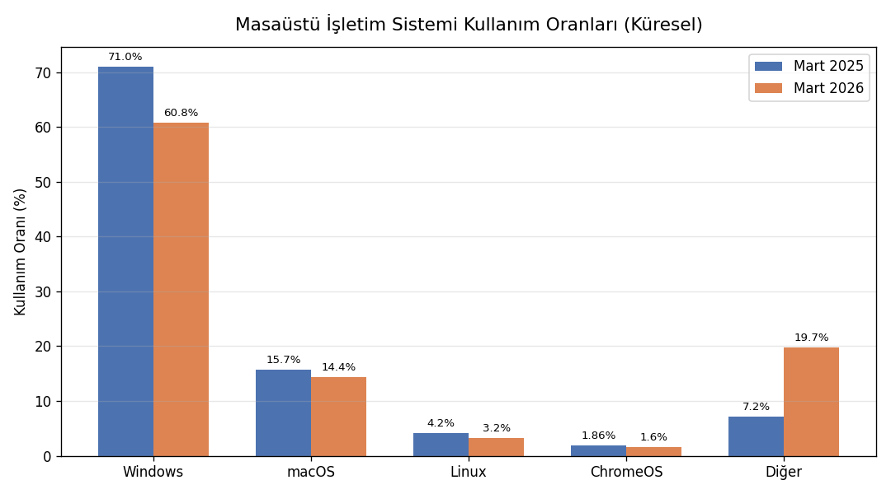
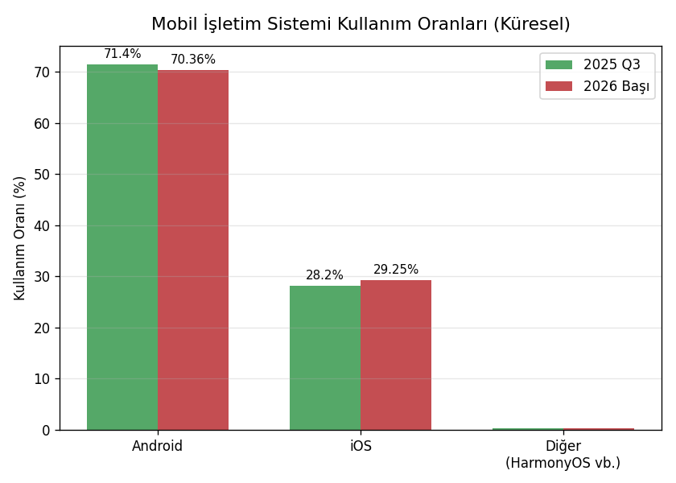
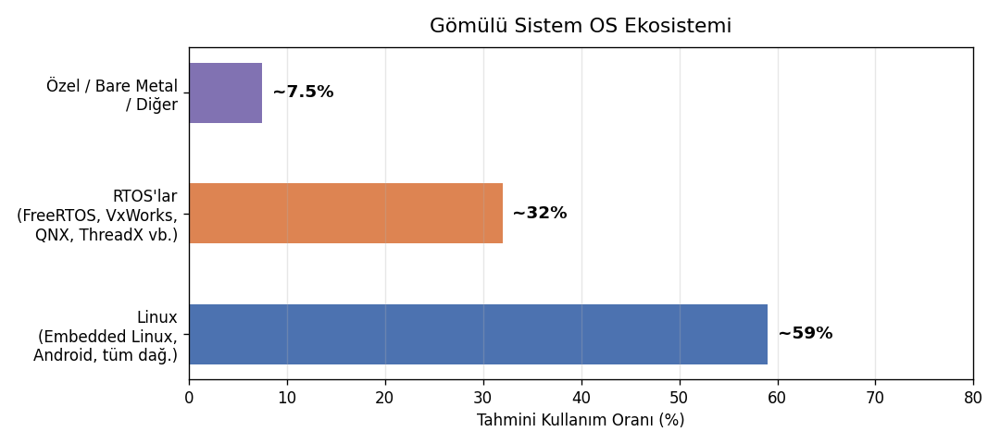
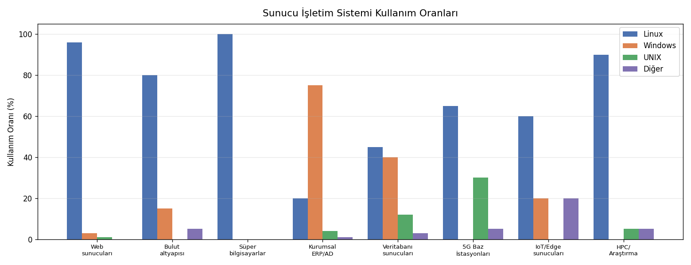

=========
GİRİŞ
=========

Temel Kavramlar: Sistem Programlama ve İşletim Sistemleri
==========================================================

Kursumuzun başında iki hafta bazı temel kavramlar ve konular üzerinde duracağız.

Sistem Programlama Nedir?
--------------------------

Bilgisayar donanımıyla arayüz oluşturan, uygulama programlarına çeşitli bakımlardan hizmet veren programlara
*sistem programları*, programlamanın bunlarla ilgili alanına da *sistem programlama (system programming)*
denilmektedir. Sistem programlama etkinlikleri aşağı seviyeli olma eğilimindedir. Bunları yazmak için önemli
ölçüde teorik bilgiye ve uygulama becerisine gereksinim duyulmaktadır. Sistem programlama
*programlamanın yükte hafif pahada ağır* bir alanını oluşturmaktadır. Bu yönüyle adeta yazılımın ağır sanayisi
niteliğindedir. Bilişim sektöründeki Microsoft, Apple, Google gibi pek çok büyük kurum geliştirdikleri sistem
yazılımları sayesinde bu hale gelmişlerdir. Tipik sistem programlama uygulamalarından bazıları şunlardır:

- İşletim Sistemleri
- Derleyiciler ve Yorumlayıcılar
- Editörler
- Gömülü Sistem Uygulamaları
- Debug Programları
- Aşağı Seviyeli Haberleşme Programları
- Virüs ve Antivirüs Yazılımları
- Çevre Birimlerinin ve Diğer Donanımsal Aygıtların Programlanması ve Aygıt Sürücüleri
- Veritabanı Motorları
- Sanallaştırma Yazılımları ve Emülatör Yazılımları
- Oyun Motorları

Sistem programlama etkinlikleri için en çok kullanılan programlama dilleri C, C++ ve Sembolik Makine
Dilleridir. Rust Programlama Dili de son yıllarda bu alanda bir yer edinmeye çalışmaktadır. Her ne kadar
sistem programlama denildiğinde akla C, C++, Rust ve sembolik makine dilleri geliyorsa da bazı sistem
programları Java ve C# gibi yüksek seviyeli dillerle de yazılabilmektedir.

İşletim Sistemleri
------------------

İşletim sistemleri bilgisayar donanımının kaynaklarını yöneten, bilgisayar donanımı ile kullanıcı arasında
arayüz oluşturan sistem programlarıdır. Bilgisayar bilimlerinin akademik öncülerinin çoğu işletim sistemlerini
bir *kaynak yöneticisi (resource manager)* olarak tanımlamıştır. Uygulama programları işletim sisteminin
sağladığı olanaklardan faydalanmaktadır.

.. code-block:: text

   ┌────────────────────────┐
   │   Uygulama Programları │
   ├────────────────────────┤
   │     İşletim Sistemi    │
   ├────────────────────────┤
   │   Bilgisayar Donanımı  │
   └────────────────────────┘

İşletim sistemlerinin yönettiği kaynakların en önemlileri şunlardır:

**CPU:** İşletim sistemi hangi programın ne zaman, ne kadar süre için CPU'ya atanacağına karar verip bu
işlemleri gerçekleştirmektedir.

**Ana Bellek (Main Memory — RAM):** İşletim sistemi programların ana belleğin neresine yükleneceğine karar
verir ve ana bellek kullanımını düzenler.

**İkincil Bellekler:** İşletim sistemi bir dosya sistemi (file system) oluşturarak dosyaların parçalarını
ikincil belleklerde etkin bir biçimde tutar ve kullanıcılara bir dosya kavramıyla sunar.

**Çevre Birimleri (klavye, fare, yazıcı vb.):** İşletim sistemi fare, klavye, yazıcı gibi çevre birimlerini
yöneterek onları kullanıma hazır hale getirir. Yardımcı işlemcileri (denetleyicileri) programlayarak onların
işlev görmesini sağlamaktadır.

**Ağ İşlemleri:** İşletim sistemi ağa ilişkin donanım birimlerini yöneterek ve çeşitli ağ protokollerini
oluşturarak dışarıdan gelen bilgileri onları talep eden programlara iletir.

İşletim sistemleri kaynak yönetimine göre alt sistemlere ayrılarak da incelenebilmektedir. Örneğin işletim
sisteminin *çizelgeleyici (scheduler)* alt sistemi demekle CPU yönetimini sağlayan alt sistem kastedilmektedir.
Ana bellek yönetimi *(memory management)* yine soyutlanarak incelenen önemli alt sistemlerden biridir. İşletim
sistemlerinin ikincil bellek yönetimine *dosya sistemi (file system)* da denilmektedir. Tabii bütün bu sistemler
birbirinden kopuk olarak değil birbirleriyle ilişkili bir biçimde işlev görmektedir. Bu durumu insanın
*solunum sistemi*, *dolaşım sistemi*, *sinir sistemi*, *boşaltım sistemi* gibi alt sistemlerine benzetebiliriz.
Bu alt sistemlerin birinde bile çalışma bozukluğu oluşsa insan yaşamını yitirebilmektedir.

İşletim sistemleri yapı olarak iki kısımdan oluşmaktadır: *Çekirdek (kernel)* ve *kabuk (shell)*. Çekirdek
işletim sisteminin donanımı kontrol eden ve kaynakları yöneten motor kısmıdır. Aslında işletim sistemi
denildiğinde akla çekirdek gelmektedir. Kabuk ise işletim sisteminin kullanıcı ile arayüz oluşturan önyüzüdür.
Örneğin UNIX/Linux sistemlerinde *bash* gibi komut satırı, GNOME, KDE gibi pencere yöneticileri, Windows'taki
masaüstü (Explorer), macOS'teki masaüstü (Aqua) bu işletim sistemlerinin kabuk kısımlarını oluşturmaktadır.

.. code-block:: text

   +-----------------------------------+
   |           Kabuk (Shell)           |
   |   +---------------------------+   |
   |   |    Çekirdek (Kernel)      |   |
   |   +---------------------------+   |
   +-----------------------------------+

Peki işletim sistemi bu kadar temel donanım yönetimini sağlıyorsa işletim sistemi olmadan programlama
yapılabilir mi? İşletim sistemi olmadan programlama faaliyetine halk arasında *bare metal programlama*
denilmektedir. Bare metal programlama genellikle mikrodenetleyicilerin kullanıldığı gömülü sistemlerde
uygulanmaktadır. Bare metal programlama özel bir amaca hizmet edecek biçimde yapılmaktadır. Amaçlar
fazlalaştığı zaman ve sistem karmaşıklaştığı zaman artık işletim sistemlerine gereksinim duyulmaktadır.

Bazı kontrol yazılımları işletim sistemlerinin bazı etkinliklerini de sağlamaktadır. Bir kontrol yazılımının
işletim sistemi olarak isimlendirilmesi için yukarıda açıkladığımız kaynak yönetimlerinin önemli bir bölümünü
sağlıyor olması gerekir. Bu kaynak yönetimlerinin çoğunu sağlamayan kontrol yazılımlarına genel olarak
*firmware* de denilmektedir.

İşletim Sistemlerinin Sınıflandırılması
----------------------------------------

İşletim sistemleri çeşitli biçimlerde sınıflandırılabilmektedir.

**Proses Yönetimine Göre**

Aynı anda tek bir programı çalıştıran işletim sistemlerine *tek prosesli (single processing)*, aynı anda
birden fazla programı çalıştırabilen işletim sistemlerine ise *çok prosesli (multiprocessing) işletim
sistemleri* denilmektedir. Örneğin DOS işletim sistemi tek prosesli bir sistemdi. Biz bu işletim sisteminde
bir programı çalıştırırdık, ancak çalıştırdığımız program sonlanınca başka bir programı çalıştırabilirdik.
Halbuki Windows, UNIX/Linux, macOS gibi işletim sistemleri çok prosesli işletim sistemleridir.

**Kullanıcı Sayısına Göre**

Birden fazla farklı kullanıcının çalışabildiği sistemlere *çok kullanıcılı (multiuser)*, tek bir kullanıcının
çalışabildiği sistemlere *tek kullanıcılı (single user)* sistemler denilmektedir. Genellikle çok prosesli
işletim sistemleri aynı zamanda çok kullanıcılı sistemlerdir. Birden fazla kullanıcının söz konusu olduğu
sistemlerde kullanıcıların yetkilerinin ayarlanması, kullanıcıların birbirlerinin alanlarına erişmesinin
engellenmesi, sistem kaynaklarını belli bölüşmesi gerekebilmektedir. Örneğin DOS tek kullanıcılı bir sistemdi.
Halbuki Windows, UNIX/Linux ve macOS sistemleri çok kullanıcılı sistemlerdir.

**Çekirdek Yapısına Göre**

İşletim sistemleri çekirdek yapısına göre *tek parçalı çekirdekli (monolithic kernel)* ve *mikro çekirdekli
(microkernel)* olmak üzere ikiye ayrılmaktadır. Tek parçalı çekirdekli işletim sisteminin büyük kısmı çekirdek
modunda çalışır. Mikro çekirdekli sistemlerde ise çekirdek modunda çalışan kısım minimize edilmeye çalışılmıştır.
Aslında tek parçalı ve mikro çekirdekli tasarımları bir spektrum olarak düşünebiliriz. Linux çekirdeği tek
parçalı *(monolithic)* tarafa daha yakındır. Mikro çekirdekli sistemlerden bazıları şunlardır:

.. list-table:: Mikro Çekirdekli İşletim Sistemleri
   :widths: 18 22 25 35
   :header-rows: 1

   * - Sistem
     - Kategori
     - Kullanım Alanı
     - Olgunluk
   * - MINIX 3
     - Saf Mikro Kernel
     - Eğitim / Araştırma
     - Akademik
   * - QNX
     - Saf Mikro Kernel
     - Gömülü / Gerçek Zamanlı
     - Üretim (Production)
   * - seL4
     - Saf Mikro Kernel
     - Güvenlik Kritik
     - Üretim (Formal Verified)
   * - Mach
     - Saf Mikro Kernel
     - Araştırma / Tarihsel
     - Tarihi Referans
   * - GNU Hurd
     - Mach Tabanlı
     - Genel Amaçlı
     - Geliştirme Aşamasında
   * - macOS/iOS (XNU)
     - Mach Tabanlı (Hibrit)
     - Masaüstü / Mobil
     - Üretim (Hibrit Tasarım)
   * - L4 / Fiasco
     - Akademik / Araştırma
     - Araştırma / Gömülü
     - Araştırma / Bazı Üretim
   * - OKL4
     - Akademik / Araştırma
     - Gömülü / Mobil
     - Üretim (Bazı platformlar)
   * - Haiku
     - Kısmen Mikro Kernel
     - Genel Amaçlı (Masaüstü)
     - Geliştirme Aşamasında

Genel olarak UNIX türevi sistemler tek parçalı çekirdekli biçimde tasarlanmaktadır. Aşağıda tek parçalı
çekirdekli tarafa yakın olan işletim sistemlerine örnekler veriyoruz:

.. list-table:: Tek Parçalı (Monolitik) Çekirdekli İşletim Sistemleri
   :widths: 22 30 48
   :header-rows: 1

   * - Sistem
     - Tür
     - Not
   * - Linux
     - Modüler Monolitik
     - LKM desteği var
   * - FreeBSD
     - Saf Monolitik
     - POSIX uyumlu
   * - NetBSD
     - Saf Monolitik
     - Taşınabilirlik odaklı
   * - OpenBSD
     - Saf Monolitik
     - Güvenlik odaklı
   * - Solaris
     - Modüler Monolitik
     - SVR4 tabanlı
   * - AIX
     - Modüler Monolitik
     - IBM Power mimarisi
   * - Original Unix
     - Saf Monolitik
     - Tarihsel referans
   * - Windows 95/98
     - Monolitik (Hibrit eğilimli)
     - Üretim dışı, tarihsel
   * - Klasik (Eski) Mac OS
     - Saf Monolitik
     - Üretim dışı, tarihsel

Tek parçalı çekirdekli tasarım genel olarak daha hızlı ve kırılgan, mikro çekirdekli tasarım ise genellikle
daha yavaş ve sağlam olma eğilimindedir. Aşağıdaki tabloda iki tasarım mimarisini avantaj ve dezavantaj
bakımından karşılaştırıyoruz:

.. list-table:: Monolitik ve Mikro Çekirdek Mimarisi Karşılaştırması
   :widths: 20 40 40
   :header-rows: 1

   * - Kriter
     - Monolitik Çekirdek
     - Mikro Çekirdek
   * - Performans
     - [+] Sistem çağrıları doğrudan çekirdek uzayında işlenir; düşük gecikme.
       [+] Context switch maliyeti düşük.
     - [-] IPC (mesaj geçişi) ek yük getirir ve gecikmeyi artırır.
       [-] Kullanıcı/çekirdek geçişi sık yaşanır.
   * - Güvenilirlik / Kararlılık
     - [-] Bir sürücü hatası tüm sistemi çökertebilir.
       [-] Hata yayılımı (fault propagation) engellenemez.
     - [+] Servisler kullanıcı uzayında izole çalışır.
       [+] Hatalı servis yeniden başlatılabilir, sistemi çökertmeden.
   * - Güvenlik
     - [-] Çekirdek büyüdükçe güvenlik açığı yüzeyi genişler.
       [-] Tüm kod aynı ayrıcalık seviyesinde.
     - [+] Minimal TCB (Trusted Computing Base).
       [+] Servisler birbirinden izole edilir.
       [+] seL4 gibi formal doğrulama mümkün.
   * - Modülerlik / Geliştirilebilirlik
     - [-] Yeni servis eklemek çekirdeği doğrudan etkiler.
       [+] LKM ile kısmi modülerlik sağlanır.
     - [+] Servisler bağımsız geliştirilebilir.
       [+] Yeni sürücü/servis kullanıcı uzayına eklenir, çekirdek değişmez.
   * - Donanım Erişimi
     - [+] Donanıma yakın çalışma kolaylığı.
       [+] DMA, interrupt handling doğrudan çekirdekten yönetilir.
     - [-] Donanım sürücüleri kullanıcı uzayında çalışır, donanım erişimi dolaylıdır.
       [-] Sürücü geliştirmesi daha karmaşık.
   * - Bakım / Test
     - [-] Çekirdek kod tabanı büyük ve karmaşık.
       [-] Hata ayıklama (debugging) güçtür.
       [+] Geniş topluluk ve araç desteği.
     - [+] Çekirdek küçük ve anlaşılır.
       [+] Her servis bağımsız test edilebilir.
       [-] IPC katmanı debug'i karmaşık olabilir.
   * - Uygun Kullanım Alanı
     - [+] Genel amaçlı sistemlerde olgunlaşmış.
       [+] Masaüstü, sunucu, HPC ortamları.
       [+] Linux, BSD aileleri kanıtlanmış.
     - [+] Gömülü, gerçek zamanlı ve güvenlik kritik sistemler için idealdir.
       [+] QNX, seL4 üretim ortamında başarılı.

**Dışsal Olaylara Yanıt Verebilme Özelliğine Göre**

İşletim sistemleri dışsal olaylara yanıt verme bakımından *gerçek zamanlı olan (real-time)* ve *gerçek zamanlı
olmayan (non-real-time)* sistemler olmak üzere ikiye ayrılabilir. Dışsal olaylara hızlı bir biçimde yanıt
verebilecek çekirdek yapısına sahip olan işletim sistemlerine *gerçek zamanlı (real-time) işletim sistemleri*
denilmektedir. Gerçek zamanlı işletim sistemleri de kendi aralarında *katı (hard real-time)* ve *gevşek
(soft real-time)* işletim sistemleri olmak üzere ikiye ayrılabilmektedir. Katı gerçek zamanlı sistemler
dışsal olaylara yanıt verme bakımından çok güvenilir olma iddiasındadır. Gevşek gerçek zamanlı sistemler
ise bu konuda daha toleranslıdır. Linux gerçek zamanlı bir işletim sistemi değildir. Çeşitli çekirdek
değişiklikleriyle (kernel patches) gevşek gerçek zamanlılık sağlanabilmektedir. Yaygın kullanılan bazı
gerçek zamanlı işletim sistemleri aşağıdaki tabloda verilmektedir:

.. list-table:: Yaygın Gerçek Zamanlı İşletim Sistemleri (RTOS)
   :widths: 16 14 20 28 22
   :header-rows: 1

   * - RTOS
     - Geliştirici
     - Lisans
     - Kullanım Alanı
     - Öne Çıkan Özellik
   * - VxWorks
     - Wind River
     - Ticari
     - Havacılık, uzay, savunma
     - DO-178C DAL-A sertifikalı
   * - INTEGRITY-178B
     - Green Hills
     - Ticari
     - F-35, askeri aviyonik
     - NSA onaylı, çok güvenli
   * - LynxOS-178
     - Lynx Software
     - Ticari
     - Askeri, havacılık
     - POSIX uyumlu, DO-178C
   * - QNX
     - BlackBerry
     - Ticari
     - Otomotiv, medikal, endüstri
     - Microkernel mimarisi
   * - FreeRTOS
     - Amazon (AWS)
     - MIT (Açık kaynak)
     - IoT, gömülü sistemler
     - Çok küçük footprint
   * - Zephyr
     - Linux Foundation
     - Apache 2.0 (Açık kaynak)
     - IoT, wearable, sensor sistemleri
     - Modern, modüler yapı
   * - RTEMS
     - Topluluk/NASA
     - BSD (Açık kaynak)
     - Uzay, bilimsel ekipman
     - NASA Mars görevlerinde
   * - embOS
     - SEGGER
     - Ticari
     - Medikal, endüstriyel
     - Çok küçük RAM kullanımı
   * - ThreadX (Azure)
     - Microsoft
     - MIT (Açık kaynak)
     - IoT, tüketici elektroniği
     - IEC 61508 sertifikalı
   * - PikeOS
     - SYSGO
     - Ticari
     - Airbus, demiryolu, otomotiv
     - Çoklu işletim sistemi

**Dağıtıklık Durumuna Göre**

İşletim sistemleri dağıtıklık durumuna göre *dağıtık olan (distributed)* ve *dağıtık olmayan
(non-distributed)* sistemler biçiminde ikiye ayrılabilmektedir. Dağıtık işletim sistemlerinde sistem birden
fazla bilgisayardan oluşan tek bir sistem gibi davranmaktadır. Örneğin 10 tane makineyi tek bir sistem olarak
düşünebilirsiniz. Bu durumda bu bilgisayarların kaynakları (örneğin diskleri ve CPU'ları) bu 10 makine
tarafından paylaşılmaktadır. Windows, UNIX/Linux ve macOS dağıtık işletim sistemleri değildir. Ancak bu
sistemlerde çeşitli framework'ler ile dağıtık uygulamalar yapılabilmektedir.

**Donanım Özelliğine Göre**

Neredeyse her yaygın masaüstü işletim sisteminin bir mobil versiyonu da oluşturulmuştur. iOS (iPhone
Operating System) ve iPadOS Apple firmasının mobil işletim sistemleridir. Bunlar macOS sistemlerinin mobil
versiyonları gibi düşünülebilir. Android bir çeşit mobil Linux sistemi olarak değerlendirilebilir. Android
projesinde Linux çekirdeği alınmış, biraz özelleştirilmiş, bazı kısımları atılmış, buna bir mobil arayüz
giydirilmiş ve sistem akıllı telefonlara ve tabletlere uygun hale getirilmiştir. Nokia eskiden Symbian
sistemlerinde büyük bir pazar payına sahipti. Ancak bu firma akıllı telefon geçişini iyi yönetemedi.
MeeGo ve Maemo gibi işletim sistemlerini denedi. Sonra ekonomik sıkıntılar sonucunda büyük ölçüde Microsoft
tarafından satın alındı. Windows'un mobil versiyonuna genel olarak *Windows CE (Compact Edition)* denilmektedir.
Windows CE'nin akıllı telefonlar ve tabletler için özelleştirilmiş biçimine ise *Windows Mobile* ve
*Windows Phone* denilmektedir. Ancak Microsoft 2010 yılında Windows Mobile işletim sistemini 2017'de de
Windows Phone işletim sistemini sonlandırmıştır ve bu alandaki rekabetten tamamen çekilmiştir. Windows CE
ise bugün *Windows IoT Core* ismi altında farklı bir tasarımla evrimleşerek devam ettirilmektedir.

Kursun yapıldığı sırada masaüstü işletim sistemlerinin masaüstü bilgisayarlardaki kullanım oranları şöyledir:

.. list-table:: Masaüstü İşletim Sistemi Kullanım Oranları (Küresel)
   :widths: 34 33 33
   :header-rows: 1

   * - İşletim Sistemi
     - Mart 2025
     - Mart 2026
   * - Windows
     - ~71%
     - ~60.8%
   * - macOS
     - ~15.7%
     - ~14.4%
   * - Linux
     - ~4.2%
     - ~3.2%
   * - ChromeOS
     - ~1.86%
     - ~1.6%
   * - Bilinmeyen / Diğer
     - ~7.2%
     - ~19.7%

   Programın çıktısı gibidir.

Biz burada masaüstü bilgisayarlar demekle kasalı olan bilgisayarları ve notebook gibi taşınabilir
bilgisayarları kastediyoruz. Akıllı telefonları, tabletleri ve diğer gömülü sistemleri kastetmiyoruz.
Akıllı telefon ve tablet dünyasındaki durum da şöyledir:

.. list-table:: Mobil İşletim Sistemi Kullanım Oranları (Küresel)
   :widths: 34 33 33
   :header-rows: 1

   * - İşletim Sistemi
     - 2025 Q3
     - 2026 Başı
   * - Android
     - ~71.4%
     - ~70.36%
   * - iOS
     - ~28.2%
     - ~29.25%
   * - Diğer (HarmonyOS vb.)
     - ~0.4%
     - ~0.39%

   Programın çıktısı gibidir.

Görüldüğü gibi Android'in bu alanda büyük bir üstünlüğü vardır. Android'in Linux çekirdeğini temel aldığını
anımsamak istiyoruz. Linux sistemlerinin gömülü sistemlerde ve sunucularda önemli bir üstünlüğü vardır. Her
ne kadar gömülü sistemler için güvenilir istatistiklerin çıkartılması o kadar kolay değilse de yine de
aşağıdaki tablo kursun yapıldığı dönem için bir fikir verebilir:

   Programın çıktısı gibidir.

Sunucu (server) olarak kullanılan bilgisayarlarda da Linux diğer seçeneklerden daha öndedir. Aşağıda kursun
yapıldığı tarih için bir fikir amacıyla sunucu dünyasındaki kullanım oranlarını bir tablo halinde veriyoruz:

.. list-table:: Sunucu İşletim Sistemi Kullanım Oranları
   :widths: 28 18 18 18 18
   :header-rows: 1

   * - Kullanım Alanı
     - Linux
     - Windows
     - UNIX
     - Diğer
   * - Web sunucuları
     - ~96%
     - ~3%
     - ~1%
     - —
   * - Bulut altyapısı
     - ~80%
     - ~15%
     - —
     - ~5%
   * - Süperbilgisayarlar
     - %100
     - —
     - —
     - —
   * - Kurumsal ERP / AD
     - ~20%
     - ~75%
     - ~4%
     - ~1%
   * - Veritabanı sunucuları
     - ~45%
     - ~40%
     - ~12%
     - ~3%
   * - 5G Baz İstasyonları
     - ~65%
     - —
     - ~30%
     - ~5%
   * - IoT / Edge sunucuları
     - ~60%
     - ~20%
     - —
     - ~20%
   * - HPC / Araştırma
     - ~90%+
     - —
     - ~5%
     - ~5%

   Programın çıktısı gibidir.

**Kaynak Kod Lisansına Göre**

Kaynak kod lisansına göre işletim sistemlerini kabaca *açık kaynak kodlu (open source)* ve *mülkiyete bağlı
(proprietary)* olmak üzere ikiye ayırabiliriz. Açık kaynak kodlu işletim sistemleri değişik açık kaynak kod
lisanslarına sahip olabilmektedir. Bunların kaynak kodları indirilip üzerinde değişiklikler yapılabilmektedir.
Örneğin Windows işletim sistemi mülkiyete sahiptir. Oysa Linux, BSD sistemleri, Solaris, Android gibi sistemler
açık kaynak kodludur. macOS sistemlerinin ise çekirdeği açık, diğer kısımları (örneğin kabuk kısmı ve diğer
katmanları) kapalıdır.

**Kaynak Kodun Özgünlüğüne Göre**

Bazı işletim sistemleri bazı işletim sistemlerinin kodları alınıp değiştirilerek oluşturulmuştur (örneğin
Android ve macOS'ta olduğu gibi). Bazı işletim sistemlerinin kodları ise sıfırdan yazılmıştır. Kodları
sıfırdan yazılan yani orijinal kod temeline dayanan işletim sistemlerinden bazıları şunlardır:

- AT&T UNIX
- DOS
- Windows
- Linux
- BSD'ler (belli bir yıldan sonra)
- Solaris
- XENIX
- VMS

Burada mimari ile orijinal kod tabanını birbirine karıştırmamak gerekiyor. Linux, UNIX işletim sisteminin
mimarisini temel almıştır. Ancak Linux'un tüm kodları sıfırdan yazılmıştır. Yani orijinal AT&T UNIX
sistemindeki kaynak kodların bir bölümü kopyalanarak kullanılmamıştır.

**GUI Çalışma Desteğine Göre**

Bazı işletim sistemleri GUI çalışma modelini doğrudan desteklerken bazıları desteklememektedir. Örneğin
Windows sistemleri çekirdekle entegre edilmiş bir GUI çalışma modeli sunmaktadır. UNIX/Linux sistemleri de
*X Window* (ya da X11) ve *Wayland* katmanlarıyla benzer bir modeli sunmaktadır. Fakat örneğin DOS işletim
sisteminin böyle bir doğal GUI desteği yoktu.

**Ağ Üzerinde Hizmet Alıp Verme Rollerine Göre**

İşletim sistemlerini ağ altında hizmet alıp verme rollerine göre *istemci (client)* ve *sunucu (server)*
biçiminde de iki gruba ayırabiliriz. Bazı işletim sistemlerinin istemci versiyonları ile sunucu versiyonları
birbirlerinden ayrılmıştır. Bazılarında ise bu ayrım yapılmamıştır. Örneğin Windows 7, 8, 10, 11 sistemleri
bu bakımdan istemci (client) sistemleridir. Halbuki Windows Server 2016, 2019, 2025 sunucu sistemleri olarak
piyasaya sürülmüştür. Eskiden Mac OS X'in istemci ve sunucu versiyonları farklıydı. Fakat Mac OS X 10.7
(Lion) ile birlikte istemci ve sunucu versiyonları birleştirildi. Linux dağıtımlarının çoğu da hem istemci
hem de sunucu olarak kullanılabilmektedir. Ancak bazı dağıtımların ise istemci ve sunucu versiyonları
farklıdır. Peki işletim sistemlerinin istemci ve sunucu versiyonları arasındaki farklılıklar nelerdir?
Kabaca iki tür farklılığın olduğunu söyleyebiliriz. Birincisi çekirdekle ilgili farklılıklardır. Genellikle
sunucu sistemlerinde çizelgeleyici alt sistemde istemci sistemlerine göre farklılıklar söz konusu olabilmektedir.
İkincisi ise barındırdıkları yardımcı yazılımlardır. İşletim sistemlerinin sunucu versiyonları hazır bazı
sunucu programlarını da içerecek biçimde paketlenmektedir.

Bilgisayar Donanımının Tarihsel Gelişimi
-----------------------------------------

Şimdi de biraz bilgisayar donanımlarının tarihsel gelişimi üzerinde duralım. Elektronik düzeyde bugün
kullandığımız bilgisayarlara benzer ilk aygıtlar 1940'lı yıllarda geliştirilmeye başlanmıştır. Ancak bundan
önce hesaplama işlemlerini yapmak için pek çok mekanik aygıt üzerinde çalışılmıştır. Bunların bazıları
kısmen başarılı olmuş ve belli bir süre kullanılmıştır. Mekanik bilgisayarlar alanındaki en önemli girişimler
Charles Babbage tarafından yapılan *Analytical Engine* ve *Difference Engine* aygıtlarıdır. *Analytical
Engine* tam olarak bitirilememiştir. Fakat bunlar pek çok çalışmaya ilham kaynağı olmuştur. Hatta bir dönem
Babbage'ın asistanlığını yapan Ada Lovelace bu *Analytical Engine* üzerindeki çalışmalarından dolayı dünyanın
ilk programcısı kabul edilmektedir. Şöyle ki: Rivayete göre Babbage Ada'dan *Analytical Engine* için Bernoulli
sayılarının bulunmasını sağlayan bir yönerge yazmasını istemiştir. Ada'nın yazdığı bu yönergeler de dünyanın
ilk programı kabul edilmektedir. (Gerçi bu yönergelerin bizzat Babbage'ın kendisi tarafından yazılmış olduğu
neredeyse ispatlanmış olsa bile hala böyle atıf vardır.)

Daha sonra 1800'lü yılların ortalarından itibaren elektronikte hızlı bir ilerleme yaşanmıştır. Bool cebri
ortaya atılmış, çeşitli devre elemanları kullanılmaya başlanmış ve mantık devreleri üzerinde çalışmalar
başlatılmıştır. 1900'lü yılların başlarında artık yavaş yavaş elektromekanik bilgisayar fikri belirmeye
başlamıştır. 1930'lu yıllarda Alan Turing konuya matematiksel açıdan yaklaşmış ve bugünkü bilgisayar benzeri
bir makinenin hangi matematik problemlerini çözebileceği üzerine kafa yormuştur. Turing bir şerit üzerinde
ilerleyen bir kafadan oluşan ve ismine *Turing Makinesi* denilen soyut makine tanımlamıştır ve bu makinenin
neler yapabileceği üzerinde çalışmalar yapmıştır. ACM Turing'in anısına bilgisayarın Nobel ödülü gibi kabul
edilen Turing ödülleri vermektedir.

Dünyanın ilk elektronik bilgisayarının hangisi olduğu konusunda bir fikir birliği yoktur. Bazıları Konrad
Zuse'nin 1941'de yaptığı Z3 bilgisayarını ilk bilgisayar olarak kabul ederken bazıları 1944'te yapılan
Harvard Mark 1 bilgisayarını bazıları da 1945'te yapılan ENIAC'ı ilk bilgisayar olarak kabul etmektedir.

Modern bilgisayar tarihi üç döneme ayrılarak incelenebilir:

1. Transistör öncesi dönem (1940–1950'lerin ortalarına kadar)
2. Transistör dönemi (1950'lerin ortalarından 1970'lerin ortalarına kadar)
3. Entegre devre dönemi (1970'lerin ortalarından günümüze kadar ki dönem)

İlk bilgisayarlar transistörler olmadığı için vakum tüplerle yapılmıştı. Vakum tüpler hem büyük yer kaplıyordu
hem de çok ısınıyordu dolayısıyla da çok güç harcıyordu. Ayrıca bunlar hassas devreler yapmak için güvenilir
elemanlar değildi. Bu nedenle bu devirdeki bilgisayarlar bir salon büyüklüğündeydi.

Transistör ilk 1947 yılında John Bardeen, William Shockley ve Walter Brattain tarafından Bell Lab'ta icat
edildi. Fakat ancak 1950'li yılların ortalarına doğru uygulama alanına girdi. İlk transistörlü radyo 1954
yılında yapılmıştır. Transistörler 1950'li yıllarda yavaş yavaş bilgisayar devrelerine de girmeye başladı.
Bu sayede bilgisayar devreleri küçüldü ve kuvvetlendi. O zamanların en önemli firmaları IBM, Honeywell, DEC
gibi firmalardı.

Entegre devreye benzer ilk çalışma aslında ilk olarak 1949 yılında Alman mühendis Werner Jacobi tarafından
yapılmıştır. Ancak entegre devre fikri 1952 yılında İngiliz Geoffrey Dummer tarafından ortaya atıldı. Fakat
gerçek anlamda ilk gerçekleştirimi 1958 yılında Texas Instruments şirketi çalışanı Jack Kilby tarafından
yapıldı. Kilby'den habersiz olarak yaklaşık altı ay sonra benzer entegre devre gerçekleştirimi Fairchild
Semiconductor firmasında Robert Noyce tarafından da yapılmıştır. Kilby ile Noyce patent konusunda mahkemelik
olmuşlarsa da sonra anlaşma sağlanmış ve her iki kişi adına patentleme yapılmıştır. Robert Noyce aslında
transistörü bulan ekipteki William Shockley'nin yanında çalışıyordu. Bu ekipte Gordon Moore da vardı.
Shockley'nin yönetiminden memnun olmayan bu ekip Fairchild Semiconductor şirketine geçmiştir. Noyce şirketin
genel müdürü, Moore da Ar-Ge müdürü olmuştur. Daha sonra 1968 yılında Robert Noyce ve Gordon Moore Fairchild
Semiconductor firmasından ayrılarak Intel'i kurdu. İkili Intel'i kurduktan sonra şirkete Fairchild
Semiconductor'dan Andrew S. Grove'u da yanlarına aldı. Entegre devreler önce Texas Instruments firması
tarafından hesap makinelerinde kullanıldı. Sonra yavaş yavaş bilgisayarlarda da kullanılmaya başlandı.

Dünyanın entegre devre olarak (yani tek parça olarak) üretilen ilk mikroişlemcisi Intel'in 8080'i kabul
edilmektedir. Intel daha önce 4004, 8008 gibi entegre devreler yaptıysa da bunlar tam bir mikroişlemci olarak
kabul edilmemektedir. Entegre devreler kullanılarak mikroişlemciler yapılmaya başlanınca artık bilgisayar
dünyası yeni bir döneme girmiş oldu. Transistörler ve sonra da entegre devreler elektronik alanında büyük
devrim yaratmıştır.

Intel 8080'i tasarladığında bundan bir kişisel bilgisayar yapılabileceği onların aklına gelmemiştir. Kişisel
bilgisayar fikri Ed Roberts isimli bir girişimci tarafından ortaya atıldı. Ed Roberts 8080'i kullanarak
Altair isimli ilk kişisel bilgisayarı yaptı ve *Popular Electronics* isimli dergiye kapak oldu. Altair makine
dilinde kodlanıyordu. Roberts buna Basic derleyicisi yazacak kişi aradı ve *Popular Electronics* dergisine
ilan verdi. İlana o zaman Harvard'ta öğrenci olan Bill Gates ile Washington State University'de öğrenci olan
arkadaşı Paul Allen başvurdular. Böylece Altair daha sonra Basic ile piyasaya sürüldü. Gates ve Allen okuldan
ayrıldılar ve 1975 yılında Microsoft firmasını kurdular. (O zamanlar bu yeni kişisel bilgisayarlara
mikrobilgisayarlar da denilmekteydi. Microsoft ismi buradan gelmektedir.) Amerika'da bu süreç içerisinde her
yerde bilgisayar kulüpleri kuruldu ve pek çok kişi kendi kişisel bilgisayarlarını yapmaya heveslendi. Steve
Jobs ve Steve Wozniak Apple'ı 1976 yılında böyle bir süreç içerisinde ve atmosferde kurmuştur.

IBM kişisel bilgisayar konusunu hafife aldı. Fakat yine de bir ekip kurarak bugün kullandığımız PC'lerin
donanımını tasarlamıştır. Ancak IBM küçük iş olduğu gerekçesiyle bunlar için işletim sistemini kendisi
yazmadı, taşeron bir firmaya yazdırmak istedi. Bu süreç içerisinde Microsoft IBM ile anlaşarak DOS işletim
sistemini geliştirdi. (Yani ilk PC'lerin donanımı IBM tarafından tasarlanmış ve işletim sistemi de Microsoft
tarafından yapılmıştır.) Microsoft IBM ile anlaştı. IBM uzağı göremediği için bu süreçte önemli ticari hatalar
yaptı. Microsoft ile yaptığı anlaşmaya göre DOS'un başkalarına satışını tamamen Microsoft yapacaktı. IBM'in
ikinci hatası da PC için donanım patentlerini almayı ihmal etmesi oldu. Bunun sonucunda pek çok firma IBM
uyumlu daha ucuz PC'ler yaptılar. Fakat bunların hepsi işletim sistemini Microsoft'tan satın alıyordu. Böylece
Microsoft 80'li yıllarda çok büyüdü ve dünyanın önemli bilişim firmalarından biri haline geldi.

İşletim Sistemlerinin Tarihsel Gelişimi
----------------------------------------

Şimdi de işletim sistemlerinin tarihsel gelişimi üzerinde duracağız. 1940'lı yıllarda ilk elektronik
bilgisayarlar yapıldığında henüz bir işletim sistemi kavramı yoktu. Bu bilgisayarlara program yazacak olanlar
işletim sistemi faaliyetlerini de kendileri yapmak zorunda kalıyordu. (Yani şimdi mikrodenetleyicilere bare
metal kod yazanlarda olduğu gibi.) Transistör bulunduktan sonra 1950'li yıllarda artık elektronik bilgisayarlar
yavaş yavaş transistörlerle yapılmaya başlandı. Transistörlerin ortaya çıkması hem bilgisayarların
kapasitelerini ve güvenilirliklerini artırmış, hem de güç harcamalarını düşürmüştür.

1950'li yıllarda IBM gibi pek çok bilgisayar üreten firma yalnızca donanım satıyordu. İşletim sistemi gibi
programları yazmak kullanıcıların yapması gereken bir işti. Böylece donanımı satın alan her kurum işletim
sistemine benzeyen programları da kendisi yazıyordu. Bu anlamda standart bir işletim sistemi yoktu. Bugünkü
anlamda ilk işletim sisteminin General Motors'un 1956 yılında IBM'in 701 sistemi için yazdığı *NAA IO (North
American Aviation Input Output System)* olduğu söylenebilir.

1960'lara gelindiğinde IBM *System/360* isminde yeni bir bilgisayar donanımı geliştirme işine girişti ve artık
donanımla işletim sistemini birlikte satma fikrini benimsedi. Bu donanım 1964 yılında duyuruldu ve 1965
yılında gerçekleştirildi. İlk System/360 Model 30 bilgisayarları o zamanın *Solid Logic Technology (SLT)*
teknolojisiyle üretilmişti. Hem öncekilerden daha güçlüydü hem de daha az yer kaplıyordu. Saniyede 34.500
işlem yapabiliyordu ve 8K ile 64K ana belleğe sahipti. 1967 yılında System/360'ın Model 60'ı piyasaya
sürüldü. Bu model saniyede 16.6 milyon komut çalıştırabiliyordu ve ana belleği de tipik olarak 512K, 768K
ve 1 MB idi. IBM System/360 donanımları için 1964 yılında ilk kez *OS/360* işletim sistemini geliştirdi. IBM
daha sonra 1967 yılında OS/360 Model 67 için OS/360'ın *TSS/360* isminde zaman paylaşımlı *(time sharing
system)* bir versiyonunu daha geliştirmiştir. IBM'in System/360 makineleri ve işletim sistemleri önemli ticari
başarı kazandı. System/360'ı System/370 izledi. System/360 ve System/370 için başka kurumlar da işletim
sistemleri geliştirmiştir. *Michigan Terminal System (MTS)* ve *MUSIC/SP* bunlar arasında önemli olanlardandır.

1960'lı yıllarda başka firmalar da işletim sistemleri geliştirmiştir. Örneğin Control Data Corporation (CDC)
firmasının *SCOPE* işletim sistemi batch işlemler yapabiliyordu. Aynı firma *MACE* isminde bu işletim
sisteminin zaman paylaşımlı bir versiyonunu da yazmıştır. Firma bu çalışmalarını 1970'li yıllarda *Kronos*
işletim sistemiyle devam ettirmiştir. Burroughs firması 1961 yılında *MCP* işletim sistemi ile B5000
bilgisayarlarını, GE firması da 1962 yılında *GECOS* işletim sistemiyle GE-600 serisi bilgisayarlarını
piyasaya sürdü. UNIVAC dünyanın ilk ticari bilgisayarlarını üreten firmadır. Bu firma da 1962 yılında
UNIVAC 1107 için *EXEC I* işletim sistemini yazdı. Bu işletim sistemini sırasıyla *Exec 2* ve *Exec 8* izledi.

DEC (Digital Equipment Corporation) eskilerin en önemli bilgisayar üretici firmalarından biriydi. (DEC 1998
yılında Compaq firması tarafından, Compaq firması da 2002 yılında HP firması tarafından satın alındı.)
Firmanın en önemli ürünleri *PDP (Programmed Data Processor)* isimli bilgisayarlarıdır. Firma PDP-1'den
(1959) başlayarak PDP-16'ya (1971–1972) kadar PDP makinelerinin 16 versiyonunu piyasaya sürmüştür. DEC'in
PDP-8'inin mini bilgisayar devrimini başlattığı söylenebilir. Bu model 50.000'in üzerinde satışa ulaşmıştır.
UNIX işletim sistemi 1969 yılında ilk kez DEC'in PDP-7 modeli üzerinde yazılmıştır. 1965 yılında piyasaya
sürülen DEC PDP-7 18 bitlik bir makineydi. Makine *DECsys* denilen işletim sistemi benzeri bir yönetici
programla beraber satılıyordu. DEC'in 1966 yılında çıkardığı PDP-10 26 bitlik bir makineydi. DEC bu modelle
birlikte işletim sistemi olarak *TOPS-10* isimli bir sisteme geçti.

1960'lı yılların sonuna kadar işletim sistemleri ağırlıklı olarak sembolik makine diliyle yazılıyordu.
1960'lı yılların sonlarında AT&T Bell Lab. tarafından UNIX işletim sistemi geliştirildiğinde önemli bir
devrim yaşandı. UNIX işletim sistemi 1973 yılında C ile yeniden yazılmıştır. Böylece artık işletim
sistemlerinin yüksek seviyeli dillerle de yazılabildiği görülmüştür. PDP-11'i 16 bitlik PDP-12 izledi.
PDP-12 Intel'in x86 ve Motorola'nın 6800 işlemcileri için ilham kaynağı olmuştur.

1970'li yılların ikinci yarısında entegre devrelerin de geliştirilmesiyle *ev bilgisayarları (home computer)*
ortaya çıkmaya başladı. Bunlarda genellikle BASIC yorumlayıcıları ile iç içe geçmiş *CP/M* ya da *GEOS*
işletim sistemleri kullanılıyordu. 1970'li yıllarda pek çok firma farklı ev bilgisayarları üretmiştir. BBC
Micro, Commodore 64, Apple II, Atari, Amstrad, ZX Spectrum dönemin en ünlü ev bilgisayarlarındandı. Bu
makinelerde kullanılan işlemciler Intel'in 8080'i, Zilog'un Z80'i, Motorola'nın 6800'ü gibi 8 bitlik
işlemcilerdi.

DEC firması 1977 yılında *VAX* isimli bilgisayarı ve 32 bitlik işlemci birimini piyasaya sürdü. VAX ailesi
makineler o yıllarda önemli bir ticari başarı kazanmıştır. DEC firması VAX makineleri için *VAX/VMS* isimli
bir işletim sistemi yazmıştı. DEC bu işletim sisteminin ismini 1992 yılında *OpenVMS* olarak değiştirdi. DEC
1992 yılında 64 bitlik RISC tasarımı olan *Alpha* işlemcilerini piyasaya sürdü ve OpenVMS Alpha işlemcilerine
port edildi. OpenVMS hala kullanılmaya devam etmektedir. Itanium ve X86-64 portları da vardır.

Apple firması 1976 yılında kuruldu. Apple'ın ilk bilgisayarı *Apple I* idi. Bunu 1977'de *Apple II*, 1980'de
de *Apple III* izledi. Bu ilk Apple bilgisayarlarında *AppleDOS* isimli işletim sistemleri kullanılıyordu.
Daha sonra Apple 1983'te *Lisa* modelini piyasaya sürdü. 1983'ün sonlarında da ilk *Macintosh* bilgisayarını
çıkardı. Lisa ile birlikte Apple grafik tabanlı işletim sistemlerine geçiş yaptı. Lisa ve sonraki Apple
bilgisayarlarının hepsi grafik bir arayüze sahiptir. Macintosh markası daha sonra Mac olarak telaffuz edilmeye
başlandı. Lisa bilgisayarlarında kullanılan işletim sistemi *LisaOS* ismindeydi. Apple daha sonra Macintosh
bilgisayarlarının değişik versiyonlarını piyasaya sürdü. Bunlardaki işletim sistemini *System Software 1*
(1984), *System Software 2* (1985), *System Software 3* (1986), *System Software 4* (1987), *System Software 5*
(1987), *System Software 6* (1988) ve *System Software 7* (1991) olarak isimlendirdi. Apple System Software
7.5'ten sonra işletim sisteminin ismini *System Software* yerine *Mac OS* olarak değiştirdi ve System Software
7.6 versiyonu *Mac OS 7.6* ismiyle çıktı. Daha sonra Apple 1997 yılında *Mac OS 8*'i, 1999 yılında da
*Mac OS 9*'u çıkarmıştır.

1980'li yıllarda Mac bilgisayarlarının fiyatı çok yüksekti ve satışları da iyi gitmiyordu. Çünkü Steve Jobs
bilgisayarların program yazmak için değil kullanmak için alınması gerektiğini düşünüyordu. Nihayet Apple'daki
çalkantılar sonucunda Steve Jobs 1985 yılında Apple'dan ayrılmak zorunda kaldı (kovuldu da denebilir) ve
*NeXT* firmasını kurdu. NeXT firması *NeXT* isimli bilgisayarları geliştirdi. Bu bilgisayarlarda *NeXTSTEP*
isimli işletim sistemi kullanılıyordu. Daha sonra bu sistem açık hale getirildi ve *OPENSTEP* ismini aldı.
Dünyanın ilk Web tarayıcısı Tim Berners-Lee tarafından Cern'de NeXT bilgisayarları üzerinde
gerçekleştirilmiştir.

Steve Jobs 1997 yılında Apple'a geri döndü. Apple da NeXT firmasını 200 milyon dolara satın aldı. Sonra
piyasaya *iMac* ve *Power Mac* serileri çıktı. Daha sonra Steve Jobs Mac'lerin çekirdeklerini tamamen
değiştirme kararı aldı. Mac'ler de Mac OS'un 10 versiyonu ile birlikte yeni bir çekirdeğe geçtiler. Mac OS
işletim sistemlerinin 10'lu versiyonları Roma rakamıyla *Mac OS X* biçiminde isimlendirilmiştir. Apple Mac OS X
ismini 2012 yılında *Mountain Lion* (10.8) sürümü ile *OS X* olarak, 2016 yılında da *Sierra* (10.12) sürümüyle
birlikte de *macOS* olarak değiştirmiştir.

DOS işletim sistemi text ekranda çalışıyordu. Microsoft da geleceğin grafik tabanlı işletim sistemlerinde
olduğunu gördü ve yavaş yavaş DOS'u bırakarak grafik tabanlı bir sisteme geçmeyi planladı. Bunun için
*Windows* isimli grafik arayüzün birinci versiyonunu 1985'te çıkardı. Bunu 1987'de *Windows 2*, 1990'da
*Windows 3.0* ve 1992'de de *Windows 3.1* izledi. Bu 16 bit Windows sistemleri işletim sistemi değildi. DOS
üzerinden çalıştırılan birer grafik arayüz gibiydi. Microsoft daha sonra Windows'u *Windows NT 3.1* ile
bağımsız bir işletim sistemi haline getirdi. Microsoft bundan sonra sırasıyla 1994 yılında *Windows NT 3.5*'i,
1995 yılında *Windows NT 3.51*'i ve *Windows 95*'i, 1998 yılında *Windows 98*'i, 2000 yılında *Windows 2000*'i
ve *Windows ME*'yi, 2001 yılında *Windows XP*'yi, 2006 yılında *Windows Vista*'yı, 2012 yılında *Windows 8*'i,
2015 yılında *Windows 10*'u ve nihayet 2021 yılında da *Windows 11*'i çıkarmıştır.

Linux işletim sistemi 1992 yılında bir dağıtım biçiminde piyasaya çıkmıştır. Linux işletim sisteminin hikâyesi
daha geniş olarak izleyen paragraflarda ele alınmaktadır.

UNIX Türevi İşletim Sistemlerinin Tarihsel Gelişimi
-----------------------------------------------------

Şimdi de UNIX türevi işletim sistemlerinin tarihsel gelişimi üzerinde durmak istiyoruz. UNIX İşletim sistemi
AT&T Bell Laboratuvarlarında 1969–1971 yılları arasında geliştirildi. Proje ekibinin lideri Ken Thompson'dı.
Çalışma ekibinde Dennis Ritchie, Brian Kernighan gibi önemli isimler de vardı. Ekip daha önce General
Electric'in GE-645 mainframe bilgisayarı için *Multics* işletim sistemi üzerinde çalışıyordu. (Multics işletim
sisteminin geliştirilmesine 1964 yılında başlandı. Projede General Electric, MIT ve Bell Lab birlikte
çalışıyordu. Sonra proje Honeywell şirketi tarafından devralınmıştır.)

AT&T 1969 yılında Multics projesinden çekilerek kendi işletim sistemini geliştirmek istemiştir. Geliştirme
çalışmasına DEC'in PDP-7 makinelerinde başlanmıştır. UNIX ismi 1970 yılında Brian Kernighan tarafından
Multics'ten kelime oyunu yapılarak uydurulmuştur. Proje ekibi AT&T'yi DEC PDP-11 almaya ikna etti ve böylece
geliştirme çalışmaları PDP-11 ile devam etti. UNIX'in resmi olarak ilk sürümü Ekim 1971'de ikinci sürümü
Aralık 1972'de, üçüncü ve dördüncü sürümleri de 1973 yılında yayınlanmıştır. UNIX işletim sistemi büyük
ölçüde PDP'nin sembolik makine dili ve Ken Thompson'ın *B* isimli programlama diliyle geliştirilmiştir. B
programlama dili fonksiyonları alıp DEC'in sembolik makine diline dönüştürüyordu. Bu bakımdan B bir
yorumlayıcı değil derleyiciydi. İşte 1972 yılında Dennis Ritchie, Ken Thompson'ın B programlama dilinden
hareketle C Programlama dilini geliştirmiştir. UNIX işletim sisteminin dördüncü sürümü 1973 yılında yeniden
C Programlama Dili ile yazılmıştır. 1974 yılında UNIX'in beşinci sürümü oluşturuldu. Bu sürümlerin hepsi
araştırma amaçlıydı ve *educational license* ismiyle lisanslanmıştı. UNIX işletim sistemi bir araştırma
projesi olarak organize edilmişti. Bu nedenle AT&T kaynak kodlarını araştırma kuruluşlarına ücretsiz
dağıtmıştır. 1975 yılında UNIX'in altıncı sürümü şirketlere yönelik hazırlandı. UNIX'in altıncı versiyonunun
kaynak kodları 20.000 dolara (şimdikinin 120.000 doları) şirketlere sunuldu. 1977 yılında Bell Lab, UNIX'i
Interdata 7/32 isimli 32 bit mimariye port etti. Bunu 1978'de VAX portu izledi.

1974 yılında California Üniversitesi (Berkeley) UNIX işletim sisteminin kopyasını Bell Lab'tan aldı. 1978
yılında *Berkeley Software Distribution (1BSD)* ismiyle AT&T dışındaki ilk UNIX dağıtımını gerçekleştirdi.
Bu dağıtım hayatını hala FreeBSD, OpenBSD ve NetBSD olarak devam ettirmektedir. 1979'da BSD'nin ikinci
versiyonu (2BSD) ve 1979'un sonlarına doğru da üçüncü versiyonu (3BSD) piyasaya sürüldü. Bunu 1980 yılında
versiyon 4 (4BSD) izlemiştir. 1991 yılında BSD UNIX'ten AT&T kodları tamamen arındırılmış ve kod bakımından
özgün hale getirilmiştir. BSD'nin son versiyonu 1995'te *4.4BSD Lite Release 2* olarak çıkmıştır.

1980'li yıllarda pek çok kurum ve ticari firma UNIX kodlarını lisans ücreti ödeyerek AT&T'den satın alıp
kendilerine yönelik UNIX sistemleri oluşturmuştur. Bunların önemli olanları şunlardır:

**AIX:** IBM tarafından geliştirilmiş olan UNIX türevi sistemlerdir. İlk kez 1986 yılında piyasaya sürülmüştür.
IBM AIX'i System/370, RS/6000, PS/2 bilgisayarlarında kullanıyordu. Bu sistemler AT&T UNIX System V kodları
temel alınarak geliştirilmiştir. AIX hala kullanılmaktadır. Son sürümü 2021 yılında 7.3 olarak piyasaya
sürülmüştür. AIX işletim sistemi PowerPC ve x86 işlemcileri için de port edilmiştir.

**IRIX:** SGI (Silicon Graphics Inc.) firması tarafından AT&T ve BSD kodları değiştirilerek 1988'de
oluşturulmuştur. 2006'da bırakılmıştır.

**HP-UX:** HP firması tarafından HP 9000 bilgisayarları için 1982'de oluşturulmuştur. Motorola 68000 ve
Itanium işlemcileri için yazılmıştır. Hala devam ettirilmektedir.

**ULTRIX:** DEC firmasının PDP-7, PDP-11 ve VAX donanımları için geliştirdiği UNIX sistemiydi. İlk versiyonu
1984 yılında çıktı. 1995 yılında piyasadan çekildi.

**XENIX:** Microsoft tarafından 1980 yılında geliştirilmeye başlanmıştır. İlk versiyonu 1980'in sonlarına
doğru çıkmıştır. Daha sonra SCO *(Santa Cruz Operation)* firması Microsoft'la bu konuda iş birliği yapmış,
1987 yılında da Microsoft sistemi tamamen SCO'ya devretmiştir. Bu sistemi daha sonra SCO firması *SCO-UNIX*
olarak devam ettirmiştir.

**SCO-UNIX:** SCO firması XENIX'i Microsoft'tan alınca bunu SCO-UNIX olarak devam ettirdi. SCO-UNIX'in ilk
versiyonu 1989 yılında çıktı. SCO sonra bunu *OpenServer* ismiyle devam ettirmiştir.

**FreeBSD, NetBSD ve OpenBSD:** 4.3BSD sistemleri temel alınarak geliştirilmiştir. FreeBSD ve NetBSD 1993
yılında, OpenBSD ise 1996 yılında piyasaya çıkmıştır. Sürdürülmeye devam etmektedir. Önemli bir UNIX varyantı
durumundadır. Bu üç sistem de birbirlerine çok benzemektedir. FreeBSD genel amaçlı istemci ve sunucu işletim
sistemi olma niyetindedir. NetBSD daha taşınabilirdir ve geniş bir porta sahiptir. Daha çok bilimsel
çalışmalarda tercih edilmektedir. OpenBSD güvenliğin önemli olduğu alanlarda tercih edilmektedir.

**SunOS (Solaris):** Sun firmasının BSD kodlarıyla oluşturduğu UNIX türevi işletim sistemiydi. İlk versiyonu
1982 yılında çıktı. SunOS işletim sistemi 5.2 versiyonundan sonra (1992) *Solaris* ismiyle pazarlanmaya
başlamıştır. Solaris daha sonra *OpenSolaris* biçiminde açık kaynak kodlu olarak bir süre varlığını devam
ettirdi. Oracle firmasının Sun firmasını 2010'da satın almasından sonra bu proje de durduruldu. Bu proje
*Illumos* ismiyle başka bir ekip tarafından devam ettirilmektedir.

**Linux:** Linus Torvalds'ın öncülüğünde geliştirilmiş en yaygın UNIX türevi işletim sistemidir. İlk versiyonu
1991 yılında çıkmıştır. Hala devam ettirilmektedir. Linux'un tarihsel gelişimi izleyen bölümde ayrıntılı bir
biçimde açıklanacaktır.

**Mac OS X, OS X, macOS:** Carnegie Mellon üniversitesinin *Mach* isimli çekirdeği ile BSD UNIX sisteminin
bir araya getirilmesiyle oluşturulmuş hibrit işletim sistemleridir. İlk versiyonu 2001 yılında piyasaya
sürülmüştür. İzleyen bölümlerde Mac OS işletim sistemlerinin tarihsel gelişimi ayrıntılı olarak ele
alınacaktır.

macOS (Mac OS X Türevi) İşletim Sistemleri
-------------------------------------------

İşletim sistemlerinin tarihsel gelişimini ele aldığımız önceki paragraflarda da belirttiğimiz gibi Apple
firmasının Mac bilgisayarları Mac OS'un 10 versiyonu ile birlikte yeni bir çekirdeğe geçmiştir. Mac OS işletim
sistemlerinin 10'lu versiyonları Roma rakamıyla *Mac OS X* biçiminde isimlendirildi. Apple Mac OS X ismini
2012 yılında *Mountain Lion* (10.8) sürümü ile *OS X* olarak, 2016 yılında da *Sierra* (10.12) sürümüyle
birlikte de *macOS* olarak değiştirdi. Biz Mac OS X, OS X ve macOS sistemlerine bu bölümde *Mac OS X türevi
işletim sistemleri* de diyeceğiz.

Mac OS X türevi işletim sistemleri aslında bir bakıma UNIX türevi sistemlerdir. Bu işletim sistemlerinin
çekirdeğine *Darwin* denilmektedir. Darwin açık kaynak kodlu bir işletim sistemdir. Ancak Mac OS X türevi
sistemler tam anlamıyla açık sistemler değildir. Bu sistemlerin çekirdeği açık olsa da geri kalan kısımları
mülkiyete sahip *(proprietary)* biçimdedir.

Darwin'in hikâyesi 1989 yılında NeXT'in *NeXTSTEP* işletim sistemiyle başladı. NeXTSTEP daha sonra
*OpenStep* ismiyle API düzeyinde standart hale getirildi. 1996'nın sonunda 1997'nin başında Steve Jobs
Apple'a dönerken Apple da NeXT firmasını satın aldı ve sonraki işletim sistemini OpenStep üzerine kuracağını
açıkladı. Bundan sonra Apple 1997'de OpenStep üzerine kurulu olan *Rapsody*'yi çıkardı. 1998'de de yeni
işletim sisteminin Mac OS X olacağını açıkladı. Daha sonra 2000 yılında Apple Rapsody'den *Darwin* projesini
türetti. Darwin her ne kadar Mac sistemlerinin çekirdeği olarak tasarlanmışsa da ayrı bir işletim sistemi
olarak da yüklenebilmektedir. Ancak Darwin grafik arayüzü olmadığı için Mac programlarını
çalıştıramamaktadır. Daha sonra Darwin'i bağımsız bir işletim sistemi haline getirmek amacıyla Darwin'den
de çeşitli projeler türetilmiştir. Bunlardan biri Apple tarafından 2002'de başlatılan *OpenDarwin*'dir. Bu
proje 2006'da sonlandırılmıştır. 2007'de *PureDarwin* projesi başlatılmıştır.

Darwin'in çekirdeği *XNU* üzerine oturtulmuştur. XNU NeXT firması tarafından NEXTSTEP işletim sisteminde
kullanılmak üzere geliştirilmiş bir çekirdektir. XNU, Carnegie Mellon *(Karnegi* diye okunuyor) üniversitesinin
*Mach 3* mikrokernel çekirdeği ile 4.3BSD karışımı hibrit bir sistemdir. Darwin, bu XNU çekirdeğini
kullanılabilir hale getirmek için çeşitli öğeleri de barındırmaktadır. Aşağıdaki şekilde XNU, Darwin ve macOS
işletim sistemleri arasındaki ilişki özetlenmektedir:

.. code-block:: text

   ┌─────────────────────────────────────────────────────────────────────────┐
   │                              D A R W I N                                │
   │                                                                         │
   │  ┌────────────────────────────────────────────────────────────────────┐ │
   │  │                          XNU ÇEKİRDEĞİ                             │ │
   │  │                                                                    │ │
   │  │  ┌─────────────────┐  ┌─────────────────┐  ┌────────────────────┐  │ │
   │  │  │      Mach       │  │      BSD        │  │      I/O Kit       │  │ │
   │  │  │ · Görev yönt.   │  │ · POSIX uyumlu  │  │ · Sürücü çerçevesi │  │ │
   │  │  │ · Sanal bellek  │  │ · Dosya sistemi │  │ · kext'ler         │  │ │
   │  │  │ · IPC / portlar │  │ · Ağ yığını     │  │ · Donanım arayüzü  │  │ │
   │  │  │ · Zamanlayıcı   │  │ · VFS katmanı   │  │ · Güç yönetimi     │  │ │
   │  │  └─────────────────┘  └─────────────────┘  └────────────────────┘  │ │
   │  └────────────────────────────────────────────────────────────────────┘ │
   │                                                                         │
   │  ┌───────────────────────────────────────────────────────────────────┐  │
   │  │                    Darwin'in Fazladan Bileşenleri                 │  │
   │  │  ┌───────────────┐  ┌───────────────┐  ┌───────────────────────┐  │  │
   │  │  │    launchd    │  │   libSystem   │  │   BSD kullanıcı       │  │  │
   │  │  │ · PID 1       │  │ · libc        │  │   araçları            │  │  │
   │  │  │ · init sistemi│  │ · libpthread  │  │ · ls, cp, mv, rm      │  │  │
   │  │  │ · servis yönt.│  │ · libm        │  │ · grep, awk, sed      │  │  │
   │  │  │ · daemon yönt.│  │ · libdl       │  │ · ps, kill, top       │  │  │
   │  │  └───────────────┘  └───────────────┘  └───────────────────────┘  │  │
   │  │  ┌───────────────┐  ┌───────────────┐  ┌───────────────────────┐  │  │
   │  │  │     dyld      │  │  libdispatch  │  │   Temel ağ araçları   │  │  │
   │  │  │ · Dinamik bağ.│  │    (GCD)      │  │ · ifconfig, route     │  │  │
   │  │  │ · .dylib yükl.│  │ · Eşzamansız  │  │ · netstat, ping       │  │  │
   │  │  │ · ASLR desteği│  │   kuyruklama  │  │ · ssh, scp            │  │  │
   │  │  │ · Sembol çözm.│  │ · iş parçacığı│  │                       │  │  │
   │  │  └───────────────┘  └───────────────┘  └───────────────────────┘  │  │
   │  └───────────────────────────────────────────────────────────────────┘  │
   └─────────────────────────────────────────────────────────────────────────┘

            │  Darwin'in üzerine Apple'ın kapalı kaynak katmanları eklenir:
            ▼

   ┌─────────────────────────────────────────────────────────────────────────────┐
   │                    Apple'ın Kapalı Kaynak Katmanı                           │
   │   ┌──────────────┐  ┌──────────────┐  ┌──────────────┐  ┌──────────────┐    │
   │   │    Quartz    │  │    Cocoa     │  │    Metal     │  │  CoreAudio   │    │
   │   │  (grafik)    │  │  (UI çerç.)  │  │  (GPU API)   │  │  (ses API)   │    │
   │   └──────────────┘  └──────────────┘  └──────────────┘  └──────────────┘    │
   │                macOS · iOS · iPadOS · watchOS · tvOS                        │
   └─────────────────────────────────────────────────────────────────────────────┘

   ÖZET:
   ┌──────────────────────────────────────────────────────────┐
   │  XNU    = Çekirdek (Mach + BSD + I/O Kit)                │
   │  Darwin = XNU + launchd + libSystem + dyld + GCD         │
   │           + BSD araçları + ağ araçları                   │
   │  macOS  = Darwin + Quartz + Cocoa + Metal + ...          │
   └──────────────────────────────────────────────────────────┘

Mac OS X türevi sistemlerin versiyonları şunlardır:

.. list-table:: macOS Versiyon Tarihi
   :widths: 40 60
   :header-rows: 1

   * - Versiyon
     - Yıl
   * - Mac OS X 10.0 (Cheetah)
     - 2001
   * - Mac OS X 10.1 (Puma)
     - 2001
   * - Mac OS X 10.2 (Jaguar)
     - 2002
   * - Mac OS X 10.3 (Panther)
     - 2003
   * - Mac OS X 10.4 (Tiger)
     - 2005
   * - Mac OS X 10.5 (Leopard)
     - 2007
   * - Mac OS X 10.6 (Snow Leopard)
     - 2009
   * - Mac OS X 10.7 (Lion)
     - 2011
   * - OS X 10.8 (Mountain Lion)
     - 2012
   * - OS X 10.9 (Mavericks)
     - 2013
   * - OS X 10.10 (Yosemite)
     - 2014
   * - OS X 10.11 (El Capitan)
     - 2015
   * - macOS 10.12 (Sierra)
     - 2016
   * - macOS 10.13 (High Sierra)
     - 2017
   * - macOS 10.14 (Mojave)
     - 2018
   * - macOS 10.15 (Catalina)
     - 2019
   * - macOS 11 (Big Sur)
     - 2020
   * - macOS 12 (Monterey)
     - 2021
   * - macOS 13 (Ventura)
     - 2022
   * - macOS 14 (Sonoma)
     - 2023
   * - macOS 15 (Sequoia)
     - 2024
   * - macOS 26 (Tahoe)
     - 2025

Son versiyon macOS 15'ten sonra macOS 26'ya atlamıştır. Artık Apple versiyon numaralandırmasında sürüm yılının
bir sonraki yılını kullanacağını açıklamıştır.

macOS büyük ölçüde POSIX uyumlu bir sistemdir.

GNU Projesi, Özgür Yazılım ve Açık Kaynak Kod
=============================================

GNU Projesi ve Özgür Yazılım Akımı
------------------------------------

Şimdi de UNIX/Linux dünyasında önemli bir yeri olan GNU Projesi, özgür yazılım ve açık kaynak kod akımları
üzerinde durmak istiyoruz.

1970'lerdeki mikro bilgisayarlar devrimine kadar yazılımda bir telif anlayışı yoktu. Yani yazılımın
dağıtılması konusunda sözleşmeler ve hukuki yaptırımlara gerek duyulmamıştı. Yazılım zaten donanımla birlikte
satılıyordu ya da kuruma özel yapılıyordu. 1969 yılında IBM yazılımı donanımla birlikte verdiği için rekabet
kurallarına uymadığı gerekçesiyle mahkemeye verilmiştir ve cezaya çarptırılmıştır. 1970'li yıllarda yazılım
maliyetleri artmış, yazılım sektörü genişlemiş ve lisanslama politikaları da uygulamaya sokulmuştur. Pek çok
yazılım bu yıllarda özel lisanslarla piyasaya sürülmeye başlanmıştır. 1980'li yıllarda bu lisanslama
faaliyetleri hız kazanmıştır.

1980'li yıllarda tüm UNIX türevi sistemler çeşitli biçimlerde sınırlandırıcı lisanslara sahipti. Yani 1980'li
yıllarda sınırlaması olmayan UNIX türevi sistemler kalmamıştı. Bu nedenle bedava ve sınırlamasız UNIX türevi
bir işletim sistemine gereksinim duyulmaya başlandı. İşte durumdan vazife çıkaran ünlü Emacs editörünün yazarı
Richard Stallman 1983 yılının sonlarına doğru GNU projesini başlattı ve özgür yazılım (*free software*) fikrini
ortaya attı. GNU projesinin amacı açık kaynak kodlu UNIX benzeri bir işletim sistemini ve geliştirme araçlarını
yazmaktı. Proje fiilen 1984 yılında başlamıştır.

Stallman 1985 yılında özgür yazılım kavramını yaygınlaştırmak amacıyla Free Software Foundation
(www.fsf.org) isimli kurumu kurdu ve artık GNU projesi bu kurum tarafından yürütülmeye başlandı. FSF özgür
yazılım modeli için GPL (*GNU Public License*) denilen bir lisans da oluşturdu. Özgür yazılım akımında
oluşturulan bir yazılım istenildiği gibi çalıştırılabilir, kopyalanabilir, incelenebilir, dağıtılabilir,
değiştirilebilir ve iyileştirilebilir. Daha açık bir biçimde özgür yazılım tipik olarak aşağıdaki dört
özgürlükle tanımlanmıştır:

- **Özgürlük 0:** Programı her türlü amaç için çalıştırma özgürlüğü
- **Özgürlük 1:** Programın kaynak kodunu inceleme ve değiştirebilme özgürlüğü
- **Özgürlük 2:** Programın kopyalarını çıkartabilme ve yeniden dağıtabilme özgürlüğü
- **Özgürlük 3:** Programı iyileştirebilme ve iyileştirilmiş programı yayınlama özgürlüğü

GNU projesi bağlamında pek çok temel araç (gcc derleyicisi, ld bağlayıcı, diğer binary utility programlar
vs.) geliştirilmiştir. Ancak GNU projesinin işletim sistemi olan GNU Hurd bir türlü hedeflenen düzeye
getirilememiştir. Bu konuda zaten artık umut da kalmamıştır.

Aslında özgür yazılım (*free software*) ile açık kaynak kod (*open source*) akımları arasında bazı farklar
olmakla birlikte her iki akımın da hedefleri benzerdir. Özgür yazılım bir sosyal harekete benzetilirken açık
kaynak kod akımı bir geliştirme metodolojisine benzetilmektedir. Biz kursumuzda tüm bu akımları
*açık kaynak kod* (*open source*) olarak nitelendireceğiz. Özgür yazılım akımının temel lisansı GPL'dir
(*GNU Public Licence*). Bunun yumuşatılmış LGPL (*Lesser GPL*) biçiminde bir versiyonu da oluşturulmuştur.
Ayrıca Apache, MIT, BSD gibi açık kaynak kodlu başka lisanslar da vardır. Bu lisansların aralarında birtakım
farklılıklar bulunmakla birlikte pek çok yönleri de ortaktır.

Linux'un Tarihi
---------------

Linux işletim sistemi projesi 90'lı yılların başlarında Helsinki Üniversitesinde Bilgisayar bölümünde öğrenci
olan Linus Torvalds tarafından başlatılmıştır. Linus Torvalds bir işletim sistemi yazma hevesine kapıldı ve
bunu o devrin tartışma platformu olan USENET'te paylaştı. 25 Ağustos 1991'de ``comp.os.minix`` haber grubuna
yazdığı mesaj tarihe geçecekti:

   *"Hello everybody out there using minix — I'm doing a (free) operating system (just a hobby, won't be big*
   *and professional like gnu) for 386(486) AT clones."*

Torvalds'ın ilk çalışmaları, Andrew Tanenbaum'un geliştirdiği Minix işletim sistemini temel alıyordu.
Torvalds bu bağlamda Tanenbaum ile yazışmalar da yapmıştır. Linux'un ilk versiyonu 0.01 biçiminde Eylül
1991'de yayımlandı. Bu versiyona şuradan erişebilirsiniz:

   https://elixir.bootlin.com/linux/0.01/source

Bu ilk versiyon öğrenci ödevi gibi olan oldukça ilkel bir çekirdekti. Sonraki zamanlarda Linux projesi çeşitli
topluluklardan destek aldı ve çekirdek gittikçe iyileştirildi. Linux çekirdeğini temel alan fakat GNU projesi
kapsamında geliştirilmiş olan pek çok araç bir araya getirilerek Linux dağıtımları oluşturuldu. Linux'un
rekabet edebilecek ölçüde bir işletim sistemi hâline gelmesi 2'li versiyonlarla başladı. 2.2, 2.4 ve
özellikle de 2.6 versiyonuyla Linux pek çok modern özelliklere sahip oldu ve çekirdek de daha etkin
çalışabilecek biçimde sürekli iyileştirildi. Linux'un 2.6 versiyonundan sonra versiyon numaralandırması
değiştirildi. Daha hızlı bir numaralandırma sistemine geçildi.

Aşağıda çekirdeğin temel versiyonlarının kullanıma sokulduğu yılları veriyoruz:

.. list-table:: Linux Çekirdeği Temel Sürümleri
   :header-rows: 1
   :widths: 10 16 74

   * - Sürüm
     - Tarih
     - Önemli Özellikler / Notlar
   * - 0.01
     - 17 Eyl 1991
     - Linus Torvalds tarafından yapılan ilk genel yayın, yalnızca x86
   * - 0.02
     - 5 Eki 1991
     - ``comp.os.minix``'e gönderilen ilk "resmi" çekirdek
   * - 0.12
     - 15 Oca 1992
     - Sanal bellek desteği eklendi; GNU GPL v2 lisansı benimsendi
   * - 0.95
     - 8 Mar 1992
     - X Window System'i çalıştıran ilk sürüm
   * - 1.0
     - 14 Mar 1994
     - İlk kararlı üretim sürümü; IPv4 ağ desteği
   * - 1.2
     - 7 Mar 1995
     - Çoklu mimari desteği (Alpha, MIPS, SPARC, x86)
   * - 2.0
     - 9 Haz 1996
     - SMP desteği, çoklu mimari, iyileştirilmiş ağ yönetimi
   * - 2.2
     - 26 Oca 1999
     - Gelişmiş SMP, deneysel IPv6, dosya sistemi iyileştirmeleri
   * - 2.4
     - 4 Oca 2001
     - USB, PC Card, ISA Tak-Çalıştır, ext3 dosya sistemi desteği
   * - 2.6
     - 17 Ara 2003
     - NPTL iş parçacığı, udev, geliştirilmiş zamanlayıcı (O(1))
   * - 2.6.16
     - 20 Mar 2006
     - İlk LTS çekirdeği; gerçek zamanlı kesme iyileştirmeleri
   * - 2.6.27
     - 9 Eki 2008
     - LTS; ext4 desteği, sanallaştırma geliştirmeleri
   * - 3.0
     - 21 Tem 2011
     - Yeniden markalama (büyük değişiklik yok); Btrfs, TRIM, Ceph
   * - 3.10
     - 30 Haz 2013
     - LTS; bellek yönetimi iyileştirmeleri, KVM geliştirmeleri
   * - 3.14
     - 30 Mar 2014
     - LTS; daha iyi gerçek zamanlı performans, enerji farkındalıklı
   * - 4.0
     - 12 Nis 2015
     - Canlı çekirdek yamalama (kpatch/kGraft) desteği
   * - 4.4
     - 10 Oca 2016
     - LTS; 3D GPU sanallaştırma, açık kaynaklı VPU sürücüsü
   * - 4.9
     - 11 Ara 2016
     - LTS; XDP ağ desteği, UBSAN desteği
   * - 4.14
     - 12 Kas 2017
     - LTS; heterojen bellek yönetimi, KPTI hazırlığı
   * - 4.19
     - 22 Eki 2018
     - LTS; Spectre/Meltdown yamaları, WireGuard öncüsü
   * - 5.0
     - 3 Mar 2019
     - Enerji farkındalıklı zamanlama, AMDGPU FreeSync, RISC-V
   * - 5.4
     - 24 Kas 2019
     - LTS; exFAT sürücüsü, kilitleme güvenlik modülü, io_uring
   * - 5.10
     - 13 Ara 2020
     - LTS; eBPF geliştirmeleri, Apple M1 ilk çalışmaları
   * - 5.15
     - 31 Eki 2021
     - LTS; NTFS3 sürücüsü, çekirdek içi SMB sunucusu
   * - 6.0
     - 2 Eki 2022
     - AMD RDNA3/Intel Arc desteği, MGLRU bellek geri kazanımı
   * - 6.1
     - 11 Ara 2022
     - LTS; Rust dil desteği, ilk Rust çekirdek modülleri
   * - 6.6
     - 29 Eki 2023
     - LTS; EEVDF zamanlayıcı CFS'nin yerini aldı, gelişmiş BPF
   * - 6.12
     - 17 Kas 2024
     - LTS; 20 yıllık PREEMPT_RT gerçek zamanlı desteği ana dala alındı
   * - 6.14
     - 24 Mar 2025
     - Intel Nova Lake erken desteği, ağ performans iyileştirmeleri
   * - 6.15
     - 25 May 2025
     - En aktif döngülerden biri; 14.612 değişiklik seti, 2.068 geliştirici
   * - 6.16
     - 27 Tem 2025
     - Zamanlayıcı ölçeklenebilirlik geliştirmeleri, AMD EPYC optimizasyonları
   * - 6.17
     - 28 Eyl 2025
     - Çalışma zamanı bariyer komut yamalama, donanım etkinleştirme
   * - 6.18
     - 1 Ara 2025
     - LTS; AccECN varsayılan açık, dosya sistemi sağlık izleme API'si
   * - 6.19
     - 8 Şub 2026
     - 6.x serisinin son sürümü; PCIe ve bellek yalıtımı çalışmaları
   * - 7.0
     - 12 Nis 2026
     - Rust kararlı hale geldi; XFS öz-iyileştirme, kuantum sonrası imza

.. note::

   LTS (Uzun Süreli Destek) olarak işaretlenen sürümler, üretim ortamları için uzun süre bakım alacak biçimde
   belirlenen kararlı çekirdeklerdir. 0.01'den 1.0'a giden süreç yaklaşık 2,5 yıl sürmüştür. 2.6 serisi
   2003–2011 arasında yaklaşık 8 yıl boyunca aktif geliştirilmiş, Linux tarihinin en uzun kullanılan serisi
   olmuştur. 6.12 ile birlikte yaklaşık 20 yıldır geliştirilen PREEMPT_RT yaması nihayet ana çekirdeğe dahil
   edilmiştir.

Her ne kadar işletim sisteminin ismi Linux olsa da aslında Linux'un geliştirilmesi büyük ölçüde GNU projesinin
sağladığı araçlarla ve oluşturduğu ortamla yapılmıştır. Aynı zamanda çekirdeğinin çalışabilmesi için pek çok
GNU aracına gereksinim duyulmaktadır. Zamanla Linux adeta GNU projesinin işletim sistemi hâline gelmiştir.
Pek çok topluluk ve geliştirici Linux'un isminin de aslında *GNU/Linux* biçiminde olması gerektiğini ifade
etmektedir. Ancak *GNU/Linux* ismi kullanılıyor olsa da geniş bir kesim tarafından benimsenmemiştir.

Linux Kaynak Kodlarına Erişim
------------------------------

Kursumuzda bazen Linux'un kaynak kodları üzerinde incelemeler ve açıklamalar da yapacağız. Linux'un kaynak
kodları üzerinde gezintiler yapabilmek için kullanılan çeşitli web siteleri bulunmaktadır. Biz kursumuzda
*Bootlin* tarafından oluşturulmuş olan aşağıdaki gezinme aracını kullanacağız:

   https://elixir.bootlin.com/linux/v7.0.1/source

Burada Linux'un öğrenci ödevi gibi olan ilk 0.01 versiyonundan itibaren tüm versiyonlarının kaynak kodları
bulunmaktadır. Bu site aynı zamanda çok kullanılan başka projelerin de kaynak kodlarını barındırmaktadır.
Bu sitenin yanı sıra aşağıdaki site de değişik işletim sistemlerinin incelenebilmesi için bir gezinti ortamı
sunmaktadır:

   http://fxr.watson.org/

Linux Dağıtımları
-----------------

Açık kaynak kodlu yazılımlar bir araya getirilip paketlenerek istenildiği gibi dağıtılabilmektedir. Dağıtım
(*distribution*) bu anlamda kullanılan genel bir terimdir ve her türlü açık kaynak kodlu yazılım için dağıtım
söz konusu olabilir. Ancak biz burada Linux dağıtımları üzerinde duracağız.

Linux temel olarak bir çekirdek geliştirme projesidir. Linux kaynak kodlarına baktığınızda tüm kodların
çekirdekle ilgili olduğunu görürsünüz. Çekirdeğin dışındaki tüm yazılımlar (örneğin init prosesinden
başlayarak, kabuk yazılımları, paket yöneticileri, pencere yöneticileri vs.) hep başka proje grupları
tarafından gerçekleştirilmiş açık kaynak kodlu yazılımlardır. İşte tüm bu açık kaynak kodlu yazılımların
Linux çekirdeği temelinde bir araya getirilerek doğrudan kullanıcının install edip çalıştırabileceği biçimde
paketlenmesine Linux dağıtımları denilmektedir. Linux dağıtımları pencere yöneticileri (KDE, GNOME gibi),
paket yöneticileri (APT, RPM, YUM, DPKG, PACMAN, ZYPPER gibi) ve diğer yararlı uygulama programları
bakımından farklılıklar gösterebilmektedir.

Toplamda iki yüzün üzerinde Linux dağıtımının olduğu söylenebilir. Ancak bunlar arasında az sayıda dağıtım
çok popüler olmuştur. Bazı dağıtımlar bazı dağıtımlardan fork edilerek oluşturulmuştur. Aşağıda en çok
kullanılan dağıtımlara ilişkin dağıtım ağacını veriyoruz:

.. code-block:: text

   Linux
   ├── Debian
   │   ├── Ubuntu
   │   │   ├── Linux Mint
   │   │   ├── Pop!_OS
   │   │   ├── elementary OS
   │   │   └── Zorin OS
   │   ├── Devuan        # Systemd olmayan Debian
   │   └── Kali Linux    # Güvenlik test amaçlı
   ├── Red Hat Linux (eski)
   │   ├── Fedora        # Topluluk temelli, RHEL'in test yatağı
   │   │   └── RHEL (Red Hat Enterprise Linux)
   │   │       ├── CentOS (→ 2021 sonrası CentOS Stream)
   │   │       ├── AlmaLinux
   │   │       └── Rocky Linux
   ├── Slackware
   │   └── Slax          # Hafif sürüm
   ├── Arch Linux
   │   ├── Manjaro
   │   └── EndeavourOS
   ├── Gentoo
   │   └── Calculate Linux
   ├── SUSE Linux
   │   ├── openSUSE Leap
   │   └── openSUSE Tumbleweed
   ├── Android           # Mobil, Linux çekirdeğine dayalı
   ├── Alpine Linux      # Minimal, güvenli, konteyner dostu
   └── Chrome OS
       └── Chromium OS   # Açık kaynak tabanı

Burada en çok kullanılan Linux dağıtımlarından bahsedeceğiz.

**Debian Dağıtımı:** En önemli ve en eski Linux dağıtımlarından biridir. Ubuntu, Knoppix, Mint dağıtımları
Debian türevi dağıtımlardır.

**Fedora:** Red Hat firması tarafından çıkarılmış olan dağıtımdır. İlk kez 2003 yılında oluşturulmuştur. RPM
paket yöneticisini kullanır. 2000 yılında ilk sürümü yapılan Red Hat Enterprise Linux (RHEL) en önemli
Fedora türevidir. Ondan da CentOS, Scientific Linux gibi dağıtımlar türetilmiştir. CentOS server makinelerde
en yaygın kullanılan Linux versiyonudur.

**OpenSUSE:** Alman SUSE firmasının desteklediği dağıtımdır. *SUSE Linux Enterprise* isminde ticari bir
versiyonu da vardır. ZYpp, YaST ve RPM paket yöneticilerini kullanmaktadır.

**Slackware:** En eski Linux dağıtımıdır. 1993 yılında oluşturulmuştur. Sürdürümü yavaş olmakla birlikte
hala devam etmektedir.

POSIX Standartları
------------------

1980'li yıllarda AT&T ya da BSD kodlarından türetilmiş olan ve çoğunluğu şirketlere ait olan pek çok UNIX türevi sistem
oluşturuldu. Bu sistemler birbirlerine çok benzemekle birlikte aralarında bazı farklılıklar da vardı. İşte IEEE durumdan
vazife çıkartarak bu UNIX türevi sistemleri standardize etmek için kolları sıvadı ve bunun sonucunda da POSIX standartlarını
oluşturdu.

POSIX sözcüğü Richard Stallman tarafından önerilmiştir. *Portable Operating System Interface for UNIX* sözcüklerinden
kısaltılarak uydurulmuştur ve *poziks* biçiminde okunmaktadır. POSIX standartları üzerinde çalışmalar 1985 yılında
başlamıştır ve ilk standartlar 1988 yılında *IEEE Std 1003.1-1988* kod numarasıyla oluşturulmuştur. POSIX her ne kadar
UNIX türevi sistemler için düşünülmüşse de UNIX türevi mimariye sahip olmayan sistemler için de kullanılabilecek bir
standarttır. Örneğin Windows sistemleri Interix denilen alt sistemle POSIX uyumlu olarak da kullanılabilmekteydi.
Interix alt sistemi daha sonra Windows 8 ile birlikte Windows'tan kaldırılmıştır. Interix yerine Microsoft sanallaştırma
yoluyla çalıştırılan *WSL (Windows Subsystem for Linux)* bileşenini Windows'a dahil etmiştir.

POSIX standartları dört bölümden oluşmaktadır:

1. **Base Definitions:** Bu bölümde temel tanımlamalar bulunmaktadır.
2. **System Interfaces:** Bu bölümde C programcıları için hazır bulunan POSIX fonksiyonları açıklanmaktadır.
3. **Shell & Utilities:** Bu bölümde kabuk komutları ve standart utility programlar ele alınmaktadır.
4. **Rationale:** Çeşitli kuralların ve özelliklerin gerekçeleri bu bölümde açıklanmaktadır.

POSIX standartlarının zaman içerisinde çeşitli versiyonları oluşturulmuştur. Bu versiyonlarda hem yeni POSIX fonksiyonları
kütüphaneye eklenmiş hem de standartlardaki bazı bozukluklar ve uyumsuzluklar düzeltilmiştir. Standardın önemli versiyonları
şu senelerde yayınlanmıştır: 1992, 1993, 1995, 1997, 2001, 2004, 2008, 2017. Standartlardaki en önemli değişim 1993
yılında *POSIX 1.b* diye de isimlendirilen *Realtime-extensions* ile 1995 yılında *POSIX 1.c* diye isimlendirilen
*Thread-extensions* isimli eklemelerdir. Bu eklemelerle POSIX'e gerçek zamanlı işlemler için çeşitli özellikler ve
thread kütüphanesi eklenmiştir.

*Single UNIX Specification* UNIX türevi sistemler için oluşturulmuş diğer önemli standarttır. Bir sistemin UNIX olarak
değerlendirilebilmesi için bu standartlara uygun olması gerekmektedir. Standartlar *Austin Group* isimli toplulukla
*Open Group* isimli dernek tarafından geliştirilmiştir. Sürdürümü Open Group tarafından yapılmaktadır. Open Group
hali hazırda UNIX sistemlerinin isim haklarını elinde bulundurmaktadır. *Single UNIX Specification* isimli standardın
zamanla pek çok versiyonu oluşturulmuştur.

POSIX standartları ile Single UNIX Specification standartları arasında eskiden daha fazla farklılıklar vardı. Ancak bugün
itibari ile bu iki standart birbirlerine yaklaştırılmış ve son versiyonlarla tamamen aynı hale getirilmiştir.
Single UNIX Specification dokümanlarına Internet'ten Open Group'un web sitesinden erişilebilir:

https://pubs.opengroup.org/onlinepubs/9799919799/

----

Yazılım Sistemlerinde Katmanlı Yapı ve Kod Tekrarı
---------------------------------------------------

Yazılımda genel olarak kod tekrarı istenmez. Bu nedenle yazılım sistemleri katmanlı bir yapıya sahip olur. Örneğin B
kütüphanesi A kütüphanesini kullanarak yazılmış olabilir. C kütüphanesi de B'yi kullanarak yazılmış olabilir. D de C'yi
kullanmış olabilir:

.. code-block:: text

              +-------------+
              |      D      |
              +-------------+
          +---------------------+
          |          C          |
          +---------------------+
      +-----------------------------+
      |              B              |
      +-----------------------------+
   +-----------------------------------+
   |                 A                 |
   +-----------------------------------+

Tabii bir kütüphane birden fazla kütüphaneyi kullanarak da yazılmış olabilir. Burada *var olanı kullanarak onu genişletme*
sürecini vurgulamak istiyoruz.

Yazılımda kod tekrarının iki önemli dezavantajı vardır:

1. Gereksiz kod büyümesi olur.
2. Test ve bakım işlemleri zorlaşır.

Prosedürel programlama modelinde kod tekrarının engellenmesi için başvurulan tipik yöntem kodu alt programlara (fonksiyonlara,
prosedürlere) ayırıp onları çağırmaktır. Örneğin C'de proje içerisinde bir kod parçasının çeşitli yerlerde yinelendiğini
düşünelim. Bu kod parçasını bir fonksiyon olarak tanımlayıp tekrarlanan yerlerde o fonksiyonu çağırabiliriz. Nesne yönelimli
programlama tekniğinde kod tekrarını engellemek için *türetme (inheritance)* özelliğinden de faydalanılmaktadır.
Bu teknikte iki sınıfın birtakım ortak elemanları varsa bu ortak elemanlar bir taban sınıfta toplanır, bu iki sınıf da
o taban sınıftan türetilerek gerçekleştirilir.

----

Temel Kavramlar
---------------

Bu bölümde sistem programlama için önemli olan bazı temel kavramlardan bahsedeceğiz.

API (Application Programming Interface)
^^^^^^^^^^^^^^^^^^^^^^^^^^^^^^^^^^^^^^^^

Bir yazılım sisteminde (bu bir işletim sistemi olabilir, framework olabilir ya da başka bir yazılım olabilir) uygulama
programcılarının doğrudan çağırabileceği, o sistem ile uygulama programcısı arasında köprü oluşturan fonksiyon ya da
sınıf kümesine API denilmektedir. API aslında lastik bir terimdir. Hangi fonksiyonlara API denilebileceği tartışılabilir.
Fakat genel olarak API uygulama programcılarının ilgili sistem üzerinde birtakım faydalı işlemler yapabilmek için
kullandıkları fonksiyon ya da sınıf kütüphaneleridir. Örneğin Java API'leri denildiğinde Java sınıfları, Windows API'leri
denildiğinde Windows işletim sisteminde temel işlemleri yapmak için kullanılan fonksiyonlar anlaşılır. POSIX
fonksiyonlarını da bu bağlamda UNIX türevi sistemlerin API'leri diyebiliriz.

Kütüphane (Library)
^^^^^^^^^^^^^^^^^^^^

Belli bir konuda faydalı işlemler yapan fonksiyonların ve/veya sınıfların oluşturduğu topluluğa *kütüphane (library)*
denilmektedir. Kütüphane denildiğinde doğrudan kullanılabilecek hazır fonksiyonlar ve sınıflar anlaşılmaktadır. Yukarıda
da belirttiğimiz gibi kütüphaneler başka kütüphaneler kullanılarak da oluşturulmuş olabilir. Kütüphaneler derleme yoluyla
çalışılan dillerde derlenmiş fonksiyonlardan oluşan dosyalar biçiminde kullanıma sunulmaktadır. Örneğin Windows
sistemlerinde kütüphaneler ``.lib`` ve ``.dll`` uzantılı dosyalar biçiminde, UNIX/Linux sistemlerinde ise ``.a`` ve
``.so`` uzantılı dosyalar biçiminde karşımıza çıkmaktadır. Tabii yorumlayıcı temelli (interpretive) dillerde
kütüphanelerdeki fonksiyonlar derlenmiş olarak değil, arakod biçiminde ya da doğrudan kaynak kod biçiminde
bulundurulmaktadır. Kütüphane kavramı *kullanıma hazır* fonksiyonları ve sınıfları belirtmektedir.

Kütüphanelerin içerisindeki fonksiyonlar karmaşık bir sistemden faydalanmak amacıyla oluşturulmuşsa bunlar aynı zamanda
API olarak da isimlendirilebilir. Yani API'ler birer kütüphane oluşturmaktadır. Ancak her kütüphane API görevinde olmak
zorunda değildir.

Framework
^^^^^^^^^

Kütüphane ve framework kavramlarının sınırları tam belli değildir. Değişik kaynaklar bu sınırları değişik biçimde
çizebilmektedir. Fakat bir sistemin framework olarak tanımlanabilmesi için şu iki özelliğin bulunması gerektiği yönünde
bir fikir birliği vardır:

1. Karmaşıklığın kullanıcıya daha basit gösterilmesi ve yük oluşturan bazı sıkıcı işlemlerin kullanıcının üzerinden
   alınması.
2. Kod akışının ele geçirilmesi ve duruma göre programcıya belli zamanlarda verilmesi (*inversion of control*).

Kütüphanelerde arka planda birtakım işlemleri bizim için yapmak ve bir akışı ele geçirmek gibi bir amaç yoktur.
Kütüphanelerde programın akışı bizdedir. Biz istersek kütüphane fonksiyonlarını çağırırız. Onlar da faydalı işlemleri
yaparlar. Şüphesiz pek çok framework aynı zamanda birtakım kütüphanelere de (API'lere de) sahiptir. Bazı ara durumlarda
o şeyin framework olarak mı yoksa kütüphane olarak mı adlandırılacağı konusunda tereddütler olabilir. (Örneğin Qt için
ona kütüphane diyenler de framework diyenler de vardır.)

----

Donanım Temelleri
-----------------

İşlemci (CPU)
^^^^^^^^^^^^^

Bir bilgisayar sisteminde aritmetik, mantıksal, bitsel işlemler ve karşılaştırma işlemleri *mikroişlemci (microprocessor)*
denilen birim tarafından yapılmaktadır. Mikroişlemciler entegre devre biçiminde üretilmişlerdir. Mikroişlemcilere
kavramsal olarak *CPU (Central Processing Unit)* de denilmektedir. Yani CPU mikroişlemcilerin kavramsal ismidir. Aslında
bir bilgisayar sisteminde komut çalıştıran pek çok yardımcı işlemci de bulunabilmektedir. CPU bu işlemcileri de programlayan
ana (merkezi) işlemcidir. Bilgisayar sisteminde yerel bazı işlemlerden sorumlu yardımcı işlemciler de vardır. Örneğin
*kesme denetleyicisi (interrupt controller)*, *disk denetleyicisi (disk controller)*, *DMA denetleyicisi (DMA controller)*
gibi. Kursumuzda yalnızca *işlemci (processor)* dediğimizde *mikroişlemci (microprocessor)* anlaşılmalıdır. Kursumuzda
*işlemci* yerine kavramsal ismi olan CPU terimi de kullanılacaktır.

Ana Bellek (RAM) ve İkincil Bellek
^^^^^^^^^^^^^^^^^^^^^^^^^^^^^^^^^^^

Bilgisayar sistemlerinde CPU ile elektriksel biçimde bağlı olan ve CPU'nun çalışması sırasında sürekli başvurulan
belleklere *ana bellek (main memory)*, *birincil bellek (primary memory)* ya da *RAM (Random Access Memory)* denilmektedir.
Programlarımız işletim sistemi tarafından ana belleğe yani RAM'e yüklenir ve CPU tarafından ana bellekten komutlar ve
veriler alınarak işlenir. CPU ile RAM arasındaki bağlantıda üç tür uç kullanılmaktadır: Veri uçları (data bus), adres
uçları (address bus) ve kontrol uçları (control bus).

.. code-block:: text

   ┌───────────────────────────┐                      ┌───────────────────────────┐
   │           CPU             │                      │           RAM             │
   │   Central Processing Unit │                      │   Random Access Memory    │
   │                           │                      │                           │
   │  ┌──────────┐ ┌─────────┐ │                      │  ┌─────────────────────┐  │
   │  │   ALU    │ │Registers│ │                      │  │    Memory Cells     │  │
   │  └──────────┘ └─────────┘ │                      │  └─────────────────────┘  │
   │                           │                      │                           │
   │  ┌───────────────────────┐│                      │  ┌─────────────────────┐  │
   │  │   Cache (L1/L2/L3)    ││                      │  │  Row / Col Decoder  │  │
   │  └───────────────────────┘│                      │  └─────────────────────┘  │
   │                           │                      │                           │
   └───────────────────────────┘                      └───────────────────────────┘
               │                                                   │
               │         ┌─────────────────────────┐               │
               ├────────>│      Address Bus        │──────────────>│
               │         │  (Tek Yönlü / 32-64 bit)│               │
               │         └─────────────────────────┘               │
               │                                                   │
               │         ┌─────────────────────────┐               │
               │<────────│       Data Bus          │<──────────────┤
               ├────────>│   (Çift Yönlü / 64 bit) │──────────────>│
               │         └─────────────────────────┘               │
               │                                                   │
               │         ┌─────────────────────────┐               │
               └────────>│      Control Bus        │──────────────>┘
                         │  (Tek Yönlü: READ/WRITE)│
                         └─────────────────────────┘

RAM içerisindeki bilgiler bilgisayar sistemi kapatıldığında kaybolmaktadır. İşte bilgisayar sistemi kapatıldığında
bilgilerin güç gereksinimi olmadan saklanması için kullanılan belleklere *ikincil bellek (secondary memory)* denilmektedir.
SSD ve hard diskler, flash bellekler, optik diskler ikincil bellek durumundadır. Kursumuzda *disk* terimini yalnızca
hard diskler ve SSD diskler için değil genel olarak ikincil bellek anlamında kullanacağız.

Eskiden ikincil bellek olarak elektromekanik biçimde üretilmiş olan hard diskler kullanılıyordu. Bugün artık hard
disklerin kullanımı gittikçe azalmıştır ve ağırlıklı olarak mekanik parçası olmayan flash bellekler disk olarak
kullanılmaktadır. Bunlara *SSD (Solid State Disk)* de denilmektedir. İkincil bellekler işletim sistemi tarafından
*dizinler ve dosyalar biçiminde* kullanıcıya gösterilmektedir. İşletim sistemlerinin bu organizasyonu yapan alt
sistemine de *dosya sistemi (file system)* denilmektedir. Yani aslında dosya kavramı işletim sistemi tarafından
oluşturulan yüksek seviyeli bir kavramdır. İşletim sistemi dosyalara birer isim yoluyla erişimi mümkün hale getirmektedir.
Aslında dosyanın parçaları diskte ardışıl bir biçimde de bulunmamaktadır. İşletim sistemi dosyanın hangi parçasının
diskin hangi bloğunda bulunduğu bilgisini tutar ve sanki dosyayı kullanıcılara ardışıl topluluğuymuş gibi gösterir.

Bir diskten transfer edilecek (okunabilecek ya da yazılabilecek) en küçük birime *blok (block)* ya da *sektör (sector)*
denilmektedir. Diskten 1 byte okumak mümkün değildir. En az 1 blok okunabilmektedir. Blok uzunluğu genellikle 512 byte
büyüklüktedir. Diskteki her bloğun fiziksel bir numarası vardır. İşte işletim sisteminin dosya sistemi her dosyanın
diskte hangi bloklarda tutulduğunu bir biçimde saklamaktadır. Aslında işletim sistemleri dosya parçalarını 512 byte'lık
bloklara bölmek yerine ardışıl bloklardan oluşan parçalara bölmektedir. Böylece dosyanın parçalarının disk üzerindeki
yerleri daha az bilgiyle tutulmuş olur. Örneğin tipik olarak Linux sistemlerinde dosyanın parçaları ardışıl 8 disk
bloğunda olacak biçimde bölünmektedir. Ancak bu durum formatlama sırasında değiştirilebilmektedir. Yani disk bloğu ile
işletim sisteminin kullandığı blok farklı uzunluklarda olabilmektedir.

DMA (Direct Memory Access)
^^^^^^^^^^^^^^^^^^^^^^^^^^

Peki diskten blok okuma ve blok yazma işlemleri nasıl yapılmaktadır? Çok eskiden bu işlemler CPU yoluyla yapılıyordu.
Sonraları bu aktarım işlemlerinde CPU'yu aradan çıkartmak için *DMA (Direct Memory Access)* denilen yerel işlemciler
yani denetleyiciler geliştirildi. Uzunca bir süredir bilgisayar sistemlerinde disk ile RAM arasındaki transferler DMA
denilen birimler tarafından yapılmaktadır. Böylece modern bilgisayar sistemlerinde göreli olarak uzun zaman alan transfer
işlemleri yapılırken işletim sistemleri CPU'ya başka işlemler yaptırabilmektedir. Aşağıdaki şekilde CPU, disk denetleyicisi
ve DMA birimlerinin etkileşimi özetlenmektedir:

.. code-block:: text

       ┌─────────────────────┐
       │         CPU         │
       │                     │
       │  ┌───┐  ┌───────┐   │
       │  │ALU│  │  CU   │   │
       │  └───┘  └───────┘   │
       │  ┌───────────────┐  │
       │  │  Registers    │  │
       │  └───────────────┘  │
       └──────────┬──────────┘
                  │
                  │  ① CPU, DMA'yı programlar
                  │     (src, dst, count)
                  ▼
       ┌─────────────────────┐
       │  DMA Denetleyici    │
       │                     │
       │  src_addr: 0x1000   │
       │  dst_addr: 0x5000   │
       │  word_count: 512    │
       └──────┬──────┬───────┘
              │      │
              │      └─────────────────────────────────┐
              │  ② Bus isteği                          │  ③ Disk'ten veri oku
              │  (Bus Request)                         │     (read trigger)
              ▼                                        ▼
       ┌─────────────────────┐              ┌─────────────────────┐
       │         RAM         │              │   Disk Denetleyici  │
       │                     │              │                     │
       │  [ 0x0000...... ]   │              │  ┌───────────────┐  │
       │  [ 0x1000 SRC  ]    │◄─────────────│  │  Veri Tamponu │  │
       │  [ ........... ]    │  ④ DMA,      │  │  (Buffer)     │  │
       │  [ 0x5000 DST  ]    │  RAM'e yazar │  └───────────────┘  │
       │  [ ........... ]    │              │        │            │
       │  [ 0xFFFF...... ]   │              │  ┌─────▼─────────┐  │
       └─────────────────────┘              │  │  Disk (HDD/   │  │
              │                             │  │   SSD)        │  │
              │                             │  └───────────────┘  │
              │                             └─────────────────────┘
              │  ⑤ Transfer bitti → Interrupt
              │
              ▼
   ┌─────────────────────┐
   │         CPU         │
   │   (IRQ handler)     │
   └─────────────────────┘

----

Mikrodenetleyici (Microcontroller)
-----------------------------------

Kendi içerisinde CPU'su, RAM'i, ROM'u ve bazı çevre birimleri de bulunan entegre devrelere *mikrodenetleyici
(microcontroller)* denilmektedir. Mikrodenetleyicilerin işlem kapasiteleri ve içerdikleri bellek miktarları düşük olma
eğilimindedir. Ancak bunlar çok kolay programlanıp uygulamaya sokulabilmektedir. Mikrodenetleyicilere *tek çiplik
bilgisayar (single chip computer)* da denilmektedir. Mikrodenetleyiciler özellikle gömülü sistemlerde tercih edilirler.
Bunların düşük güç harcaması ve ucuz olmaları en büyük avantajlarındandır. Mikrodenetleyiciler için İngilizce
*MCU (Microcontroller Unit)* kısaltması da kullanılabilmektedir. Mikrodenetleyicilerin kapasiteleri düşük olma eğiliminde
olduğu için bunlara genellikle genel amaçlı işletim sistemleri yüklenememektedir. Mikrodenetleyiciler tipik olarak
*bare metal* programlama yoluyla kullanılmaktadır. Ancak zaman içerisinde mikrodenetleyiciler de teknolojinin
gelişmesinden paylarını almıştır. Bunların da kapasiteleri gittikçe yükseltilmektedir. Her ne kadar
mikrodenetleyicilere genel amaçlı işletim sistemleri yüklenemiyorsa da küçük yer kaplayan *gerçek zamanlı işletim
sistemleri* pek çok mikrodenetleyicide kullanılabilmektedir. Mikrodenetleyiciler değişik firmalar tarafından değişik
mimarilerle üretilmektedir. ARM ailesinin M profilleri ailenin mikrodenetleyici üyeleridir. Mikrodenetleyici üreten
önemli firmaları ve bunların mimarilerini aşağıdaki tabloda veriyoruz:

.. list-table:: Önemli Mikrodenetleyici Üreticileri ve Ürünleri
   :header-rows: 1
   :widths: 25 75

   * - Firma
     - Tipik Ürünler
   * - Microchip / Atmel
     - PIC16F, PIC18F, PIC32MZ, ATmega328P, ATmega2560, SAMD21, AVR DA/DB serisi
   * - STMicroelectronics
     - STM32F0/F1/F4/F7, STM32L0/L4 (düşük güç), STM32H7 (yüksek performans), STM8S/STM8L
   * - NXP Semiconductors
     - LPC1768, LPC55S69, i.MX RT serisi (cross-over MCU), Kinetis K/L/E serisi
   * - Texas Instruments
     - MSP430 (ultra düşük güç), CC2340 (kablosuz), TM4C123, C2000 (motor kontrolü), SimpleLink serisi
   * - Renesas Electronics
     - RA serisi (ARM Cortex-M), RX serisi, RL78 (düşük güç), RH850 (otomotiv)
   * - Infineon Technologies
     - XMC1000/4000, PSoC 4/6, AURIX TC serisi (otomotiv), CYT serisi
   * - Espressif Systems
     - ESP8266, ESP32, ESP32-S2/S3/C3/C6 (Wi-Fi/BT entegre), ESP32-H serisi (IEEE 802.15.4)
   * - Nordic Semiconductor
     - nRF51822, nRF52840, nRF9160 (LTE-M/NB-IoT), nRF5340 (çift çekirdekli BLE)
   * - Silicon Laboratories
     - EFM32 (Gecko serisi, düşük güç), EFR32 (kablosuz), BGM220 (BLE modül)
   * - Raspberry Pi Foundation
     - RP2040 (çift çekirdek Cortex-M0+, PIO özelliği), RP2350 (Cortex-M33 / RISC-V)

----

SoC (System on Chip)
---------------------

Bazı firmalar ayrı birimler olarak tasarlanmış mikroişlemcileri, RAM'leri, ROM'ları ve diğer bazı üniteleri tek bir
entegre devrenin içerisine sıkıştırmaktadır. Bunlara genel olarak *SoC (System On Chip)* denilmektedir. SoC
mikrodenetleyicilere benzese de aslında onlardan farklıdır. SoC'lar içerisindeki işlemcilerin ve belleklerin kapasiteleri
yüksektir. Bunlar özel amaçlı üretilirler ve bunların devrelerde kullanılmaları mikrodenetleyiciler kadar kolay değildir.
Bunların en önemli avantajları *az yer kaplamasıdır*. Örneğin Raspberry Pi kitlerinde Broadcom isimli firmanın 2835,
2836, 2837 numaralı SoC entegreleri, BeagleBone Black kitlerinde TI firmasının 335X SoC entegreleri kullanılmıştır.
Bunların içerisinde Cortex A serisi ARM işlemcileri, RAM ve ROM bellekler ve başka birtakım çevre birimleri de
bulunmaktadır.

Mikrodenetleyiciler çok hızlı bir biçimde başka devrelere bağlanabilmekte, hemen uygulamalarda kullanılabilmektedir.
SoC'ların amacı bu değildir. SoC'lar belli birimleri tek bir entegre devre içerisinde toplamak için üretilmektedir.
Bunların devrelerde kullanılması ancak özel kartlar tasarlanarak mümkün hale getirilmiştir. Örneğin Apple firmasının
M1, M2, M3, M4, M5 isimleriyle belirtilen çipleri birer SoC'tur. Aşağıda çok kullanılan bazı SoC'ların listesi
verilmiştir:

.. list-table:: Yaygın SoC Üreticileri ve Ürünleri
   :header-rows: 1
   :widths: 18 17 25 40

   * - Üretici
     - SoC Serisi
     - Başlıca Modeller
     - Kullanım Alanları
   * - Qualcomm
     - Snapdragon
     - SD 8 Gen 3, SD 888, SD 680, SD 660, SD 210, SD 7c
     - Akıllı telefon, tablet, IoT, otomotiv, endüstriyel gömülü sistemler
   * - Apple
     - A / M / S Serisi
     - A17 Pro, A16, M4, M3, S9, T2, W1
     - iPhone, iPad, Mac, Apple Watch, HomePod, AirPods
   * - MediaTek
     - Dimensity / Helio
     - Dimensity 9300, Helio G99, Helio P70, MT8195, MT6580
     - Akıllı telefon, tablet, akıllı TV, router, wearable cihazlar
   * - Samsung
     - Exynos
     - Exynos 2400, Exynos 1380, Exynos 850, Exynos W930
     - Samsung telefon/tablet, akıllı saat, Galaxy Watch, IoT cihazları
   * - HiSilicon (Huawei)
     - Kirin
     - Kirin 9000S, Kirin 990, Kirin 710, Kirin 810
     - Huawei telefon/tablet, akıllı ev, güvenlik kameraları
   * - Broadcom
     - BCM Serisi
     - BCM2711, BCM2837, BCM2835
     - Raspberry Pi kartları, set-top box, ağ ekipmanları, IoT
   * - NXP Semiconductors
     - i.MX / LPC / Kinetis
     - i.MX 8M Plus, i.MX 6, LPC55S69, LPC54018
     - Endüstriyel otomasyon, otomotiv, tıbbi cihazlar, motor kontrolü
   * - STMicroelectronics
     - STM32
     - STM32H7, STM32F4, STM32L4, STM32G0, STM32U5
     - Gömülü kontrol, IoT, sensör, motor sürücü, tıbbi cihazlar
   * - Texas Instruments
     - AM / CC / MSP
     - AM6254, AM5728, CC3220, MSP432, TDA4VM
     - Endüstriyel işlemci, kablosuz IoT, otomotiv ADAS, enerji yönetimi
   * - Espressif
     - ESP32 / ESP8266
     - ESP32-S3, ESP32-C6, ESP32-H2, ESP8266, ESP32-C3
     - Wi-Fi/BT IoT, akıllı ev, wearable, düşük güçlü uygulamalar
   * - Nordic Semi.
     - nRF Serisi
     - nRF5340, nRF9160, nRF52840, nRF7002
     - Bluetooth LE, Thread, Zigbee, LTE-M/NB-IoT, sağlık, akıllı ev, endüstriyel IoT
   * - Microchip / Atmel
     - SAM / PIC32 / AVR32
     - SAMA5D4, SAM E70, PIC32MZ, AVR32UC3, SAMD51
     - Gömülü Linux, motor kontrol, endüstriyel kontrol, güvenlik
   * - Rockchip
     - RK Serisi
     - RK3588, RK3399, RK3568, RK3326, PX30
     - SBC kartları (Orange Pi, Rock Pi), akıllı TV, dijital tabela, NVR
   * - Allwinner
     - A / H / T Serisi
     - A64, H6, H616, T507, R329
     - Tablet, SBC, akıllı TV kutusu, otomotiv, eğitim kartları
   * - NVIDIA
     - Tegra / Jetson
     - Tegra X1, Jetson Orin, Jetson Xavier NX, Jetson Nano
     - Otonom araç, robot, edge AI, endüstriyel görüntü işleme

----

SoM ve SBC
-----------

Bilgisayar sistemlerinde çok karşılaşılan diğer iki kavram da *SoM (System on Module)* ve *SBC (Single Board Computer)*
kavramlarıdır. SoM birtakım modüllerin bir baskılı devre üzerinde bir araya getirilmesiyle oluşan küçük kartlara
denilmektedir. Kendi içerisinde mikrodenetleyici ve bazı çevre birimlerini de içerebilmektedir. Örneğin USB'den seri
porta çeviri yapan küçük birimlere SoM denilebilmektedir. SoC ile SoM arasındaki farka dikkat ediniz. SoC geniş
kapasiteli pek çok birimin tek bir entegre devre biçiminde üretilmesini amaç edinmiştir. SoM ise daha özel amaçlı
birkaç entegre devrenin bir kart üzerinde bir araya getirilmesiyle oluşan devrelerdir.

Tüm bilgisayar devresinin küçük bir kart üzerine monte edilmesiyle oluşturulmuş donanımlara ise *SBC (Single Board
Computer)* denilmektedir. Örneğin Raspberry Pi ve BeagleBoard kartları birer SBC'dir. SBC'lerin üzerinde SoC'lar ve
diğer önemli çevre birimleri bulunmaktadır ve bunlar doğrudan güç verildiğinde kişisel bir bilgisayar gibi
kullanılabilmektedir.

----

Gömülü Sistemler ve Gömülü Linux
----------------------------------

Asıl amacı bilgisayar olmayan fakat bilgisayar devresi içeren sistemlere genel olarak *gömülü sistemler* denilmektedir.
Örneğin elektronik tartılar, biyomedikal aygıtlar, GPS cihazları, turnike geçiş sistemleri, müzik kutuları vs. birer
gömülü sistemdir. Gömülü sistemlerde en çok kullanılan programlama dili C'dir. Gömülü sistemlerde *bare metal*
programlama oldukça yaygındır. Gömülü sistemlerin önemli bir bölümünde ucuz mikrodenetleyiciler kullanılmaktadır.
Bunlara da genel amaçlı işletim sistemleri yüklenemediği için bare metal çalışma zorunlu hale gelmektedir. Ancak son
yıllarda Raspberry Pi gibi, BeagleBone Black gibi güçlü ARM işlemcilerine sahip SBC'ler çok ucuzlamıştır ve artık
gömülü sistemlerde de doğrudan kullanılır hale gelmiştir. Bu SBC'ler yukarıda da belirttiğimiz gibi tamamen bir
bilgisayarın işlevselliğine sahiptir. Bunlara genellikle Linux işletim sistemi ya da Android işletim sistemi yüklenir.
Böylece gömülü yazılımların güçlü donanımlarda ve bir işletim sistemi altında çalışması sağlanabilmektedir. Örneğin
Raspberry Pi'a Mono yükleyerek C# ile program yazıp çalıştırabiliriz. Onlarda Python ile de programlama yapabiliriz.

Gömülü sistemlerde Linux işletim sistemi yoğun bir biçimde kullanılmaktadır. Tabii Linux'un yüklenip çalışabilmesi için
gömülü sistemdeki bilgisayar donanımının da belli kapasiteye sahip olması gerekir. Linux'ın gömülü sistemlerdeki
kullanımına bilgisayar dünyasında *gömülü Linux (embedded Linux)* da denilebilmektedir. Gömülü Linux isminde ayrı bir
işletim sistemi yoktur. Gömülü Linux dendiğinde *Linux'un gömülü sistemler için konfigüre edilmiş hali* anlaşılmalıdır.

Çevirici Programlar, Derleyiciler ve Yorumlayıcılar
----------------------------------------------------

Bir programlama dilinde yazılmış olan programı eşdeğer olarak başka bir dile dönüştüren programlara *çevirici programlar
(translators)* denilmektedir. Çevirici programlarda dönüştürülmek istenen programın diline *kaynak dil (source language)*,
dönüşüm sonucunda elde edilen programın diline de *hedef dil (target/destination language)* denir. Örneğin:

.. code-block:: text

                     ┌──────────────────┐
    C# Programı  ──► │ Çevirici Program │ ──►  VB.NET Programı
                     └──────────────────┘

Burada kaynak dil C#, hedef dil VB.NET'tir.

Eğer bir çevirici programda hedef dil aşağı seviyeli bir dil ise (saf makine dili, arakod ve sembolik makine dilleri alçak
seviyeli dillerdir) böyle çevirici programlara *derleyici (compiler)* denilmektedir. Her derleyici bir çevirici programdır
fakat her çevirici program bir derleyici değildir. Bir çevirici programa derleyici diyebilmek için hedef dile bakmak
gerekir. Örneğin arakodu gerçek makine koduna dönüştüren .NET'in çalıştırma ortamı olan *CLR (Common Language Runtime)*
bir derleme işlemi yapmaktadır. Sembolik makine dilini saf makine diline dönüştüren program da bir derleyicidir.
Derleyiciler genellikle kaynak dil belirtilerek isimlendirilmektedir. Örneğin *C derleyicisi*, *Rust derleyicisi*,
*Java derleyicisi* gibi.

.. code-block:: text

                     ┌──────────────────┐
    C Programı  ──►  │  C Derleyicisi   │ ──►  Saf makine dili ya da sembolik makine dili
                     └──────────────────┘

Bazı programlar kaynak programı alarak hedef kod üretmeden onu o anda çalıştırırlar. Bunlara *yorumlayıcı (interpreter)*
denilmektedir. Yorumlayıcılar birer çevirici program değildir. Yorumlayıcı yazmak derleyici yazmaktan daha kolaydır.
Fakat programın çalışması genel olarak daha yavaş olur. Yorumlayıcılarda kaynak kodun çalıştırılması için onun başka
kişilere verilmesi gerekir. Bu da kaynak kod güvenliğini bozar. (Aslında *yorumlayıcı* sözcüğü İngilizce *interpreter*
sözcüğünün verdiği anlamı karşılamamaktadır. İngilizce *interpreter* çeviri dünyasında *mütercim tercümanlar* için
kullanılmaktadır. İngilizce *interpreter* sözcüğü *translator* sözcüğü dikkate alınarak uydurulmuştur. İngilizce yazılı
metni çevirerek yazı biçiminde veren kişilere *translator*, sözel metni o anda sözel olarak çeviren kişilere de
*interpreter* denilmektedir. *Interpreter* sözcüğünde vurgulanan çeviri sonucunda herhangi bir belge yani dosya
oluşmamasıdır.)

Bazı diller yalnızca derleyicilere sahiptir (C, C++, C#, Java, Rust gibi). Bazıları yalnızca yorumlayıcılara sahiptir
(PHP, Perl gibi). Bazılarının hem derleyicileri hem de yorumlayıcıları vardır (Basic, Swift, Python gibi). Genel olarak
belli bir alana yönelik (domain specific) dillerde ve çok yüksek seviyeli dillerde çalışma yorumlayıcılar yoluyla
yapılmaktadır. Genel amaçlı diller daha çok derleyiciler ile derlenerek çalıştırılırlar.

Çapraz Derleyiciler (Cross Compilers)
^^^^^^^^^^^^^^^^^^^^^^^^^^^^^^^^^^^^^^

Kullandığımız CPU'lar ikilik sistemdeki makine komutlarını çalıştırmaktadır. Bir kodun CPU tarafından çalıştırılabilmesi
için o kodun o CPU'nun makine diline göre oluşturulmuş olması gerekir. Zaten derleyiciler de bunu yapmaktadır. Eğer bir
derleyici o anda çalışılmakta olan makinenin CPU'sunun işletebileceği makine kodlarını üretmek yerine başka bir CPU'nun
makine komutlarını üretiyorsa bu tür derleyicilere *çapraz derleyiciler (cross compilers)* denilmektedir. Çapraz
derleyiciler özellikle gömülü sistemlerde yoğun olarak kullanılmaktadır. Çünkü gömülü sistemlerin çoğundaki donanımlar
bir derleyicinin etkin bir biçimde çalıştırılmasına izin vermemektedir. Örneğin elimizde BeagleBone Black isimli SBC
bulunuyor olsun. Biz de yazdığımız programı orada çalıştırmak isteyelim. İşte biz bu derleme işlemini Intel tabanlı
masaüstü bilgisayarlarımızda çapraz derleyicilerle yapabiliriz. Bu çapraz derleyiciler Intel makine komutları yerine ARM
makine komutlarını üretmektedir. Derleme sonucunda elde edilen kod hedef sisteme götürülerek orada çalışabilmektedir.
Çapraz derleyiciler geliştirme sürecinin daha güçlü donanımlarda yapılmasını sağlamaktadır.

Decompiler
^^^^^^^^^^

Alçak seviyeli dillerden yüksek seviyeli dillere dönüştürme yapan (yani derleyicilerin yaptığının tam tersini yapan)
yazılımlara *decompiler* denilmektedir. Örneğin C#'ta yazılıp derlenmiş olan ``.exe`` dosyadan yeniden C# programı
oluşturan bir yazılım *decompiler*'dır. Saf makine dilini decompile etmek neredeyse mümkün değildir. Ancak .NET'in
arakodu olan *CIL (Common Intermediate Language)* ve Java'nın arakodu olan *Java Byte Code* kolay bir biçimde decompile
edilebilmektedir. C#'ta derlenmiş ve çalıştırılabilir hale getirilmiş dosyayı yeniden C#'a dönüştüren pek çok decompiler
vardır (örneğin Salamander, Dis#, Reflector, ILSpy gibi). İşte decompile işlemini engellemek için C# ve Java programcıları
başka önlemlere başvurmaktadır. Ancak C, C++, Rust gibi doğal kod üreten derleyicilerin ürettiği kodlar etkin bir biçimde
geri dönüştürülememektedir.

----

IDE (Integrated Development Environment)
-----------------------------------------

Derleyiciler komut satırından çalıştırılan programlardır. Bir programlama faaliyetinde program editör denilen bir program
kullanılarak yazılır. Diske kaydedilir. Sonra komut satırından derleme yapılır. Bu yorucu bir faaliyettir. İşte yazılım
geliştirmeyi kolaylaştıran çeşitli araçları içerisinde barındıran (integrated) özel yazılımlara *IDE (Integrated
Development Environment)* denilmektedir. IDE'lerin editörleri vardır, menüleri vardır ve çeşitli araçları vardır.
IDE'lerde derleme yapılırken derlemeyi IDE'lerin kendisi yapmaz. IDE derleyiciyi çalıştırır. Yani IDE'ler yardımcı
araçlardır, yazılım geliştirme için mutlak gerekli araçlardan değildir.

Yazılım geliştirme sürecinde IDE'ler özellikle bazı dillerde yoğun olarak kullanılmaktadır. Microsoft'un ünlü IDE'sine
*Visual Studio* denilmektedir. Apple firmasının da *XCode* isimli bir IDE'si vardır. IntelliJ özellikle IDE yazımına
yönelmiş bir firmadır. Farklı programlama dilleri için farklı IDE'ler oluşturmuştur. Firmanın C/C++ IDE'sine *CLion*
denilmektedir. Bazı IDE'ler açık kaynak kodlu biçimde yazılmıştır. Dolayısıyla bu IDE'ler aynı zamanda bedavadır. Bazı
IDE'ler paralı olsa da bunların parasız versiyonları da oluşturulmuştur. Yine IDE'lerin bazıları *cross platform*
özelliğe sahiptir. Yani hem Windows sistemlerinde hem macOS sistemlerinde hem de Linux sistemlerinde aynı arayüz ile
kullanılabilmektedir. Belli bir süredir IDE'ler artık bir plugin mimarisi ile tasarlanmaktadır. Böylece IDE'lerin
işlevleri üçüncü parti plugin'lerle işlevsel bakımdan genişletilebilmektedir. Bazı IDE'ler yalnızca belli bir programlama
dili için oluşturulmuştur. Bazı IDE'ler ise pek çok programlama dilini desteklemektedir.

Bazı araçlar tam bir IDE gibi olmasa da IDE'ye benzer özelliklere sahiptir. Bunlar adeta editör ile IDE arasında bir
konumda bulunmaktadır. İngilizce bunlara *lightweight IDE (hafif siklet IDE)* ya da *code editor* de denilmektedir.
Günümüzde bu editör ile IDE arasında kalan araçlardan en yaygın kullanılanlardan biri Microsoft'un geliştirdiği VSCode
isimli programdır.

UNIX/Linux sistemlerinde C ve C++ IDE'si ve kod editörü olarak QtCreator, VSCode, KDevelop, Eclipse (CDT) kullanılabilir.
Ancak kursumuzdaki uygulamalarda biz bir IDE kullanmayacağız. Kodları VSCode gibi bir editörde yazıp programlarımızı
komut satırından derleyeceğiz.

----

Arakod (Intermediate Code) ve JIT Derleme
------------------------------------------

Bazı sistemlerde derleyiciler doğrudan doğal kod üretmek yerine hiçbir CPU'nun makine dili olmayan (dolayısıyla hiçbir
CPU tarafından işletilemeyen) yapay bir kod üretmektedir. Bu yapay kodlara genel olarak *arakod (intermediate code)*
denilmektedir. Bu arakodlar doğrudan herhangi bir CPU tarafından çalıştırılamazlar. Arakodlu çalışma Java ve .NET
dünyasında ve daha başka ortamlarda kullanılmaktadır. Java dünyasında Java derleyicilerinin ürettikleri arakoda *Java
Bytecode*, .NET dünyasında ise *CIL (Common Intermediate Language)* denilmektedir. Peki bu arakodlar ne işe yaramaktadır?
İşte bu arakodlar çalıştırılmak istendiğinde ilgili ortamın alt sistemleri devreye girerek önce bu arakodları o anda
çalışılan CPU'nun doğal makine diline dönüştürüp sonra çalıştırmaktadır. Bu sürece yani arakodun doğal makine koduna
dönüştürülmesi sürecine *tam zamanında derleme (just in time compilation)* ya da kısaca *JIT derlemesi* denilmektedir.
Java ortamında bu JIT derlemesini yaparak programı çalıştıran alt sisteme *Java Sanal Makinesi (Java Virtual Machine)*,
.NET ortamında ise *CLR (Common Language Runtime)* denilmektedir.

Şüphesiz doğal kodlu çalışma arakodla çalışmadan daha hızlıdır. Pek çok benchmark testi aradaki hız farkının %20
civarında olduğunu göstermektedir. Peki arakodlu çalışmanın avantajları nelerdir? İşte bu çalışma biçimi derlenmiş
kodun platform bağımsız olmasını sağlamaktadır. Buna *binary portability* de denilmektedir. Böylece arakodlar başka bir
CPU'nun ya da işletim sisteminin bulunduğu bir bilgisayara götürüldüğünde eğer orada ilgili ortam (framework) kuruluysa
doğrudan çalıştırılabilmektedir.

----

Linux Ortamının Oluşturulması
------------------------------

Şimdi de Linux ortamının bilgisayarlarımızda nasıl oluşturulacağı üzerinde duralım. Linux'unuzu makinenize doğrudan
*host sistem* olarak kurabilirsiniz. Ancak pek çok kişi ayrı bir Linux makinesi bulundurmak istememektedir.

Windows'ta Linux ortamının oluşturulması için üç yöntem kullanılabilmektedir.

**1) Cygwin Ortamı Yoluyla:** Cygwin isimli ortam yapay biçimde bize Linux çalışma ortamını (genel olarak POSIX çalışma
ortamını) sunmaktadır. Cygwin bir sanal makine değildir. Bize yapay biçimde UNIX/Linux ortamı sunan bir platformdur.
Biz bu platformda UNIX/Linux kabuk komutlarını, ``gcc``, ``g++`` gibi derleyicilerle POSIX fonksiyonlarını kullanabiliriz.
Burada geliştirdiğimiz programlar ilgili UNIX/Linux ortamına götürülerek yeniden derlenmek suretiyle çalıştırılabilir.
Ancak Cygwin ortamının bir sanallaştırma yapmadığına, arka planda Windows'un olanaklarıyla UNIX/Linux ortamını emüle
ettiğine dikkat ediniz. Bu ortam bizim kursumuz için uygun değildir.

**2) Microsoft'un WSL Ortamı Yoluyla:** Microsoft *Windows Subsystem for Linux (WSL)* adı altında sanallaştırma ile
Linux ortamı sunabilmektedir. Windows bilgisayarlarınıza bu ortamı kurabilirsiniz. Ancak bu ortam da kursumuz için uygun
değildir. WSL'nin 2. versiyonu arka planda Microsoft'un *Hyper-V* denilen hypervisor programını kullanmaktadır.

**3) Sanallaştırma Yoluyla:** Bugün VMWare, VirtualBox, Xen gibi hypervisor yazılımlarla orijinal işletim sisteminin
kodları tamamen sanallaştırma yoluyla çalıştırılabilmektedir. Artık Cygwin ve WSL kullanımı Windows sistemlerinde bu
nedenle çok azalmıştır. Sanallaştırmada *host* ve *guest* sistemler arasında copy-paste işlemleri de yapılabilmektedir.
Sanallaştırma yazılımları *host* olarak Windows, Linux ve macOS sistemlerinde bulunmaktadır. Biz kursumuzda Linux
ortamını sanallaştırma yoluyla kullanacağız.

Linux için sanallaştırma ortamı çeşitli hypervisor programlarla sağlanabilmektedir. VMWare firmasının (Broadcom bu firmayı
satın aldı) *VMWare Player* ya da *Fusion* ürünleri ücret ödemeden kullanılabilmektedir. Oracle firmasının VirtualBox
ürünü de benzer biçimde kullanılabilmektedir.

Biz kursumuzda Debian türevi Mint dağıtımını kullanacağız. Debian türevi sistemler paket yöneticisi olarak ``apt``
kullanmaktadır. Bu sistemlerde ``apt-get install`` komutuyla paket indirip kurabilirsiniz. Örneğin:

.. code-block:: bash

    $ sudo apt-get install clang

macOS Hakkında Not
^^^^^^^^^^^^^^^^^^

Burada bir noktaya dikkatinizi çekmek istiyoruz: macOS sistemleri aslında belli derecede POSIX uyumu olan UNIX türevi
sistemlerdir. Dolayısıyla kursumuzda genel olarak UNIX/Linux sistemi denildiğinde macOS sistemi de anlaşılmalıdır.
Kursumuzdaki UNIX/Linux sistemleri için verilen örneklerin önemli bir bölümü macOS sistemlerinde de benzer biçimde
derlenerek çalıştırılabilir. (Kursumuzdaki içeriğin %90 civarı macOS sistemleriyle karşılanabilmektedir.) Ancak Linux
aygıt sürücülerinin ve Linux'a özgü birtakım özelliklerin macOS sistemlerinde kullanılması mümkün değildir. Bu nedenle
eğer host makineniz macOS ise yine sanallaştırma yoluyla ona Linux'u yüklemeniz gerekir.

----

C Programlarının UNIX/Linux'ta Derlenmesi
------------------------------------------

Bir C programını UNIX/Linux sistemlerinde derlemek için önce programın bir metin editöründe yazılıp bir dosya biçiminde
diskte saklanması gerekir. Bundan sonra dosya ismi derleyicilere komut satırı argümanı biçiminde verilerek derleme
gerçekleştirilmektedir. UNIX/Linux sistemlerinde ağırlıklı olarak ``gcc`` ve ``clang`` derleyicileri kullanılmaktadır.
Bu iki derleyicinin komut satırı seçenekleri (komut satırı arayüzü) birbirleriyle uyumludur. Program bir metin editörde
yazılıp ``.c`` uzantısıyla saklandıktan sonra derleme işlemi komut satırından şöyle yapılmaktadır:

.. code-block:: bash

    gcc -o <çalıştırılabilen dosya ismi> <kaynak dosya ismi>
    clang -o <çalıştırılabilen dosya ismi> <kaynak dosya ismi>

Örneğin:

.. code-block:: bash

    $ gcc -o sample sample.c

ya da:

.. code-block:: bash

    $ clang -o sample sample.c

Eğer ``-o`` seçeneği kullanılmamışsa çalıştırılabilen dosyanın ismi ``a.out`` olacaktır.

``gcc`` ve ``clang`` derleyicilerinin varsayılan durumda uyarı seviyeleri düşüktür. Programcılar tüm uyarı seviyelerini
açmak için genellikle ``-Wall`` seçeneğini de komut satırına eklerler. Örneğin:

.. code-block:: bash

    $ gcc -Wall -o sample sample.c

``gcc`` ve ``clang`` derleyicileri varsayılan durumda derleme sonrasında bağlayıcıyı (linker) çalıştırmaktadır. Bağlama
işlemi bittikten sonra ``gcc`` ve ``clang`` oluşturulmuş olan amaç dosyayı (object file) da kendisi siler. UNIX/Linux
sistemlerinde bağlama (linking) işlemi GNU projesi kapsamında geliştirilmiş olan ``ld`` isimli bağlayıcı programıyla
yapılmaktadır. Aslında biz derleme ve bağlama işlemini ayrı ayrı iki aşamada da yapabiliriz. ``gcc`` ve ``clang``
derleyicilerinde ``-c`` seçeneği *yalnızca derle (only compile), bağlama* anlamına gelmektedir. Biz bir C programını
yalnızca derleyip ondan amaç dosya elde edebiliriz. Örneğin:

.. code-block:: bash

    $ gcc -c sample.c

Amaç dosyayı bağlamak için ``ld`` bağlayıcısı kullanılabilir. Ancak bu durumda bazı başlangıç dosyalarının (start-up
object files) da bağlama işlemine dahil edilmesi gerekir. Biz bağlama işlemini de ``gcc`` (ya da ``clang``) ile
yapabiliriz. ``gcc`` aslında bu durumda arka planda ``ld`` bağlayıcı programını çalıştırmaktadır. Örneğin:

.. code-block:: bash

    $ gcc -c sample.c
    $ gcc -o sample sample.o

Bu biçimde ``gcc`` başlangıç amaç dosyalarını da ``ld`` bağlayıcısına vererek bağlama işlemini ona yaptırmaktadır.
UNIX/Linux sistemlerinde bulunulan dizindeki bir programı komut satırından çalıştırabilmek için yalnızca dosyanın ismi
yazılmaz. Onun dizini de belirtilmelidir. Tipik çalıştırma şöyle yapılmaktadır:

.. code-block:: bash

    $ ./sample

``.`` karakterinin bulunulan dizini temsil ettiğini anımsayınız.

GCC pek çok sisteme port edilmiştir. GCC'nin Windows portuna *MinGW* denilmektedir. ``gcc`` ve ``clang`` derleyicileri
varsayılan durumda eğer sistem 32 bit ise 32 bit derleme, 64 bit ise 64 bit derleme yapmaktadır. Örneğin makinemizdeki
Linux sistemi 64 bit ise aşağıdaki gibi bir derlemeden 64 bit ELF formatına sahip bir çalıştırılabilir dosya elde ederiz:

.. code-block:: bash

    $ gcc -o sample sample.c

Oluşturulan çalıştırılabilir dosyanın türüne ``file`` komutuyla bakabiliriz:

.. code-block:: bash

    $ file sample
    sample: ELF 64-bit LSB executable, x86-64, version 1 (SYSV), dynamically linked, \
    interpreter /lib/ld64.so.1, not stripped

64 bit Linux sistemlerinde 32 bit derleme yapmak için ``-m32`` seçeneği kullanılmalıdır. Örneğin:

.. code-block:: bash

    $ gcc -m32 -o sample sample.c

Pek çok 64 bit Linux sisteminde 32 bitlik derleme paketleri hazır olarak bulunmamaktadır. Bu nedenle 32 bit derleme için
ek paketlerin yüklenmesi gerekebilmektedir. Debian türevi sistemlerde bu paketlerin yüklenmesi aşağıdaki komutla
yapılabilir:

.. code-block:: bash

    $ sudo apt-get install g++-multilib libc6-dev-i386

İlk Program: Hello UNIX/Linux System Programming
^^^^^^^^^^^^^^^^^^^^^^^^^^^^^^^^^^^^^^^^^^^^^^^^^

Şimdi UNIX/Linux sistemlerinde ilk programımız olan *Hello UNIX/Linux System Programming* programını yazıp derleyelim:

.. code-block:: c

    #include <stdio.h>

    int main(void)
    {
        printf("Hello UNIX/Linux System Programming...\n");

        return 0;
    }

Programın ``sample.c`` dosyası olarak kaydedildiğini varsayalım. Derleme işlemi ``gcc`` derleyicisi ile şöyle yapılabilir:

.. code-block:: bash

    $ gcc -o sample sample.c

Çalıştırmayı şöyle yapabilirsiniz:

.. code-block:: bash

    $ ./sample

----

Sistem Fonksiyonları, POSIX Fonksiyonları ve Standart C Fonksiyonları
-----------------------------------------------------------------------

İşletim sistemlerinin çekirdeklerinde binlerce hatta on binlerce fonksiyon bulunmaktadır. Bunların küçük bir kısmı
dışarıdan da (kullanıcı modundan da) önemli bazı işleri yapmak için çağrılabilmektedir. Bunlara işletim sisteminin
*sistem fonksiyonları (system call)* denilmektedir. Her işletim sisteminin sistem fonksiyonlarının isimleri ve parametrik
yapıları farklı olabilmektedir. Biz C programcısı olarak bu sistem fonksiyonlarını doğrudan çağırabiliriz. Ancak bu
durumda her işletim sisteminin sistem fonksiyonları farklı olduğu için taşınabilirlik sorunları ortaya çıkabilecektir.
Zaten POSIX standartlarının oluşturulmasının amacı taşınabilir bir komut ve kütüphane arayüzü sunmaktır.

Programlarda sık karşılaşılan bazı işlemler aslında aşağı seviyede tamamen işletim sisteminin kontrolü altındadır. O
faaliyetleri gerçekleştirmek isteyen herkes aslında eninde sonunda işletim sisteminin ilgili sistem fonksiyonunu çağırmak
zorundadır. Örneğin bir dosyayı silmek için bir sistem fonksiyonu vardır. Kullandığımız dil ne olursa olsun, eninde
sonunda dosya bu sistem fonksiyonu tarafından silinir. Çünkü bunun başka yolu yoktur. Biz hangi dili, kütüphaneyi ya da
ortamı (framework) kullanıyor olursak olalım, bu işi yapmak için bize sunulan fonksiyonlar eninde sonunda işletim
sisteminin dosyayı silen sistem fonksiyonunu çağırarak bu işi yaparlar.

POSIX standartları temelde hem kabuk komutlarını hem de C'den çağrılacak ortak fonksiyonları belirlemektedir. POSIX
fonksiyonları UNIX türevi sistemlerdeki ortak fonksiyonlardır. POSIX fonksiyonları Linux, BSD, Solaris hatta macOS gibi
sistemlerde aynı biçimde kullanılabilmektedir. Bazı POSIX fonksiyonları doğrudan o sistemdeki bir sistem fonksiyonunu
çağırır. Bazı POSIX fonksiyonları ise hiçbir sistem fonksiyonunu çağırmaz. Bazıları da birden fazla sistem fonksiyonunu
çağırabilmektedir. Örneğin dosya açmak için ``open`` isimli bir POSIX fonksiyonu kullanılmaktadır. Bu fonksiyon Linux
sistemlerinde neredeyse doğrudan ``sys_open`` isimli sistem fonksiyonunu çağırmaktadır.

Standart C fonksiyonları ise tüm C derleyicilerinde bulunan fonksiyonlardır. İşletim sistemi ne olursa olsun C
derleyicileri bu standart C fonksiyonlarını bizim için kullanıma hazır biçimde bulundurmaktadır. Bu üç grup fonksiyon
içerisinde şüphesiz en geniş taşınabilirliğe sahip olan standart C fonksiyonlarıdır. Örneğin Linux sistemlerde standart
bir C fonksiyonu olan ``fopen`` fonksiyonunu çağırmış olalım. Bu sistemlerde ``fopen`` fonksiyonu birtakım işlemlerden
sonra ``open`` POSIX fonksiyonunu çağırmaktadır. ``open`` POSIX fonksiyonu da ``sys_open`` isimli sistem fonksiyonunu
çağırır. Dosyanın açılması aslında ``sys_open`` isimli sistem fonksiyonu tarafından yapılmaktadır:

.. code-block:: text

    fopen -----> open -----> sys_open

POSIX fonksiyonları UNIX/Linux sistemlerinde standart C fonksiyonlarının bulunduğu kütüphane içerisine
yerleştirilmiştir. Bu kütüphaneye *libc* denilmektedir. Bu *libc* kütüphanesi GNU tarafından *glibc* ismiyle
gerçekleştirilmiştir. Bu kütüphane ``gcc`` ile bağlama işlemi yapılırken otomatik biçimde bağlama sürecine
katılmaktadır. Yani UNIX/Linux sistemlerinde POSIX fonksiyonlarını çağırmak için ek bir işlem yapmaya gerek yoktur.
(Ancak istisna olarak bazı POSIX fonksiyonları başka kütüphanelerde de bulunabilmektedir. Örneğin POSIX thread
fonksiyonları ``pthread`` denilen ayrı bir kütüphanenin içerisindedir.) POSIX fonksiyonlarının prototipleri çeşitli
başlık dosyaları içerisinde bulundurulmuştur. Pek çok POSIX fonksiyonunun prototipi ``<unistd.h>`` dosyası içerisinde
bulunmaktadır. Ancak bu dosyanın dışında POSIX fonksiyonlarının prototiplerini barındıran pek çok başlık dosyası da
vardır. Biz kursumuzda bir POSIX fonksiyonunu açıklarken onun prototipinin hangi başlık dosyasında olduğunu da
belirteceğiz.

Peki bazen işletim sisteminin sistem fonksiyonlarını doğrudan çağırmamız gerekebilir mi? Taşınabilirlik sağlamak için
ortak özelliklere hitap etmek gerekir. Yani örneğin Linux'ta olan fakat BSD'de olmayan bir özellik POSIX fonksiyonunun
konusu olamaz. Çünkü POSIX fonksiyonları tüm UNIX türevi sistemler için ortak bir arayüz oluşturacak biçimde
tasarlanmıştır. İşte biz bazen belirli bir sisteme özgü işlemler yapmak isteyebiliriz. Bunun için doğrudan o sistemin
sistem fonksiyonlarını çağırmak zorunda kalabiliriz. Şimdi şöyle bir soru soralım: Linux için ``fopen`` mu, ``open`` mi,
yoksa ``sys_open`` mi daha geniş olanaklara sahiptir? İşte Linux'un ``sys_open`` fonksiyonu Linux'a özgü yazılmıştır.
``open`` ise UNIX türevi tüm sistemleri hedef alacak biçimde tasarlanmıştır. Halbuki ``fopen`` fonksiyonu tüm sistemlerde
bulunan ortak özelliklere göre tanımlanmıştır.

Windows sistemlerinde genellikle sisteme yönelik birtakım işlemler için hazır biçimde bulunan fonksiyonlar vardır. Bunlara
*Windows API Fonksiyonları* denilmektedir. Windows'un API fonksiyonları düzey olarak POSIX fonksiyonlarına benzetilebilir.
Nasıl POSIX fonksiyonları tüm UNIX türevi sistemlerdeki ortak fonksiyonları betimliyorsa Windows'un API fonksiyonları da
tüm Windows sistemlerinde kullanabileceğimiz ortak fonksiyonları betimlemektedir. (Bazı Windows API fonksiyonlarının ancak
belli bir Windows versiyonundan sonraki versiyonlarda kullanılabildiğini de belirtelim.) Windows'un API fonksiyonlarından
bazıları Windows'un belli bir sistem fonksiyonunu doğrudan çağırabilmekte, bazıları birden fazla sistem fonksiyonunu
çağırabilmekte, bazıları ise hiçbir sistem fonksiyonunu çağırmayabilmektedir. Windows'un API fonksiyonlarının pek
çoğunun prototipi ``<Windows.h>`` isimli başlık dosyasındadır. Bu API fonksiyonlarının bulunduğu dinamik kütüphaneler
(``Kernel32.dll``, ``User32.dll``, ``Gdi32.dll`` gibi) Microsoft'un derleyicileri ve bağlayıcıları tarafından doğrudan
işleme sokulurlar. Dolayısıyla Windows'un API fonksiyonlarını çağırmak için Microsoft derleyicilerinde ``<windows.h>``
dosyasını include etmek dışında yapılması gereken başka bir şey yoktur.

----

man Sayfaları
-------------

UNIX/Linux dünyasında komutlar, fonksiyonlar ve sistemle ilgili diğer konularda yardım almak için geleneksel olarak
*man sayfaları (manual pages)* denilen bir yardım sistemi kullanılmaktadır. ``man`` isimli program komut satırı argümanı
olarak yardım talep edilen öğeyi almaktadır. Örneğin:

.. code-block:: bash

    $ man ls

Burada ``ls`` komutu için bilgilendirme yapılacaktır. ``man`` yardım sistemi ciltlerden oluşmaktadır. ``man`` ciltleri
şunlardır:

.. list-table::
   :header-rows: 1
   :widths: 10 90

   * - Cilt
     - Kapsam
   * - 1
     - Çalıştırılabilir programlar veya kabuk komutları
   * - 2
     - Sistem çağrıları (çekirdek tarafından sağlanmış işlevler)
   * - 3
     - Kitaplık çağrıları (program kitaplıkları içindeki işlevler)
   * - 4
     - Özel dosyalar (genellikle ``/dev`` içinde bulunur)
   * - 5
     - Dosya biçimi ve düzenler; örn. ``/etc/passwd``
   * - 6
     - Oyunlar
   * - 7
     - Çeşitli (makro paketleri ve düzenler dahil olmak üzere), örn. man(7), groff(7), man-pages(7)
   * - 8
     - Sistem yönetim komutları (genellikle yalnızca kök kullanıcı için)
   * - 9
     - Çekirdek yordamları [Standart olmayan]

``man`` programının kendisi için de aşağıdaki gibi yardım alabilirsiniz:

.. code-block:: bash

    $ man man

``man`` sayfalarında kabuk komutları 1. ciltte, sistem çağrısı yapan fonksiyonlar 2. ciltte, sistem çağrısı yapmayan
fonksiyonlar ise 3. ciltte bulunmaktadır. Bazen yardım almak istenilen öğeler birden fazla ciltte bulunuyor olabilir.
Bu durumda ``man`` programı varsayılan durumda en düşük ciltteki öğe hakkında bilgi verir. Örneğin ``stat`` öğesi hem
bir kabuk komutu hem de sistem çağrısı yapan bir fonksiyonu belirtmektedir. Eğer ``man`` komutunu aşağıdaki gibi
kullanırsanız bu durumda yalnızca 1. ciltteki kabuk komutu olan ``stat`` hakkında bilgi elde edersiniz:

.. code-block:: bash

    $ man stat

Ancak bu tür çakışmalarda cilt numarası da belirtilebilmektedir. Örneğin:

.. code-block:: bash

    $ man 2 stat

Burada 2. ciltte bulunan ``stat`` öğesi hakkında bilgi talep edilmektedir.

Belli bir öğe hakkındaki tüm ciltlerde bulunan bilgileri elde etmek için ``-a`` seçeneği kullanılmaktadır. Örneğin:

.. code-block:: bash

    $ man -a stat

Burada her ``q`` tuşuna basıldığında sonraki ciltteki bilgiler görüntülenecektir.

Bazen ``man`` ciltlerinin hepsi sisteminizde yüklü olmayabilir. Bu tür durumlarda bunları manuel bir biçimde yüklemeniz
gerekir. Örneğin:

.. code-block:: bash

    $ sudo apt install manpages manpages-dev manpages-posix manpages-posix-dev

``man`` sayfaları Internet'te de çeşitli siteler içerisinde bulunmaktadır. Tarayıcınızda *man stat* gibi bir arama
yaparsanız bu bilgilere web üzerinden de erişebilirsiniz.

``apropos`` isimli program bir öğenin hangi ``man`` sayfalarında bulunduğu hakkında bilgiler vermektedir. Örneğin:

.. code-block:: bash

    $ apropos stat

Linux sistemlerinde ``man`` sayfaları dışında ``info`` sayfaları da bulunmaktadır. ``man`` sayfaları kısa ve öz bilgiler
verirken ``info`` sayfaları daha ayrıntılı, hiyerarşik ve birbirine bağlantılı (hyperlink) bilgiler vermektedir. Ancak
``info`` sayfaları yalnızca belirli konuları bünyesinde barındırmaktadır.

POSIX standartlarındaki bilgilerle ``man`` sayfalarındaki bilgiler benzer olsa da eşdeğer değildir. Linux'taki ``man``
sayfaları Linux'taki gerçekleştirim hakkında bilgiler vermektedir. Oysa POSIX standartları ortak arayüz hakkında bilgiler
vermektedir. Örneğin bir POSIX fonksiyonu Linux'ta POSIX standartlarında belirtilen işlevleri karşılamanın yanı sıra
başka birtakım ek özelliklere de sahip olabilmektedir. ``man`` sayfası bu bilgileri de vermektedir. Halbuki POSIX
dokümanları yalnızca standart özellikler hakkında bilgiler vermektedir. Ayrıca POSIX standartlarında olmayan ancak Linux
sistemlerinde var olan çeşitli kabuk komutları ve kütüphane fonksiyonları da bulunmaktadır. Bunlar hakkında bilgiler
Linux'un ``man`` sayfalarında bulunmaktadır.

Bugün LLM'ler bize hızlı bir biçimde hedefe yönelik yardımlar sunabilmektedir. Ancak UNIX/Linux sistem programlama
konusuna hakim olabilmek için POSIX standartlarını ve ``man`` sayfalarını mutlaka gereksinim duyuldukça incelemenizi
salık veriyoruz.

----

GNU Stilinde Komut Satırı Argümanları
--------------------------------------

UNIX/Linux dünyasında komut satırı argümanlarının oluşturulması için geniş bir kesim tarafından kullanılan geleneksel
bir biçim vardır. Bu biçime *GNU biçimi* de denilmektedir. Biz de kursumuzda UNIX/Linux dünyasında yazacağımız
programlarda bu geleneği kullanacağız. GNU stilinde komut satırı argümanları üçe ayrılmaktadır:

1. Argümansız seçenekler
2. Argümanlı seçenekler
3. Seçeneksiz argümanlar

Kısa Seçenekler
^^^^^^^^^^^^^^^

Klasik argümansız seçenekler ``-`` karakterine yapışık tek bir harften oluşmaktadır. Harflerde büyük harf-küçük harf
duyarlılığı (case sensitivity) dikkate alınmaktadır. Örneğin:

.. code-block:: bash

    $ ls -l -i /usr/include

Burada ``-l`` ve ``-i`` argümansız seçeneklerdir. ``/usr/include`` argümanının bu seçeneklerle hiçbir ilgisi yoktur.
Argümansız seçenekler tek bir karakterden oluşturulduğu için birleştirilebilmektedir. Örneğin:

.. code-block:: bash

    $ ls -li

Buradaki ``-li`` aslında ``-l -i`` ile tamamen aynı anlamdadır. Genel olarak GNU stilinde seçenekler arasındaki sıranın
bir önemi yoktur. Yani örneğin ``ls -l -i`` ile ``ls -i -l`` arasında bir farklılık yoktur. Seçenekler istenilen sırada
belirtilebilmektedir.

Argümanlı seçeneklerde bir seçeneğin yanında o seçenekle ilişkili bir argüman da bulunur. Örneğin:

.. code-block:: bash

    $ gcc -o sample sample.c

Burada ``-o`` seçeneği tek başına kullanılmaz. Hedef dosyanın ismi seçeneğin argümanını oluşturmaktadır. O halde
buradaki ``-o`` seçeneği tipik olarak argümanlı seçeneğe bir örnektir. Argümanlı seçeneklerin birleştirilmesi tavsiye
edilmez. Ancak birleştirme yapılabilmektedir. Örneğin:

.. code-block:: bash

    $ gcc -co sample.o sample.c

Bu yazım biçimini pek çok program kabul etse de tavsiye edilmemektedir. Buradaki argümanların aşağıdaki gibi belirtilmesi
daha uygundur:

.. code-block:: bash

    $ gcc -c -o sample.o sample.c

Argümanlı seçenekleri argümansız seçeneklerle birleştirecekseniz argümanlı seçeneği sonda bulundurmanız gerekir. Örneğin:

.. code-block:: bash

    $ tar -xvzf test.tar.gz

Burada ``test.tar.gz`` argümanı aslında ``-f`` seçeneğinin argümanıdır. Biz bu ``-f`` seçeneğini sonda bulundurmak
zorundayız. Aşağıdaki kullanım hatalıdır:

.. code-block:: bash

    $ tar -xvfz test.tar.gz

Burada ``-f`` seçeneğindeki argüman sorunu nedeniyle program hata mesajı vererek sonlanacaktır.

Argümanlı seçeneklerde seçeneğin argümanı hiç boşluk karakterleriyle ayrılmasa bile bu durum geçerlidir. Örneğin:

.. code-block:: bash

    $ gcc -osample sample.c

Burada ``-o`` argümanlı seçenek olduğu için onu başka bir seçenek izleyemeyeceğinden dolayı ``sample``, ``-o``
seçeneğinin argümanı olarak ele alınmaktadır. Tabii seçenekli argümanlarda argümandan sonra bir boşluk bırakmak komutun
daha iyi algılanmasını sağlamaktadır.

Seçeneklerle ilgisi olmayan argümanlara *seçeneksiz argüman* denilmektedir. Örneğin:

.. code-block:: bash

    $ gcc -o sample sample.c

Burada ``sample.c`` argümanı herhangi bir seçenekle ilgili değildir. Örneğin:

.. code-block:: bash

    $ cp x.txt y.txt

Buradaki ``x.txt`` ve ``y.txt`` argümanları da seçeneklerle ilgili değildir. Seçeneksiz argümanların sonda bulunması
gerekmez. Örneğin:

.. code-block:: bash

    $ gcc sample.c -o sample

Uzun Seçenekler
^^^^^^^^^^^^^^^

Eskiden yalnızca tek karakterden oluşan kısa seçenekler kullanılıyordu. Ancak daha sonraları bu kısa seçeneklerin
yetersiz kaldığı ve okunabilirliği bozduğu gerekçesiyle uzun seçenekler de kullanılmaya başlanmıştır. POSIX standartları
uzun seçenekleri desteklememektedir. Ancak UNIX/Linux dünyasında yaygın biçimde kullanılmaktadır.

Uzun seçenekler ``--`` öneki ile başlatılır. Örneğin:

.. code-block:: bash

    prog --count -a -b --length 100

Uzun seçenekler de argümanlı ve argümansız olabilmektedir. Yukarıdaki örnekte ``--count`` argümansız uzun seçenek,
``-a`` ve ``-b`` argümansız seçenekler ve ``--length 100`` ise argümanlı uzun seçenektir.

Uzun seçeneklerde *isteğe bağlı argüman (optional argument)* denilen özel bir argüman da kullanılmaktadır. İsteğe bağlı
argümanlar uzun seçeneklerin yanında verilip verilmemesi isteğe bağlı olan argümanlardır. Uzun seçeneklerin isteğe bağlı
argümanları ``=`` sentaksı ile yapışık bir biçimde belirtilmektedir. Örneğin:

.. code-block:: bash

    prog --size=512

Burada ``--size`` uzun seçeneğinin argümanı isteğe bağlıdır. Yani bu uzun seçenek argümansız da aşağıdaki gibi
kullanılabilirdi:

.. code-block:: bash

    prog --size

Günümüzde genel olarak programlar kısa seçenekleri de uzun seçenekleri de bir arada kullanmaktadır. Programcılar bazı
kısa seçeneklerin alternatif uzun seçeneklerini oluşturabilmektedir. Örneğin Linux'un ``ls`` komutunun seçenek listesi
şöyledir:

.. list-table:: ``ls`` Komutunun Seçenekleri
   :header-rows: 1
   :widths: 38 62

   * - Seçenek
     - Açıklama
   * - ``-a``, ``--all``
     - Nokta ile başlayanlar dahil tüm dosyaları listeler
   * - ``-A``, ``--almost-all``
     - ``.`` ve ``..`` hariç gizli dosyaları listeler
   * - ``-b``, ``--escape``
     - Yazdırılamaz karakterleri sekizlik gösterimle kaçırır
   * - ``--block-size=BOYUT``
     - Boyutları BOYUT katlarında gösterir (örn: ``--block-size=M``)
   * - ``-B``, ``--ignore-backups``
     - ``~`` ile biten yedek dosyaları listelemeye dahil etmez
   * - ``-c``
     - ``-lt`` ile durum değişikliği zamanını gösterir, ``-l`` ile sıralar
   * - ``-C``
     - Çıktıyı sütunlar halinde listeler (varsayılan)
   * - ``--color[=NE ZAMAN]``
     - Renklendirmeyi etkinleştirir (always/auto/never)
   * - ``-d``, ``--directory``
     - Dizin içeriği yerine dizinin kendisini listeler
   * - ``-D``, ``--dired``
     - Emacs dired modu için çıktı üretir
   * - ``-f``
     - Sıralama yapmaz; ``-aU`` etkinleştirir, ``-ls`` devre dışı bırakır
   * - ``-F``, ``--classify[=NE ZAMAN]``
     - Dosya türünü belirten sembol ekler (``/``, ``*``, ``@``, ``|``, ``=``)
   * - ``--file-type``
     - ``-F`` gibi ancak ``*`` eklemez
   * - ``--format=SÖZCÜK``
     - Listeleme biçimini belirler (across/commas/long/vb.)
   * - ``--full-time``
     - Tam tarih ve saat bilgisini gösterir
   * - ``-g``
     - Kullanıcı adı sütunu olmaksızın uzun listeleme yapar
   * - ``--group-directories-first``
     - Dizinleri dosyalardan önce listeler
   * - ``-G``, ``--no-group``
     - Uzun listede grup adını göstermez
   * - ``-h``, ``--human-readable``
     - Boyutları okunabilir birimlerle gösterir (K, M, G)
   * - ``--si``
     - Boyutları SI (1000'lik) birimleriyle gösterir
   * - ``-H``, ``--dereference-command-line``
     - Sembolik bağlantıları komut satırında takip eder
   * - ``--dereference-command-line-symlink-to-dir``
     - Yalnızca dizine işaret eden sembolik bağlantıları takip eder
   * - ``--hide=KALIP``
     - Belirtilen glob kalıbıyla eşleşen girişleri gizler
   * - ``--hyperlink[=NE ZAMAN]``
     - Dosya adlarına terminal hiper bağlantısı ekler
   * - ``--indicator-style=SÖZCÜK``
     - Tür gösterge stilini belirler (none/slash/file-type/classify)
   * - ``-i``, ``--inode``
     - Her dosyanın inode numarasını gösterir
   * - ``-I``, ``--ignore=KALIP``
     - Belirtilen glob kalıbıyla eşleşen girişleri gizler
   * - ``-k``, ``--kibibytes``
     - Blok boyutlarını 1 KiB olarak gösterir
   * - ``-l``
     - Uzun biçimde listeler (izin, sahip, boyut, tarih)
   * - ``-L``, ``--dereference``
     - Sembolik bağlantılar için bağlantıyı takip eder
   * - ``-m``
     - Girişleri virgülle ayrılmış liste olarak gösterir
   * - ``-n``, ``--numeric-uid-gid``
     - Kullanıcı ve grup adı yerine UID/GID numarası gösterir
   * - ``-N``, ``--literal``
     - Dosya adlarını tırnak içine almaz
   * - ``-o``
     - Grup sütunu olmaksızın uzun listeleme yapar
   * - ``-p``, ``--indicator-style=slash``
     - Dizinlerin sonuna ``/`` ekler
   * - ``-q``, ``--hide-control-chars``
     - Yazdırılamaz karakterleri ``?`` ile değiştirir
   * - ``--show-control-chars``
     - Yazdırılamaz karakterleri olduğu gibi gösterir
   * - ``-Q``, ``--quote-name``
     - Dosya adlarını çift tırnak içinde gösterir
   * - ``--quoting-style=SÖZCÜK``
     - Tırnak stilini belirler (literal/shell/c/escape/vb.)
   * - ``-r``, ``--reverse``
     - Sıralama düzenini tersine çevirir
   * - ``-R``, ``--recursive``
     - Dizin ağacını özyinelemeli olarak listeler
   * - ``-s``, ``--size``
     - Her dosyanın blok cinsinden disk kullanımını gösterir
   * - ``-S``
     - Dosya boyutuna göre sıralar (büyükten küçüğe)
   * - ``--sort=SÖZCÜK``
     - Sıralama ölçütünü belirler (none/size/time/version/ext)
   * - ``--time=SÖZCÜK``
     - Zaman ölçütünü belirler (atime/ctime/mtime/birth)
   * - ``--time-style=BİÇİM``
     - Tarih/saat gösterim biçimini belirler
   * - ``-t``
     - Değişiklik zamanına göre sıralar (yeniden eskiye)
   * - ``-T``, ``--tabsize=SÜTUN``
     - Sekme durakları için sütun genişliğini ayarlar
   * - ``-u``
     - ``-lt`` ile erişim zamanını gösterir, ``-l`` ile erişime göre sıralar
   * - ``-U``
     - Dizin sırasıyla listeler, sıralama yapmaz
   * - ``-v``
     - Dosya adlarındaki sayıları doğal sırada sıralar
   * - ``-w``, ``--width=SÜTUN``
     - Çıktı genişliğini n karakter olarak belirler
   * - ``-x``
     - Sütunlar yerine satırlar halinde sıralar
   * - ``-X``
     - Uzantıya göre alfabetik sıralar
   * - ``-Z``, ``--context``
     - SELinux güvenlik bağlamını gösterir
   * - ``-1``
     - Her dosyayı ayrı satırda listeler
   * - ``--help``
     - Yardım bilgisini gösterip çıkar
   * - ``--version``
     - Sürüm bilgisini gösterip çıkar

Burada da gördüğünüz gibi bazı kısa seçeneklerin alternatif uzun seçenekleri de bulunmaktadır. Ancak yalnızca uzun
seçenekler de vardır. Yukarıda da belirttiğimiz gibi POSIX standartları uzun seçenekleri desteklememektedir.

----

``getopt`` ve ``getopt_long`` Fonksiyonları
--------------------------------------------

Peki biz programımızda GNU stilinde seçenek kullanmak istersek komut satırı argümanlarını nasıl parse edebiliriz? İşte
UNIX/Linux dünyasında komut satırı argümanlarını parse etmek için ``getopt`` ve ``getopt_long`` isimli iki fonksiyon
bulundurulmuştur. ``getopt`` bir POSIX fonksiyonudur. Ancak bu fonksiyon uzun seçenekleri parse etmemektedir.
``getopt_long`` ise uzun seçenekleri de parse eden ``getopt`` fonksiyonunun daha gelişmiş bir biçimidir. Ancak
``getopt_long`` bir POSIX fonksiyonu değildir; ``libc`` kütüphanesinde bulunmaktadır. ``getopt`` ve ``getopt_long``
fonksiyonları Windows sistemlerinde hazır bir biçimde herhangi bir kütüphanede bulunmamaktadır. Zaten yukarıda da
belirttiğimiz gibi Windows sistemlerindeki komut satırı argüman stili UNIX/Linux sistemlerindekinden farklıdır.

``getopt`` Fonksiyonunun Kullanımı
^^^^^^^^^^^^^^^^^^^^^^^^^^^^^^^^^^^

``getopt`` fonksiyonunun prototipi şöyledir:

.. code-block:: c

    #include <unistd.h>

    int getopt(int argc, char * const argv[], const char *optstring);

``getopt`` fonksiyonunun ilk iki parametresi ``main`` fonksiyonunun ``argc`` ve ``argv`` parametreleri gibidir. Yani
programcı ``main`` fonksiyonunun bu parametrelerini ``getopt`` fonksiyonuna geçirir. Fonksiyonun üçüncü parametresinde
kısa seçenekler belirtilmektedir. Bu parametre bir yazı biçiminde girilir. Bu yazıdaki her bir karakter bir kısa seçeneği
belirtmektedir. Bir karakterin sağında ``:`` karakteri varsa bu ``:`` karakterinin solundaki seçeneğin argümanlı bir
seçenek olduğunu belirtmektedir. Örneğin ``"ab:c"`` yazısında ``-a``, ``-b`` ve ``-c`` seçenekleri belirtilmiştir.
Ancak ``-b`` seçeneğinin argümanı da vardır.

``getopt`` fonksiyonu bir kez çağrılmaz. Bir döngü içerisinde çağrılmalıdır. Çünkü fonksiyon her çağrıldığında bir
kısa seçeneği bulmaktadır. Fonksiyon bütün kısa seçenekleri bulduktan sonra artık bulacak bir seçenek kalmadığında
``-1`` değerine geri dönmektedir. Fonksiyonun tipik çağrılma kalıbı şöyledir:

.. code-block:: c

    int result;

    while ((result = getopt(argc, argv, "ab:c")) != -1) {
        /* ... */
    }

``getopt``, her kısa seçeneği bulduğunda o kısa seçeneğe ilişkin karakterle (yani o karakterin sayısal karşılığı ile)
geri dönmektedir. O halde bizim ``getopt`` fonksiyonunun geri dönüş değerini ``switch`` içerisinde ele almamız gerekir:

.. code-block:: c

    while ((result = getopt(argc, argv, "ab:c")) != -1) {
        switch (result) {
            case 'a':
                /* ... */
                break;
            case 'b':
                /* ... */
                break;
            case 'c':
                /* ... */
                break;
        }
    }

``getopt`` fonksiyonu, olmayan (yani üçüncü parametresinde belirtilmeyen) bir kısa seçenekle karşılaştığında ya da
argümanı olması gerektiği halde girilmemiş bir kısa seçenekle karşılaştığında ``'?'`` özel değerine geri dönmektedir.
Programcının ``switch`` deyimine bu ``case`` bölümünü ekleyerek bu durumu da ele alması uygun olur. Örneğin:

.. code-block:: c

    while ((result = getopt(argc, argv, "ab:c")) != -1) {
        switch (result) {
            case 'a':
                /* ... */
                break;
            case 'b':
                /* ... */
                break;
            case 'c':
                /* ... */
                break;
            case '?':
                /* ... */
                break;
        }
    }

``getopt`` Fonksiyonunun Global Değişkenleri
^^^^^^^^^^^^^^^^^^^^^^^^^^^^^^^^^^^^^^^^^^^^^

``getopt`` fonksiyonunun kullandığı dört global değişken vardır. Bu global değişkenler kütüphanenin içerisinde
tanımlanmıştır. Bunları biz ``extern`` bildirimi ile kullanabiliriz. Ancak bunların ``extern`` bildirimleri zaten
``<unistd.h>`` dosyası içerisinde yapılmış durumdadır:

.. code-block:: c

    extern int opterr;
    extern int optopt;
    extern int optind;
    extern char *optarg;

Varsayılan durumda, ``getopt`` fonksiyonu geçersiz bir seçenekle (yani üçüncü parametresinde belirtilmeyen bir
seçenekle) karşılaştığında ya da seçenek argümana sahip olduğu halde argümanın belirtilmemesi durumunda ``stderr``
dosyasına (ekranda çıkacaktır) kendisi hata mesajını yazdırmaktadır. Programcılar genellikle bunu istemezler.
``getopt`` fonksiyonunun geçersiz seçenekler için hata mesajını yazdırması ``opterr`` değişkenine ``0`` değeri
atanarak engellenebilmektedir. Yani ``opterr`` değişkeni sıfır dışı bir değerdeyse (varsayılan durum) fonksiyon mesajı
``stderr`` dosyasına kendisi de yazar; sıfır değerindeyse fonksiyon hata mesajını ``stderr`` dosyasına yazmaz.

``getopt`` fonksiyonu geçersiz bir seçenekle ya da argümanı girilmemiş argümanlı bir seçenekle karşılaştığında ``'?'``
karakteri ile geri dönmekle birlikte aynı zamanda ``optopt`` global değişkenine geçersiz seçeneğin karakter karşılığını
da yerleştirmektedir. Böylece programcı daha yeterli bir mesaj verebilmektedir. Örneğin:

.. code-block:: c

    opterr = 0;
    while ((result = getopt(argc, argv, "ab:c")) != -1) {
        switch (result) {
            case 'a':
                printf("-a given...\n");
                break;
            case 'b':
                printf("-b given...\n");
                break;
            case 'c':
                printf("-c given...\n");
                break;
            case '?':
                if (optopt == 'b')
                    fprintf(stderr, "-b option given without argument!...\n");
                else
                    fprintf(stderr, "invalid option: -%c\n", optopt);
                break;
        }
    }

Argümanlı bir kısa seçenek bulunduğunda ``getopt`` fonksiyonu, ``optarg`` global değişkenini o kısa seçeneğin
argümanını gösterecek biçimde set eder. Ancak ``optarg`` her argümanlı seçenekte yeni bulunan argümanlı seçeneğin
argümanını gösterecek biçimde ayarlanmaktadır. Dolayısıyla programcı argümanlı kısa seçeneği bulduğu anda ``optarg``
değişkenine başvurmalı, gerekirse onu başka bir göstericede saklamalıdır.

Seçeneksiz Argümanların Elde Edilmesi
^^^^^^^^^^^^^^^^^^^^^^^^^^^^^^^^^^^^^^^

Peki seçeneksiz argümanları nasıl elde edebiliriz? Seçeneksiz argümanlar ``argv`` dizisinin herhangi bir yerine
bulunuyor olabilir. İşte ``getopt`` fonksiyonu her zaman seçeneksiz argümanları girildiği sırada ``argv`` dizisinin
sonuna taşır ve onların başladığı indeksi de ``optind`` global değişkeninin göstermesini sağlar. O halde programcı
``getopt`` ile işini bitirdikten sonra (yani ``while`` döngüsünden çıktıktan sonra) ``optind`` indeksinden ``argc``
indeksine kadar ilerleyerek tüm seçeneksiz argümanları elde edebilmektedir. Örneğin:

.. code-block:: bash

    $ ./sample -a ali -b veli selami -c

Burada ``ali`` ve ``selami`` seçeneksiz argümanlardır. ``getopt`` bu ``argv`` dizisini şu hale getirmektedir:

.. code-block:: bash

    ./sample -a -b veli -c ali selami

Şimdi burada ``optind`` indeksi artık ``ali`` argümanının başladığı indeksi belirtecektir. Onun ötesindeki tüm argümanlar
seçeneksiz argümanlardır. Bu argümanları ``while`` döngüsünün dışında şöyle yazdırabiliriz:

.. code-block:: c

    for (int i = optind; i < argc; ++i)
        puts(argv[i]);

Burada bir noktaya dikkatinizi çekmek istiyoruz. Argümanlı seçeneklerde argüman girilmemişse fakat bu seçenekten sonra
başka bir komut satırı seçeneği ya da argümanı varsa ``getopt`` bu argümanlı seçeneğin argümanının ondan sonra gelen
seçenek ya da argüman olduğunu sanmaktadır. Örneğin ``"ab:c"`` seçeneklerinin söz konusu olduğu durumda kullanıcı
programı şöyle çalıştırmış olsun:

.. code-block:: bash

    $ ./sample -a -b -c

Burada kullanıcı ``-b`` için bir argüman girmeyi unutmuştur. ``getopt`` bunu anlayamaz. Bu durumda ``getopt`` sanki
``-c`` seçeneğini ``-b`` seçeneğinin argümanıymış gibi ele almaktadır. Dolayısıyla ``getopt`` bu durumda ``-b``
seçeneği için ``'?'`` karakteriyle geri dönmeyecektir.

Bayrak Değişkenleriyle Seçenek Yönetimi
^^^^^^^^^^^^^^^^^^^^^^^^^^^^^^^^^^^^^^^^^

Peki komut satırı seçeneklerini program içerisinde nasıl kullanabiliriz? İşte bunun için en klasik yöntem her komut
satırı seçeneği için bir bayrak bulundurmak, bayrakları da ``getopt`` döngüsünde set etmektir. ``getopt`` döngüsünden
çıkıldıktan sonra bayraklara bakılarak hangi seçeneklerin belirtildiği tespit edilebilir. Uygulamaların çoğunda bazı
seçenekler bazı seçeneklerle birlikte kullanılamamaktadır. Programcının ``getopt`` döngüsünden çıktıktan sonra
seçeneklerin doğru kullanılmış olduğunu kontrol etmesi gerekir. Bunun için kullanabileceğiniz bir kalıp şöyle olabilir:

- Her seçenek için bir bayrak değişkeni tutulur. Bu bayrak değişkenlerine başlangıçta ``0`` atanır.
- Her argümanlı seçenek için bir gösterici bulundurulur.
- ``getopt`` döngüsünde her seçenekle karşılaşıldığında bayrak değişkenine ``1`` atanarak o seçeneğin verilmiş olduğu
  kaydedilir.
- Argümanlı seçeneklerle karşılaşıldığında ``optarg`` global değişkeninden faydalanılarak ilgili göstericinin seçeneğin
  argümanını göstermesi sağlanır.

Genellikle programlarda aynı seçeneğin birden fazla kez belirtilmesine yönelik kontroller yapılmamaktadır. Bu tür
durumlarda aynı bayrak değişkeni birden fazla kez set edilir ancak programda bir davranış farklılığı oluşmaz. Örneğin
``ls`` programında da böyle bir kontrol yapılmamıştır:

.. code-block:: bash

    $ ls -lllllllllll

