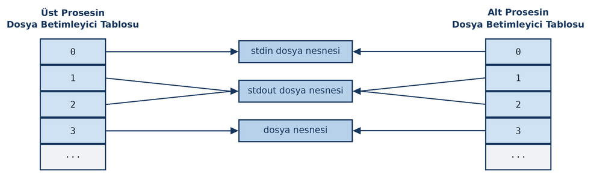
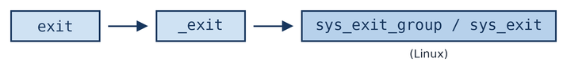
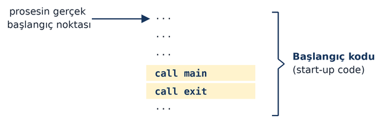

=======================================
Proseslerin Yaratılması ve Yok Edilmesi
=======================================

Anımsanacağı gibi işletim sistemlerinde çalışmakta olan programlara "proses" denilmektedir. Her proses başka bir proses 
tarafından yaratılmaktadır. Bu bölümde dikkatimizi prosesler üzerinde üzerine çevireceğiz. 

Proses ID (PID) Kavramı ve pid_t Türü
=====================================

UNIX/Linux sistemlerinde her prosesin o anda "sistem genelinde tek olan (*unique*)" bir *proses ID (PID)* değeri
vardır. PID değeri prosesin kontrol bloğuna erişmek için bir anahtar olarak kullanılmaktadır. Yani biz işletim 
sistemine bu PID değerini verdiğimizde işletim sistemi hızlı bir biçimde bu PID değerinden hareketle prosesin 
kontrol bloğuna erişebilmektedir.

PID değerleri ``pid_t`` türüyle temsil edilmiştir. POSIX standartlarına göre ``pid_t`` türü işaretli 
bir tamsayı türü olmak koşuluyla ``<sys/types.h>`` ve ``<unistd.h>`` dosyalarında typedef edilmiş olmak zorundadır. 
Bu türün hangi işaretli tamsayı türü olarak typedef edildiğinin programcı tarafından bilinmesine gerek ypktur. 

Sistem boot edildiğinde boot kodu ``0`` numaralı PID'ye sahip proses biçimine dönüştürülmektedir. Buna *swapper*
ya da *pager* da denilebilmektedir. Daha sonra da bu ``0`` numaralı PID bir daha sistemde kullanılmamaktadır.
(Yani ``0`` numaralı PID geçerli bir PID değildir.) Sistemde ikinci yaratılan proses ``1`` numaralı ID'ye sahip 
olan *init* ismiyle temsil edilen prosestir. ``0`` numaralı proses yok edildiği için sistemdeki bütün proseslerin 
atası bu *init* prosesidir. *init* prosesi arka planda bir *daemon* gibi çalışmaktadır. UNIX/Linux dünyasında 
terminal etkileşimi olmayan arka planda çalışan proseslere *daemon* denilmektedir. (Bu tür proseslere Windows 
dünyasında da *servis (service)* denilmektedir.)

İşletim sisteminin çekirdeği tipik olarak yeni yaratılan proses için proses PID değerini bir sayaç
kullanarak vermektedir. Her proses yaratıldığında bu sayaç değeri bir artırılır. Sayaç sona geldiğinde
yeniden başa geçilir ve bitmiş proseslerin PID'leri kullanılır. Örneğin sistem açıldığında ``1`` numaralı PID'ye
sahip *init* prosesi tarafından yaratılan proseslere artık sistem ``2``, ``3``, ``4``, ... PID'lerini vermektedir.
Proses PID değerlerinin belli bir anda sistemde tek olduğuna dikkat ediniz. Zaman içerisinde
bilgisayarınız uzun süre açık kalırsa sonlanmış olan eski PID değerleri yeniden kullanılacaktır.

PID'ler İçin Tavan Değeri
-------------------------

UNIX/Linux sistemlerinde genellikle PID değerleri için bir tavan değer de belirlenmektedir. Bu tavan
değere ulaşıldığında yukarıda da belirttiğimiz gibi yeniden başa dönülüp boş olan PID'ler kullanılmaktadır. 
Linux sistemlerinde default durumda PID tavan değeri 32768'dir. Bu değer sistem yöneticisi tarafından
değiştirilebilmektedir. Ancak yükseltilecek maksimum değer de önceden belirlenmiştir. Aşağıda bu değerleri
tablo halinde veriyoruz:

.. list-table::
   :header-rows: 1

   * - Sistem
     - PID_MAX_DEFAULT
     - PID_MAX_LIMIT (üst sınır)
   * - 32-bit
     - 32768
     - 32768 (0x8000)
   * - 64-bit
     - 32768
     - 4194304 (4*1024*1024)

Çalışan sistemdeki PID tavan değerini ``/proc/sys/kernel/pid_max`` dosyasından görüntüleyebilirsiniz.
Bunun için ``sysctl`` komutunu da kullanabilirsiniz:

.. list-table::
   :header-rows: 1

   * - Yöntem
     - Komut / Dosya
     - Açıklama
   * - Çalışma zamanı
     - ``/proc/sys/kernel/pid_max``
     - Sistemde o an geçerli üst sınır
   * - sysctl
     - ``sysctl kernel.pid_max``
     - Aynı değerin sysctl arayüzü
   * - Değiştirme
     - ``sysctl -w kernel.pid_max=N``
     - Root yetkisi gerekir

Her ne kadar çekirdekteki default değer ``32768`` olsa da *systemd* init sistemi açılış sırasında bu değeri
maksimum değer olan ``4194304`` değerine çekmektedir. Örneğin:

.. code-block:: console

    $ cat /proc/sys/kernel/pid_max
    4194304

Proses ID'lerine İlişkin Fonksiyonlar

getpid ve getppid Fonksiyonları
===============================

O anda çalışmakta olan programa ilişkin PID değeri ``getpid`` isimli POSIX fonksiyonu ile elde
edilebilmektedir:

.. code-block:: c

    #include <unistd.h>

    pid_t getpid(void);

Fonksiyon başarısız olamaz. Bu değeri şöyle yazdırabiliriz:

.. code-block:: c

    printf("%jd\n", (intmax_t)getpid());

``pid_t`` türünün gerçekte hangi tür olduğunu bilmediğimiz için onu sistemde olabilecek en büyük işaretli
tamsayı türünü temsil eden ``intmax_t`` türüne dönüştürdük.

.. code-block:: c

    #include <stdio.h>
    #include <stdint.h>
    #include <unistd.h>

    int main(void)
    {
        pid_t pid;

        pid = getpid();
        printf("%jd\n", (intmax_t)pid);

        return 0;
    }

Her proses başka bir proses tarafından yaratılmaktadır. Bir prosesi yaratan prosese o prosesin *üst
prosesi (parent process)*, yaratılan prosese de üst prosesin *alt prosesi (child process)* denilmektedir.
Her prosesin bir üst prosesi vardır. Bir prosesin üst prosesi ``getppid`` fonksiyonu ile elde
edilmektedir. Fonksiyonun prototipi şöyledir:

.. code-block:: c

    #include <unistd.h>

    pid_t getppid(void);

Bu fonksiyon da başarısız olamamaktadır.

Biz programı kabuk üzerinden çalıştırdığımızda çalıştırdığımız prosesin üst prosesi kabuk prosesi
(muhtemelen bash) olacaktır.

Bir prosesin üst prosesi sonlanırsa bu tür proseslere *öksüz (orphan) prosesler* denilmektedir. Sistem
böyle bir durumda ``1`` numaralı ID'ye sahip olan *init* ismiyle temsil ettiğimiz prosesi öksüz duruma düşmüş
prosesin üst prosesi olarak atamaktadır. Dolayısıyla her zaman prosesin bir üst prosesi bulunmaktadır.

.. code-block:: c

    #include <stdio.h>
    #include <stdint.h>
    #include <unistd.h>

    int main(void)
    {
        pid_t pid, ppid;

        pid = getpid();
        printf("pid = %jd\n", (intmax_t)pid);

        ppid = getppid();
        printf("ppid = %jd\n", (intmax_t)ppid);

        return 0;
    }

ps Komutu ile Proseslerin Görüntülenmesi
========================================

UNIX/Linux sistemlerinde o anda sistemde bulunan prosesler hakkında bilgiler ``ps`` isimli POSIX komutuyla
elde edilmektedir. Linux sistemlerinde ``ps`` komutu ``proc`` dosya sistemini kullanmaktadır. ``ps`` komutu
oldukça ayrıntılı bir komuttur ve pek çok seçeneğe sahiptir. Komutu seçeneksiz kullanırsak yalnızca çalışan
terminaldeki prosesler görüntülenmektedir. Örneğin:

.. code-block:: console

    $ ps
    PID TTY          TIME CMD
    9804 pts/0    00:00:00 bash
    10127 pts/0    00:00:00 ps

Kullanıcının bütün terminallerdeki proseslerini görmek için ``-u`` seçeneği kullanılmaktadır. ``-u``
seçeneğinin yanına kullanıcı ismi de getirilebilmektedir. Örneğin:

.. code-block:: console

    $ ps -u
    USER         PID %CPU %MEM    VSZ   RSS TTY      STAT START   TIME COMMAND
    kaan        9804  0.0  0.1  14276  5844 pts/0    Ss+  11:04   0:00 bash
    kaan       10094  0.0  0.1  14144  5664 pts/1    Ss   11:27   0:00 bash
    kaan       10131  200  0.1  16532  4728 pts/1    R+   11:35   0:00 ps -u

``-l`` seçeneği prosesler hakkında daha ayrıntılı bilgiler vermektedir. Örneğin:

.. code-block:: console

    $ ps -l
    F S   UID     PID    PPID  C PRI  NI ADDR SZ WCHAN  TTY          TIME CMD
    0 S  1000   10094    9793  0  80   0 -  3536 do_wai pts/1    00:00:00 bash
    4 R  1000   10139   10094  0  80   0 -  4142 -      pts/1    00:00:00 ps

Görüldüğü gibi ``-l`` seçeneği ile prosesin "etkin kullanıcı ID'si", "etkin grup ID'si", "üst proses
ID'si", "bağlantılı olduğu terminal" bilgileri de verilmektedir.

Sistemdeki tüm prosesleri ``-e`` seçeneğiyle görüntüleyebiliriz. Örneğin:

.. code-block:: console

    $ ps -e
    PID TTY          TIME CMD
      1 ?        00:00:02 systemd
      2 ?        00:00:00 kthreadd
      3 ?        00:00:00 pool_workqueue_release
      4 ?        00:00:00 kworker/R-rcu_gp
      5 ?        00:00:00 kworker/R-sync_wq
      6 ?        00:00:00 kworker/R-kvfree_rcu_reclaim
      7 ?        00:00:00 kworker/R-slub_flushwq
    ....

Belli bir terminalden çalıştırılmış olan prosesleri ``-t`` seçeneği ile görüntüleyebiliriz:

.. code-block:: console

    $ ps -t pts/1
      PID TTY          TIME CMD
    10094 pts/1    00:00:00 bash
    10168 pts/1    00:00:00 ps

Biz kursumuzda yeri geldikçe ``ps`` komutunun diğer bazı seçenekleri üzerinde de açıklamalar yapacağız.

Yaratılabilecek Proses ve Thread Sayısına İlişkin Limitler 
==========================================================

Sistemlerde prosesler konusunda bazı limitler söz konusu olabilmektedir. Çünkü her proses bir kaynak
kullanmaktadır. Bu kaynakların da bir limiti vardır. Örneğin Linux sistemlerinde, sistem genelinde aynı
anda var olabilecek toplam proseslerin sayısı (bunu proses ID'lerinin alabileceği tavan değerle
karıştırmayınız) ``/proc/sys/kernel/threads-max`` dosyasında belirtilmektedir. Burada belirtilen değer
*toplam proseslerin ve thread'lerin* sayısıdır. (Linux sistemlerinde aslında thread'ler de prosesler gibi 
kaynak kullanmaktadır. Çekirdek alanında proseslerle thread'ler aynı veri yapısıyla temsil edilmektedir.) 
Örneğin kursun yapıldığı sistemdeki aynı anda yaratılabilecek proseslerin ve thread'lerin maksimum sayısı 
şöyledir:

.. code-block:: console

    $ cat /proc/sys/kernel/threads-max
    30231

Bu değer ``sysctl`` komutu ile de elde edilebilir:

.. code-block:: console

    $ sysctl kernel.threads-max
    kernel.threads-max = 30231

Bu değer çalışmakta olan makinedeki fiziksel bellek miktarına bağlı olarak da değişebilmektedir. Bu değer
``proc`` dosya sistemi yoluyla ya da ``sysctl`` komutu ile değiştirilebilmektedir.

Yine UNIX/Linux sistemlerinde belli bir kullanıcının yaratabileceği maksimum proses ve thread sayısı da
sınırlandırılmaktadır. Eğer böyle bir sınırlandırma yapılmasaydı sıradan bir kullanıcı sistemdeki tüm
proses ve thread kapasitesini kendi başına kullanıp diğer kullanıcıları zor durumda bırakabilirdi.
Kullanıcının yaratabileceği maksimum proses ve thread sayısı ``getrlimit`` POSIX fonksiyonuyla ya da
``ulimit -u`` kabuk komutuyla elde edilebilir. Tabii uygun önceliğe sahip olan prosesler (proses ID'si ``0`` olan prosesler 
ve Linux sistemlerinde bu *yetenekliliğe (capability)* sahip olan prosesler) bu sınırlamaya tabi değildir. (Bu konu
ileride "process kaynak limitlerinin" anlatıldığı bölümde ayrıntılarıyla ele alınacaktır.) Uygun önceliğie sahip 
prosesler genel olarak kaynakların *hard limitlerini* yükseltebilmektedir. Aşağıda kursun yapıldığı sistemde sıradan
bir kullanıcının limiti gösterilmiştir:

.. code-block:: console

    $ ulimit -u
    15115

Ancak bu limitler de makineden makineye de değişebilmektedir. Çünkü sistemdeki fiziksel RAM miktarıyla da
ilişkilidir.

Bu değerler aslında o anda ya da kalıcı olarak değiştirilebilmektedir. Bu değerlerin boot edilene kadar
değiştirilmesi *proc* girişlerine yeni değerlerin yazılmasıyla ya da ``sysctl`` komutu ile de yapılabilir.
Kalıcı değişiklikler için sistem boot edilirken başvurulan bazı konfigürasyon dosyalarından
faydalanılmaktadır. Örneğin ``/etc/sysctl.conf`` dosyasına yeni limitler girilirse sistem bu limitlerle
açılacaktır.

Prosesleirn Yaratılması: fork Fonksiyonu
========================================

UNIX/Linux sistemlerinde prosesler ``fork`` isimli POSIX fonksiyonu ile yaratılmaktadır. ``fork``
fonksiyonu pek çok UNIX türevi sistemde doğrudan işletim sisteminin bu işi yapan sistem fonksiyonunu
çağırmaktadır. Linux sistemlerinde ``sys_fork`` ve bunun daha genel biçimi olan `
``sys_clone`` sistem fonksiyonları bu işi yapmaktadır. ``fork`` fonksiyonunun prototipi şöyledir:

.. code-block:: c

    #include <unistd.h>

    pid_t fork(void);

.. note::

    İngilizce ``fork`` sözcüğü Türkçe *çatal* anlamına gelmektedir. *Akışın çatallanması* gibi bir benzetmeye
    dayanılarak bu isim uydurulmuştur.

``fork`` bir prosesin tamamen özdeş bir kopyasını oluşturmaktadır. ``fork`` fonksiyonunun çalışmasını şöyle 
bir analoji ile daha iyi anlayabiliriz. Diyelim ki bir klonlama makinesi var. Bu makine insandaki tüm atomları 
bire bir kopyalayarak yeni bir klon oluşturuyor olsun. Bu durumda klonlama makinesine bir kişi girdiğinde makineden 
iki kişi çıkmaktadır. Makineden çıkan iki kişinin tüm geçmiş yaşantıları, her şeyi aynı olacaktır. Makineden 
çıktığında her iki kişi de kendini gerçek kopya sanabilir. Çünkü klonlama sırasında tüm atomlar (bellek 
mekanizması nöral düzeyde işlev görmektedir, nöronlar da neticede atomlardan oluşmaktadır) kopyalanmıştır. 
Makineden çıkan iki kişinin her şeyi aynıdır. Ancak makineden çıktıktan sonra artık bunlar farklı olaylarla 
karşılaşacağı için bellek ve deneyim olarak farklılaşacaklardır. Burada her ne kadar makineden çıkan iki 
kişi de kendisinin orijinal kopya olduğunu sanıyorsa da klonlamayı yapan operatör kimin orijinal kopya kimin 
onun kopyası olduğunu bilmektedir. 

İşte ``fork`` fonksiyonunun çalışması yukarıdaki analojiye çok benzemektedir. ``fork`` fonksiyonuna giren akış 
orada yeni ve özdeş bir prosesin yaratılmasına yol açmaktadır. Yeni yaratılan prosesin bellek alanı ve proses 
kontrol bloğu büyük ölçüde üst prosesten kopyalanmaktadır. Yeni yaratılan prosesin akışı ``fork`` içerisinden 
başlatılmaktadır. Böylece asıl proses ile yeni yaratılan prosesin her ikisi de ``fork`` fonksiyonundan çıkar. 
Asıl proses ile yeni yaratılan proses aynı bellek alanına (yani kabaca aynı *code*, *data*, *stack* ve *heap* 
alanlarına) sahiptir. ``fork`` çağrısını yapan asıl prosese *üst proses (parent process)*, ``fork`` ile 
yaratılan yeni prosese ise *alt proses (child process)* denilmektedir. Tabii üst proses de aslında ``fork`` 
çağrısı ile başka bir proses tarafından yaratılmıştır.

``fork`` fonksiyonunda kabaca şunlar yapılmaktadır:

| **1.** Alt proses için yeni bir proses kontrol bloğu yaratılır. ``fork`` işlemini yapan prosesin (üst proses)
   proses kontrol bloğunun içeriği yeni yaratılan prosesin (alt proses) proses kontrol bloğuna kopyalanır.
   Böylece üst proses ile yeni yaratılan alt proses tamamen aynı özelliklere sahip olmaktadır. Örneğin bu
   iki prosesin "etkin ve gerçek kullanıcı ve grup ID'leri", "çalışma dizinleri (current working
   directories)", "açmış olduğu dosyalara ilişkin bilgiler" aynı olur.

| **2.** Çekirdek alt proses için üst prosesin bellek alanının özdeş kopyasını oluşturur. Böylece her iki proses
   de içerik olarak aynı *kod* alanına, aynı *data* alanına, aynı *stack* alanına ve aynı *heap* alanına sahip olacaktır.
   Ancak bunlar birbirlerinden ayrıdır.

| **3.** Yeni yaratılan alt proses çalışmaya ``fork`` fonksiyonunun içinden başlar. Her iki akış da (yani
   ``fork`` uygulayan prosesin akışı ve yeni yaratılan alt prosesin akışı da) ``fork`` içerisinden çıkar. Üst
   proses ``fork`` fonksiyonundan alt prosesin proses ID'si ile çıkarken alt proses ``0`` ile çıkmaktadır.

Yukarıdaki işlemler ``fork`` fonksiyonunun içinde yapılmaktadır. ``fork`` fonksiyonundan hem bu fonksiyonu
çağıran proses hem de yeni yaratılan proses çıkmaktadır. Ancak bunların bellek alanları ayrı olduğu için
artık birinin yapacağı değişikliği diğeri görmeyecektir. ``fork`` fonksiyonu, bir klonlama yapmaktadır.
Yeni bir prosesi, kendi çağıran prosesle aynı özelliklerle ve aynı bellek alanı ile yaratmaktadır. ``fork``
sırasında prosesin kontrol bloğu yeni yaratılan prosese kopyalandığı için üst proses ile alt proses aynı
gerçek ve etkin kullanıcı ve grup ID'sine sahip olur. 

``fork`` işlemini yapan proses üst proses (parent process) durumundadır. Yeni yaratılan proses ise alt
proses (child process) durumundadır. Tabii alt proses yeni bir proses ID'ye sahip olacaktır. Alt prosesin
üst prosesi, ``fork`` fonksiyonu uygulayan proses olacaktır. 

``fork`` fonksiyonu başarısız olabilir. (Örneğin kaynak yetersizliği durumunda, kullanıcının proses yaratma 
limiti aşıldığı durumda ``fork`` başarısız olabilir.) ``fork`` başarısızlık durumunda ``-1`` değerine geri dönmektedir.

Peki yeni proses hangi noktada yaratılmaktadır? Tabii ``fork`` fonksiyonu içerisinde. Yukarıda da
belirttiğimiz gibi yeni yaratılan prosesin (alt prosesin) akışı da ``fork`` fonksiyonun içerisinden
başlatılacaktır. Bu durumda her iki proses de ``fork`` fonksiyonunun içerisinden çıkacaktır. İşte üst
proses (yani ``fork`` işlemini yapan proses) *alt prosesin ID* değeri ile, alt proses ise *0 değeri ile*
``fork`` fonksiyonundan çıkar. Böylece programcı ``fork`` çıkışında üst proses ile alt prosese farklı
işlemler yaptırabilmektedir. (Alt prosesin ``fork`` içerisinden ``0`` ile çıkması alt prosesin proses ID'sinin
``0`` olduğu anlamına gelmemektedir. Alt prosesin proses ID'si alt proses içerisinden ``getpid`` fonksiyonuyla
elde edilebilmektedir.)

fork Kullanımına İlişkin Tipik Kalıp
------------------------------------

``fork`` kullanımına ilişkin tipik kalıbı şöyledir:

.. code-block:: c

    pid_t pid;
    /* ... */

    if ((pid = fork()) == -1)
        exit_sys("fork");

    if (pid != 0) {        /* parent process */
        /* ... */
    }
    else {                /* child process */
        /* ... */
    }

Aşağıdaki örnekte ``fork`` fonksiyonu ile bir proses yaratılmış ve proses ID'ler üst ve alt proseslerde
yazdırılmıştır. Bu örnekte üst proseste ``fork`` fonksiyonunun alt prosesin proses ID değeri ile geri
döndüğüne dikkat ediniz. Denemenin yapıldığı makinede şöyle bir sonuç elde edilmiştir:

.. code-block:: text

    Parent PID: 549376
    Parent's parent PID: 536568
    fork return value: 549377
    common code...
    Child PID: 549377
    Child's parent PID: 549376
    Common code...

Görüldüğü gibi alt prosesin üst proses ID'si ile üst prosesin proses ID'si aynıdır. Programı kabuk
üzerinden çalıştırdığımız için üst prosesin üst proses ID'si kabuk prosesinin (tipik olarak bash) proses
ID'si olacaktır.

.. code-block:: c

    #include <stdio.h>
    #include <stdlib.h>
    #include <stdint.h>
    #include <unistd.h>

    void exit_sys(const char *msg);

    int main(void)
    {
        pid_t pid;

        if ((pid = fork()) == -1)
            exit_sys("fork");

        if (pid != 0) {        /* parent process */
            printf("Parent PID: %jd\n", (intmax_t)getpid());
            printf("Parent's parent PID: %jdd\n", (intmax_t)getppid());
            printf("fork return value: %jd\n", (intmax_t)pid);
        }
        else {                /* child process */
            printf("Child PID: %jd\n", (intmax_t)getpid());
            printf("Child's parent PID: %jd\n", (intmax_t)getppid());
        }

        printf("Common code...\n");

        sleep(1);

        return 0;
    }

    void exit_sys(const char *msg)
    {
        perror(msg);
        exit(EXIT_FAILURE);
    }

fork Sonrası Bellek Ayrışması ve Ortak Kod
------------------------------------------

``fork`` işleminde en fazla kafa karıştıran noktalardan biri ``fork`` fonksiyonundan iki akışın da çıkması
durumudur. Burada genellikle yeni öğrenenlerin gözden kaçırdığı birkaç nokta vardır:

| **1.** ``fork`` sırasında ``fork`` işlemini yapan prosesin (yani üst prosesin) tüm bellek alanının, yani onun
   kod, data, stack ve heap alanlarının özdeş bir kopyası oluşturulmaktadır. Yani ``fork`` işlemini yapan
   prosesin kod, data, stack ve heap alanlarının hepsi alt proseste de bulunmaktadır. Örneğin:

   .. code-block:: c

       if ((pid = fork()) == -1)
           exit_sys("fork");

       if (pid != 0) {
           /* ... */
       }
       else {
           /* ... */
       }

Programcının yazdığı bu kod hem üst proses hem de alt proses tarafından çalıştırılmaktadır. Yani bu
kod hem üst proseste hem de alt proseste bulunacaktır. Bizim buradaki temel amacımız ``fork`` çıkışında
kodu aynı olan iki farklı prosese farklı şeyleri yaptırmaktır. İşte bunu ``fork`` fonksiyonunun geri
dönüş değerini kontrol ederek sağlayabilmekteyiz.

| **2.** Yeni öğrenen kişilere iki prosesin de ``fork`` fonksiyonundan çıkması tuhaf gelebilmektedir. Aslında
   burada bir tuhaflık yoktur. Şöyle ki: Prosesin yaratılması ve bellek alanlarının kopyalanması zaten
   ``fork`` içerisinde yapılmaktadır. ``fork`` fonksiyonunu çağıran proses (üst proses) ``fork``'tan
   çıkacaktır. Kopyası çıkartılan alt prosesin çalışması da ``fork`` içerisinden başlatılmaktadır. Bu
   durumda alt proses de ``fork`` fonksiyonundan çıkacaktır. Çatallanmanın ``fork`` içerisinde
   yapıldığına dikkat ediniz.

Tabii ``fork`` fonksiyonundan çıkınca artık üst proses ile alt prosesin yaşamları farklı olabilmektedir.
Örneğin üst proses bir global değişkenin değerini değiştirse alt proses bunu değişmiş olarak görmez. Çünkü
o global değişkenin üst proseste ve alt proseste artık farklı kopyaları vardır. Üst proses kendi global
değişkenini değiştirmektedir. Yani ``fork`` işleminden çıkıldığında üst ve alt prosesin her şeyi aynı olsa
da artık bunlar kendi yollarına gideceklerdir. (Klon makinesinden çıkar çıkmaz iki kişinin her şeyi aynıdır. 
Ancak bundan sonra bu kişiler bağımsız kişiler oldukları için başlarına farklı olaylar gelecektir. Birisinin 
maruz kaldığı bir duruma diğeri maruz kalmayacaktır.)

Aşağıdaki örnekte ``fork`` işlemi sonrasında üst proses ``g_x`` global değişkenine yeni bir değer
atamıştır. Sonra alt proseste bu global değişkenin değeri yazdırılmıştır. Tabii alt proses üst prosesin
yaptığı bu değişikliği görmeyecektir. Çünkü aslında iki prosesin de bellek alanları tamamen ``fork``
içerisinde klonlama yöntemiyle ayrıştırılmıştır.

.. code-block:: c

    #include <stdio.h>
    #include <stdlib.h>
    #include <unistd.h>

    void exit_sys(const char *msg);

    int g_x = 10;

    int main(void)
    {
        pid_t pid;

        if ((pid = fork()) == -1)
            exit_sys("fork");

        if (pid != 0) {        /* parent process */
            g_x = 100;
        }
        else {                /* child process */
            sleep(1);
            printf("%d\n", g_x);    /* 10 */
        }

        printf("Common code...\n");

        sleep(1);

        return 0;
    }

    void exit_sys(const char *msg)
    {
        perror(msg);
        exit(EXIT_FAILURE);
    }

``fork`` işleminde yeni proses yaratıldığında hangi proses akışının ``fork`` fonksiyonundan önce
çıkacağının bir garantisi yoktur. Bu, işletim sisteminin çizelgeleme algoritmalarına bağlı olarak
değişebilmektedir.

Aşağıdaki örnekte *Common Code* yazısı ``8`` defa ekranda görünecektir:

.. code-block:: c

    fork();
    fork();
    fork();

    printf("Common code...\n");

Çünkü ilk ``fork`` işleminden sonra ikinci ``fork`` işlemini ``2`` proses yapacaktır. Böylece ikinci ``fork`` 
işleminden sonra aynı koda sahip ``4`` proses oluşacaktır. Sonra bu ``4`` proses de üçüncü ``fork`` işlemini yapacaktır. 
O halde üçüncü ``fork`` işleminden toplam ``8`` proses çıkacaktır. Buradaki ``sleep`` fonksiyonunu neden çağırdığımıza 
takılmayınız. Amacımız tüm yazma işlemleri bittikten sonra kabuğun prompt'una düşülmesini sağlamaktır. Kod karmaşık
olmasın diye ``fork`` çağrılarının geri dönüş değerlerini kontrol etmedik. Ancak uygulamada kontrol
etmelisiniz. Programı çalıştırdığımızda şöyle bir çıktı elde edeceğiz:

.. code-block:: text

    Common code...
    Common code...
    Common code...
    Common code...
    Common code...
    Common code...
    Common code...
    Common code...

.. code-block:: c

    #include <stdio.h>
    #include <unistd.h>

    int main(void)
    {
        fork();
        fork();
        fork();

        printf("Common code...\n");
        sleep(1);

        return 0;
    }

Benzer biçimde yine aşağıdaki kodda ekrana 8 tane 3 sayısı basılacaktır:

.. code-block:: c

    int a = 0;

    fork();
    ++a;
    fork();
    ++a;
    fork();
    ++a;

    printf("%d\n", a);

Burada prosesler aynı ``a`` değişkenini artırmamaktadır. ``fork`` işlemi ile proseslerin bellek alanları
kopyalandığı için her alt prosesin kendi ``a`` değişkeni vardır. Örneği bütün olarak aşağıda veriyoruz:

.. code-block:: c

    #include <stdio.h>
    #include <unistd.h>

    int main(void)
    {
        int a = 0;

        fork();
        ++a;
        fork();
        ++a;
        fork();
        ++a;

        printf("Common code: %d\n", a);
        sleep(1);

        return 0;
    }

fork İşleminde Dosya Betimleyici Tablosunun Durumu
--------------------------------------------------

``fork`` işlemi sırasında üst prosesin (``fork`` işlemini yapan prosesin) proses kontrol bloğunun yeni
yaratılan alt prosesin proses kontrol bloğuna kopyalandığını belirttik. Bu nedenle alt prosesin kullanıcı
ID'si, grup ID'si, çalışma dizini ve daha pek çok özellikleri üst prosesle aynı olacaktır. Peki alt
proseste dosya betimleyici tablosunun durumu ne olacaktır? Örneğin biz bir dosya açtıktan sonra ``fork``
yapmış olsak alt proseste bu dosyanın durumu ne olacaktır?

``fork`` işlemi sırasında işletim sistemi üst prosesin dosya betimleyici tablosu içerisindeki dosya
nesnelerinin adreslerini de alt prosesin dosya betimleyici tablosuna kopyalamaktadır. Ancak dosya
nesnelerinin kopyalarını çıkartmamaktadır. Böylece ``fork`` işleminin sonunda üst prosesin dosya
betimleyici tablosunun slotları ile alt prosesin dosya betimleyici tablosunun slotları aynı dosya
nesnesini gösteriyor durumda olur. Bu tür kopyalamalara *sığ kopyalama (shallow copy)* denildiğini
anımsayınız:

Mademki açık dosyaya ilişkin tüm bilgiler dosya nesnesinde tutulmaktadır, o halde örneğin ``fork`` işleminden
sonra örneğin proseslerden biri bir dosyanın dosya göstericisinin konumunu değiştirirse diğer proses de
bunu değişmiş olarak görecektir. Tabii ``fork`` işlemi sırasında dosya nesnelerinin referans sayaçları da
bir artırılmaktadır. Benzer biçimde aslında işin başında açık olan ``0``, ``1`` ve ``2`` numaralı betimleyiciler 
login işlemi öncesinde yaratılmış durumdadır. Her ``fork`` işleminde bu betimleyicilere ilişkin dosya
nesnelerinin kopyaları çıkartılmamaktadır. Prosesler aslında özel bir durum olmadıktan sonra hep aynı ``0``, ``1`` ve ``2``
numaralı dosya nesnelerini kullanmaktadır.

Aşağıdaki örnekte önce bir dosya açılmış sonra üst proses dosya göstericisini ``50``'nci offset'e
konumlandırmıştır. Üst prosesle alt proses aynı dosya nesnelerini gördüğü için bu durumdan alt proses
etkilenecektir. Alt proseste yapılan okuma ``50``'nci offset'ten itibaren yapılacaktır. Bu örnekte önce
``open`` fonksiyonuyla ``test.txt`` dosyası açılmıştır:

.. code-block:: c

    if ((fd = open("test.c", O_RDONLY)) == -1)
        exit_sys("open");

Sonra ``fork`` işlemi uygulanmıştır:

.. code-block:: c

    if ((pid = fork()) == -1)
        exit_sys("fork");

``fork`` işleminden sonra üst proseste dosya göstericisi konumlandırılmış ve alt proseste ``read``
fonksiyonu ile okuma yapılmıştır. Alt proses ``50``'nci offset'ten itibaren okumayı yapacaktır. Örneği
denerken ``test.txt`` dosyasının en az ``60`` karakter uzunluğunda bir text dosya olmasını sağlamalısınız.

Örneğimizde ``close`` işleminin hem üst proseste hem de alt proseste yapıldığına dikkat ediniz.
Dolayısıyla üst ve alt prosesler dosyayı kapattığında dosya nesnesinin referans sayacı azaltılacak, referans 
sayacı ``0``'a düştüğünde dosya nesnesi de silinecektir. 

.. code-block:: c

    #include <stdio.h>
    #include <stdlib.h>
    #include <fcntl.h>
    #include <unistd.h>

    void exit_sys(const char *msg);

    int main(void)
    {
        int fd;
        pid_t pid;
        char buf[10 + 1];
        ssize_t result;

        if ((fd = open("test.c", O_RDONLY)) == -1)
            exit_sys("open");

        if ((pid = fork()) == -1)
            exit_sys("fork");

        if (pid != 0) {
            lseek(fd, 50, SEEK_SET);
        }
        else {
            sleep(1);
            if ((result = read(fd, buf, 10)) == -1)
                exit_sys("read");
            buf[result] = '\0';
            puts(buf);
        }

        close(fd);

        sleep(1);

        return 0;
    }

    void exit_sys(const char *msg)
    {
        perror(msg);
        exit(EXIT_FAILURE);
    }

fork İşleminde Dosya Tamponların Durumu
---------------------------------------

C'nin standart dosya fonksiyonlarının tamponlama mekanizmasıyla çalıştığını görmüştük. Bu durumda
``fopen`` fonksiyonu ile açtığımız bir dosyaya bir şeyler yazıp henüz tampon flush edilmeden ``fork``
yaparsak üst prosesin tüm bellek alanının kopyası çıkartılacağı için bu tamponun da flush edilmemiş bir
kopyası oluşacaktır.

Örneğin ``fopen`` fonksiyonuyla bir dosyayı ``"r+"`` modunda açıp içerisinden okuma yapmış olalım. Tampon
okuma işlemi ile doldurulacaktır. Bu işlemden sonra ``fork`` yapmış olalım. Artık bu tamponun içeriği hem
üst proseste hem alt proseste bulunacaktır. Üst prosesin dosyanın tampondaki kısmına yeni yazmalar yapıp
dosyayı kapattığını düşünelim. Alt proses de daha sonra hiçbir işlem yapmadan dosyayı kapatmış olsun
(``exit`` işlemiyle zaten ``stdio`` dosyaları otomatik kapatılmaktadır.) Şimdi alt prosesin tamponu flush
edileceğinden üst prosesin yazdıkları ezilecektir. Eğer böyle bir durum programınızda oluşuyorsa ``fork``
işleminden önce dosyayı flush edebilirsiniz. Bu yukarıdaki sorunu engelleyecektir. Örneğin:

.. code-block:: c

    f = fopen("test.txt", "r+b");
    ch = fgetc(f);
    fflush(f);

    pid = fork();
    if (pid != 0) {
        fprinf(f, "test\n");
        /* ... */
    }
    else {
        /* ... */
        exit(EXIT_SUCCESS);
    }

Bu temsili kodda kontrolleri yapmadık. Burada üst proses tampona yazmış olsa da alt prosesteki tampon
temiz durumda olduğu için alt proseste dosya kapatıldığında flush işlemi yapılmayacaktır. Dolayısıyla
yukarıdaki anomali oluşmayacaktır. C standartlarına göre yalnızca tampona yazılan kısım (*unwritten data*)
flush işlemi sırasında asıl hedefe aktarılmaktadır.

Aşağıdaki örnekte ``printf`` fonksiyonu Linux sistemlerinde default durumda *satır tamponlamalı* olan
``stdout`` dosyasının tamponuna bilgileri yazmıştır. Ancak ``\n`` karakteri tampona yazılmadığı için flush
işlemi de yapılmamıştır. ``fork`` işlemi ile birlikte bu tamponun da kopyası çıkarılacağından dolayı
ekranda iki tane *Ok* yazısı görünecektir:

.. code-block:: c

    pid_t pid;

    printf("Ok");

    if ((pid = fork()) == -1)
        exit_sys("fork");

    printf("\n");

Burada tampondaki *Ok* yazısı henüz flush edilmemiştir. ``fork`` işlemi sonrasında ``'\n'`` dolayısıyla flush
yapıldığında hem üst prosesin hem de alt prosesin ``stdio`` tamponu flush edilecektir. Dolayısıyla ekrana iki
kez *Ok* yazısı basılacaktır. Örneği bir bütün olarak aşağıda veriyoruz:

.. code-block:: c

    #include <stdio.h>
    #include <stdlib.h>
    #include <unistd.h>

    void exit_sys(const char *msg);

    int main(void)
    {
        pid_t pid;

        printf("Ok");

        if ((pid = fork()) == -1)
            exit_sys("fork");

        printf("\n");

        return 0;
    }

    void exit_sys(const char *msg)
    {
        perror(msg);
        exit(EXIT_FAILURE);
    }

Proseslerin Sonlandırılması: _exit, exit ve abort Fonksiyonları
===============================================================

Şimdi de proseslerin nasıl sonlandırıldığını görelim. UNIX/Linux sistemlerinde prosesi sonlandırmak için
``_exit`` isimli POSIX fonksiyonu kullanılmaktadır. Bu fonksiyonun kullanımı C'nin standart ``exit`` fonksiyonuna
benzemektedir.

.. code-block:: c

    #include <unistd.h>

    void _exit(int status);

Fonksiyon, parametre olarak prosesin *çıkış kodunu (exit code)* almaktadır. Tabii bir proses sonlanmadan önce
prosesin sistem genelinde tahsis etmiş olduğu kaynaklar boşaltılmaktadır. Yani örneğin biz ``open``
fonksiyonu ile birtakım dosyalar açmışsak ``_exit`` işlemi sırasında bütün bu dosyalar kapatılacaktır, bu
dosyaların tuttuğu kaynaklar duruma göre serbest bırakılacaktır. Tabii ``_exit`` fonksiyonu yalnızca açık
dosyaları kapatmakla kalmaz, henüz görmediğimiz tahsis edilmiş olan başka kaynakları da boşaltmaktadır.
Linux sistemlerinde ``_exit`` fonksiyonu doğrudan işletim sisteminin ``sys_exit_group`` ya da ``sys_exit``
isimli sistem fonksiyonunu çağırmaktadır. Tabii asıl prosesin sonlandırılması bu sistem fonksiyonu
tarafından yapılmaktadır. Yine geleneksel olarak başarılı sonlanmalar için 0 değeri, başarısız sonlanmalar
için sıfır dışı değerler kullanılmaktadır. Peki bir program çökerek sonlandığında ne olmaktadır? Aslında
programın çökerek sonlanması kontrolsüz bir biçimde sonlanması anlamına gelmemektedir. UNIX/Linux
sistemlerinde çökme tabir edilen durumlar aslında bir sinyal oluşturmaktadır. Program çökse de işletim
sistemi tarafından onun tuttuğu kaynaklar yine boşaltılmaktadır. Yani çökme (crash olma) kullanıcının
algıladığı bir durumdur. İşletim sistemi çöken programlarda yine devreye girip gereken boşaltmaları
yapmaktadır.

C'nin standart ``exit`` fonksiyonunun da prototipi şöyledir:

.. code-block:: c

    #include <stdlib.h>

    void exit(int status);

C'nin ``exit`` fonksiyonu prosesin sonlandırılması için UNIX/Linux sistemlerinde aslında ``_exit`` POSIX
fonksiyonunu çağırmaktadır:

``exit`` standart C fonksiyonu, standart C kütüphanesi için yapılan bazı işlemleri de geri almaktadır.
Örneğin ``exit`` fonksiyonu önce ``atexit`` fonksiyonu ile kaydettirilmiş olan fonksiyonları ters sırada
çağırır, sonra ``tmpfile`` fonksiyonu ile yaratılmış geçici dosyaları siler ve dosya bilgi göstericilerine
(streams) ilişkin tamponları flush eder, sonra da bunları kapatır. Eğer prosesinizi ``exit`` standart C
fonksiyonu yerine ``_exit`` POSIX fonksiyonu ile sonlandırırsanız proses sonlanırken bu işlemlerin
hiçbiri yapılmayacaktır.

C Programının Gerçek Başlangıç Noktası (start-up code)
------------------------------------------------------

C'de aslında ilk çalışan kod ``main`` fonksiyonunun kodu değildir. C derleyicileri ismine *başlangıç kodu
(start-up code)* denilen bir kodu da programa eklemektedir. Programın gerçek başlangıç noktası
derleyicinin yerleştirdiği bu başlangıç kodundan yapılmaktadır. Bu başlangıç kodu ``main`` fonksiyonunu
çağırmaktadır. C'de programcı, program içerisinde ``exit`` fonksiyonunu hiç çağırmamışsa akış ``main``
fonksiyonunu bitirdiğinde ``main`` fonksiyonunun geri dönüş değeri ile ``exit`` fonksiyonu çağrılmaktadır.
Yani C'de ``main`` fonksiyonu derleyici tarafından adeta ``exit(main())`` gibi çağrılmaktadır.
Derleyicinin ürettiği kodu şöyle temsil edebiliriz:

Yani C'de aslında tüm program sonlandırmaları her zaman ``exit`` (ya da ``abort``) fonksiyonu ile
yapılmaktadır. ``exit`` fonksiyonu yukarıda da belirttiğimiz gibi kütüphaneye ilişkin bazı son işlemleri
yaptıktan sonra UNIX/Linux sistemlerinde ``_exit`` POSIX fonksiyonunu çağırmaktadır. 

C standartlarına göre ``main`` fonksiyonunun sonunda ``return`` deyimi bulundurulmamışsa ``return 0`` yapılmış 
gibi işlem uygulanmaktadır. Örneğin:

.. code-block:: c

    int main(void)
    {
        /* ... */
    }

Burada ``main`` fonksiyonunun sonunda ``return`` uygulanmamıştır. Yani akış eğer buraya ulaşırsa ``main``
fonksiyonu ``0`` geri dönüş değeri ile sonlanacaktır. ile geri döndürüldüğü kabul edilmektedir. ``main`` dışındaki herhangi 
bir fonksiyonda ``return`` uygulanmazsa geri dönüş değeri çöp değer olarak elde edilmektedir.

Derleyicilerin başlangıç kodları genellikle açık olmayan derleyicilerde bile kaynak kod olarak
verilmektedir. Başlangıç kodları ayrı bir ya da birden fazla amaç dosya biçiminde derlenmiştir ve bağlama
aşamasında bu amaç dosyalar da bağlama işlemine sokulmaktadır. Örneğin:

.. code-block:: console

    $ gcc -o sample sample.c

Burada aslında ``gcc`` ``sample.c`` dosyasını derleyip ``sample.o`` dosyasını elde ettikten sonra ``ld``
bağlayıcısını yalnızca bu dosyayla değil bir grup başlangıç amaç dosyasıyla birlikte çağırmaktadır.

C'nin ``abort`` fonksiyonu ise *normal olmayan (abnormal)* sonlandırmalar için kullanılmaktadır.
UNIX/Linux sistemlerinde ``abort`` standart C fonksiyonu ``SIGABRT`` sinyali oluşturarak programı
sonlandırmaktadır. Programın sonlanması bu sinyal dolayısıyla gerçekleşmektedir. Sinyaller konusu ileride
ayrı bölümde ele alınacaktır.

Yukarıda da belirttiğimiz gibi C'de programlar, standart ``exit`` fonksiyonu ile sonlandırılmalıdır. Çünkü
``exit`` fonksiyonu bazı gerekli son işlemleri de yapmaktadır. Ancak yine de bazen programın doğrudan
``_exit`` POSIX fonksiyonu ile sonlandırılması da gerekebilmektedir. Bu gerekliliğe ilişkin örneklerle
sonraki konularımızda karşılaşacağız.

UNIX/Linux sistemlerinde prosesler ``_exit``, ``exit`` ve ``abort`` çağrılarının dışında sinyaller (signals) yoluyla da 
sonlanmaktadır. Örneğin abort aslında sonlandırmayı böyle yapmaktadır. Sinyaller konusu kitabımızda 
ayrı bir bölümde ele alınmaktadır. 

Aşağıdaki örnekte program ``exit`` fonksiyonu ile değil ``_exit`` fonksiyonu ile sonlandırılmıştır. Bu
nedenle ``atexit`` ile kaydedilen ``foo`` ve ``bar`` fonksiyonları program sonlanırken çağrılmayacaktır.
Aynı zamanda dosya tamponları da flush edilmeyeceğinden dolayı ``printf`` fonksiyonu ile ekrana yazılmak
istenen ancak satır tamponlaması nedeniyle henüz yazılamayan *ok* yazısı da ekranda görülmeyecektir.
Burada ``_exit`` çağrısını kaldırırsanız, akış ``main`` fonksiyonunu bitirince ``exit`` standart C
fonksiyonu çağrılacağı için bir sorun kalmayacaktır.

.. code-block:: c

    #include <stdio.h>
    #include <stdlib.h>
    #include <unistd.h>

    void foo(void)
    {
        fprintf(stderr, "foo\n");
    }

    void bar(void)
    {
        fprintf(stderr, "bar\n");
    }

    int main(void)
    {
        atexit(foo);
        atexit(bar);

        printf("ok");

        _exit(0);

        return 0;
    }

Linux'ta aslında ``_exit`` fonksiyonu işletim sisteminin ``sys_exit`` sistem fonksiyonunu değil
``sys_exit_group`` sistem fonksiyonunu çağırmaktadır. Linux'ta ``sys_exit`` sistem fonksiyonu yalnızca
fonksiyonu çağıran thread'i, ``sys_exit_group`` fonksiyonu ise tüm thread'leri, dolayısıyla da prosesi
sonlandırmaktadır.

wait Fonksiyonları
==================

``exit`` ve ``_exit`` fonksiyonunun parametresi olan prosesin çıkış kodu işletim sistemi tarafından kullanılmamaktadır.
ilgilendirmemektedir. Bunu prosesi yaratan üst proses isterse ona verir.  prosesin hangi çıkış koduyla sonlandığıyla 
işletim sistemi ilgilenmez. Çıkış kodunun değeri üst prosesle alt prosesin arasındaki bir anlaşma ile anlam kazanmaktadır.

Üst proses ``fork`` fonksiyonu ile alt prosesi yarattıktan sonra onun sonlanmasını bekleyebilir ve alt
proses sonlandığında onun çıkış kodunu alabilir. Bunun için ``wait`` ve ``waitpid`` isimli POSIX
fonksiyonları kullanılmaktadır. ``waitpid`` fonksiyonu ``wait`` fonksiyonunu işlevsel olarak
kapsamaktadır. (Zaten önce ``wait`` fonksiyonu vardı, onun yetersizlikleri görülünce ``waitpid``
fonksiyonu tasarlandı.)

``wait`` fonksiyonunun prototipi şöyledir:

.. code-block:: c

    #include <sys/wait.h>

    pid_t wait(int *status);

``wait`` fonksiyonu herhangi bir alt proses sonlanana kadar kendisini çağıran thread'i blokede 
bekletir. Burada blokede bekleme terimi CPU zamanı harcamadan uykuda kalmayı belirtmektedir. Tabii
``wait`` fonksiyonu çağrıldığında alt proseslerden biri zaten sonlanmış da olabilir. Bu durumda ``wait``
fonksiyonu blokeye (yani beklemeye) yol açmaz. ``wait`` fonksiyonu başarı durumunda çıkış kodunu aldığı
prosesin ID değeri ile geri döner. Böylece programcı çok sayıda alt prosesin söz konusu olduğu
durumda hangi alt prosesin çıkış kodunu aldığını geri dönüş değerinden hareketle anlayabilmektedir. Fonksiyon
parametresiyle aldığı ``int`` nesnesinin içerisine sonlanan prosesin çıkış kodunu ve sonlanma nedenine
ilişkin bazı bilgileri yerleştirmektedir.

Normal biçimde sonlanmamış (yani bir sinyal ile sonlanmış) proseslerde çıkış kodu oluşmamaktadır. O halde
programcının prosesin çıkış kodunu alabilmesi için onun normal bir biçimde sonlanmış olduğunu belirlemesi
gerekir. İşte ``<sys/wait.h>`` içerisindeki ``WIFEXITED`` makrosu ile bu belirleme yapılabilmektedir. Bu
makroya ``wait`` fonksiyonuna geçirilmiş olan ``int`` nesne verilir. Makro bu nesnenin bazı bitlerinden
alt prosesin normal sonlanıp sonlanmadığını anlar ve eğer alt proses normal bir biçimde sonlanmışsa sıfır
dışı herhangi bir değere, normal bir biçimde sonlanmamışsa sıfır değerine geri döner. Benzer biçimde biz
prosesin anormal bir biçimde bir sinyal dolayısıyla sonlanıp sonlanmadığını da ``WIFSIGNALED`` makrosuyla
tespit edebiliriz. Proses ``SIGSTOP`` sinyali ile geçici süre durdurulmuş da olabilir. Bu durum da
``WIFSTOPPED`` makrosu ile tespit edilebilmektedir. Prosesin çıkış kodu ise ``WEXITSTATUS`` makrosuyla
elde edilmektedir. Yine bu makroya ``wait`` fonksiyonuna adresi geçirilen ``int`` nesne argüman olarak
verilmektedir. Güncel POSIX standartlarında artık ``wait`` fonksiyonunda iletilen durum (status)
bilgisinin en düşük anlamlı 1 byte'ının çıkış kodunu içerdiği açıkça belirtilmektedir. (Her ne kadar
``exit`` standart C fonksiyonunun çıkış kodunu belirten parametresi ``int`` türden olsa da POSIX
standartlarında çıkış kodu için belirtilen değer [0, 255] arasında olmak zorundadır.) Programcı ``wait``
fonksiyonuna argüman olarak ``NULL`` adres de geçebilir. Bu durumda fonksiyon çıkış koduyla ilgili bir
yerleştirme yapmaz. Ancak yine ilk alt prosesin bitmesini bekler.

Eğer ``wait`` fonksiyonu çağrıldığında zaten üst prosesin yarattığı herhangi bir alt proses yoksa ya da 
fonksiyona geçersiz bir adres geçilmişse fonksiyon başarısız olacaktır. 

``wait`` fonksiyonunun tasarımında şu problemler vardır:

- ``wait`` fonksiyonu ile biz belli bir alt prosesi bekleyememekteyiz. ``wait`` fonksiyonu çağrıldığında 
henüz hiçbir alt proses sonlanmamışsa ``wait`` ilk sonlanan alt prosesin çıkış kodunu alır.

- ``wait`` fonksiyonu çağrıldığında eğer zaten birden fazla alt proses sonlanmış durumdaysa POSIX 
standartları hangi alt prosesin ``exit`` kodunun elde edileceği konusunda bir garanti vermemektedir. 
Yani bu durumda ``wait`` fonksiyonunun ilk sonlanan alt prosesin çıkış kodunu alması garanti 
edilmemiştir.

Aşağıdaki örnekte üst proses ``fork`` fonksiyonu ile alt prosesi yaratmıştır ve ``wait`` fonksiyonu 
ile onu beklemiştir. Alt proses normal bir biçimde sonlanmışsa onun çıkış kodunu alıp ekrana 
yazdırmıştır.

.. code-block:: c

    #include <stdio.h>
    #include <stdlib.h>
    #include <unistd.h>
    #include <sys/wait.h>

    void exit_sys(const char *msg);

    void child_proc(void)
    {
        for (int i = 0; i < 10; ++i) {
            printf("child running: %d\n", i);
            sleep(1);
        }

        exit(100);
    }

    int main(void)
    {
        pid_t pid;
        int status;

        if ((pid = fork()) == -1)
            exit_sys("fork");

        if (pid == 0)
            child_proc();

        printf("parent waiting for the child to exit...\n");

        if (wait(&status) == -1)
            exit_sys("wait");

        if (WIFEXITED(status))
            printf("child exited with exit code %d\n", WEXITSTATUS(status));

        printf("Ok, parent continues running...\n");

        return 0;
    }

    void exit_sys(const char *msg)
    {
        perror(msg);
        exit(EXIT_FAILURE);
    }

===============================================
waitpid, Zombie Prosesler ve Çevre Değişkenleri
===============================================

wait Fonksiyonu ile Bekleme Yapmadan Örnek
==========================================

Aşağıdaki örnekte ise üst proses ``wait`` fonksiyonu çağırmadan alt proses sonlanmıştır. Tabii bu durumda
üst proses hiç beklemeden alt prosesin çıkış kodunu alıp yoluna devam edecektir.

.. code-block:: c

    #include <stdio.h>
    #include <stdlib.h>
    #include <unistd.h>
    #include <sys/wait.h>

    void exit_sys(const char *msg);

    void child_proc(void)
    {
        printf("child terminates...\n");

        exit(100);
    }

    int main(void)
    {
        pid_t pid;
        int status;

        if ((pid = fork()) == -1)
            exit_sys("fork");

        if (pid == 0)
            child_proc();

        for (int i = 0; i < 10; ++i) {
            printf("parent running: %d\n", i);
            sleep(1);
        }

        if (wait(&status) == -1)
            exit_sys("wait");

        if (WIFEXITED(status))
            printf("child exited with exit code %d\n", WEXITSTATUS(status));

        printf("Ok, parent continues running...\n");

        return 0;
    }

    void exit_sys(const char *msg)
    {
        perror(msg);
        exit(EXIT_FAILURE);
    }

Çoklu Alt Proseslerin wait ile Beklenmesi
=========================================

Tabii üst proses ne kadar ``fork`` yapmışsa o kadar sayıda ``wait`` yapmalıdır. Çünkü her ``wait``
fonksiyonu yalnızca tek bir alt prosesin sonlanma bilgilerini alacaktır.

.. code-block:: c

    #include <stdio.h>
    #include <stdlib.h>
    #include <stdint.h>
    #include <unistd.h>
    #include <sys/wait.h>

    #define NCHILDS     10

    void exit_sys(const char *msg);

    void child_proc(int ecode)
    {
        sleep(1);
        for (int i = 0; i < 10; ++i) {
            printf("child running: %d\n", i);
            sleep(1);
        }

        exit(ecode);
    }

    int main(void)
    {
        pid_t pid, pid_wait;
        int status;

        for (int i = 0; i < NCHILDS; ++i) {
            if ((pid = fork()) == -1)
                exit_sys("fork");
            if (pid == 0)
                child_proc(100 + i);
            printf("process created with pid %jd\n", (intmax_t)pid);
        }

        for (int i = 0; i < NCHILDS; ++i) {
            if ((pid_wait = wait(&status)) == -1)
                exit_sys("wait");
            if (WIFEXITED(status))
                printf("child pid %jd exited with exit code %d\n", (intmax_t)pid_wait, WEXITSTATUS(status));
        }

        printf("Ok, parent continues running...\n");

        return 0;
    }

    void exit_sys(const char *msg)
    {
        perror(msg);
        exit(EXIT_FAILURE);
    }

waitpid Fonksiyonu
==================

``waitpid`` fonksiyonu ``wait`` fonksiyonunun daha gelişmiş bir biçimidir. Fonksiyonun prototipi şöyledir:

.. code-block:: c

    #include <sys/wait.h>

    pid_t waitpid(pid_t pid, int *status, int options);

Fonksiyonun birinci parametresi beklenecek alt prosesin proses ID değerini belirtir. Bu sayede programcı
belli bir alt prosesi bekleyebilmektedir. Bu birinci parametre aslında birkaç biçimde geçilebilmektedir.
Eğer bu parametreye programcı pozitif değerde bir proses ID geçerse fonksiyon proses id'si geçirilen
değer olan o alt prosesi bekleyecektir. (Tabii bu parametreye geçirilen proses ID, o prosesin bir alt
prosesi değilse fonksiyon hemen başarısız olmaktadır.) Eğer bu parametre negatif bir proses ID değeri
geçilirse bu durumda fonksiyon proses grup ID'si bu değerin pozitifi olan herhangi bir alt prosesi
beklemektedir. Eğer bu parametre -1 olarak geçilirse bu durumda fonksiyon tamamen ``wait``
fonksiyonundaki gibi davranmaktadır. Yani herhangi bir alt prosesi beklemektedir. Eğer bu parametreye 0
değeri geçilirse fonksiyon, proses grup ID'si kendisini çağıran prosesin ID'si ile aynı olan herhangi bir
alt prosesi beklemektedir.

pid Parametresinin Anlamı
-------------------------

Bu parametrenin alabileceği değerleri aşağıda bir tablo biçiminde de veriyoruz:

.. list-table::
   :header-rows: 1

   * - pid Değeri
     - Beklenen Alt Proses
   * - pid > 0
     - Proses ID'si pid olan alt proses
   * - pid == 0
     - Proses grup ID'si çağıranla aynı olan herhangi bir alt proses
   * - pid == -1
     - Herhangi bir alt proses (wait ile eşdeğer)
   * - pid < -1
     - Proses grup ID'si \|pid\| olan herhangi bir alt proses

options Parametresi
-------------------

Fonksiyonun ikinci parametresi sonlanma nedeninin ve çıkış kodunun yerleştirileceği ``int`` türden
nesnenin adresini almaktadır. Üçüncü parametre bazı özel değerlerin bit düzeyinde OR'lanmasıyla
oluşturulabilmektedir:

- ``WNOHANG``: Bu durumda ``waitpid`` eğer alt proses henüz sonlanmamışsa bekleme yapmaz, fonksiyon 0 ile
  geri döner.
- ``WUNTRACED``, ``WCONTINUED``: Prosesin durdurulması ve devam ettirilmesi ile ilgili bilginin elde
  edilmesinde kullanılmaktadır.

Aşağıdaki tabloda son parametre için kullanılabilecek bayrakların listesini veriyoruz:

.. list-table::
   :header-rows: 1

   * - Seçenek
     - Anlamı
     - Standart
   * - 0
     - Bir alt proses sonlanana kadar bloke olunur
     - POSIX
   * - ``WNOHANG``
     - Durumu değişen alt proses yoksa bloke olmadan 0 ile dönülür
     - POSIX
   * - ``WUNTRACED``
     - Durdurulmuş alt prosesler için de bilgi elde edilir
     - POSIX
   * - ``WCONTINUED``
     - SIGCONT ile devam ettirilen alt prosesler için de kullanılır
     - POSIX
   * - ``__WCLONE``
     - Yalnızca sonlanınca SIGCHLD göndermeyen alt prosesler
     - Linux
   * - ``__WALL``
     - Türüne bakılmaksızın tüm alt prosesler beklenir
     - Linux
   * - ``__WNOTHREAD``
     - Aynı thread grubundaki diğer thread'lerin yarattığı alt prosesler beklenmez
     - Linux

Tabii bu üçüncü parametre genellikle 0 geçilmektedir. 0 geçilmesi bu bayraklardan hiçbirinin
kullanılmadığı anlamına gelmektedir. O halde aslında ``wait(&status)`` çağrısı ile
``waitpid(-1, &status, 0)`` çağrısı eşdeğerdir. Gördüğünüz gibi ``waitpid`` fonksiyonu tamamen ``wait``
fonksiyonunu işlevsel olarak kapsamaktadır.

``waitpid`` fonksiyonunda da ikinci parametre için ``NULL`` adres geçilebilir. Bu durumda proses beklenir
ama çıkış bilgileri elde edilmez.

``waitpid`` fonksiyonu da tıpkı ``wait`` fonksiyonunda olduğu gibi başarı durumunda beklenen proses ID
değeri ile, başarısızlık durumunda -1 değeriyle geri dönmektedir.

waitpid Kullanım Örnekleri
--------------------------

Örneğin:

.. code-block:: c

    if ((pid = fork()) == -1)
        exit_sys("fork");

    /* ... */

    if (waitpid(pid, &status, 0) == -1)
        exit_sys("waitpid");

Burada ``waitpid`` fonksiyonu ile alt prosesin PID değeri belirtilerek bekleme yapılmıştır. Örneğin:

.. code-block:: c

    if ((child_pid = waitpid(pid, &status, WNOHANG)) == -1)
        exit_sys("waitpid");

    if (child_pid == 0)
        printf("no child exited...\n");

Burada ``WNOHANG`` bayrağının kullanıldığına dikkat ediniz. Bu bayrak, ``waitpid`` fonksiyonu ile beklenen
alt proses henüz sonlanmamışsa fonksiyonun 0 ile geri dönmesine yol açmaktadır.

Aşağıdaki örnekte 5 tane alt proses yaratılmış, ancak bunlar herhangi bir sırada değil yaratım sırasına
göre ``waitpid`` fonksiyonu ile beklenmiştir. Bu örneği ``waitpid`` yerine ``wait`` fonksiyonunu
kullanarak da çalıştırıp iki çıktı arasındaki farka bakabilirsiniz.

.. code-block:: c

    #include <stdio.h>
    #include <stdlib.h>
    #include <unistd.h>
    #include <sys/wait.h>

    #define NCHILDS        5

    void exit_sys(const char *msg);

    void child_proc(int val)
    {
        srand(val);

        sleep(rand() % 5 + 1);

        exit(val);
    }

    int main(void)
    {
        pid_t pids[NCHILDS];
        int status;

        printf("parent is waiting for childs to exit...\n");

        for (int i = 0; i < NCHILDS; ++i) {
            if ((pids[i] = fork()) == -1)
                exit_sys("fork");
            if (pids[i] == 0)
                child_proc(100 + i);
        }

        for (int i = 0; i < NCHILDS; ++i) {
            if (waitpid(pids[i], &status, 0) == -1)
                exit_sys("wait");
            if (WIFEXITED(status))
                printf("child exited with exit code %d\n", WEXITSTATUS(status));
        }

        printf("Ok, parent continues running...\n");

        return 0;
    }

    void exit_sys(const char *msg)
    {
        perror(msg);
        exit(EXIT_FAILURE);
    }

Programcının ``fork`` fonksiyonu ile her yarattığı alt prosesi ``wait`` fonksiyonları ile beklemesi iyi
bir tekniktir. Aksi halde sonraki paragrafta ele alacağımız gibi *hortlak (zombie)* proses problemi
oluşabilmektedir.

Kabuğun Çıkış Kodu ($?)
=======================

Biz kabuk üzerinden program çalıştırdığımızda ``fork`` işlemini kabuk uygulamaktadır. Dolayısıyla
çalıştırılan programın çıkış kodunu da üst proses olan kabuk almaktadır. İşte biz ``$?`` ile kabuk
üzerinde son çalıştırılan programın çıkış kodunu elde edebiliriz. Örneğin:

.. code-block:: console

    $ ./sample
    $ echo $?
    100

Zombie (Hortlak) Proses Kavramı
===============================

UNIX/Linux sistemlerinde prosesler konusunda çokça karşılaşılan *zombie (hortlak)* proses biçiminde bir
kavram vardır. Zombie sözcük anlamı olarak *tam ölememiş ya da öldükten sonra dirilmiş olan canlılar* için
kullanılmaktadır. (Tabii gerçek dünyada böyle bir durumla karşılaşılmamıştır.) Bir alt proses
sonlandığında işletim sistemi onun kaynaklarını boşaltmaktadır. Örneğin prosesin bellek alanı tamamen
sisteme iade edilmektedir. Prosesin açmış olduğu dosyalar kapatılmaktadır. Ancak işletim sistemi, alt
prosesin çıkış kodunu üst prosese iletebilmek için proses kontrol bloğunu proses bittiğinde hemen serbest
bırakmamaktadır. Prosesin çıkış kodu proses kontrol bloğunda saklanmaktadır. İşletim sistemi *üst proses
bu çıkış kodunu herhangi bir zaman isteyebilir* diye sonlanmış olan prosesin proses kontrol bloğunu
(Linux'taki ``task_struct`` yapısı) sisteme iade etmez. Böylece bir alt proses bittiğinde eğer üst proses
``wait`` fonksiyonlarıyla alt prosesin exit kodunu henüz almamışsa *kendisi bitmiş ama proses kontrol
bloğu sisteme iade edilmemiş* durumu oluşmaktadır. İşte bu duruma UNIX/Linux dünyasında *zombie process*
denilmektedir. Zombie proseslerde prosesin ID değeri de *üst proses wait ya da waitpid fonksiyonunu
kullanabilir* diye sisteme iade edilmemektedir. Yani zombie proses oluşması, bitmiş olan prosesin proses
kontrol bloğunun yer kaplamasına hem de bitmiş olan prosesin ID değerinin yeniden kullanılamamasına yol
açmaktadır.

Alt/Üst Proses Sonlanma Senaryoları
-----------------------------------

Alt ve üst proseslerin sonlanması şu biçimlerde olabilmektedir:

1. Üst proses alt prosesten önce sonlanmış olabilir. Bu durumda alt proses *öksüz (orphan)* duruma düşer.
   Sistem de 1 numaralı ID'ye sahip olan *init* prosesini öksüz prosesin üst prosesi olarak atar. Daha
   sonra alt proses sonlandığında *init* prosesi alt prosesin exit kodunu alarak onun zombie duruma
   düşmesini engeller.

2. Alt proses üst prosesten daha önce sonlanmıştır. İşte bu durumda eğer üst proses ``wait``
   fonksiyonlarını henüz uygulamamışsa alt proses zombie durumda kalır. Tabii üst proses ``wait``
   fonksiyonlarını uyguladığı anda alt proses zombie olmaktan kurtulur.

3. Alt proses üst prosesten önce sonlanmıştır. Ancak üst proses de ``wait`` fonksiyonlarını uygulamadan
   sonlanmıştır. Bu durumda yine işletim sistemi artık çıkış kodunu alacak bir üst proses kalmadığı için
   alt prosesi zombie olmaktan çıkartır. Yani onun proses kontrol bloğunu ve ID değerini serbest bırakır.

O halde zombie proses yalnızca şu süreçte ortaya çıkmaktadır: *Alt proses sonlanmıştır ancak üst proses
wait fonksiyonlarını uygulamadan çalışmasına devam etmektedir.*

Zombie Proses Oluşturma Örneği
------------------------------

Şimdi bir *zombie* proses durumu oluşturalım. Yapacağımız şey alt prosesi sonlandırıp üst prosesin
``wait`` fonksiyonlarını uygulamadan yoluna devam etmesini sağlamaktır. Zombie prosesler *"ps -l"*
komutunda *defunct* olarak gösterilmektedir. Bunların *proses durumları da (process state)* *Z* harfi ile
belirtilmektedir. Örneğin:

.. code-block:: console

    $ ps -la
    F S   UID     PID    PPID  C PRI  NI ADDR SZ WCHAN  TTY          TIME CMD
    0 S  1000   10612    1868  0  80   0 -   622 hrtime pts/1    00:00:00 sample
    1 Z  1000   10613   10612  0  80   0 -     0 -      pts/1    00:00:00 sample <defunct>
    4 R  1000   10621    1618  0  80   0 -  3540 -      pts/0    00:00:00 ps

.. code-block:: c

    #include <stdio.h>
    #include <stdlib.h>
    #include <unistd.h>

    void exit_sys(const char *msg);

    int main(void)
    {
        pid_t pid;

        if ((pid = fork()) == -1)
            exit_sys("fork");

        if (pid != 0) {            /* üst proses */
            for (int i = 0; i < 60; ++i) {
                printf("parent process continues running: %d\n", i);
                sleep(1);
            }
        }
        else {                    /* alt proses */
            printf("child terminates...\n");

            exit(EXIT_SUCCESS);
        }

        return 0;
    }

    void exit_sys(const char *msg)
    {
        perror(msg);
        exit(EXIT_FAILURE);
    }

Zombie Prosesin Yarattığı Sorunlar
----------------------------------

Yukarıda da belirttiğimiz gibi zombie proses oluşmasının yarattığı sorunlar şunlardır:

1. Üst prosesin ömrü fazla değilse genellikle üst prosesin zombie proses oluşturması ciddi bir soruna
   yol açmaz. Ancak üst proses uzun süre çalışıyorsa (günlerce, aylarca) zombie prosesler sistem
   kaynağının boşa harcanmasına yol açabilmektedir.

2. Zombie proseslere ilişkin proses ID değerleri o proses zombie'likten kurtulana kadar sistem tarafından
   kullanılamamaktadır. Sürekli zombie proses üreten bir program proses ID'lerinin tükenmesine bile yol
   açabilmektedir.

3. Daha önce bir kullanıcının yaratabileceği maksimum proses sayısının sınırlandırıldığını belirtmiştik.
   İşletim sistemi bunun için proses yaratıldıkça bir sayacı artırır, proses sonlandığında bu sayacı
   eksiltir. İşte zombie prosesler henüz tam sonlanmadığı için bu sayacı eksiltememektedir.

Zombie Oluşumunu Otomatik Engelleme Yöntemleri
----------------------------------------------

Peki zombie proses oluşmasının engellenmesinin tek yolu ``wait`` fonksiyonlarını uygulamak mıdır? Çünkü
``wait`` fonksiyonları uygulandığında üst proses alt proses bitene kadar blokede bekleyecektir. Halbuki
bazı uygulamalarda üst prosesin yoluna devam etmesi ve bloke olmaması istenir. İşte zombie oluşmasının
otomatik engellenmesi için iki yöntem kullanılmaktadır:

1. Alt proses bittiğinde ``SIGCHLD`` sinyaline üst proses ``wait`` fonksiyonlarını uygularsa üst proses
   blokede kalmadan zombie durumunu engelleyebilir.

2. Biz alt prosesin çıkış kodunu almak istemediğimizi işletim sistemine söylersek işletim sistemi alt
   proses bittiğinde onu zombie duruma sokmadan onun kaynaklarını boşaltabilmektedir.

Bu iki zombie engelleme yöntemi de *sinyaller (signals)* konusuyla ilgilidir. Bu konu ileride ele
alınacaktır.

Çevre Değişkenleri (Environment Variables)
==========================================

Modern işletim sistemlerinin büyük çoğunluğunda, prosese özgü, ismine *çevre değişkenleri (environment
variables)* denilen bir veri yapısı bulundurulmaktadır. Çevre değişkenleri anahtar-değer çiftlerini
tutan, anahtar verildiğinde onun değerini bize veren *sözlük (dictionary)* tarzı bir veri yapısı
organizasyonudur. Tabii sözlük tarzı veri yapıları pek çok nesne yönelimli programlama dilinin standart
kütüphanesinde *map*, *set*, *dictionary*, *hashtable* gibi isimlerle de bulunmaktadır. Ancak çevre
değişkenleri, bir sözlük veri yapısının basit bir biçimde işletim sistemi tarafından aşağı seviyeli
gerçekleştirimidir.

Çevre değişkenleri bağlamında anahtar-değer çiftlerinin anahtarlarına *çevre değişkeni (environment
variable)* denilmektedir. O anahtara karşı gelen değere de *o çevre değişkeninin değeri* denir. Çevre
değişkenlerinin anahtarları da değerleri de birer yazı biçimindedir. Örneğin anahtar *ankara* yazısı
olabilir, onun değeri de *06* yazısı olabilir. Anahtar *eskisehir* yazısı olabilir, onun değeri de *26*
yazısı olabilir.

Çevre değişkenleri ve değerleri pek çok işletim sisteminde prosesin bellek alanı içerisinde
tutulmaktadır. Örneğin Windows sistemleri, UNIX/Linux sistemleri tipik olarak çevre değişkenlerini proses
bellek alanı içerisinde özel bir alanda tutmaktadır.

UNIX/Linux sistemlerinde prosesin çevre değişkenlerinin (yani anahtarların) büyük harf-küçük harf
duyarlılığı vardır. Ancak Windows sistemlerinde çevre değişkenlerinin büyük harf-küçük harf duyarlılığı
yoktur. Genel olarak çevre değişkenleri (yani anahtarlar) boşluk karakterleri içermemektedir.

Çevre değişkenleri yukarıda da belirttiğimiz gibi prosese özgüdür. ``fork`` işlemi sırasında alt prosese
aktarılmaktadır. Örneğin biz kabuk üzerinden bir program çalıştırdığımızda kabuk prosesinin çevre
değişkenleri bizim çalıştırdığımız programa ilişkin prosese aktarılmaktadır. Bir proses başka bir
prosesin çevre değişkenlerine herhangi bir biçimde müdahale edememektedir.

Peki çevre değişkenlerine neden gereksinim duyulmaktadır? İşte bazı POSIX fonksiyonları ve sistem
fonksiyonları prosesin belli çevre değişkenlerine başvurabilmektedir. Çevre değişkenleri programcılar
tarafından da çeşitli amaçlarla kullanılabilmektedir.

Çevre değişkenleri ile ilgili programcının şu işlemleri yapabilmesi gerekmektedir:

- Bir çevre değişkeni (yani anahtar) verildiğinde onun değerini elde etmek.
- Prosesin çevre değişken listesine yeni bir anahtar-değer çifti eklemek.
- Prosesin tüm çevre değişken listesini elde etmek.

getenv Fonksiyonu
=================

Bir çevre değişkeni (yani anahtar) verildiğinde onun değerini elde etmek için ``getenv`` isimli standart
C fonksiyonu kullanılmaktadır. Fonksiyonun prototipi şöyledir:

.. code-block:: c

    #include <stdlib.h>

    char *getenv(const char *name);

Fonksiyon parametre olarak çevre değişkeninin ismini (yani anahtarı) alır, geri dönüş değeri olarak onun
değerinin bulunduğu bellek adresini verir. Fonksiyonun geri döndürdüğü adres prosesin adres alanı
içerisindeki statik düzeyde tahsis edilmiş bir alanın adresidir. Tabii bu adresteki yazının sonunda null
karakter bulunmaktadır. Fonksiyon eğer ilgili çevre değişkeni yoksa ``NULL`` adrese geri dönmektedir.
Fonksiyonun geri dönüş değeri ``const`` olmayan bir gösterici olsa da programcı geri döndürülen bu
adresteki yazıyı değiştirmeye çalışmamalıdır. C standartlarında bu değiştirme durumu işletim sisteminin
isteğine bırakılmış olsa da UNIX/Linux sistemlerinde bu durum tanımsız davranışa yol açmaktadır.
``getenv`` fonksiyonu başarısızlık durumunda ``errno`` değişkenini herhangi bir değerle set etmemektedir.
Örneğin:

.. code-block:: c

    char *value;
    /* ... */

    if ((value = getenv("PATH")) == NULL) {
        fprintf(stderr, "cannot find environment variable!..\n");
        exit(EXIT_FAILURE);
    }
    puts(value);

Burada ``PATH`` isimli çevre değişkeninin değeri elde edilip yazdırılmıştır.

Aşağıdaki örnekte komut satırından alınan çevre değişkeninin değeri ``stdout`` dosyasına yazdırılmıştır.

.. code-block:: c

    #include <stdio.h>
    #include <stdlib.h>

    int main(int argc, char *argv[])
    {
        char *value;

        if (argc != 2) {
            fprintf(stderr, "wrong number of arguments!...\n");
            exit(EXIT_FAILURE);
        }

        if ((value = getenv(argv[1])) == NULL) {
            fprintf(stderr, "environment variable not found: %s\n", argv[1]);
            exit(EXIT_FAILURE);
        }

        puts(value);

        return 0;
    }

Çevre Değişkenlerinin fork ile Aktarımı
=======================================

Yukarıda da belirttiğimiz gibi prosesin çevre değişkenleri, ``fork`` işlemi sırasında üst prosesten alt
prosese aktarılmaktadır. Zaten çevre değişkenleri prosesin bellek alanında saklandığından ve ``fork``
işlemi de prosesin bellek alanının kopyasını oluşturduğundan bu aktarım ``fork`` işleminde doğal olarak
yapılmaktadır. Örneğin biz kabuk üzerinden bir program çalıştırdığımızda kabuğun çevre değişkenleri bizim
programımıza aktarılacaktır.

Kabuktaki Çevre Değişkenleri (env, cd, PWD)
===========================================

Kabuğun çevre değişken listesi ``env`` kabuk komutuyla her satırda *anahtar=değer* biçiminde
görüntülenebilmektedir. Peki kabuk programındaki çevre değişkenleri nasıl oluşturulmuştur? İşte
prosesler birbirlerini yaratırken kabuk prosesine gelene kadar bazı prosesler çevre değişkenlerine
eklemeler yapmaktadır. Örneğin kabuk programını çalıştıran login programı ``HOME``, ``USER``, ``SHELL``
gibi çevre değişkenlerini prosesin çevre değişken listesine eklemektedir. Benzer biçimde kabuk da pek çok
çevre değişkenini çevre değişken listesine eklemiş durumdadır. Yani biz programımızı kabuk üzerinden
çalıştırırken kümülatif olarak çeşitli prosesler çevre değişken listesine çeşitli çevre değişkenlerini
zaten eklemiş durumdadır. Örneğin biz kabuk üzerinde ``cd`` komutunu kullandığımızda kabuk ``PWD`` isimli
çevre değişkeninin değerini o anda geçilen dizinin yol ifadesini belirtecek biçimde değiştirmektedir.
(Bunu ``chdir`` POSIX fonksiyonu yapmaz, zaten yapamaz. Kabuktaki ``cd`` komutu bunu yapmaktadır.)

Kabukta echo ve Çevre Değişkeni Genişletmesi ($VAR)
===================================================

Bilindiği gibi ``echo`` isimli kabuk komutu yanındaki yazıyı ``stdout`` dosyasına yazdırmaktadır. Örneğin:

.. code-block:: console

    $ echo merhaba nasılsın?
    merhaba nasılsın?

``echo`` komutunda yazdırılacak yazı iki tırnak ya da tek tırnağa da alınabilir. Örneğin:

.. code-block:: console

    $ echo "merhaba nasılsın?"
    merhaba nasılsın?

Tabii ``echo`` komutu aslında ``/bin`` dizininde bir program dosyası biçiminde bulunmaktadır. Dolayısıyla
bu program ``argv`` ile komut satırı argümanlarını alıp birleştirerek aralara SPACE karakteri ekleyip
yazdırmaktadır. Örneğin:

.. code-block:: console

    $ echo merhaba    nasılsın?
    merhaba nasılsın?

Burada *merhaba* ile *nasılsın?* arasındaki birden fazla boşluk karakterinin kaybolduğuna dikkat ediniz.
Kabuk üzerinden çift tırnak ve tek tırnak (aralarında küçük farklılıklar vardır) tek bir komut satırı
argümanı oluşturmaktadır. Örneğin:

.. code-block:: console

    $ echo "merhaba    nasılsın?"
    merhaba    nasılsın?

Kabuk üzerinde bir çevre değişkenini başına ``$`` getirerek yazarsak kabuk sanki o yazı yerine onun
değerine ilişkin yazıyı oraya yazmışız gibi davranmaktadır. Örneğin biz kabuk üzerinde ``$PATH`` yazarsak
kabuk bu ``$PATH`` yazısını kaldırıp onun yerine onun değerini oraya yerleştirecektir. (Aynı işlem Windows
sistemlerinde ``%NAME%`` ile yapılmaktadır.) O halde biz kabuğun bir çevre değişkeninin değerini şöyle
yazdırabiliriz:

.. code-block:: console

    $ echo $PATH
    /home/kaan/.local/bin:/usr/local/sbin:/usr/local/bin:/usr/sbin:/usr/bin:/sbin:/bin:/usr/games:/usr/local/games:/snap/bin

Eğer ``$`` karakterinin yanındaki çevre değişkeni mevcut değilse bu durumda kabuk onun yerine boş bir
yazı (boş string) yerleştirmektedir. Örneğin:

.. code-block:: console

    $ echo -$XXX-
    --

=================================================================
Çevre Değişkenlerini Değiştirme: setenv, putenv, environ ve Kabuk
=================================================================

setenv Fonksiyonu
=================

Prosesin çevre değişken listesine yeni bir anahtar-değer çifti eklemek için ``setenv`` ve ``putenv``
isimli POSIX fonksiyonları kullanılmaktadır. Bu fonksiyonlar standart C fonksiyonları değildir. C'de
prosesin çevre değişken listesine ekleme yapan standart bir fonksiyon yoktur.

``setenv`` fonksiyonunun prototipi şöyledir:

.. code-block:: c

    #include <stdlib.h>

    int setenv(const char *name, const char *value, int overwrite);

Fonksiyonun birinci parametresi çevre değişkeninin ismini, ikinci parametresi onun değerini alır. Üçüncü
parametre eğer o çevre değişkeni zaten varsa onun değerinin değiştirilip değiştirilmeyeceğini belirtir. Bu
parametre sıfır dışı bir değer olarak geçilirse çevre değişkeninin değeri değiştirilir. Sıfır geçilirse
değiştirilmez ve fonksiyon yine başarıyla geri döner. Fonksiyon başarı durumunda 0 değerine, başarısızlık
durumunda -1 değerine geri dönmektedir. Başarısızlık durumunda ``errno`` değeri uygun biçimde set
edilmektedir.

setenv Kullanım Örneği
----------------------

Aşağıdaki örnekte komut satırı argümanı ile verilen çevre değişkenleri ``setenv`` fonksiyonu ile prosesin
çevre değişken listesine eklenmiş ve sonra ``getenv`` fonksiyonu ile onların değerleri elde edilmiştir.
Girişin aşağıdaki gibi yapılması gerekir:

.. code-block:: console

    $ ./setenv ali=100 veli=200 selami=300

Program ``=`` karakterini ``strchr`` fonksiyonu ile aramış, eğer onu bulursa ``=`` karakteri yerine
``\0`` karakterini yerleştirmiştir.

.. code-block:: c

    /* setenv.c */

    #include <stdio.h>
    #include <stdlib.h>
    #include <string.h>

    int main(int argc, char *argv[])
    {
        char *str;
        char *value;

        if (argc == 1) {
            fprintf(stderr, "too few arguments!..\n");
            exit(EXIT_FAILURE);
        }

        for (int i = 1; i < argc; ++i) {
            if ((str = strchr(argv[i], '=')) == NULL) {
                fprintf(stderr, "invalid argument: %s\n", argv[i]);
                exit(EXIT_FAILURE);
            }
            *str = '\0';
            if (setenv(argv[i], str + 1, 1) == -1)
                perror("setenv");
        }

        for (int i = 1; i < argc; ++i) {
            if ((value = getenv(argv[i])) == NULL) {
                fprintf(stderr, "environment variable not found: %s\n", argv[i]);
                continue;
            }
            printf("%s ===> %s\n", argv[i], value);
        }

        return 0;
    }

putenv Fonksiyonu
=================

``putenv`` fonksiyonu da yine prosesin çevre değişken listesine ekleme yapmak için kullanılmaktadır.
Fonksiyonun prototipi şöyledir:

.. code-block:: c

    #include <stdlib.h>

    int putenv(char *str);

Fonksiyon parametre olarak ``anahtar=değer`` biçiminde bir yazı almaktadır. Fonksiyon ilgili çevre
değişkeni zaten varsa her zaman onun değerini değiştirmektedir. Eğer yazıda ``=`` karakteri
kullanılmazsa, değeri boş olan (yani elde edildiğinde yalnızca null karakter veren) bir çevre değişkeni
oluşturulmaktadır. Fonksiyon yine başarı durumunda 0 değerine, başarısızlık durumunda -1 değerine geri
döner ve ``errno`` değişkeni uygun biçimde set edilir. ``putenv`` fonksiyonunda verilen adres doğrudan
prosesin çevre değişken listesinde kullanmaktadır. Verilen adresteki bilginin program çalıştığı sürece
kalıcı olmasına dikkat ediniz. Örneğin:

.. code-block:: c

    if (putenv("city=istanbul") == -1)
        exit_sys("putenv");

UNIX türevi sistemlerde prosesin çevre değişken listesi, izleyen paragraflarda da görüleceği gibi,
prosesin sanal bellek alanında ``environ`` isimli bir gösterici dizisinde tutulmaktadır. ``environ``
gösterici dizisini daha önce görmüştük. İşte ``putenv`` fonksiyonu bu gösterici dizisindeki yeni bir
elemana parametresiyle verilen ``anahtar=değer`` yazısının adresini yerleştirmektedir.

putenv Kullanım Örneği (Komut Satırı Argümanları)
-------------------------------------------------

Aşağıdaki örnekte yine program aşağıdakine benzer çalıştırılmalıdır:

.. code-block:: console

    $ ./putenv ali=100 veli=200

.. code-block:: c

    /* putenv.c */

    #include <stdio.h>
    #include <stdlib.h>
    #include <string.h>

    int main(int argc, char *argv[])
    {
        char *value;
        char *str;
        char env[4096];
        ptrdiff_t len;

        if (argc == 1) {
            fprintf(stderr, "too few arguments!..\n");
            exit(EXIT_FAILURE);
        }

        for (int i = 1; i < argc; ++i)
            if (putenv(argv[i]) == -1)
                perror("putenv");

        for (int i = 1; i < argc; ++i) {
            if ((str = strchr(argv[i], '=')) != NULL) {
                len = str - argv[i];
                memcpy(env, argv[i], len);
                env[len] = '\0';
            }

            if ((value = getenv(env)) == NULL) {
                fprintf(stderr, "environment variable not found: %s\n", argv[i]);
                continue;
            }
            printf("%s ===> %s\n", env, value);
        }

        return 0;
    }

putenv ile Program İçi Değişiklik Örneği
----------------------------------------

Aşağıdaki örnekte ``putenv`` fonksiyonu ile prosesin çevre değişken listesine bir ekleme yapılmıştır.
Sonra buradaki anahtar-değer çifti program içerisinde değiştirilmiştir. Prosesin çevre değişken
listesinin nasıl organize edildiği izleyen paragrafta ele alınmaktadır.

.. code-block:: c

    #include <stdio.h>
    #include <stdlib.h>
    #include <string.h>

    void exit_sys(const char *msg);

    int main(void)
    {
        char *value;
        char env[1024] = "city=istanbul";

        if (putenv(env) == -1)
            exit_sys("setenv");

        if ((value = getenv("city")) == NULL) {
            fprintf(stderr, "cannot find environment variable \"city\"!...\n");
            exit(EXIT_FAILURE);
        }

        puts(value);        /* istanbul */

        strcpy(env, "village=urla");

        if ((value = getenv("village")) == NULL) {
            fprintf(stderr, "cannot find environment variable \"village\"!...\n");
            exit(EXIT_FAILURE);
        }

        puts(value);        /* urla */

        return 0;
    }

    void exit_sys(const char *msg)
    {
        perror(msg);
        exit(EXIT_FAILURE);
    }

Çevre Değişkenlerinin Bellekte Organizasyonu (environ Dizisi)
=============================================================

UNIX/Linux sistemlerinde genel olarak çevre değişkenleri bir gösterici dizisi yoluyla tutulmaktadır. Her
çevre değişkeni aslında ``anahtar=değer\0`` biçiminde bir yazı olarak oluşturulmakta ve bu yazıların
başlangıç adresleri de bir gösterici dizisinde saklanmaktadır. Bu gösterici dizisinin sonunda da ``NULL``
adres bulunmaktadır. Bu gösterici dizisinin başlangıç adresi ``environ`` isimli bir global göstericiyi
gösteren göstericiyle tutulmaktadır. Yani prosesin çevre değişken listesi aşağıdaki gibi bir veri
yapısıyla oluşturulmuştur:

.. code-block:: text

    environ ---->  adres  ---> ali=100\0
                    adres  ---> veli=200\0
                    adres  ---> selami=300\0
                    ...
                    NULL

``environ`` göstericisinin gösterdiği yerdeki gösterici dizisinin sonunda ``NULL`` adres bulundurulduğuna
dikkat ediniz.

Aslında ``putenv`` fonksiyonu bizim ``anahtar=değer`` biçiminde verdiğimiz yazının adresini eğer anahtar
yoksa doğrudan bu gösterici dizisine eklemektedir. Bu gösterici dizisinin hemen aşağısında boş yer olmak
zorunda değildir. Genellikle gerçekleştirimleri yapanlar yeni bir ``environ`` dizisini tahsis edip
eklemeyi oraya yapmaktadır. Örneğin:

.. code-block:: c

    char s[] = "ayse=500";

    putenv(s);

.. code-block:: text

    environ (yeri değişmiş olabilir) ----> adres              ---> ali=100\0
                                            adres              ---> veli=200\0
                                            adres              ---> selami=300\0
                                            ...
                                            s dizisinin adresi ---> ayse=500\0
                                            NULL

Maalesef bu ``environ`` global değişkeninin ``extern`` bildirimi herhangi bir başlık dosyasında
bulundurulmamıştır. Prosesin çevre değişken listesine erişmek isteyen programcıların bu ``extern``
bildirimini kendilerinin yapması gerekir. Örneğin:

.. code-block:: c

    extern char **environ;

O halde prosesin bütün çevre değişkenlerinin listesini almak oldukça kolaydır:

.. code-block:: c

    for (int i = 0; environ[i] != NULL; ++i)
        puts(environ[i]);

Tüm Çevre Değişkenlerini Listeleme (environ ile)
------------------------------------------------

Aşağıdaki örnekte prosesin tüm çevre değişkenlerinin listesi elde edilerek ekrana (``stdout`` dosyasına)
yazdırılmıştır.

.. code-block:: c

    #include <stdio.h>

    extern char **environ;

    int main(void)
    {
        for (int i = 0; environ[i] != NULL; ++i)
            puts(environ[i]);

        return 0;
    }

env Kabuk Komutu
----------------

Kabuk üzerinde ``env`` komutu yukarıdaki programda olduğu gibi kabuğun tüm çevre değişken listesini
ekrana (``stdout`` dosyasına) yazdırmaktadır. Örneğin:

.. code-block:: console

    $ env
    SHELL=/bin/bash
    SESSION_MANAGER=local/kaan-virtual-machine:@/tmp/.ICE-unix/1361,unix/kaan-virtual-machine:/tmp/.ICE-unix/1361
    QT_ACCESSIBILITY=1
    COLORTERM=truecolor
    XDG_CONFIG_DIRS=/etc/xdg/xdg-cinnamon:/etc/xdg
    XDG_SESSION_PATH=/org/freedesktop/DisplayManager/Session0
    GNOME_DESKTOP_SESSION_ID=this-is-deprecated
    GTK_IM_MODULE=ibus
    QT_IM_MODULES=wayland;ibus
    ...

İstediğimiz bir ismin bulunduğu satırları elde etmek için ``grep`` komutu ile boru işlemi yapabiliriz.
Örneğin:

.. code-block:: console

    $ env | grep PWD
    PWD=/home/kaan/Study/UnixLinux-SysProg/09-EnvironmentVariables
    OLDPWD=/home/kaan/Study/UnixLinux-SysProg

getenv Fonksiyonunun Basit Bir Gerçekleştirimi
----------------------------------------------

``getenv`` fonksiyonu aşağıdaki gibi basit bir biçimde gerçekleştirilebilir.

.. code-block:: c

    #include <stdio.h>
    #include <stdlib.h>
    #include <stddef.h>
    #include <string.h>

    extern char **environ;

    char *mygetenv(const char *env)
    {
        char *str;
        size_t len1, len2;

        if (*env == '\0' || environ == NULL)
            return NULL;

        len1 = strlen(env);
        for (int i = 0; environ[i] != NULL; ++i) {
            if ((str = strchr(environ[i], '=')) != NULL) {
                len2 = (size_t)(str - environ[i]);               /* size_t dönüştürmesi gerekmiyor */
                if (len1 == len2 && strncmp(environ[i], env, len1) == 0)
                    return str + 1;
            }
        }

        return NULL;
    }

    int main(int argc, char *argv[])
    {
        char *value;

        if (argc != 2) {
            fprintf(stderr, "wrong number of arguments!..\n");
            exit(EXIT_FAILURE);
        }

        if ((value = mygetenv(argv[1])) == NULL) {
            fprintf(stderr, "environment not found!..\n");
            exit(EXIT_FAILURE);
        }
        puts(value);

        return 0;
    }

fork ile Çevre Değişkenlerinin Aktarımı
---------------------------------------

Prosesin çevre değişkenlerine ilişkin gösterici dizisi ve onların gösterdikleri yerler prosesin bellek
alanı içerisindedir. ``fork`` işlemi sırasında üst prosesin tüm bellek alanının bir kopyası
oluşturulduğuna göre alt prosesin çevre değişken listesi üst prosesinkinin aynısı olacaktır. Ancak
``fork`` işleminden sonra üst proses kendi çevre değişken listesinde bir değişiklik yaparsa artık
yalnızca o değişiklik o prosese özgü hale gelecektir. Çünkü ``fork`` işlemi sırasında bellek alanları
kopyalandıktan sonra artık üst prosesle alt prosesin bellek alanları birbirinden tamamen ayrılmış olur.

unsetenv Fonksiyonu
===================

Bir çevre değişkeni ``unsetenv`` isimli POSIX fonksiyonuyla prosesin çevre değişken listesinden
silinebilmektedir. Fonksiyonun prototipi şöyledir:

.. code-block:: c

    #include <stdlib.h>

    int unsetenv(const char *name);

Fonksiyon çevre değişkenin ismini almaktadır. Başarı durumunda 0 değerine, başarısızlık durumunda -1
değerine geri döner ve ``errno`` uygun biçimde set edilir. Eğer ilgili çevre değişkeni zaten yoksa
fonksiyon bir şey yapmaz, ancak başarılı bir biçimde geri dönmektedir. Örneğin:

.. code-block:: c

    if (unsetenv("city") == -1)
        exit_sys("unsetenv");

``unsetenv`` işlemi sırasında çevre değişken bloğu için (yani ``environ`` gösterici dizisi için)
küçültme amaçlı yeniden tahsisat da yapılabilir.

Aşağıdaki örnekte komut satırından alınan bir çevre değişkeninin önce değeri yazdırılmış, sonra o çevre
değişkeni silinmiş, sonra da o çevre değişkeninin yeniden değeri elde edilmek istenmiştir.

.. code-block:: c

    #include <stdio.h>
    #include <stdlib.h>

    void exit_sys(const char *msg);

    int main(int argc, char *argv[])
    {
        char *value;

        if (argc != 2) {
            fprintf(stderr, "wrong number of arguments!...\n");
            exit(EXIT_FAILURE);
        }

        if ((value = getenv(argv[1])) == NULL) {
            fprintf(stderr, "environment variable not found: %s\n", argv[1]);
            exit(EXIT_FAILURE);
        }

        puts(value);

        if (unsetenv(argv[1]) == -1)
            exit_sys("ensetenv");

        if ((value = getenv(argv[1])) == NULL) {
            fprintf(stderr, "environment variable not found: %s\n", argv[1]);
            exit(EXIT_FAILURE);
        }

        puts(value);

        return 0;
    }

    void exit_sys(const char *msg)
    {
        perror(msg);
        exit(EXIT_FAILURE);
    }

Kabuk Üzerinde Çevre Değişkeni Tanımlama (export, unset)
========================================================

Peki biz programımızı çalıştırdığımızda belli bir çevre değişkeninin zaten var olmasını nasıl
sağlayabiliriz? Çevre değişkenleri ``fork`` işlemi sırasında alt prosese aktarıldığına göre biz eğer
kabuk programının (bash) çevre değişken listesine bir ekleme yaparsak kabuk bizim programımızı
çalıştırırken ``fork`` yapacak ve onun çevre değişkenleri bizim programımıza aktarılacaktır. Peki kabuk
programının çevre değişken listesine nasıl ekleme yapabiliriz? İşte bu işlem şöyle yapılabilmektedir:

.. code-block:: console

    $ city=eskisehir
    $ export city

Kabuk Değişkeni ile Çevre Değişkeni Farkı ve export Komutu
----------------------------------------------------------

Komut satırında ``anahtar=değer`` biçiminde bir yazı yazıp ENTER tuşuna basarsak biz kabuk dili için bir
kabuk değişkeni yaratmış oluruz. Bu kabuk değişkeninin aynı zamanda kabuğun çevre değişkeni yapılması için
``export`` komutu kullanılmaktadır. Tabii bu iki komut tek hamlede de verilebilmektedir:

.. code-block:: console

    $ export city=eskisehir

Çevre değişkenini kabuktan silmek için de ``unset`` komutu kullanılmaktadır. Örneğin:

.. code-block:: console

    $ unset city

Çevre değişkeni bir kere ``export`` edildikten sonra artık onun değerini değiştirirken yeniden ``export``
işlemi yapılmasına gerek olmaz. Örneğin:

.. code-block:: console

    $ export city=eskisehir
    $ echo $city
    eskisehir
    $ city=izmir
    $ env | grep city

$ ile Değişken Genişletme ve Küme Parantezleri
----------------------------------------------

Anımsanacağı gibi bir çevre değişkeninin (aslında genel olarak kabuk değişkeninin) değerini elde etmek
için kabuk üzerinde ismin önüne ``$`` karakteri getirilmektedir. Örneğin:

.. code-block:: console

    $ echo $city

Burada biz ``city`` çevre değişkeninin değerini ekrana yazdırmış olduk. ``$`` karakterinden sonra çevre
değişkeni küme parantezlerine de alınabilir. Örneğin:

.. code-block:: console

    $ echo ${city}

Buradaki küme parantezine bazı durumlarda gereksinim duyulabilmektedir. Örneğin kabuk üzerinde ``city``
çevre değişkenini yukarıdaki gibi yaratmış olalım. Şimdi de bu çevre değişkeninden hareketle bu çevre
değişkeninin değerine yapışık olarak *center* sözcüğünü de eklemek isteyelim:

.. code-block:: console

    $ export OTHER=$citycenter

Bu durumda kabuk sanki bizim ``citycenter`` isimli bir çevre değişkeninin değerini elde etmek
istediğimizi sanacaktır. Bu durumda mecburen küme parantezleri kullanılmalıdır. Örneğin:

.. code-block:: console

    $ export OTHER=${city}center

Yalnızca Çalıştırılan Programa Özgü Çevre Değişkenleri
------------------------------------------------------

Aslında pek çok kabuk programında hiç kabuk programının çevre değişkenlerini set etmeden, doğrudan
çalıştırılacak program için çevre değişkenleri belirlenebilmektedir. Bunun için önce ``değişken=değer``
çiftleri aralarına boşluk karakterleri olacak biçimde yazılarak program dosyası belirtilir. Örneğin:

.. code-block:: console

    $ XX=10 YY=20 ./sample

Burada ``XX`` ve ``YY`` kabuğun çevre değişken listesine eklenmemektedir. Doğrudan ``sample`` prosesinin
çevre değişkeni yapılmaktadır. Kabuk bu durumda ``fork`` işleminden sonra alt proseste bu çevre
değişkenlerini ekleyip ``exec`` yapmaktadır.

Kabukların Startup (Başlangıç) Dosyaları
========================================

Kabuk üzerinde yukarıdaki gibi çevre değişkeni oluşturduğumuzda bunun kalıcılığı olmaz. Yani bu çevre
değişkeni o kabuk programının (o kabuk prosesinin) çevre değişkeni olur. Biz başka terminal açtığımızda
orada başka bir kabuk prosesi çalışacağı için bu çevre değişkeni orada bulunmayacaktır. Peki kabuk
üzerindeki çevre değişkenlerinin kalıcılığını nasıl sağlayabiliriz? İşte bunu sağlamak için kabukların
*startup* dosyaları kullanılmaktadır.

Kabuk Çalıştırma Biçimleri (login / non-login / non-interactive)
----------------------------------------------------------------

Kabukların startup dosyaları kabuğun nasıl çalıştırıldığına bağlı olarak değişmektedir. Kabuk programları
üç biçimde çalıştırılabilmektedir:

1. Interactive login shell
2. Interactive non-login shell
3. Non-interactive shell

*Interactive shell* demek *komut satırına düşen kullanıcının komut vererek çalıştırdığı shell* demektir.
*login shell* demek bize *user name* ve *password* soran shell demektir. *Non-interactive shell* demek
ise tek bir komutu çalıştırıp işlemini sonlandıran shell demektir. Değişik kabuk programlarının startup
dosyaları farklıdır. Biz burada ``bash`` kabuğu üzerinde duracağız. ``bash`` kabuğunun *user manual*
dokümanındaki ilgili bölüm aşağıdaki bağlantıdan incelenebilir:

``https://www.gnu.org/software/bash/manual/html_node/Bash-Startup-Files.html``

bash Startup Dosyaları
----------------------

Eğer ``bash`` *interactive login shell* biçiminde çalıştırılmışsa shell önce ``/etc/profile`` dosyasını
çalıştırır, sonra sırasıyla aşağıdaki dosyalardan hangisini ilk bulursa yalnız onun içerisindeki
komutları çalıştırır:

.. code-block:: text

    ~/.bash_profile
    ~/.bash_login
    ~/.profile

Eğer ``bash`` *interactive non-login shell* olarak çalıştırılırsa (örneğin masaüstünden) bu durumda
``bash`` ``~/.bashrc`` dosyasındaki komutları çalıştırmaktadır. Yani örneğin biz ``~/.bashrc`` dosyasına
``export`` ile çevre değişkeni eklersek masaüstünden terminali açtığımızda o çevre değişkeni kabuk
üzerinde ekli olarak görünecektir. Tabii programcı hem *interactive login shell* hem de *interactive
non-login shell* için aynı komutların çalıştırılmasını isteyebilir. Bunu sağlamanın pratik bir yolu
komutları ``~/.bashrc`` dosyasına yazıp ``~/.bash_profile`` içerisinden bu dosyanın çalıştırılmasını
sağlamaktır. Bu işlem şöyle yapılabilir:

.. code-block:: bash

    if [ -f ~/.bashrc ]; then . ~/.bashrc; fi

Eğer ``bash`` interactive olmayan bir biçimde (``-c`` seçeneği ile) çalıştırılırsa bu durumda
``BASH_ENV`` isimli bir çevre değişkenini araştırır. Eğer bulursa onun değerinin belirttiği script
dosyasını çalıştırır.

Çevre Değişkenlerinin Kullanım Amaçları
=======================================

Peki çevre değişkenlerine neden gereksinim duyulmaktadır? Çevre değişkenleri birtakım aşağı seviyeli
işlemlerin parametrik hale getirilmesi için kullanılabilmektedir. Yani çevre değişkenleri aşağı seviyeli
bazı işlemlerin basit bir biçimde dışarıdan değiştirilmesine olanak sağlamaktadır. Bazı çevre değişkenleri
bazı POSIX fonksiyonları tarafından kullanılmaktadır. Örneğin ``exec`` fonksiyonlarının p'li biçimleri
prosesin ``PATH`` çevre değişkenine başvurmaktadır. Ya da örneğin dinamik bir kütüphane yüklenirken
dinamik yükleyici prosesin ``LD_LIBRARY_PATH`` çevre değişkenine başvurmaktadır. Bazen çevre değişkenleri
uygulama programcıları tarafından da kullanılmaktadır.

Programlarda Çevre Değişkeni ile Parametrik Ayar Örneği
-------------------------------------------------------

Örneğin biz programımız içerisinde bir dosyanın yerini belirlemek isteyelim. Ancak kullanıcı bu dosyayı
farklı bir yere yerleştirebiliyor olsun. Bunu bir çevre değişkeni ile ayarlanabilir hale getirebiliriz:

.. code-block:: c

    char *data_path = "datafile.dat";
    char *value;
    FILE *s;

    if ((value = getenv("DATA_LOCATION")) != NULL)
        data_path = value;

    if (f = fopen(data_path, "r")) == NULL) {
        fprintf(stderr, "cannot open file!...\n");
        exit(EXIT_FAILURE);
    }
    ...

Derleyicilerde Çevre Değişkeni Kullanımı (C_INCLUDE_PATH)
---------------------------------------------------------

Örneğin ``gcc`` derleyicisi ``<...>`` biçiminde include edilmiş dosyaların yerlerini aynı zamanda
``C_INCLUDE_PATH`` isimli bir çevre değişkeninde de aramaktadır. Yani derleyici standart include
dosyalarının bulunduğu yerin dışında bu çevre değişkeni ile belirtilen dizinlere de bakmaktadır. Tabii
birden fazla dizin belirtilebilir, bu durumda ``:`` ile onları ayırmak gerekir. Örneğin:

.. code-block:: console

    $ export C_INCLUDE_PATH=/home/kaan:/home/kaan/Study