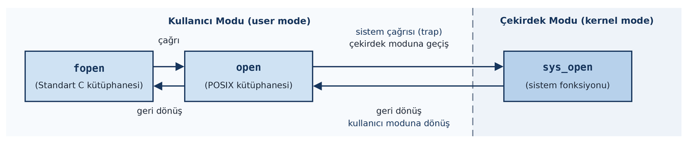

=================================================================  
Standart C Kütüpahnesinin Uyguladığı Dosya Tamponlama Mekanizması
=================================================================

Bu bölümde standart C'deki dosya fonksiyonlarının tamponlama mekanizması üzerinde duracağız.

C'nin prototipleri ``<stdio.h>`` içerisinde bulunan ve başı "f" ile başlayan dosya fonksiyonları aslında
birer *sarma fonksiyon (wrapper function)* gibidir. Biz bu fonksiyonları kullandığımızda arka planda bu
fonksiyonlar UNIX/Linux ve macOS sistemlerinde POSIX fonksiyonlarını, Windows sistemlerinde ise Windows
API fonksiyonlarını çağırmaktadır. Tabii bu fonksiyonlar da aslında ilgili sistemdeki sistem fonksiyonlarını
çağırarak işlemlerini yapmaktadır. Örneğin biz Linux sistemlerinde ``fopen`` fonksiyonunu kullanmış olalım.
Önceki bölümde de bu çağrının nelere yol açtığını belirtmiştik:



``fopen`` fonksiyonu bize ``FILE *`` türünden bir *dosya bilgi göstericisi (stream)* vermektedir. Aslında
``FILE`` bir ``typedef`` ismidir ve bir yapı belirtmektedir:

.. code-block:: c

    typedef struct {

        /* ... */

    } FILE;

Peki bu yapının içerisinde hangi bilgiler vardır? Bir kere ``fopen`` dosyayı gerçekte UNIX/Linux
sistemlerinde ``open`` POSIX fonksiyonunu kullanarak açtığına göre bir biçimde onun içerisinde ``open``
fonksiyonundan elde edilen dosya betimleyicisi bulunacaktır:

.. code-block:: c

    typedef struct {
        /*... */
        int fd;
        /* ... */
    } FILE;

``FILE`` yapısı içerisinde başka hangi bilgilerin bulunması gerektiğini konular ilerledikçe anlayacaksınız.  

C'nin standart dosya fonksiyonlarının en önemli özellikliği bir tamponlama mekanizması eşliğinde çalışmadıdır. 
Bu nedenle C'nin dosya fonksiyonlarına *tamponlu (buffered) IO fonksiyonları* da denilmektedir.

Sistem Fonksiyonlarını Çağırmanın Maliyeti
==========================================

Biz önceki bölümde sistem fonksiyonlrını çağırmanın bir maliyet oluşturduğuğunu söyleemiştik. Şimdi bunu daha 
somut hale getirelim. Aşağıda iki program verilmiştir. Bu iki program da bir dosyanın bütün karakterlerini ekrana yazdırmaktadır.
``read1.c`` programı bu işlemi her defasında ``read`` fonksiyonunu çağırarak yaparken ``read2.c`` programı
bir defasında 512 byte okuma yapıp, okunanları bir tampona yerleştirip oradan alıp yazdırmaktadır.
Dolayısıyla ``read1.c`` programının daha hızlı çalışması beklenir. Çünkü bu program sistem
fonksiyonlarını daha az çağırmaktadır. Aşağıda bir Linux sanal makinesinde ``read1.c`` ve 
``read2.c`` programlarının ``/usr/include/math.h`` gibi bir dosyanın içeriğinin yazdırılması işlemindeki çalışma
zamanları verilmiştir:

.. code-block:: console

    $ time ./read1 /usr/include/math.h
    ...
    real    0m0,032s
    user    0m0,006s
    sys     0m0,025s

    $ time ./read2 /usr/include/math.h
    ...
    real    0m0,007s
    user    0m0,001s
    sys     0m0,006s

Görüldüğü gibi küçük bir dosyada bile çalışma zamanı arasında önemli farklılıklar (``4`` kat civarında) gözlemlenmektedir.

``read1.c```

.. code-block:: c

    #include <stdio.h>
    #include <stdlib.h>
    #include <fcntl.h>
    #include <unistd.h>

    void exit_sys(const char *msg);

    int main(int argc, char *argv[])
    {
        int fd;
        char ch;
        ssize_t result;

        if (argc != 2) {
            fprintf(stderr, "wrong number of arguments!...\n");
            exit(EXIT_FAILURE);
        }

        if ((fd = open(argv[1], O_RDONLY)) == -1)
            exit_sys("open");

        while ((result = read(fd, &ch, 1)) > 0)
            putchar(ch);

        if (result == -1)
            exit_sys("read");

        putchar('\n');

        close(fd);

        return 0;
    }

    void exit_sys(const char *msg)
    {
        perror(msg);
        exit(EXIT_FAILURE);
    }

``read2.c```

.. code-block:: c

    #include <stdio.h>
    #include <stdlib.h>
    #include <fcntl.h>
    #include <unistd.h>

    void exit_sys(const char *msg);

    #define BUFSIZE        512

    int main(int argc, char *argv[])
    {
        int fd;
        char buf[BUFSIZE];
        ssize_t result;

        if (argc != 2) {
            fprintf(stderr, "wrong number of arguments!...\n");
            exit(EXIT_FAILURE);
        }

        if ((fd = open(argv[1], O_RDONLY)) == -1)
            exit_sys("open");

        while ((result = read(fd, buf, BUFSIZE)) > 0) {
            for (int i = 0; i < result; ++i)
                putchar(buf[i]);
        }

        if (result == -1)
            exit_sys("read");

        putchar('\n');

        close(fd);

        return 0;
    }

    void exit_sys(const char *msg)
    {
        perror(msg);
        exit(EXIT_FAILURE);
    }

Tamponlama Mekanizmasının Çalışma Biçimi
========================================

İşte standart C fonksiyonları da yukarıdaki örnekte olduğu gibi sistem fonksiyonlarını daha az çağırmak
için bir tampon kullanmaktadır. Biz örneğin ``fgetc`` fonksiyonu ile bir byte bile okumak istesek ``fgetc``
bir tamponluk bilgiyi okur ve bize onun içerisinden bir byte'ı verir. Biz daha sonra yeniden ``fgetc``
fonksiyonunu çağırdığımızda ``fgetc`` zaten tamponda daha önce okunmuş olan bilgi yığını olduğu için
``read`` fonksiyonu ile okuma yapmaz, bize doğrudan byte'ı tampondan verir. Tabii tampondaki tüm byte'lar
okunduktan sonra (yani tamponun sonuna gelindiğinde) ``fgetc`` yeniden ``read`` fonksiyonunu çağıracak ve
tamponu yeniden dolduracaktır.

``fopen`` fonksiyonun geri döndürdüğü ``FILE`` türünden yapının içerisinde aslında bu tamponu yönetmek için gerekli 
olan bilgiler de bulunmaktadır. Örneğin "tamponun adresi", "tamponun büyüklüğü", "tamponda nerede kalındığı", 
"tamponda değişiklik yapılan yerin tampondaki konumu" gibi bilgiler bu ``FILE`` yappısının içerisinde tutulmaktadır. 

Dosya işlemlerinde tamponlama C'ye özgü bir durum değildir. C++'taki ``iostream`` sınıfları, dosya işlemlerini
yapan Java ve C# sınıfları, Rust'taki ``BufReader``, ``BufWriter`` gibi yapılar benzer tamponlamayı yapmaktadır.

Aşağıda daha önce yapmış olduğumuz okuma zaman ölçümü standart C fonksiyonları kullanılarak
yapılmıştır.

.. code-block:: console

    $ time ./read3 /usr/include/math.h
    ...
    real    0m0,006s
    user    0m0,001s
    sys     0m0,005s

Görüldüğü gibi standart C fonksiyonları da bizim manuel yaptığımız tamponlamayı kendi içlerinde
yapmaktadır.

``read3.c```

.. code-block:: c

    #include <stdio.h>
    #include <stdlib.h>

    int main(int argc, char *argv[])
    {
        FILE *f;
        int ch;

        if (argc != 2) {
            fprintf(stderr, "wrong number of arguments!...\n");
            exit(EXIT_FAILURE);
        }

        if ((f = fopen(argv[1], "r")) == NULL) {
            fprintf(stderr, "cannot open file!..\n");
            exit(EXIT_FAILURE);
        }

        while ((ch = fgetc(f)) != EOF)
            putchar(ch);

        if (ferror(f)) {
            fprintf(stderr, "cannot read file!..\n");
            exit(EXIT_FAILURE);
        }

        putchar('\n');

        fclose(f);

        return 0;
    }

Varsayılan Tampon Büyüklüğü
---------------------------

C'de dosya tamponları dosya açıldığında o dosyaya ilişkin olacak biçimde oluşturulmaktadır. Yani her
dosyanın tamponu birbirinden ayrıdır. Standart C fonksiyonlarının kullandıkları default tampon büyüklüğü
``<stdio.h>`` içerisinde ``BUFSIZ`` sembolik sabitiyle dışarıya verilmektedir. (Tabii bu ``BUFSIZ``
değerini değiştirmenin bir anlamı yoktur. Kod çoktan derlenmiştir. Bu sembolik sabit sadece dış dünyaya
default durum hakkında bilgi vermek için bulundurulmuştur.)

Aşağıdaki programda ``BUFSIZ`` değeri ekrana (``stdout`` dosyasına) yazdırılmıştır. Kursun yapıldığı
makinede bu değer 8192'dir. Tabii bu 8192 değeri *glibc* kütüphanesi tarafından belirlenmiş bir değerdir.

.. code-block:: c

    #include <stdio.h>

    int main(void)
    {
        printf("%d\n", BUFSIZ);        /* 8192 */

        return 0;
    }

C'nin standart dosya fonksiyonlarının kullandığı bu tamponlar *read/write* tamponlardır. Yani yalnızca okuma sırasında
değil yazma sırasında da kullanılmaktadır. Örneğin biz ``fputc`` fonksiyonu ile bir byte'ı dosyaya yazmak
istesek bu bir byte aslında bu tampona yazılır. Tamponun içerisindekiler tampon dolduğunda, açıkça ``fflush`` fonksiyonu 
çağrıldığında, ``fseek`` fonksiyonu çağrıldığında ya da en kötü olasılıkla ``fclose`` işlemi sırasında ``write``
fonksiyonu çağrılarak diske yazılmaktadır. Biz tampondaki bilginin aktarılmasını garanti etmek için
``fflush`` fonksiyonunu çağırabiliriz. Tampondaki bilginin diske yazılması işlemine dosya terminolojisinde
*flush işlemi* denilmektedir. ``fflush`` fonksiyonunun kullanılabilmesi için dosyanın yazma modunda
(yani ``"w"``, ``"r+"`` gibi modlarda) açılmış olması gerekmektedir.

FILE Yapısının İçeriği
----------------------

Bildiğiniz gibi C'nin dosya açmakta kullanılan ``fopen`` fonksiyonu bize ``FILE`` türünden bir yapı
nesnesinin adresini vermektedir. Bu ``FILE`` nesnesine İngilizce *stream* denilmektedir. Biz kursumuzda buna
genel olarak *dosya bilgi göstericisi* diyoruz. İşte yukarıda da belirttiğimiz gibi bu ``FILE`` yapısının
içerisinde tamponu yönetmek için de bilgiler bulunmaktadır. ``FILE`` yapısının içerisinde tipik olarak şu
bilgiler bulunur:

- İşletim sistemi düzeyinde okuma/yazma işlemleri için gereken dosya betimleyicisi
- Tamponun başlangıç adresini tutan bir gösterici
- Tampondaki aktif noktayı tutan bir gösterici
- Tamponun uzunluğunu tutan bir eleman ya da tamponun sonunu tutan bir gösterici
- Tamponda yapılan değişikliğin konumunu tutan göstericiler
- Diğer bilgiler

Örneğin kursun yapıldığı makinedeki *glibc* kütüphanesinde ``FILE`` yapısı önce ``struct _IO_FILE``
biçiminde tanımlanıp sonra ``FILE`` olarak ``typedef`` edilmiştir:

.. code-block:: c

    struct _IO_FILE
    {
        int _flags;             /* High-order word is _IO_MAGIC; rest is flags. */

        /* The following pointers correspond to the C++ streambuf protocol. */
        char *_IO_read_ptr;     /* Current read pointer */
        char *_IO_read_end;     /* End of get area. */
        char *_IO_read_base;    /* Start of putback+get area. */
        char *_IO_write_base;   /* Start of put area. */
        char *_IO_write_ptr;    /* Current put pointer. */
        char *_IO_write_end;    /* End of put area. */
        char *_IO_buf_base;     /* Start of reserve area. */
        char *_IO_buf_end;      /* End of reserve area. */

        /* The following fields are used to support backing up and undo. */
        char *_IO_save_base;    /* Pointer to start of non-current get area. */
        char *_IO_backup_base;  /* Pointer to first valid character of backup area */
        char *_IO_save_end;     /* Pointer to end of non-current get area. */

        struct _IO_marker *_markers;

        struct _IO_FILE *_chain;

        int _fileno;
        int _flags2;
        __off_t _old_offset;    /* This used to be _offset but it's too small.  */

        /* 1+column number of pbase(); 0 is unknown. */
        unsigned short _cur_column;
        signed char _vtable_offset;
        char _shortbuf[1];

        _IO_lock_t *_lock;
        #ifdef _IO_USE_OLD_IO_FILE
    };

    typedef struct _IO_FILE FILE;

*musl* isimli standart C ve POSIX kütüphanesinde de benzer tanımlamalar kullanılmıştır:

.. code-block:: c

    struct _IO_FILE {
        unsigned flags;
        unsigned char *rpos, *rend;
        int (*close)(FILE *);
        unsigned char *wend, *wpos;
        unsigned char *mustbezero_1;
        unsigned char *wbase;
        size_t (*read)(FILE *, unsigned char *, size_t);
        size_t (*write)(FILE *, const unsigned char *, size_t);
        off_t (*seek)(FILE *, off_t, int);
        unsigned char *buf;
        size_t buf_size;
        FILE *prev, *next;
        int fd;
        int pipe_pid;
        long lockcount;
        int mode;
        volatile int lock;
        int lbf;
        void *cookie;
        off_t off;
        char *getln_buf;
        void *mustbezero_2;
        unsigned char *shend;
        off_t shlim, shcnt;
        FILE *prev_locked, *next_locked;
        struct __locale_struct *locale;
    };

    typedef struct _IO_FILE FILE;

Peki ``fopen`` tarafından bu ``FILE`` yapısı nasıl tahsis edilmektedir? Standart C kütüphanelerini
yazanlar birkaç teknik kullanabilmektedir. Örneğin tipik olarak tahsisat ``malloc`` fonksiyonuyla yapılabilir.  
Tabii bu durumda ``free`` işlemi ``fclose`` fonksiyonu tarafından yapılacaktır. Bazı kütüphane gerçekleştirimlerinde 
``FILE`` yapısı zaten işin başında statik düzeyde tahsis edilmiş bir ``FILE`` dizisinin içerisinden alınmaktadır. 
Örneğin:

.. code-block:: c

    static FILE g_files[FILE_MAX];

Örneğin *musl* kütüphanesinde ``FILE`` nesnesi ve onun kullandığı tampon tek hamlede ``malloc`` fonksiyonu
ile tahsis edilmiştir:

.. code-block:: c

    if (!(f=malloc(sizeof *f + UNGET + BUFSIZ))) return 0;

*uclibc'de (mikro C kütüphanesinde)* tahsisat ``malloc`` fonksiyonuyla yapılmıştır:

.. code-block:: c

    if ((stream = malloc(sizeof(FILE))) == NULL) {
        return stream;
    }

*glibc* kütüphanesi de tahsisatı ``malloc`` fonksiyonuyla yapmaktadır. 

C standartlarında ``FILE`` yapısının içeriği hakkında bilgi verilmemiştir. Bu durumda bu ``FILE``
yapısının içeriği kütüphaneyi yazanlar tarafından istenildiği gibi oluşturulabilir.

C'nin Standart Dosya Fonksiyonlarıyla Köprü Kuran POSIX Fonksiyonları
=====================================================================

Biz bir dosyayı ``fopen`` fonksiyonuyla açıp o dosyanın dosya betimleyicisini elde edebiliriz. ``fileno``
isimli POSIX fonksiyonu ``FILE`` yapısının içerisindeki dosya betimleyicisini bize vermektedir. ``fileno``
fonksiyonunun prototipi şöyledir:

.. code-block:: c

    #include <stdio.h>

    int fileno(FILE *stream);

Fonksiyonun geri dönüş değeri dosya betimleyicisidir. Peki bu fonksiyon başarısız olabilir mi ya da
bu fonksiyonun başarısızlığı tespit edilebilir mi? POSIX standartlarına göre fonksiyon başarısız olabilir. Bu durumda ``-1``
değerine geri döner. Ancak fonksiyonun başarısızlığının tespiti yeterli bir biçimde yapılamayabilir. Fonksiyon ``FILE`` 
yapısının içerisindeki dosya betimleyicisini tutan elemana başlangıçta geçersiz bir değer atayıp bu değere bakmaktadır. 
Örneğin:

.. code-block:: c

    FILE *f;
    int fd;
    /* ... */

    if ((f = fopen("test.txt", "r")) == NULL) {
        fprintf(stderr, "cannot open file!...\n");
        exit(EXIT_FAILURE);
    }

    if ((fd = fileno(f)) == -1)
        exit_sys("fileno");

Tabii ``fileno`` fonksiyonuyla ``FILE`` yapısı içerisindeki dosya betimleyicisini alıp onunla dosya işlemleri
yaptığımızda dosya göstericisinin değeri de değişmiş olacaktır.

``fileno`` bir standart C fonksiyonu değildir, bir POSIX fonksiyonudur. Microsoft Windows sistemlerinde de
bu fonksiyonu ``_fileno`` ismiyle bulunmaktadır.

Aşağıdaki örnekte dosya önce ``fopen`` fonksiyonuyla açılıp ``fileno`` fonksiyonuyla dosya betimleyicisi
elde edilmiş ve sonra o betimleyici ile okuma yapılmıştır.

.. code-block:: c

    #include <stdio.h>
    #include <stdlib.h>
    #include <unistd.h>

    void exit_sys(const char *msg);

    int main(void)
    {
        FILE *f;
        int fd;
        char buf[10 + 1];
        ssize_t result;

        if ((f = fopen("test.txt", "r")) == NULL) {
            fprintf(stderr, "cannot open file!...\n");
            exit(EXIT_FAILURE);
        }

        if ((fd = fileno(f)) == -1)
            exit_sys("fileno");

        if ((result = read(fd, buf, 10)) == -1)
            exit_sys("read");

        buf[result] = '\0';
        puts(buf);

        fclose(f);

        return 0;
    }

    void exit_sys(const char *msg)
    {
        perror(msg);
        exit(EXIT_FAILURE);
    }

``fileno`` POSIX fonksiyonunun mantıksal olarak tersini yapan ``fdopen`` isimli bir POSIX fonksiyonu da
vardır. (``fdopen`` da bir standart C fonksiyonu değildir.) Bu fonksiyon ``open`` POSIX fonksiyonuyla açıp
betimleyicisini elde ettiğimiz dosyaya ilişkin dosya bilgi göstericisini (``FILE *``) bize verir. Yani
``fdopen`` sanki o dosyayı ``fopen`` ile açmışız gibi bir durum oluşturmaktadır. ``fdopen`` fonksiyonunun
prototipi şöyledir:

.. code-block:: c

    #include <stdio.h>

    FILE *fdopen(int fd, const char *mode);

Fonksiyonun birinci parametresi ``open`` fonksiyonu ile elde edilen dosya betimleyicidir. İkinci parametre
dosyanın ``fopen`` fonksiyonundaki açış modudur. Tabii buradaki açış modunun ``open`` fonksiyonuyla dosya
açılırkenki mod ile uyuşması gerekir. Fonksiyon başarı durumunda dosya bilgi göstericisine, başarısızlık
durumunda ``NULL`` adrese geri döner, ``errno`` değişkeni uygun biçimde set edilir. Örneğin:

.. code-block:: c

    int fd;
    FILE *f;
    /* ... */

    if ((fd = open("test.txt", O_RDONLY)) == -1)
        exit_sys("open");

    if ((f = fdopen(fd, "r")) == NULL)
        exit_sys("fdopen");

``fdopen`` fonksiyonundaki açış modunun betimleyici oluşturulurken belirtilen açış moduyla uyumlu olması
gerektiğine bir kez daha dikkatinizi çekmek istiyoruz. Yukarıdaki örnekte biz ``fdopen`` fonksiyonunda açış
modunu ``"r+"`` biçiminde verseydik ``fdopen`` başarısız olurdu.

Aşağıdaki örnekte önce ``open`` fonksiyonu ile dosya açılmış, sonra dosya betimleyicisi kullanılarak
``fdopen`` fonksiyonu ile dosya bilgi göstericisi elde edilmiştir. İşlemlere standart C fonksiyonlarıyla
devam edilmiştir. ``fclose`` işlemi zaten bu betimleyiciyi kapatacağı için ayrıca ``close`` fonksiyonu
çağrılmamıştır.

.. code-block:: c

    #include <stdio.h>
    #include <stdlib.h>
    #include <fcntl.h>

    void exit_sys(const char *msg);

    int main(void)
    {
        int fd;
        FILE *f;
        int ch;

        if ((fd = open("test.txt", O_RDONLY)) == -1)
            exit_sys("open");

        if ((f = fdopen(fd, "r")) == NULL)
            exit_sys("fdopen");

        while ((ch = fgetc(f)) != EOF)
            putchar(ch);

        if (ferror(f)) {
            fprintf(stderr, "cannot read file!..\n");
            exit(EXIT_FAILURE);
        }

        fclose(f);

        return 0;
    }

    void exit_sys(const char *msg)
    {
        perror(msg);
        exit(EXIT_FAILURE);
    }

Standart C Dosya Fonksiyonlarında Tamponlama Modları
====================================================

Şimdi de C'nin standart dosya fonksiyonlarının uyguladığı *tamponlama (buffering)* modları hakkında bilgiler
verelim. Standart C'nin ``<stdio.h>`` fonksiyonları tamponlamayı üç moda (ya da stratejiye) göre farklı
biçimlerde yapmaktadır.

**Tam Tamponlamalı (Full Buffered) Mod:** Burada okuma sırasında tampon tamamen doldurulur. Tamponun
sonuna gelindiğinde tampon yeniden doldurulur. Yazma işlemleri de tampona yapılır. Tamponun sonuna
gelindiğinde, ``fflush`` ya da ``fseek`` çağrısı yapıldığında tampona yazılmış olanlar flush edilir.

**Satır Tamponlamalı (Line Buffered) Mod:** Bu modda tampon tamamen doldurulmaz. Yalnızca tek satırlık
bilgi (``'\n'`` karakteri dahil olmak üzere) tampona çekilmektedir. Okuma sırasında bu tampondan byte'lar
verilir. Dosyaya yazılmak istenen byte'lar yine tampona yazılır. flush işlemi ``'\n'`` karakteri tampona
yazılınca (ya da ``fflush``, ``fseek`` ve ``fclose`` fonksiyonları çağrılınca) yapılmaktadır. Satır tamponlamalı mod
tipik olarak text dosyalar için kullanılmaktadır. Binary dosyalar için bu mod kullanılabilse de
anlamsızdır.

**Sıfır Tamponlamalı (Unbuffered) Mod:** Burada tampon hiç kullanılmaz. Doğrudan ilgili aşağı seviyeli
fonksiyonlarla (yani UNIX/Linux sistemlerinde ``read`` ve ``write`` fonksiyonlarıyla) aktarım
yapılır.

C standartları bu üç tamponlama biçimini kabaca betimlemiştir, ayrıntılar konusunda bir açıklama yapmamıştır. 
C standartlarında tamponlama stratejisi için yalnızca kabaca ""niyet" belirtilmiştir. Tamponlama modlarını aşağıdaki 
tabloyla özetleyebiriz:

.. list-table::
   :header-rows: 1
   :stub-columns: 1

   * - Tamponlama Türü
     - Davranış
   * - Tam Tamponlamalı (Full Buffered)
     - Tampon tamamen doldurulunca flush edilir.
   * - Satır Tamponlamalı (Line Buffered)
     - Yalnızca bir satır (``'\n'`` dahil) tutulur, ``'\n'`` görülünce flush edilir.
   * - Sıfır Tamponlamalı (Unbuffered)
     - Tampon kullanılmaz, her çağrı doğrudan ``read`` / ``write`` ile yapılır.

Satır tamponlaması kişilere biraz tuhaf gelebilmektedir. Çünkü satır tamponlaması yapabilmek için standart
C kütüphanesinin okuma sırasında ``'\n'`` karakterini görmesi gerekir ki bazı durumlarda bunun etkin bir
biçimde yapılabilme olanağı yoktur. Ancak bazı durumlarda zaten aygıt sürücüler bize satırsal bilgi
vermektedir. Standart C kütüphaneleri disk dosyaları için satır tamponlaması yaparken aslında çoğu kez
``'\n'`` karakterine kadar değil tüm tampon kadar okuma yapmaktadır. Satır tamponlamasının en önemli etkisi
yazma işleminde kendini göstermektedir. Satır tamponlamalı modda ``'\n'`` karakteri tampona yazıldığında flush
işlemi yapılmaktadır. Dolayısıyla kütüphaneleri gerçekleştirenler satır tamponlaması ile okuma yapılırken ``'\n'`` 
karakterine kadar değil tüm tamponu da doldurabilmektedir.  Yukarıda da belirttiğimiz gibi ayrıntılı
bir açıklama yapılmamıştır. Standartlar ayrıntıların "derleyicileri yazanların isteğine bırakıldığını
(implementation-defined)"" belirtmektedir.

C standartlarında tamponlamayla ilgili kısım şöyledir:

.. container:: acknowledge

    When a stream is unbuffered, characters are intended to appear from the source or at the destination as soon as
    possible. Otherwise characters may be accumulated and transmitted to or from the host environment as a block.
    When a stream is fully buffered, characters are intended to be transmitted to or from the host environment as a
    block when a buffer is filled. When a stream is line buffered, characters are intended to be transmitted to or
    from the host environment as a block when a new-line character is encountered. Furthermore, characters are
    intended to be transmitted as a block to the host environment when a buffer is filled, when input is requested
    on an unbuffered stream, or when input is requested on a line buffered stream that requires the transmission of
    characters from the host environment. Support for these characteristics is implementation-defined, and may be
    affected via the ``setbuf`` and ``setvbuf`` functions.

Tamponlama modu ile ilgili iki önemli soru gündeme gelmektedir:

1. ``fopen`` fonksiyonu ile bir dosya açıldığında dosyanın default tamponlama modu nedir?
2. Dosyanın tamponlama modu nasıl değiştirilmektedir?

``fopen`` fonksiyonu ile dosya açıldığında dosyanın default tamponlama modu hakkında C standartlarında bir
şey söylenmemiştir. Bu durum *bunun herhangi bir biçimde olabileceği* anlamına gelmektedir. Fakat mevcut
standart C kütüphanelerinin hepsi disk dosyalarında default durumda *tam tamponlamalı (full buffered)*
modu esas almaktadır. Ancak C standartlarında ``stdin``, ``stdout`` ve ``stderr`` dosyalarının default
tamponlama modu için bazı şeyler söylenmiştir. 

Tamponlama Modunun Değiştirilmesi: setbuf ve setvbuf Fonksiyonları
------------------------------------------------------------------

Bir dosyanın tamponlama modu, dosya ``fopen`` fonksiyonuyla açıldıktan sonra ancak henüz hiçbir işlem yapmadan 
``setbuf`` ve ``setvbuf`` standart C fonksiyonlarıyla değiştirilebilmektedir. Dosya üzerinde herhangi bir işlem 
yaptıktan sonra bu fonksiyonların çağrılması *tanımsız davranışa (undefined behavior)* yol açmaktadır. ``setvbuf`` 
fonksiyonu işlevsel olarak ``setbuf`` fonksiyonunu zaten kapsamaktadır. ``setbuf`` fonksiyonu aslında kullanılan 
tamponun yerini değiştirmek için tasarlanmıştır. Fonksiyonun prototipi şöyledir:

.. code-block:: c

    #include <stdio.h>

    void setbuf(FILE *stream, char *buf);

Fonksiyonun birinci parametresi dosya bilgi göstericisini, ikinci parametresi yeni tamponun yerini
belirtmektedir. Bu tamponun ``BUFSIZ`` uzunluğunda olması gerekir. Eğer ikinci parametre ``NULL`` adres
olarak girilirse bu durumda dosya sıfır tamponlamalı moda sokulmaktadır. Fonksiyon başarıyı kontrol
edememektedir. Örneğin:

.. code-block:: c

    FILE *f;
    char mybuf[BUFSIZ];
    /* ... */

    if ((f = fopen("test.txt", "r+")) == NULL) {
        fprintf(stderr, "cannot open file!...\n");
        exit(EXIT_FAILURE);
    }
    setbuf(f, mybuf);

Burada artık açılan dosya için ``mybuf`` ile belirtilen tampon kullanılacaktır. Biz dosyayı sıfır
tamponlamalı moda şöyle geçirebiliriz:

.. code-block:: c

    setbuf(f, NULL);

Aslında tamponun yerini değiştirmenin gerektiği durumlar oldukça seyrektir. Tampona doğrudan erişilmek
istendiğinde, ya da tamponun heap'te değil de statik bir alanda oluşturulması istendiğinde bu değişiklik
yapılabilmektedir. Bazı standart C kütüphaneleri (örneğin *musl* ve *uclibc*) dosya tamponunu ``fopen``
işlemi sırasında tahsis etmektedir. *glibc* gibi bazı kütüphaneler ise tamponu "ilk kez kullanıldığında"
tahsis etmektedir.

Aşağıdaki örnekte ``setbuf`` fonksiyonu ile dosya için kullanılacak tamponun yeri değiştirilmiştir.
``fgetc`` işlemi sonrasında bu tamponun doldurulduğunu gözlemleyebilirsiniz.

.. code-block:: c

    #include <stdio.h>
    #include <stdlib.h>

    int main(void)
    {
        FILE *f;
        char mybuf[BUFSIZ];
        long size;
        int n;
        int ch;

        if ((f = fopen("test.txt", "r+")) == NULL) {
            fprintf(stderr, "cannot open file!...\n");
            exit(EXIT_FAILURE);
        }
        setbuf(f, mybuf);

        fseek(f, 0, SEEK_END);
        size = ftell(f);
        fseek(f, 0, SEEK_SET);
        n = size < 512 ? size : 512;

        ch = fgetc(f);
        putchar(ch);

        for (int i = 0; i < n; ++i)
            putchar(mybuf[i]);
        putchar('\n');

        fclose(f);

        return 0;
    }

``setvbuf`` fonksiyonu ile hem tamponun yeri, hem büyüklüğü hem de tamponlama modu değiştirilebilmektedir.
Fonksiyonun prototipi şöyledir:

.. code-block:: c

    #include <stdio.h>

    int setvbuf(FILE *stream, char *buf, int mode, size_t size);

Fonksiyonun birinci parametresi dosya bilgi göstericisini (*stream*) belirtir. Üçüncü parametre
değiştirilecek tamponlama modunu belirtmektedir. Bu parametre şu değerlerden birini alabilmektedir:

.. list-table::
   :widths: 30 70
   :header-rows: 1

   * - Sembolik Sabit
     - Tamponlama Türü
   * - ``_IONBF``
     - Sıfır tamponlamalı (unbuffered)
   * - ``_IOLBF``
     - Satır tamponlamalı (line buffered)
   * - ``_IOFBF``
     - Tam tamponlamalı (fully buffered)

İkinci parametre tamponun yerini değiştirmek için kullanılmaktadır. Bu parametre ``NULL`` adres geçilirse
tamponun yeri değiştirilmez. Son parametre ise tamponun yeni uzunluğunu belirtmektedir. Programcı ikinci
parametreye ``NULL`` adres geçip son parametre yoluyla tamponun büyüklüğünü de değiştirebilir. Bu durumda
tamponu ``setvbuf`` kendisi tahsis edecektir. Eğer tamponlama modu ikinci parametreye ``_IONBF`` geçilerek
sıfır tamponlamalı mod olarak ayarlanırsa artık ikinci ve dördüncü parametrenin bir önemi kalmamaktadır.
Fonksiyon başarı durumunda 0 değerine, başarısızlık durumunda sıfır dışı bir değere geri dönmektedir.
POSIX sistemlerinde ``errno`` değişkeni yine uygun biçimde set edilmektedir. Örneğin:

.. code-block:: c

    FILE *f;
    /* ... */

    if ((f = fopen("test.txt", "r+")) == NULL) {
        fprintf(stderr, "cannot open file!...\n");
        exit(EXIT_FAILURE);
    }

    if (setvbuf(f, NULL, _IONBF, 0) == -1) {
        fprintf(stderr, "setvbuf failed!..\n");
        exit(EXIT_FAILURE);
    }

Burada dosya sıfır tamponlamalı moda sokulmuştur. Örneğin:

.. code-block:: c

    FILE *f;
    char mybuf[1024];
    /* ... */

    if ((f = fopen("test.txt", "r+")) == NULL) {
        fprintf(stderr, "cannot open file!...\n");
        exit(EXIT_FAILURE);
    }

    if (setvbuf(f, mybuf, _IONBF, 1024) == -1) {
        fprintf(stderr, "setvbuf failed!..\n");
        exit(EXIT_FAILURE);
    }

Burada tamponun yeri ve uzunluğu değiştirilmiştir.

*glibc* kütüphanesinde POSIX standartlarında olmayan ``setbuffer`` ve ``setlinebuf`` isimli iki fonksiyon da bulunmaktadır. 
Bu fonksiyonların prototipleri şöyledir:

.. code-block:: c

    #include <stdio.h>

    void setbuffer(FILE *stream, char *buf, size_t size);
    void setlinebuf(FILE *stream);

``setbuffer`` fonksiyonu ``setbuf`` fonksiyonunun tampon büyüklüğünün de belirlenebildiği biçimidir.
``setlinebuf(stream)`` çağrısı ise aşağıdakiyle eşdeğerdir:

.. code-block:: c

    setvbuf(stream, NULL, _IOLBF, 0);

.. note::

    *glibc* dışındaki çeşitli standart C kütüphanelerinin özellikle stdio fonksiyonlarının gerçekleştirimini
    inceleyebilirsiniz. İncelemek için alternatifler şunlar olabilir:

    - `uclibc (Mikro C kütüphanesi) <https://elixir.bootlin.com/uclibc-ng/latest/source>`_
    - `musl libc kütüphanesi <http://www.musl-libc.org/>`_
    - `diet libc kütüphanesi <http://www.fefe.de/dietlibc/>`_
    - Plauger'in *The C Standard Library* kitabında gerçekleştirimini yaptığı kütüphane:
      `GitHub c-standard-library konusu <https://github.com/topics/c-standard-library>`_

stdin, stdout ve stderr Dosyalarının Varsayılan Tamponlama Modları
------------------------------------------------------------------

Daha önce de belirttiğimiz gibi C'nin ``<stdio.h>`` dosyası içerisinde ``FILE *`` türünden yani *stream*
belirten üç makro bulunmaktadır: ``stdin``, ``stdout`` ve ``stderr``. Bu makrolar ``fopen`` fonksiyonunun 
geri döndürdüğü ``FILE`` nesnesi türünden adres belirtmektedir. Dolayısıyla C'nin standart
dosya fonksiyonlarında bunları kullanabiliriz. Örneğin aslında:

.. code-block:: c

    printf(...);

çağrısı ile aşağıdaki ``fprintf`` çağrısının bir farkı yoktur:

.. code-block:: c

    fprintf(stdout, ...);

Zaten örneğin C standartlarında ``printf`` için ayrıntılı açıklama yapılmamış, bu fonksiyonun "fprintf
fonksiyonunun stdout dosyasına yazan biçimi olduğu" söylenmiştir. Asıl açıklama ``fprintf`` fonksiyonunda
yapılmıştır.

``stdin``, ``stdout`` ve ``stderr`` dosyaları tarafından açılmamıştır ve programcı tarafından kapatılmamalıdır. 
Programcı bunları doğrudan kullanabilir. Şüphesiz UNIX/Linux
sistemlerinde ``stdin`` dosya bilgi göstericisinin gösterdiği ``FILE`` nesnesinin içerisinde 0 numaralı
betimleyici, ``stdout`` ``FILE`` nesnesinin içerisinde 1 numaralı betimleyici ve ``stderr`` ``FILE``
nesnesinin içerisinde 2 numaralı betimleyici vardır.

``stdin``, ``stdout`` ve ``stderr`` dosyaları için de ``FILE`` nesneleri, dolayısıyla tampon
oluşturulmaktadır. Yani bu dosyalar da tamponlu bir biçimde işleme sokulmaktadır. C standartları herhangi
bir dosyanın default tamponlaması hakkında bir şey söylememiş olsa da ``stdin``, ``stdout`` ve ``stderr``
dosyalarının default tamponlaması hakkında şunları söylemiştir:

- ``stdin`` ve ``stdout`` dosyaları default durumda "eğer interaktif olmayan bir aygıta yönlendirilmişse
  işin başında tam tamponlamalı" moddadırlar. Ancak bu dosyalar "interaktif olan bir aygıta
  yönlendirilmişse işin başında tam tamponlamalı olamazlar, satır tamponlamalı ya da sıfır tamponlamalı"
  olabilirler. Klavye ve ekran yani terminal *interaktif aygıt* kabul edilmektedir. Ancak disk dosyaları
  interaktif aygıt kabul edilmemektedir.

- ``stderr`` dosyası ister interaktif olmayan aygıta yönlendirilmiş olsun isterse interaktif aygıta
  yönlendirilmiş olsun işin başında tam tamponlamalı olamaz. Ancak satır tamponlamalı ya da sıfır
  tamponlamalı olabilir.

  Bu konudaki standartlardaki anlatım şöyledir:

.. container:: acknowledge

    At program startup, three text streams are predefined and need not be opened explicitly
    — standard input (for reading conventional input), standard output (for writing
    conventional output), and standard error (for writing diagnostic output). As initially
    opened, the standard error stream is not fully buffered; the standard input and standard
    output streams are fully buffered if and only if the stream can be determined not to refer
    to an interactive device.

Örneğin Windows sistemlerindeki C derleyicilerinde default durumda dosyaya yönlendirme yapılmamışsa
``stdout`` sıfır tamponlamalı, ``stdin`` satır tamponlamalıdır. Ancak UNIX/Linux sistemlerinde ``stdout``
ve ``stdin`` dosyaları default durumda satır tamponlamalıdır. Aşağıdaki örnekte bu durum anlaşılabilir.

.. code-block:: c

    #include <stdio.h>

    int main(void)
    {
        printf("ankara");        /* Windows sistemlerinde yazı gözükecek, UNIX/Linux'ta gözükmeyecek */

        for (;;)
            ;

        return 0;
    }

Bu örnekte eğer ``stdout`` default durumda satır tamponlamalı ise "ankara" yazısı önce tampona
aktarılacak, ``'\n'`` basılana kadar tamponda kalacaktır. Tabii program sonlanırken ``stdin``, ``stdout`` ve
``stderr`` dosyaları zaten derleyiciler tarafından kapatılacağı için her durumda bu flush işlemi
yapılacaktır. Örneğin aşağıdaki programda programın çalışması bitince her sistemde yazı görünecektir:

.. code-block:: c

    #include <stdio.h>

    int main(void)
    {
        printf("ankara");

        return 0;
    }

Peki ``stdout`` dosyası terminale yönlendirilmişken satır tamponlamalı ya da sıfır tamponlamalı modda
olabiliyorsa bir yazının ekrana çıkmasını nasıl garanti edebiliriz? Mademki ``stdout`` terminale
yönlendirildiğinde en kötü olasılıkla satır tamponlamalı olabilir. O zaman yazının sonuna ``'\n'`` karakteri
koyarız. Örneğin:

.. code-block:: c

    #include <stdio.h>

    int main(void)
    {
        printf("ankara\n");        /* Hem Windows'ta hem de Linux sistemlerinde yazı görülecek */

        for (;;)
            ;

        return 0;
    }

Ancak burada imleç aynı zamanda aşağı satıra da geçirilmektedir. Peki imleç aşağı satıra geçirilmeden
yazının ekrana çıkması nasıl garanti edilebilir? Bunun iki yolu vardır. Birincisi ``stdout`` dosyasını
``fflush(stdout)`` çağrısıyla flush etmektir:

.. code-block:: c

    #include <stdio.h>

    int main(void)
    {
        printf("ankara");
        fflush(stdout);

        for (;;)
            ;

        return 0;
    }

İkincisi ise ``stdout`` dosyasını her ihtimale karşı açıkça sıfır tamponlamalı moda çekmektir:

.. code-block:: c

    #include <stdio.h>

    int main(void)
    {
        setvbuf(stdout, NULL, _IONBF, 0);        /* setbuf(stdout, NULL) */
        printf("ankara");

        for (;;)
            ;

        return 0;
    }

C derleyicilerinin çoğunda ``stdin`` dosyasından okuma yapıldığında okuma yapan fonksiyonlar önce
``stdout`` dosyasını flush etmektedir. Ancak standartlarda bu durum garanti edilmemiştir. Örneğin:

.. code-block:: c

    #include <stdio.h>

    int main(void)
    {
        printf("ankara");

        getchar();        /* Hem Windows hem de UNIX/Linux sistemlerindeki derleyicilerde stdout flush edilecek */

        return 0;
    }

Mademki bu davranış standartlarda garanti edilmemiş, o halde yine en doğru uygulama yazının sonunda ``'\n'``
yoksa açıkça ``fflush(stdout)`` çağrısını yapmaktır.

stdin Tamponunun Temizlenmesi
-----------------------------

``stdin`` dosyası hem Windows hem de UNIX/Linux sistemlerinde disk dosyasına yönlendirilmemişse satır
tamponlamalı moddadır. Dolayısıyla biz klavyeden bir karakter bile okumak istesek UNIX/Linux
sistemlerinde ``read`` fonksiyonu 0 numaralı betimleyici ile çağrılıp bir satırlık bilgi okunacak ve bu
bir satırlık bilgi sonunda ``'\n'`` karakteri olacak biçimde tampona yerleştirilecektir. Artık tamponda bilgi olduğu
sürece okuma fonksiyonları tampondakileri okuyacaktır. Tamponda bir karakter kalmadığında yeniden
klavyeden bir satırlık okuma yapılıp tampona yerleştirilecektir. Örneğin üst üste iki ``getchar`` çağrısı
ile iki karakteri ``stdin`` dosyasından okumak isteyelim:

.. code-block:: c

    ch1 = getchar();
    ch2 = getchar();
    ch3 = getchar();

Birinci ``getchar`` çağrısı bizden bir satır alarak onu ``stdin`` dosyasının tamponuna yerleştirir. Tabii
tamponun sonunda ``'\n'`` karakteri de bulunacaktır. İkinci ``getchar`` çağrısı tampon boş olmadığı için
klavyeden giriş istemeyip tampondan girişi karşılayacaktır. Yukarıdaki örnekte biz ilk ``getchar``
fonksiyonunda klavyeden ``a`` karakterine basıp ENTER tuşuna basmış olalım. Bu durumda tamponda şu karakter
olacaktır:

.. code-block:: text

    a\n

İlk ``getchar`` bu ``'a'`` karakterini, ikinci ``getchar`` ise ``'\n'`` karakterini alacaktır. Üçüncü ``getchar``
çağrısında artık tampon boş olduğu için yeni bir satır istenecektir. Yani ``stdin`` dosyasından okuma
yapan fonksiyonlar tampon boşsa ``read`` fonksiyonunu çağırarak bizden bir satırlık bilgi istemektedir.
Aşağıdaki programla test işlemini yapabilirsiniz:

.. code-block:: c

    #include <stdio.h>

    int main(void)
    {
        int ch;

        ch = getchar();
        printf("%c (%d)\n", ch, ch);

        ch = getchar();
        printf("%c (%d)\n", ch, ch);

        ch = getchar();
        printf("%c (%d)\n", ch, ch);

        return 0;
    }

Tabii ``scanf``, ``getchar``, ``gets`` gibi fonksiyonların hepsi ortak tampondan çalışmaktadır. Yani bu
fonksiyonların hepsi ``stdin`` dosyasından okuma yapar. ``stdin`` dosyasının da toplamda bir tane tamponu
vardır.

Peki biz gerçekten ikinci ``getchar`` fonksiyonu ile yeni bir klavye girişi yapmak istiyorsak bunu nasıl
sağlayabiliriz? ``stdin`` dosyasının flush edilmesi geçersiz bir işlemdir. Zira C'de salt okunur (read-only)
dosyalar flush edilemezler. Bunun için özel bir fonksiyon da bulundurulmamıştır. O zaman tek yapılacak şey
``'\n'`` karakterini görene kadar ``stdin`` dosyasından karakter karakter okuma yapmaktır. Bu işlem şöyle bir
döngü ile yapılabilir:

.. code-block:: c

    while (getchar() != '\n')
        ;

Tabii sonraki paragraflarda görüleceği üzere ``EOF`` durumunun da kontrol edilmesi uygun olur. Bu
nedenle aşağıdaki gibi bir fonksiyon bu iş için kullanılabilir:

.. code-block:: c

    void clear_stdin(void)
    {
        int ch;

        while ((ch = getchar()) != '\n' && ch != EOF)
            ;
    }

Maalesef bu işlemin C'de daha pratik bir yolu yoktur. Örneğin:

.. code-block:: c

    #include <stdio.h>

    void clear_stdin(void)
    {
        int ch;

        while ((ch = getchar()) != '\n' && ch != EOF)
            ;
    }

    int main(void)
    {
        int ch;

        ch = getchar();
        printf("%c (%d)\n", ch, ch);

        clear_stdin();

        ch = getchar();
        printf("%c (%d)\n", ch, ch);

        return 0;
    }

Biz ``stdin`` dosyasından okuma yaptığımızda ``EOF`` ile de karşılaşabiliriz. Çünkü ``stdin`` bir dosyaya
yönlendirildiğinde dosyanın sonuna gelinmiş de olabilir. Peki ``stdin`` default durumda klavyeden okuma
yaparken dosya sonu kavramı ne olacaktır? İşte terminal aygıt sürücüsü bazı özel tuş kombinasyonlarında
yalancı bir ``EOF`` etkisi oluşturmaktadır. Windows sistemlerinde ``Ctrl+z`` tuşu, UNIX/Linux sistemlerinde
``Ctrl+d`` tuşu bu amaçla kullanılmaktadır. Örneğin:

.. code-block:: c

    ch = getchar();

Burada Windows sistemlerinde ``Ctrl+z`` tuşuna, UNIX/Linux sistemlerinde ``Ctrl+d`` tuşuna basıldığında
"dosya sonuna gelme etkisi" yaratılacak ve ``getchar`` fonksiyonu ``EOF`` değerine (-1) geri dönecektir.
Tabii bu tuş kombinasyonlarına basıldığında gerçekte dosya sonuna gelme gibi bir durum oluşmamaktadır. Bu
yalancı bir etkidir. Yani daha sonra ``stdin`` dosyasından yine okuma yapılabilir. Bu nedenle ``stdin``
tamponunu boşaltırken kullanıcının ``EOF`` etkisi yaratmak isteyebileceğine de dikkat edilmelidir:

.. code-block:: c

    void clear_stdin(void)
    {
        int ch;

        while ((ch = getchar()) != '\n' && ch != EOF)
            ;
    }

stdin Dosyasından Okuma Yapan Standart Fonksiyonlara Genel Bakış
================================================================

``stdin`` dosyasından okuma yapan standart C fonksiyonları şunlardır:

- ``getchar``
- ``scanf``
- ``gets`` (C11'de kaldırıldı)
- ``gets_s`` (C11 ile birlikte eklendi ancak "isteğe bağlı (optional), MSVC ve glibc kütüphanelerinde yok*)

Tabii dosya okuma fonksiyonlarında da (``getc``, ``fgets``, ``fscanf``, ``fread`` gibi) dosya bilgi
göstericisi olarak ``stdin`` girilirse yine ``stdin`` dosyasından okuma yapılabilir.

Bunların hepsi aynı tampondan çalışmaktadır. Şimdi bu fonksiyonlar üzerinde duralım.

getchar Fonksiyonu
------------------

``getchar`` fonksiyonu ``stdin`` dosyasından bir karakter okur. Tabii önce tampona bakar. Tamponda en az
bir karakter varsa onu verir. Tampon tamamen boşsa klavyeden bir satır okuyarak tamponu doldurur. Ondan
sonra karakteri verir. Aslında ``gets`` ve ``scanf`` gibi fonksiyonlar genellikle ``getchar``, ``getc`` gibi 
tampondan tek bir karakter okuyan fonksiyonlar kullanılarak yazılmaktadır. Yani temel fonksiyonun ``getchar`` ya da
onun genel hali olan ``getc`` fonksiyonu olduğunu düşünebilirsiniz. (``getc`` fonksiyonunu izleyen paragraflarda 
ele alacağız.)

``getchar`` fonksiyonu dosya sonuna gelindiğinde (örneğin ``Ctrl+d`` tuşlarına basıldığında) ya da IO
hatası olduğunda ``EOF`` değerine geri dönmektedir. ``EOF`` değeri derleyicilerin hemen hepsinde ``-1``
biçiminde define edilmiştir. ``getchar`` fonksiyonunun prototipi şöyledir:

.. code-block:: c

    #include <stdio.h>

    int getchar(void);

Fonksiyonun geri dönüş değerinin ``unsigned char`` değil de ``int`` türden olması ilk bakışta kişilere
tuhaf gelmektedir. Ancak eğer fonksiyonun geri dönüş değeri ``char`` olsaydı bu durumda ``0xFF`` gibi bir
okumayla ``EOF`` değeri birbirinden ayırt edilemezdi. Oysa geri dönüş değerinin ``int`` türden olması
durumunda dosya sonuna gelindiğinde fonksiyon ``-1`` ile geri dönerken ``0xFF`` karakteri okunduğunda ``255`` 
değeri ile geri dönmektedir.

gets Fonksiyonu 
---------------

``gets`` fonksiyonu C99'da *deprecated* yapılmış ve C11'de C'den kaldırılmıştır. Ancak hâlâ derleyiciler bu
fonksiyonu muhafaza etmektedir. *glibc* kütüphanesinde ``gets`` fonksiyonunun prototipi
``<stdio.h>`` dosyasından kaldırılmıştır. Ayrıca Linux sistemlerindeki ``ld`` bağlayıcısı ``gets``
kullanıldığında bir uyarı mesajı da oluşturmaktadır. Bağlayıcı tarafından verilen mesaj şöyledir:

.. code-block:: text

    /usr/bin/ld: /tmp/ccmd8Y6N.o: in function `main':
    sample.c:(.text+0x4d): uyarı: the `gets' function is dangerous and should not be used.

``gets`` fonksiyonu ``stdin`` dosyasından karakter karakter okuma yapar ve okuduğu karakterleri parametresiyle 
aldığı adresteki diziye yerleştirir ``gets`` fonksiyonu ``'\n'`` karakterini de okur ancak onun yerine diziye ``'\0'`` 
karakterini yerleştirir. Yani ``gets`` fonksiyonu aslında ``stdin`` tamponunu da tamamen boşaltmaktadır. Tabii ``gets`` 
fonksiyonu çağrıldığında ``stdin`` tamponunda zaten karakterler varsa ``gets`` fonksiyonu klavyeden bir giriş beklemeden 
onları okuyup geri dönecektir.

``gets`` fonksiyonunun prototipi şöyledir:

.. code-block:: c

    char *gets(char *s);

``gets`` fonksiyonu argüman olarak girilen adresin aynısıyla geri döner. Ancak henüz hiçbir karakter
okunmadan ``EOF`` ile karşılaşılırsa ya da işlemler sırasında IO hatası oluşursa ``gets`` bu durumda ``NULL`` adresle
geri dönmektedir. IO hatası durumunda diziye kısmi yerleştirme yapılmış olabilir.

``gets`` fonksiyonunu ``getchar`` kullanarak şöyle yazabiliriz:

.. code-block:: c

    char *mygets(char *s)
    {
        int ch;
        size_t i;

        for (i = 0; (ch = getchar()) != '\n' && ch != EOF; ++i)
            s[i] = ch;

        if (i == 0 && ch == EOF || ferror(f))
            return NULL;

        s[i] = '\0';

        return s;
    }

Aşağıda yazdığımız fonksiyonun kullanımına bir örnek veriyoruz.

.. code-block:: c

    #include <stdio.h>

    int main(void)
    {
        char buf[64];

        mygets(buf);
        puts(buf);

        return 0;
    }

gets_s Fonksiyonu
-----------------

``gets`` fonksiyonunun tasarımında baştan beri bir problem vardı. Fonksiyonda argüman olarak geçilen
alanın uzunluğu belirtilmediği için her zaman taşma durumu söz konusu olabilmektedir. Örneğin:

.. code-block:: c

    char s[100];

    gets(s);

Burada kullanıcı klavyeden 100 karakterden daha fazla karakter girerse dizi taşacaktır. (Tabii stdin bir disk dosyasına 
da yönlendirilmiş olabilir.) Fonksiyonun dizi uzunluğunu da parametre olarak alması gerekirdi. İşte C11 ile birlikte 
"isteğe bağlı biçimde standartlara eklenmiş" olan ``gets_s`` fonksiyonu bunu yapmaktadır. ``gets_s`` fonksiyonunun 
prototipi şöyledir:

.. code-block:: c

    char *gets_s(char *s, rsize_t n);

Buradaki ``rsize_t`` türü yine isteğe bağlı bir biçimde, ancak ``size_t`` türü olarak typedef edilmek
zorundadır. ``size_t`` ile ``rsize_t`` türü aynı tür olmasına karşın ``rsize_t`` türü için maksimum uzunluk
``RSIZE_MAX`` olarak belirlenmiştir. Yani kütüphane fonksiyonları bu limitin dışında ``rsize_t`` değeri
gördüğünde hatayla geri dönebilmektedir. *glibc* kütüphanesinde ``gets_s`` fonksiyonu bulunmamaktadır.

``gets_s`` fonksiyonunun gerçekleştirimi şöyle yapılabilir:

.. code-block:: c

    char *mygets_s(char *s, size_t size)
    {
        int ch;
        size_t i;

        for (i = 0; (ch = getchar()) != '\n' && ch != EOF && i < size - 1; ++i)
            s[i] = ch;

        if (i == 0 && ch == EOF || ferror(f))
            return NULL;

        s[i] = '\0';

        return s;
    }

``for`` ve ``while`` döngülerindeki koşul ifadelerinde çok fazla ``&&`` operatörünü kullanmak
okunabilirliği bozabilmektedir. Bazı kontrolleri içeride yapabilirsiniz:

.. code-block:: c

    #include <stdio.h>

    char *mygets_s(char *s, size_t n)
    {
        int ch;
        size_t i;

        for (i = 0; i < n - 1; ++i) {
            if ((ch = getchar()) == '\n' || ch == EOF)
                break;
            s[i] = ch;
        }
        s[i] = '\0';

        if (i == 0 && ch == EOF || ferror(f))
            return NULL;

        return s;
    }

Aşağıda bir test kodu verilmiştir.

.. code-block:: c

    #include <stdio.h>

    char *mygets_s(char *s, size_t n)
    {
        int ch;
        size_t i;

        for (i = 0; i < n - 1; ++i) {
            if ((ch = getchar()) == '\n' || ch == EOF)
                break;
            s[i] = ch;
        }

        s[i] = '\0';

        if (i == 0 && ch == EOF)
            return NULL;

        return s;
    }

    int main(void)
    {
        char buf[3];

        mygets_s(buf, 3);
        printf("%s\n", buf);

        return 0;
    }

fgets Fonksiyonu
----------------

Bazı programcılar ``gets_s`` fonksiyonu derleyicilerde bulunmadığı için onun işlevselliğini ``fgets``
fonksiyonu ile karşılamaya çalışmaktadır. ``fgets`` fonksiyonunun prototipi şöyledir:

.. code-block:: c

    char *fgets(char * restrict str, int size, FILE * restrict stream);

Ancak klavyeden (ya da yönlendirilmişse disk dosyasından) belirtilen uzunluktan daha kısa bir satır girilmişse ``fgets`` 
bu durumda ``'\n'``karakterini de diziye yerleştirmektedir. Bu durumda programcının bu ``'\n'`` karakterini kendisinin 
aşağıdaki gibi silmesi gerekebilmektedir:

.. code-block:: c

    char buf[64];
    char *str;
    /* ... */

    fgets(buf, 64, stdin);
    if ((str = strchr(buf, '\n')) != NULL)
        *str = '\0';

``fgets`` yine hiç karakter okuyamadan ``EOF`` ile karşılaşırsa ya da IO hatası oluştuğunfa ``NULL`` adresle geri 
dönmektedir. fgets bazı karakterleri okuduktan sonra da IO hatası oluşabilir. Bu durumda dizinin durumu standartlarda 
"indeterminate" olarak rapor edilmiştir. 

Biz kursumuzda bir satır yazı okumak amacıyla ``fgets`` fonksiyonunu kullanacağız. Ancak siz ``'\n'``
karakterini ortadan kaldırma zahmetine girmek istemiyorsanız kendi ``gets_s`` fonksiyonunuzu yazıp onu
kullanabilirsiniz.

scanf Fonksiyonu
----------------

``scanf`` fonksiyonu işlevsel olarak ``printf`` fonksiyonunun tersi gibidir. Prototipi şöyledir:

.. code-block:: c

    int scanf(const char *format, ...);

Fonksiyon ``stdin`` dosyasından karakterleri tek tek okur. Format karakterlerine uygunsuzluk tespit ettiği
noktada uygunsuz olan o karakteri tampona geri bırakır ve işlemini sonlandırır. ``scanf`` fonksiyonu
başarılı bir biçimde yerleştirilen değerlerin (parçaların) sayısına geri dönmektedir. Tabii ``scanf`` 0'a da
geri dönebilir. ``scanf`` henüz hiçbir karakter okuyamadan ``EOF`` ya da IO hatasıyla karşılaşırsa ``EOF`` 
değerine geri döner. ``scanf`` her zaman baştaki boşluk karakterlerini (leading space) ve girişler arasındaki boşluk
karakterlerini atmaktadır. Ancak sonraki boşluk karakterlerini (``'\n'`` de dahil olmak üzere) atmamaktadır.

Örneğin aşağıdaki ``scanf`` çağrısını yapılmış olsun:

.. code-block:: c

    int a, b;
    int result;
    /* ... */

    result = scanf("%d%d", &a, &b);

Burada klavyeden şu girişi yapmış olalım:

.. code-block:: text

    100 200ankara

``scanf`` burada ``stdin`` dosyasından karakter karakter okuma yaparken tampon önce bir satırla
doldurulacaktır:

.. code-block:: text

    tampon: |100 200ankara\n|

``scanf`` 100 değerini başarılı bir biçimde okuyup ``a`` nesnesine yerleştirecektir. 200 karakterlerini
okuduktan sonra 'a' karakterinin format ile uyumsuz olduğunu tespit edip işlemini sonlandıracaktır.
``scanf`` bu durumda 2 parça yerleştirme yaptığı için 2 değerine geri dönecektir. ``scanf`` beğenmediği
'a' karakterini tampona geri bırakacaktır. ``scanf`` sonrasında ``stdin`` tamponunun durumu şöyle
olacaktır:

.. code-block:: text

    tampon: |ankara\n|

Girişi şöyle yapmış olalım:

.. code-block:: text

    ankara

Bu durumda ``scanf`` hiç yerleştirme yapamayacak ve 0 ile geri dönecektir. Tampon aşağıdaki durumda
kalacaktır:

.. code-block:: text

    tampon: |ankara\n|

Girişi şöyle yapmış olalım:

.. code-block:: text

    100 200

Burada ``scanf`` iki yerleştirmeyi de başarılı bir biçimde yapmaktadır. Tamponun sonundaki ``'\n'`` karakterini
beğenmediği için onu yeniden tampona yerleştirmektedir. Tamponun durumu şöyle olacaktır:

.. code-block:: text

    tampon: |\n|

scanf ile Menü Uygulaması Örneği
--------------------------------

Aşağıdaki örneğe dikkat ediniz:

.. code-block:: c

    int main(void)
    {
        int option;

        for (;;) {
            printf("1) Add record\n");
            printf("2) Delete record\n");
            printf("3) List records\n");
            printf("4) Exit\n");

            printf("\nChoose an item:");
            fflush(stdout);
            scanf("%d", &option);

            switch (choice) {
                case 1:
                    printf("adding record...\n");
                    break;
                case 2:
                    printf("delete record...\n");
                    break;
                case 3:
                    printf("list records...\n");
                    break;
                case 4:
                    goto EXIT;
                default:
                    printf("invalid choice!..\n");
                    break;
            }
        }
    EXIT:
        return 0;
    }

Burada klavyeden (stdin dosyasından) bir giriş istenmiş ve giriş ``switch`` deyimi ile ele alınmıştır. Peki kullanıcı
yanlışlıkla 'a' gibi bir karakteri girip ENTER tuşuna basarsa ne olur? İşte bu durumda ``scanf`` seçilen
nesneye yerleştirme yapmaz ve 0 ile geri döner. Ancak 'a' karakterini tampona geri bırakır. Muhtemelen
``switch`` deyimi ``default`` kısımdan sapıp döngü yinelenecektir. Ancak tamponda hâlâ 'a' vardır. ``scanf``
yine bu 'a' karakterini tampondan alır, yine başarısız olur. Böylece bir sonsuz döngü oluşacaktır. Bunu
engellemek için ``scanf`` fonksiyonunun geri dönüş değerini kontrol edip gerektiğinde tamponu
boşaltabiliriz:

.. code-block:: c

    int main(void)
    {
        int option;

        for (;;) {
            printf("1) Add record\n");
            printf("2) Delete record\n");
            printf("3) List records\n");
            printf("4) Exit\n");

            printf("\nChoose an item:");
            fflush(stdout);
            if (scanf("%d", &option) == 0) {
                printf("invalid choice!..\n\n");
                while (getchar() != '\n')
                    ;
                continue;
            }

            switch (option) {
                case 1:
                    printf("adding record...\n");
                    break;
                case 2:
                    printf("delete record...\n");
                    break;
                case 3:
                    printf("list records...\n");
                    break;
                case 4:
                    goto EXIT;
                default:
                    printf("invalid choice!..\n");
                    break;

            }
        }
    EXIT:
        return 0;
    }

Aşağıda bu örneğin biraz daha gelişmiş bir biçimi verilmiştir.

.. code-block:: c

    #include <stdio.h>

    void clear_stdin(void)
    {
        int ch;

        while ((ch = getchar()) != '\n' && ch != EOF)
            ;
    }

    int disp_menu(void)
    {
        int option;
        int result;

        do {
            printf("1) Add record \n");
            printf("2) Delete record \n");
            printf("3) List record \n");
            printf("4) Quit\n");

            printf("\nChoose an item:");
            if ((result = scanf("%d", &option)) != 1 || option < 0 || option > 4) {
                printf("Invalid option!...\n");
                clear_stdin();
            }
        } while (result != 1);

        return option;
    }

    int main(void)
    {
        int option;

        for (;;) {
            option = disp_menu();

            switch (option) {
                case 1:
                    printf("add record...\n");
                    break;
                case 2:
                    printf("delete record...\n");
                    break;
                case 3:
                    printf("list record...\n");
                    break;
                case 4:
                    goto EXIT;
            }
        }

    EXIT:
        return 0;
    }

ungetc Fonksiyonu
-----------------

Bir dosyadan okunan karakter beğenilmezse sanki hiç okunmamış gibi bir etki oluşturmak için (yani o
karakteri tampona geri bırakmak için) ``ungetc`` isimli bir standart C fonksiyonu bulundurulmuştur:

.. code-block:: c

    #include <stdio.h>

    int ungetc(int c, FILE *stream);

Fonksiyon başarı durumunda tampona bırakılan karakterin aynısına, başarısızlık durumunda ``EOF`` değerine
geri dönmektedir.

fgetc ve getc Fonksiyonları
---------------------------

Bir dosyayı byte byte okumak için ``fgetc`` fonksiyonundan faydalanırız. Örneğin:

.. code-block:: c

    FILE *f;
    int ch;
    /* ... */

    if ((f = fopen("test.txt", "r")) == NULL) {
        pritnf(stderr, "cannot open file!..\n");
        exit(EXIT_FAILURE);
    }

    while ((ch = fgetc(f)) != EOF) {
        /* ... */
    }

Burada birinci ``fgetc`` çağrısı tamponu dolduracak, diğer çağrılar disk işlemi yapmadan tampondan okuma
yapacaktır. Ancak fonksiyon çağırmanın da önemli bir maliyeti vardır. (Buna İngilizce *function call
overhead* de denilmektedir.) İşte C standartlarında ``fgetc`` yerine ``getc`` isimli alternatif bir
fonksiyon da bulundurulmuştur. C standartlarına göre ``getc`` fonksiyonu makro olarak da
gerçekleştirilebilmektedir. Yani iki fonksiyon arasındaki tek fark ``getc`` fonksiyonunun bir makro
biçiminde yazılabilmesidir. ``getc`` fonksiyonunun prototipi de şöyledir:

.. code-block:: c

    #include <stdio.h>

    int getc(FILE *stream);

``getc`` genellikle bir makro biçiminde yazıldığı için fonksiyon çağırmanın maliyetini
düşürebilmektedir. Örneğin:

.. code-block:: c

    while ((ch = getc(f)) != EOF) {
        /* ... */
    }

Artık ``getc`` bir makro biçiminde tanımlandıysa hiç fonksiyon çağrısı yapmadan doğrudan tampondaki
byte'ı alan kodu açacaktır. Böylece programcı fonksiyon çağırmanın maliyetinden kurtulmuş olur. 